---
难度：⭐⭐⭐
类型：进阶分析
预计时间：45 分钟
前置知识：
  - [01-quickstart.md](01-quickstart.md)
后续推荐：
  - [03-architecture.md](03-architecture.md)
学习路径：
  - 用户路径：第 2 阶段
  - 开发路径：第 2 阶段
---

# TradingAgents 原理与工作流分析

## 这篇文档回答什么问题

这篇文档不讲安装细节，而是回答下面几个关键问题：

1. 为什么这个项目采用多 Agent，而不是一个超级 Prompt。
2. 为什么它要用图结构管理流程，而不是让 Agent 自由对话。
3. 为什么 Analyst、Researcher、Trader、Risk Manager 要拆成不同阶段。
4. 工具调用、辩论轮数、最终裁决在系统里分别扮演什么角色。

如果你想真正理解 TradingAgents 的设计逻辑，而不只是会运行命令，这一篇是核心。

## 学习目标

读完本文后，你应该能够：

1. 解释多 Agent 设计在这个项目中的必要性。
2. 理解 LangGraph 在这里承担的工作流控制作用。
3. 说清楚 Analyst、Researcher、Trader、Risk Manager 各阶段之间的输入输出关系。
4. 分析辩论轮数、工具节点和最终审批节点如何共同塑造系统行为。

## 原理一：把复杂金融决策拆成角色协作

TradingAgents 的核心不是“模型多”，而是“角色清晰”。系统把金融研究和交易决策拆成多个具有独立职责的角色：

1. Analyst 负责收集与组织领域信息。
2. Researcher 负责制造观点冲突。
3. Manager 负责仲裁阶段性争议。
4. Trader 负责把研究结论转成行动计划。
5. Risk Management 负责在最终执行前重新审视风险。

这背后有一个很重要的工程判断：在复杂问题上，单个 Agent 同时承担信息收集、观点生成、反方挑战和最终裁决，通常会导致提示词负担过重，推理边界变得模糊。

## 原理二：图编排比自由对话更可控

项目使用 LangGraph 组织执行流程，而不是让多个 Agent 漫无边界地轮流说话。图编排带来 4 个关键收益：

1. 节点和边显式可见，便于维护。
2. 每一阶段的产出字段稳定，便于复盘。
3. 条件跳转逻辑可以独立修改。
4. 新增角色或阶段时，不需要重写整套系统。

这意味着系统不是“看模型什么时候想停”，而是“由图定义什么条件下进入下一阶段”。对研究框架来说，这种可控性非常重要。

反过来看，如果不用图，而是让多个 Agent 自由接话，常见问题会立刻出现：

1. 很难明确某个阶段什么时候应该结束。
2. 中间产物会混在消息历史里，不利于结构化复盘。
3. 新增角色时，停止条件、上下文格式和执行顺序之间容易互相牵连，改动一处往往牵动其余。

## 原理三：工具调用先于报告生成

四类 Analyst 默认都不是直接从世界知识中空想结论。它们会先通过 ToolNode 调用数据工具，再基于工具结果生成报告。

这样设计的价值在于：

1. 决策过程更接近“先查证，再分析”的研究习惯。
2. Agent 输出与外部数据建立了更直接的联系。
3. 每类 Agent 只能接触和自己角色相关的工具，减少能力溢出。

## 原理四：双层模型分工

系统默认使用两类模型：

1. quick_think_llm：面向高频、重复性更强的节点。
2. deep_think_llm：面向高价值仲裁节点。

这种设计反映了一个很实际的策略：不是所有节点都值得支付最高推理成本。高频节点更关心吞吐和响应速度，关键裁决节点更关心推理质量和稳定性。

## 原理五：记忆与反思是为闭环研究预留接口

项目内置了 BM25 记忆系统，并为 bull、bear、trader、invest_judge、portfolio_manager 分别维护独立记忆空间。当前实现不追求最强语义检索，而是优先保证：

1. 离线可用。
2. 成本低。
3. 易于理解与替换。

它的角色不是立即让系统“自动变聪明”，而是为后续复盘和长期演进预留稳定接口。

当前 BM25 的局限也要说清楚：它更擅长词面匹配，不擅长强语义泛化。因此它不是“最强记忆方案”，而是“当前阶段最稳妥的工程方案”。

这也是 BM25 在当前阶段优先于向量检索的原因：

1. BM25 不依赖额外 Embedding 服务，部署和调试成本更低。
2. 对研究型框架来说，先保证检索链路稳定，比先追求最强语义泛化更重要。
3. 一旦未来切到向量检索，只要外部接口保持稳定，上层节点不需要整体重写。

## 完整工作流：从信息收集到最终拍板

```mermaid
flowchart LR
    A[初始化状态] --> B[Market Analyst]
    B -->|”有 tool_calls”| B1[tools_market]
    B1 --> B
    B -->|”无 tool_calls”| B2[Msg Clear Market]
    B2 --> C[Social Analyst]
    C -->|”有 tool_calls”| C1[tools_social]
    C1 --> C
    C -->|”无 tool_calls”| C2[Msg Clear Social]
    C2 --> D[News Analyst]
    D -->|”有 tool_calls”| D1[tools_news]
    D1 --> D
    D -->|”无 tool_calls”| D2[Msg Clear News]
    D2 --> E[Fundamentals Analyst]
    E -->|”有 tool_calls”| E1[tools_fundamentals]
    E1 --> E
    E -->|”无 tool_calls”| E2[Msg Clear Fundamentals]
    E2 --> F[Bull Researcher]
    F --> G[Bear Researcher]
    G -->|”count < 2×rounds”| F
    G -->|”count ≥ 2×rounds”| H[Research Manager]
    H --> I[Trader]
    I --> J[Aggressive Analyst]
    J --> K[Conservative Analyst]
    K --> L[Neutral Analyst]
    L -->|”count < 3×rounds”| J
    L -->|”count ≥ 3×rounds”| M[Portfolio Manager]
    M --> N[Final Trade Decision]
```

上图展示了真实执行过程中的关键循环路径：

1. **工具循环**：每个 Analyst 在自己的节点和工具节点之间往返，停止条件是最后一条消息不再包含 `tool_calls`。
2. **研究辩论循环**：Bull 和 Bear 交替发言，达到 `2 × max_debate_rounds` 次后转入 Research Manager。
3. **风险辩论循环**：Aggressive → Conservative → Neutral 三方轮转，达到 `3 × max_risk_discuss_rounds` 次后转入 Portfolio Manager。
4. **消息清理**：每个 Analyst 完成后，系统删除该阶段所有历史消息并添加占位消息，隔离各 Analyst 的上下文。

## 分阶段理解系统行为

### 第一阶段：Analyst Team

这一阶段的目标不是给出最终交易建议，而是把原始信号拆成多个维度的中间报告：

1. 市场结构和技术指标。
2. 社交或情绪信号。
3. 新闻与事件冲击。
4. 公司基本面和财务信息。

这一层的本质是“信息分桶整理”。

### 第二阶段：Research Debate

看多和看空研究员不是为了形式上的对话，而是为了主动制造冲突。冲突的价值在于，它能迫使系统把支持证据和反对证据都显式说出来，而不是直接输出单边结论。

研究经理在这里的角色，是把争论收敛成投资计划，而不是简单统计谁说得多。

### 第三阶段：Trader

Trader 不是最终批准者。它更像是把研究结论翻译成“如果要行动，应该如何行动”的执行层角色。它的产出通常比研究结论更接近实际交易语言。

### 第四阶段：Risk Debate

这个阶段是 TradingAgents 与很多“研究到结论即结束”的系统最不同的地方。它在 Trader 之后又加入了一层风险角度的多方辩论，让激进、保守、中立三个立场重新审视计划。

这意味着系统默认认为：研究结论正确，不等于行动风险可接受。

### 第五阶段：Portfolio Manager

最终裁决权集中在组合经理节点，而不是 Analyst 或 Trader。这个设计非常像现实中的组织治理结构：

1. Analyst 提供事实和观点。
2. Researcher 制造对抗性讨论。
3. Trader 给出执行方案。
4. Portfolio Manager 对最终行动负责。

## 为什么要把研究辩论和风险辩论分开

研究辩论关注的是“值不值得做”，风险辩论关注的是“即便值得做，是否适合现在这样做”。这两个问题表面接近，实际完全不同。

把两者混在一轮对话里，常见后果是：

1. 价值判断和风险约束互相污染。
2. 结论看起来完整，实际上缺少清晰的责任边界。
3. 无法判断问题到底出在分析阶段还是风险阶段。

TradingAgents 把它们拆开，是为了让决策过程更容易解释和复盘。

## 工具节点为什么重要

如果没有 ToolNode，Analyst 的报告就更接近”模型印象”，而不是”数据驱动的结构化分析”。ToolNode 的价值不只是调用 API，而是让 Agent 行为进入受约束的行动空间。

换句话说，ToolNode 不是附加功能，而是这个系统从”多角色聊天”走向”多角色研究工作流”的关键一环。

### 工具循环的精确机制

每个 Analyst 的停止条件基于**消息行为检测**，而不是计数。ConditionalLogic 的 `should_continue_*` 方法会检查 `messages` 列表中最后一条消息是否包含 `tool_calls`：

1. 如果 `last_message.tool_calls` 非空 → 路由到对应的 ToolNode（如 `”tools_market”`）
2. 如果 `last_message.tool_calls` 为空 → 路由到消息清理节点（如 `”Msg Clear Market”`）

这意味着循环次数完全由模型行为决定——模型认为不需要更多数据时，自动结束工具调用阶段。

### 消息清理：控制上下文膨胀

每个 Analyst 完成后，系统会执行消息清理（由 `create_msg_delete()` 生成）：

1. 删除该阶段累积的所有历史消息（通过 `RemoveMessage`）
2. 添加一条占位消息 `HumanMessage(content=”Continue”)`

这样做的三个原因：

1. **控制上下文长度**：避免消息历史无限膨胀，降低后续节点的 token 消耗。
2. **兼容 Provider 要求**：Anthropic 等部分 Provider 要求消息列表不为空。
3. **隔离 Analyst 影响**：下一个 Analyst 不会继承上一个 Analyst 的工具调用细节，保证每个 Analyst 独立工作。

## 辩论轮数为什么是关键调节杆

max_debate_rounds 和 max_risk_discuss_rounds 不只是性能开关，它们直接影响系统行为风格。理解它们的关键在于掌握**乘数机制**——每个参数控制的不是总发言次数，而是每位参与者的发言次数。

### 投资辩论的精确计数逻辑

投资辩论（Research Debate）由 Bull Researcher 和 Bear Researcher 两个角色参与，轮转顺序是 Bull → Bear → Bull → Bear ...

源码中的收敛条件是 `count >= 2 * max_debate_rounds`，即：

| max_debate_rounds | Bull 发言次数 | Bear 发言次数 | 总发言次数 | 典型用途 |
| ---- | ---- | ---- | ---- | ---- |
| 1 | 1 | 1 | 2 | 首次验证、低成本试跑 |
| 2 | 2 | 2 | 4 | 日常研究、对比实验 |
| 更高 | 更充分辩论 | 更充分辩论 | 可能冗余 | 有明确实验目的的研究场景 |

轮转逻辑也很精确：如果上一条发言以 `”Bull”` 开头，下一个发言者是 Bear；否则是 Bull。达到计数上限时转入 Research Manager。

### 风险辩论的精确计数逻辑

风险辩论（Risk Debate）由 Aggressive、Conservative、Neutral 三个角色参与，轮转顺序是 Aggressive → Conservative → Neutral → Aggressive ...

源码中的收敛条件是 `count >= 3 * max_risk_discuss_rounds`，即：

| max_risk_discuss_rounds | 每人发言次数 | 总发言次数 | 典型用途 |
| ---- | ---- | ---- | ---- |
| 1 | 1 | 3 | 首次验证、低成本试跑 |
| 2 | 2 | 6 | 日常研究、对比实验 |
| 更高 | 更充分复审 | 冗余和漂移风险增加 | 有明确实验目的的研究场景 |

轮转逻辑基于 `latest_speaker` 字段：Aggressive 后转 Conservative，Conservative 后转 Neutral，Neutral 后转 Aggressive。达到计数上限时转入 Portfolio Manager。

### 权衡表

| 轮数设置 | 优点 | 代价 | 适合场景 |
| ---- | ---- | ---- | ---- |
| 1 / 1 | 最快、最容易稳定跑通 | 反方挑战和风险复审都偏浅 | 首次验证、低成本试跑 |
| 2 / 2 | 信息更充分，结论更稳 | 延迟和成本明显上升 | 日常研究、对比实验 |
| 更高 | 可以观察更长的辩论链 | 冗余、漂移和不收敛风险显著增加 | 有明确实验目的的研究场景 |

轮数不是越高越好，而是越能服务你当前验证目标越好。

## 自测问题

如果你想确认自己真的理解了本文，而不是只记住了流程图，可以自问这 3 个问题：

1. 如果去掉 ToolNode，这个系统会退化成什么样？
2. 如果 Research Debate 和 Risk Debate 合并成一段对话，责任边界会在哪里变模糊？
3. 如果把 Graph 改成自由对话流，最先失去的是可控性、可复盘性，还是可扩展性？为什么？

如果这些问题你答不顺，下一步建议直接去读 [03-architecture.md](03-architecture.md)，把”原理”映射到真实代码结构。

## 各角色的 Prompt 设计哲学

理解了流程之后，理解每个角色”怎么被 Prompt”能帮你更准确地预判系统行为。

### Analyst 层：ChatPromptTemplate + 工具绑定

四类 Analyst 共享一套 Prompt 架构：

1. **通用前缀**（所有 Analyst 相同）：`”You are a helpful AI assistant, collaborating with other assistants. Use the provided tools to progress towards answering the question...”`——这段定义了协作式工作风格和工具使用指导。
2. **角色特化 system_message**：追加在前缀之后，定义每个 Analyst 的专业领域和分析重点。
3. **工具列表注入**：`”You have access to the following tools: {tool_names}”`——每个 Analyst 只能看到自己角色的工具集合。
4. **语言指令**：通过 `get_language_instruction()` 注入输出语言。默认 English 时返回空字符串（零 token 开销），非 English 时追加 `”Write your entire response in {lang}.”`。
5. **报告写回**：只有当 `result.tool_calls` 为空时，才将 `result.content` 写入专属 state 字段。

以 Market Analyst 为例，其 system_message 会列出所有可选技术指标（close_50_sma、close_200_sma、close_10_ema、macd、rsi、boll、atr、vwma 等），并要求”选择最多 8 个互补指标”——这体现了”最小必要能力”原则。

### Researcher 层：直接 Prompt + 记忆注入

Bull 和 Bear Researcher 不使用 ChatPromptTemplate，而是直接用 f-string 构建 Prompt。关键差异：

1. **不绑定工具**：Researcher 不调用工具，完全依赖 Analyst 报告和辩论历史。
2. **记忆检索**：每次发言前，通过 BM25 检索 2 条最相似的历史场景（`memory.get_memories(curr_situation, n_matches=2)`），注入到 Prompt 中。
3. **不注入语言指令**：内部辩论始终保持英文，保证推理质量。
4. **对抗性设计**：Bull 强调”增长潜力、竞争优势、正面指标”，Bear 强调”风险、竞争弱点、负面指标”——两者主动制造冲突，而不是寻求共识。

### Manager 层：仲裁式 Prompt

Research Manager 和 Portfolio Manager 都承担仲裁角色：

1. **Research Manager**：Prompt 要求”make a definitive decision: align with the bear analyst, the bull analyst, or choose Hold only if it is strongly justified”——避免默认 Hold 倾向，要求明确站队。
2. **Portfolio Manager**：Prompt 定义了严格的 5 级评级体系（Buy / Overweight / Hold / Underweight / Sell），并要求输出 Rating + Executive Summary + Investment Thesis 三段式结构。
3. **Portfolio Manager 注入语言指令**（`get_language_instruction()`）：最终决策是用户可见输出，支持多语言。
4. **两者都使用记忆检索**：`memory.get_memories(curr_situation, n_matches=2)`。

### Trader 层：翻译式 Prompt

Trader 的 Prompt 定位非常明确：”Based on a comprehensive analysis...provide a specific recommendation to buy, sell, or hold”。它被要求以 `'FINAL TRANSACTION PROPOSAL: **BUY/HOLD/SELL**'` 结尾。Trader 不是仲裁者，而是把研究结论翻译成可执行语言的中间角色。

### Risk Debator 层：立场锚定式 Prompt

三个风险辩手的 Prompt 各自锚定在一个明确立场上：

1. **Aggressive**：”actively champion high-reward, high-risk opportunities”——主动辩护高风险机会。
2. **Conservative**：”protect assets, minimize volatility, and ensure steady, reliable growth”——保护资产，追求稳健。
3. **Neutral**：”provide a balanced perspective, weighing both the potential benefits and risks”——平衡双方观点。

三者的共同特征是”Engage actively by addressing any specific concerns raised”——要求直接回应对方论点，而不是各自说各自的。

## 一句话总结工作流哲学

TradingAgents 的工作流哲学可以概括为一句话：先分角色收集与挑战信息，再分阶段收敛为行动，而不是让一个 Agent 直接给出看似完整的最终答案。

## 练习题

1. 为什么说 Trader 不是最终责任节点？
2. 如果把风险辩论放到 Trader 之前，会带来哪些潜在好处和问题？
3. 为什么 ToolNode 会显著提升系统的可解释性？

---

__文档元信息__
难度：⭐⭐⭐ | 类型：进阶分析 | 更新日期：2026-04-01 | 预计阅读时间：45 分钟
