---
难度：⭐⭐⭐
类型：进阶分析
预计时间：35 分钟
前置知识：
  - [01-quickstart.md](01-quickstart.md)
后续推荐：
  - [03-architecture.md](03-architecture.md)
学习路径：
  - 用户路径：第 2 阶段
  - 开发路径：第 2 阶段
---

# TradingAgents 原理与工作流分析

## 这篇文档回答什么问题

这篇文档不讲安装细节，而是回答下面几个关键问题：

1. 为什么这个项目采用多 Agent，而不是一个超级 Prompt。
2. 为什么它要用图结构管理流程，而不是让 Agent 自由对话。
3. 为什么 Analyst、Researcher、Trader、Risk Manager 要拆成不同阶段。
4. 工具调用、辩论轮数、最终裁决在系统里分别扮演什么角色。

如果你想真正理解 TradingAgents 的设计逻辑，而不只是会运行命令，这一篇是核心。

## 学习目标

读完本文后，你应该能够：

1. 解释多 Agent 设计在这个项目中的必要性。
2. 理解 LangGraph 在这里承担的工作流控制作用。
3. 说清楚 Analyst、Researcher、Trader、Risk Manager 各阶段之间的输入输出关系。
4. 分析辩论轮数、工具节点和最终审批节点如何共同塑造系统行为。

## 原理一：把复杂金融决策拆成角色协作

TradingAgents 的核心不是“模型多”，而是“角色清晰”。系统把金融研究和交易决策拆成多个具有独立职责的角色：

1. Analyst 负责收集与组织领域信息。
2. Researcher 负责制造观点冲突。
3. Manager 负责仲裁阶段性争议。
4. Trader 负责把研究结论转成行动计划。
5. Risk Management 负责在最终执行前重新审视风险。

这背后有一个很重要的工程判断：在复杂问题上，单个 Agent 同时承担信息收集、观点生成、反方挑战和最终裁决，通常会导致提示词负担过重，推理边界变得模糊。

## 原理二：图编排比自由对话更可控

项目使用 LangGraph 组织执行流程，而不是让多个 Agent 漫无边界地轮流说话。图编排带来 4 个关键收益：

1. 节点和边显式可见，便于维护。
2. 每一阶段的产出字段稳定，便于复盘。
3. 条件跳转逻辑可以独立修改。
4. 新增角色或阶段时，不需要重写整套系统。

这意味着系统不是“看模型什么时候想停”，而是“由图定义什么条件下进入下一阶段”。对研究框架来说，这种可控性非常重要。

## 原理三：工具调用先于报告生成

四类 Analyst 默认都不是直接从世界知识中空想结论。它们会先通过 ToolNode 调用数据工具，再基于工具结果生成报告。

这样设计的价值在于：

1. 决策过程更接近“先查证，再分析”的研究习惯。
2. Agent 输出与外部数据建立了更直接的联系。
3. 每类 Agent 只能接触和自己角色相关的工具，减少能力溢出。

## 原理四：双层模型分工

系统默认使用两类模型：

1. quick_think_llm：面向高频、重复性更强的节点。
2. deep_think_llm：面向高价值仲裁节点。

这种设计反映了一个很实际的策略：不是所有节点都值得支付最高推理成本。高频节点更关心吞吐和响应速度，关键裁决节点更关心推理质量和稳定性。

## 原理五：记忆与反思是为闭环研究预留接口

项目内置了 BM25 记忆系统，并为 bull、bear、trader、invest_judge、portfolio_manager 分别维护独立记忆空间。当前实现不追求最强语义检索，而是优先保证：

1. 离线可用。
2. 成本低。
3. 易于理解与替换。

它的角色不是立即让系统“自动变聪明”，而是为后续复盘和长期演进预留稳定接口。

## 完整工作流：从信息收集到最终拍板

```mermaid
flowchart LR
    A[初始化状态] --> B[Market Analyst]
    B --> C[Social Analyst]
    C --> D[News Analyst]
    D --> E[Fundamentals Analyst]
    E --> F[Bull Researcher]
    F --> G[Bear Researcher]
    G --> H[Research Manager]
    H --> I[Trader]
    I --> J[Aggressive Analyst]
    J --> K[Conservative Analyst]
    K --> L[Neutral Analyst]
    L --> M[Portfolio Manager]
    M --> N[Final Trade Decision]
```

上图只展示主干阶段。真实执行过程中，每个 Analyst 都可能在自己的节点和工具节点之间往返，研究和风险阶段也会按辩论轮数循环。

## 分阶段理解系统行为

### 第一阶段：Analyst Team

这一阶段的目标不是给出最终交易建议，而是把原始信号拆成多个维度的中间报告：

1. 市场结构和技术指标。
2. 社交或情绪信号。
3. 新闻与事件冲击。
4. 公司基本面和财务信息。

这一层的本质是“信息分桶整理”。

### 第二阶段：Research Debate

看多和看空研究员不是为了形式上的对话，而是为了主动制造冲突。冲突的价值在于，它能迫使系统把支持证据和反对证据都显式说出来，而不是直接输出单边结论。

研究经理在这里的角色，是把争论收敛成投资计划，而不是简单统计谁说得多。

### 第三阶段：Trader

Trader 不是最终批准者。它更像是把研究结论翻译成“如果要行动，应该如何行动”的执行层角色。它的产出通常比研究结论更接近实际交易语言。

### 第四阶段：Risk Debate

这个阶段是 TradingAgents 与很多“研究到结论即结束”的系统最不同的地方。它在 Trader 之后又加入了一层风险角度的多方辩论，让激进、保守、中立三个立场重新审视计划。

这意味着系统默认认为：研究结论正确，不等于行动风险可接受。

### 第五阶段：Portfolio Manager

最终裁决权集中在组合经理节点，而不是 Analyst 或 Trader。这个设计非常像现实中的组织治理结构：

1. Analyst 提供事实和观点。
2. Researcher 制造对抗性讨论。
3. Trader 给出执行方案。
4. Portfolio Manager 对最终行动负责。

## 为什么要把研究辩论和风险辩论分开

研究辩论关注的是“值不值得做”，风险辩论关注的是“即便值得做，是否适合现在这样做”。这两个问题表面接近，实际完全不同。

把两者混在一轮对话里，常见后果是：

1. 价值判断和风险约束互相污染。
2. 结论看起来完整，实际上缺少清晰的责任边界。
3. 无法判断问题到底出在分析阶段还是风险阶段。

TradingAgents 把它们拆开，是为了让决策过程更容易解释和复盘。

## 工具节点为什么重要

如果没有 ToolNode，Analyst 的报告就更接近“模型印象”，而不是“数据驱动的结构化分析”。ToolNode 的价值不只是调用 API，而是让 Agent 行为进入受约束的行动空间。

换句话说，ToolNode 不是附加功能，而是这个系统从“多角色聊天”走向“多角色研究工作流”的关键一环。

## 辩论轮数为什么是关键调节杆

max_debate_rounds 和 max_risk_discuss_rounds 不只是性能开关，它们直接影响系统行为风格：

1. 轮数较低时，系统更快收敛，但可能遗漏反方证据。
2. 轮数较高时，系统更充分讨论，但成本和延迟更高，也可能引入冗余。

因此，这两个参数本质上是在调节“讨论充分性”和“执行效率”之间的平衡。

## 一句话总结工作流哲学

TradingAgents 的工作流哲学可以概括为一句话：先分角色收集与挑战信息，再分阶段收敛为行动，而不是让一个 Agent 直接给出看似完整的最终答案。

## 练习题

1. 为什么说 Trader 不是最终责任节点？
2. 如果把风险辩论放到 Trader 之前，会带来哪些潜在好处和问题？
3. 为什么 ToolNode 会显著提升系统的可解释性？

---

__文档元信息__
难度：⭐⭐⭐ | 类型：进阶分析 | 更新日期：2026-03-29 | 预计阅读时间：35 分钟
