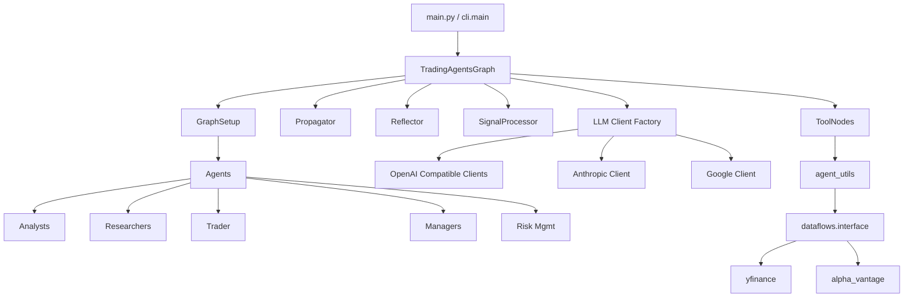

---
难度：⭐⭐⭐⭐
类型：专家设计
预计时间：40 分钟
前置知识：
  - [02-principles-and-workflow.md](02-principles-and-workflow.md)
后续推荐：
  - [05-extension-guide.md](05-extension-guide.md)
学习路径：
  - 用户路径：可选进阶
  - 开发路径：第 3 阶段
---

# TradingAgents 架构分析

## 这篇文档关注什么

如果说“原理与流程”讲的是为什么这样设计，那么这一篇讲的是它在代码里如何真正落地。

重点包括：

1. 目录是如何分层的。
2. 核心类和模块分别负责什么。
3. 状态模型如何承载整个工作流。
4. 数据流、模型流和结果流是怎样贯穿系统的。

## 全局架构图

## 目录分层

从职责出发，整个项目大致可以理解为 5 层。

## 关键源码入口速查表

| 主题 | 关键文件 | 为什么先看它 |
| ---- | ---- | ---- |
| Python 示例入口 | main.py | 最短路径展示如何创建 graph 并执行 propagate |
| CLI 入口 | cli/main.py | 展示交互式使用方式、配置收集和运行展示 |
| 主编排类 | tradingagents/graph/trading_graph.py | 汇总 LLM、ToolNode、memory 和 graph 装配 |
| 图构建 | tradingagents/graph/setup.py | 决定节点、边和阶段顺序 |
| 条件分流 | tradingagents/graph/conditional_logic.py | 决定何时继续调用工具或结束辩论 |
| 初始状态 | tradingagents/graph/propagation.py | 定义整个 graph 的起始上下文 |
| 状态契约 | tradingagents/agents/utils/agent_states.py | 定义所有关键报告与辩论字段 |
| 数据供应商路由 | tradingagents/dataflows/interface.py | 决定工具最终落到哪个供应商实现 |
| 模型工厂 | tradingagents/llm_clients/factory.py | 决定 provider 如何映射到具体客户端 |

### 入口层

1. main.py：示例化的 Python API 入口。
2. cli/main.py：面向交互式使用的 CLI 入口。

这两条路径最终都会调用 TradingAgentsGraph，所以它才是真正的统一核心入口。

### 图编排层

这一层位于 tradingagents/graph，负责定义和执行整个状态图：

1. trading_graph.py：主编排类。
2. setup.py：负责把节点和边组装成可执行图。
3. conditional_logic.py：负责条件分流。
4. propagation.py：负责初始状态和运行参数。
5. reflection.py：负责收益反馈后的记忆更新。
6. signal_processing.py：负责从自然语言决策中提取核心信号。

### Agent 层

这一层位于 tradingagents/agents，聚焦“角色能力”而不是“流程顺序”。

1. analysts：四类分析师。
2. researchers：看多和看空研究员。
3. trader：交易规划角色。
4. managers：研究经理和组合经理。
5. risk_mgmt：激进、保守、中立三种风险视角。
6. utils：状态定义、工具桥接、记忆系统。

### 能力抽象层

能力抽象层包含两个关键目录：

1. llm_clients：统一模型调用接口。
2. dataflows：统一数据供应商访问接口。

它们的共同目标是：把供应商差异挡在边界层，不让上层流程代码被大量 if else 污染。

### 表现层与验证层

1. cli：负责交互体验、进度展示与统计。
2. tests：当前覆盖较少，但承担最低限度的行为保护。
3. docs：文档体系。

## 核心类：TradingAgentsGraph

TradingAgentsGraph 是系统装配中心。初始化时，它会做几件关键工作：

1. 接收或加载配置。
2. 调用 set_config 更新 dataflows 全局配置。
3. 初始化深层与浅层 LLM。
4. 初始化多个记忆实例。
5. 创建 ToolNode。
6. 初始化条件逻辑、图构建器、传播器、反思器、信号处理器。
7. 调用 GraphSetup.setup_graph 生成最终 graph。

这里最值得注意的是，它并不承担具体分析逻辑。它负责的是“装配”和“协调”，而不是“判断”。这是一种良好的职责隔离。

## 状态模型：系统的共享数据契约

AgentState 是这个项目里最关键的数据契约。它把原本可能散落在消息历史中的信息沉淀成结构化字段。

| 字段 | 作用 |
| ---- | ---- |
| messages | 图执行中的消息历史 |
| company_of_interest | 当前标的 |
| trade_date | 当前分析日期 |
| market_report | 技术或市场分析结果 |
| sentiment_report | 情绪分析结果 |
| news_report | 新闻分析结果 |
| fundamentals_report | 基本面分析结果 |
| investment_debate_state | 投资辩论状态 |
| investment_plan | 研究经理裁决结果 |
| trader_investment_plan | 交易员生成的执行计划 |
| risk_debate_state | 风险辩论状态 |
| final_trade_decision | 组合经理最终决策 |

这意味着下游节点读取上下文时，不必从自由文本里猜测“上一阶段到底产出了什么”，而可以直接读取字段。

## 初始状态是如何构造的

Propagator.create_initial_state 会构造一份包含以下内容的初始结构：

1. 起始 human message。
2. 标的与日期。
3. 投资辩论状态的默认值。
4. 风险辩论状态的默认值。
5. 各类报告字段的空值占位。

这说明图执行的输入不是一段裸文本，而是一份结构化运行上下文。

## GraphSetup：把架构图变成可执行图

GraphSetup.setup_graph 的职责，是把“有哪些角色”“它们如何连接”“在什么条件下跳转”真正翻译为 LangGraph 的节点和边。

它做的事情主要包括：

1. 根据 selected_analysts 动态创建 Analyst 节点。
2. 为每个 Analyst 配套消息清理节点和工具节点。
3. 把 Analyst 串成顺序执行链。
4. 把研究辩论、交易规划、风险辩论和组合审批接在后面。
5. 最后 compile 成可调用图对象。

这里有一个很关键的行为特征：selected_analysts 的顺序会影响 Analyst 执行顺序，所以它不只是“启用集合”，同时也是“执行序列定义”。

## ConditionalLogic：系统如何知道何时收敛

ConditionalLogic 提供三类判断：

1. Analyst 是否继续走工具调用。
2. 研究辩论是否继续。
3. 风险辩论是否继续。

这种设计把“节点做什么”和“流程去哪里”拆开了。好处是节点逻辑不会被流程判断淹没，流程判断也可以独立演化。

## ToolNode 与数据流

ToolNode 是连接 Agent 层和外部数据世界的桥。它的运行路径大致是：

1. Agent 调用工具。
2. ToolNode 执行 agent_utils 中暴露的方法。
3. agent_utils 再桥接到 dataflows.interface 的抽象路由。
4. route_to_vendor 根据配置选择具体供应商实现。

这条链路使得 Agent 不需要知道自己究竟在用 yfinance 还是 Alpha Vantage。

## LLM 抽象层的价值

llm_clients/factory.py 把不同模型供应商统一抽象到 create_llm_client 之下。上层主要关心 provider 名称和模型名称，而不需要深入理解各家 SDK 差异。

特别重要的一点是，系统会对部分 provider 的返回内容做 normalize_content 归一化。这是多 provider 架构能稳定运行的关键前提之一。

## 日志、结果与反馈回路

TradingAgentsGraph.propagate 执行结束后，会把完整状态保存为 JSON。这些 JSON 文件不是附属产物，而是研究框架极其重要的一部分，因为它们承载了：

1. 中间报告。
2. 辩论历史。
3. 最终决策。

后续的 Reflector 则允许你把真实收益或亏损作为反馈，更新记忆系统，形成实验闭环。

## 架构中的一个现实问题

默认配置中存在 results_dir，但当前 `_log_state` 实际写入的是 eval_results。这说明结果输出路径在“配置声明”和“实际实现”之间还没有完全统一。这个问题不会阻止系统运行，但会影响工程一致性和使用者预期。

## 架构设计的优点

1. 职责分层较清晰。
2. 角色拆分有明显现实映射。
3. Graph、LLM、Dataflow 之间边界明确。
4. 扩展路径清晰，适合研究迭代。

## 架构设计的局限

1. 目前测试覆盖不足，导致架构演化风险偏高。
2. 结果输出策略仍有一致性问题。
3. 多角色链路较长，对模型质量与外部依赖稳定性要求较高。

## 小结

TradingAgents 的架构强项，不是把一切做到最轻量，而是把复杂流程拆得足够清楚。这让它非常适合研究、改造和扩展。

如果你下一步准备真正进入源码，推荐阅读顺序是：

1. 先看 main.py 和 cli/main.py，建立入口直觉。
2. 再看 trading_graph.py 和 setup.py，理解整体装配与流程顺序。
3. 然后看 agent_states.py、interface.py、factory.py，理解系统边界。

---

__文档元信息__
难度：⭐⭐⭐⭐ | 类型：专家设计 | 更新日期：2026-03-29 | 预计阅读时间：40 分钟
