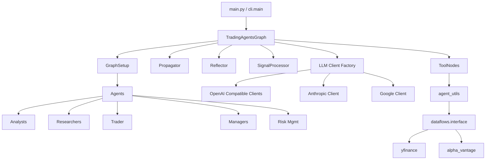
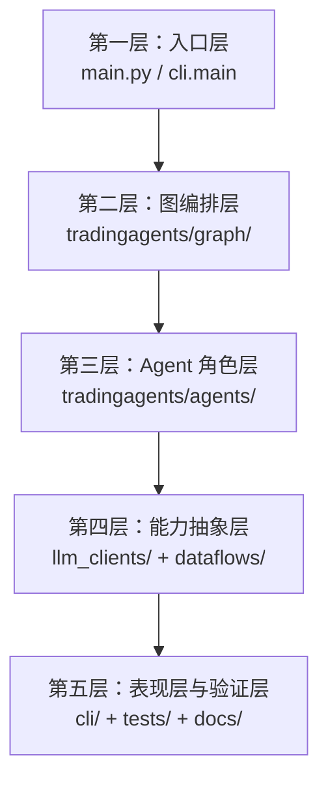

---
难度：⭐⭐⭐⭐
类型：专家设计
预计时间：55 分钟
前置知识：
  - [02-principles-and-workflow.md](02-principles-and-workflow.md)
后续推荐：
  - [05-extension-guide.md](05-extension-guide.md)
学习路径：
  - 用户路径：可选进阶
  - 开发路径：第 3 阶段
---

# TradingAgents 架构分析

## 这篇文档关注什么

如果说“原理与流程”讲的是为什么这样设计，那么这一篇讲的是它在代码里如何真正落地。

重点包括：

1. 目录是如何分层的。
2. 核心类和模块分别负责什么。
3. 状态模型如何承载整个工作流。
4. 数据流、模型流和结果流是怎样贯穿系统的。

## 全局架构图



## 常见问题该从哪一层查

  | 你看到的问题 | 优先检查的层 | 为什么 |
  | ---- | ---- | ---- |
  | 图不收敛或阶段卡住 | 图编排层 | 节点连接、条件边和循环都在这里 |
  | 日志路径和配置不一致 | 入口层 + 图编排层 | 配置声明和实际落盘逻辑分布在不同位置 |
  | 数据源切换后结果异常 | 能力抽象层 | route_to_vendor、供应商实现和异常回退都在这里 |
  | CLI 能选但结果里没有新产物 | 表现层 + Agent 层 | 暴露层和状态写回可能没有同时闭合 |
  | 同一 ticker 被错误标准化 | Agent utils | ticker 上下文构造和工具桥接在这里 |

## 目录分层

从职责出发，整个项目可以理解为 5 层。每一层有明确的职责边界和依赖方向：



这样分层，不只是为了”目录看起来整齐”，而是为了控制 3 类最容易失控的耦合：

1. 把角色逻辑和流程控制拆开，避免 Agent 文件里充满图跳转判断。
2. 把外部供应商差异收敛到边界层，避免上层代码到处写 provider 分支。
3. 把交互表现层与核心执行链路拆开，避免 CLI 改动意外污染主图逻辑。

## 关键源码入口速查表

| 主题 | 关键文件 | 为什么先看它 |
| ---- | ---- | ---- |
| Python 示例入口 | [main.py](../../main.py) | 最短路径展示如何创建 graph 并执行 propagate |
| CLI 入口 | [cli/main.py](../../cli/main.py) | 展示交互式使用方式、配置收集和运行展示 |
| 主编排类 | [tradingagents/graph/trading_graph.py](../../tradingagents/graph/trading_graph.py) | 汇总 LLM、ToolNode、memory 和 graph 装配 |
| 图构建 | [tradingagents/graph/setup.py](../../tradingagents/graph/setup.py) | 决定节点、边和阶段顺序 |
| 条件分流 | [tradingagents/graph/conditional_logic.py](../../tradingagents/graph/conditional_logic.py) | 决定何时继续调用工具或结束辩论 |
| 初始状态 | [tradingagents/graph/propagation.py](../../tradingagents/graph/propagation.py) | 定义整个 graph 的起始上下文 |
| 状态契约 | [tradingagents/agents/utils/agent_states.py](../../tradingagents/agents/utils/agent_states.py) | 定义所有关键报告与辩论字段 |
| 数据供应商路由 | [tradingagents/dataflows/interface.py](../../tradingagents/dataflows/interface.py) | 决定工具最终落到哪个供应商实现 |
| 模型工厂 | [tradingagents/llm_clients/factory.py](../../tradingagents/llm_clients/factory.py) | 决定 provider 如何映射到具体客户端 |

### 入口层

1. main.py：示例化的 Python API 入口。
2. cli/main.py：面向交互式使用的 CLI 入口。

这两条路径最终都会调用 TradingAgentsGraph，所以它才是真正的统一核心入口，而不是 GraphSetup。GraphSetup 更像“图装配器”，TradingAgentsGraph 则是“系统装配中心”：它同时掌握配置、LLM、ToolNode、记忆、传播器和最终图实例。

### 图编排层

这一层位于 tradingagents/graph，负责定义和执行整个状态图：

1. trading_graph.py：主编排类。
2. setup.py：负责把节点和边组装成可执行图。
3. conditional_logic.py：负责条件分流。
4. propagation.py：负责初始状态和运行参数。
5. reflection.py：负责收益反馈后的记忆更新。
6. signal_processing.py：负责从自然语言决策中提取核心信号。

### Agent 层

这一层位于 tradingagents/agents，聚焦“角色能力”而不是“流程顺序”。

1. analysts：四类分析师。
2. researchers：看多和看空研究员。
3. trader：交易规划角色。
4. managers：研究经理和组合经理。
5. risk_mgmt：激进、保守、中立三种风险视角。
6. utils：状态定义、工具桥接、记忆系统。

之所以不是粗略地分成”agents”和”infrastructure”两层，是因为这个项目有明确的角色治理结构。Analyst、Researcher、Trader、Manager、Risk Mgmt 分成独立子目录，能让“角色职责”和“执行阶段”形成一一对应的阅读与扩展入口。对研究型框架来说，这比一个平铺目录更容易追踪责任边界。

### 能力抽象层

能力抽象层包含两个关键目录：

1. llm_clients：统一模型调用接口。
2. dataflows：统一数据供应商访问接口。

它们的共同目标是：把供应商差异挡在边界层，不让上层流程代码被大量 if else 污染。

### 表现层与验证层

1. cli：负责交互体验、进度展示与统计。
2. tests：当前覆盖较少，但承担最低限度的行为保护。
3. docs：文档体系。

## 核心类：TradingAgentsGraph

TradingAgentsGraph 是系统装配中心。初始化时，它会做几件关键工作：

1. 接收或加载配置。
2. 调用 set_config 更新 dataflows 全局配置。
3. 初始化深层与浅层 LLM。
4. 初始化多个记忆实例。
5. 创建 ToolNode。
6. 初始化条件逻辑、图构建器、传播器、反思器、信号处理器。
7. 调用 GraphSetup.setup_graph 生成最终 graph。

这里最值得注意的是，它并不承担具体分析逻辑。它负责的是“装配”和“协调”，而不是“判断”。这是一种良好的职责隔离。

## 状态模型：系统的共享数据契约

AgentState 是这个项目里最关键的数据契约。它把原本可能散落在消息历史中的信息沉淀成结构化字段。

| 字段 | 作用 |
| ---- | ---- |
| messages | 图执行中的消息历史 |
| company_of_interest | 当前标的 |
| trade_date | 当前分析日期 |
| market_report | 技术或市场分析结果 |
| sentiment_report | 情绪分析结果 |
| news_report | 新闻分析结果 |
| fundamentals_report | 基本面分析结果 |
| investment_debate_state | 投资辩论状态 |
| investment_plan | 研究经理裁决结果 |
| trader_investment_plan | 交易员生成的执行计划 |
| risk_debate_state | 风险辩论状态 |
| final_trade_decision | 组合经理最终决策 |

这意味着下游节点读取上下文时，不必从自由文本里猜测“上一阶段到底产出了什么”，而可以直接读取字段。

## 初始状态是如何构造的

Propagator.create_initial_state 会构造一份包含以下内容的初始结构：

1. 起始 human message。
2. 标的与日期。
3. 投资辩论状态的默认值。
4. 风险辩论状态的默认值。
5. 各类报告字段的空值占位。

这说明图执行的输入不是一段裸文本，而是一份结构化运行上下文。

## GraphSetup：把架构图变成可执行图

GraphSetup.setup_graph 的职责，是把“有哪些角色”“它们如何连接”“在什么条件下跳转”真正翻译为 LangGraph 的节点和边。

它做的事情主要包括：

1. 根据 selected_analysts 动态创建 Analyst 节点。
2. 为每个 Analyst 配套消息清理节点和工具节点。
3. 把 Analyst 串成顺序执行链。
4. 把研究辩论、交易规划、风险辩论和组合审批接在后面。
5. 最后 compile 成可调用图对象。

这里有一个很关键的行为特征：selected_analysts 的顺序会影响 Analyst 执行顺序，所以它不只是“启用集合”，同时也是“执行序列定义”。

这也是为什么 GraphSetup 是扩展指南中的关键文件。只要你打算新增 Analyst、调整阶段顺序、让某个节点变成可选能力，最后都绕不开 [tradingagents/graph/setup.py](../../tradingagents/graph/setup.py)。

## ConditionalLogic：系统如何知道何时收敛

ConditionalLogic 提供三类判断：

1. Analyst 是否继续走工具调用。
2. 研究辩论是否继续。
3. 风险辩论是否继续。

这种设计把“节点做什么”和“流程去哪里”拆开了。好处是节点逻辑不会被流程判断淹没，流程判断也可以独立演化。

## ToolNode 与数据流

ToolNode 是连接 Agent 层和外部数据世界的桥。它的运行路径大致是：

1. Agent 调用工具。
2. ToolNode 执行 agent_utils 中暴露的方法。
3. agent_utils 再桥接到 dataflows.interface 的抽象路由。
4. route_to_vendor 根据配置选择具体供应商实现。

这条链路使得 Agent 不需要知道自己究竟在用 yfinance 还是 Alpha Vantage。

如果你要调试数据问题，最有效的办法不是直接盯某个 Analyst 的 Prompt，而是沿着这条链路反查：Agent 工具定义 -> agent_utils -> [tradingagents/dataflows/interface.py](../../tradingagents/dataflows/interface.py) -> 供应商实现。

## LLM 抽象层的价值

llm_clients/factory.py 把不同模型供应商统一抽象到 create_llm_client 之下。上层主要关心 provider 名称和模型名称，而不需要深入理解各家 SDK 差异。

特别重要的一点是，系统会对部分 provider 的返回内容做 normalize_content 归一化。这是多 provider 架构能稳定运行的关键前提之一。

### normalize_content 的精确实现

`normalize_content` 定义在 [tradingagents/llm_clients/base_client.py](../../tradingagents/llm_clients/base_client.py) 中。它解决的问题非常具体：

**问题**：OpenAI Responses API 和 Google Gemini 3 返回的 `response.content` 不是字符串，而是由多个类型化内容块组成的列表。例如：

```python
# OpenAI Responses API 的返回格式
[
    {“type”: “reasoning”, “text”: “思考过程...”},
    {“type”: “text”, “text”: “实际输出文本”}
]

# 普通 OpenAI Chat API 的返回格式
“纯文本字符串”
```

**实现逻辑**：

1. 检查 `response.content` 是否为列表（`isinstance(content, list)`）
2. 如果是列表：提取所有 `type == “text”` 的块，拼接成纯文本字符串
3. 如果不是列表（已是字符串）：不做任何处理
4. 将结果写回 `response.content`，返回原 response 对象

**意义**：保证所有下游 Agent 节点始终面对 `str` 类型的 `response.content`，不需要为不同 Provider 写分支逻辑。

### Provider 分组策略

factory.py 中的分组逻辑是：

| Provider | 使用客户端 | 共享原因 |
| ---- | ---- | ---- |
| openai | OpenAIClient | 原生 |
| ollama | OpenAIClient | 兼容 OpenAI Chat API |
| openrouter | OpenAIClient | 兼容 OpenAI Chat API |
| xai | OpenAIClient | 兼容 OpenAI Chat API |
| anthropic | AnthropicClient | 独立 SDK |
| google | GoogleClient | 独立 SDK |

这意味着 6 种 Provider 仅需要 3 种客户端实现，显著降低了维护成本。

### Provider 专属参数传递

TradingAgentsGraph 的 `_get_provider_kwargs()` 方法会根据当前 `llm_provider` 提取对应参数：

| Provider | 配置键 | 作用 |
| ---- | ---- | ---- |
| google | `google_thinking_level` | 控制思考深度（如 “high”, “minimal”） |
| openai | `openai_reasoning_effort` | 控制推理力度（如 “medium”, “high”, “low”） |
| anthropic | `anthropic_effort` | 控制输出努力级别（如 “high”, “medium”, “low”） |

这些参数在配置层声明，在初始化时提取，在客户端构造时注入。Agent 层完全不感知这些差异。

## 信号处理模块

SignalProcessor 定义在 [tradingagents/graph/signal_processing.py](../../tradingagents/graph/signal_processing.py)，是 `propagate()` 返回值的生成器。

**输入**：Portfolio Manager 的完整决策文本（可能包含 Rating、Executive Summary、Investment Thesis 等）。

**处理**：使用 `quick_thinking_llm` 调用一个精简 Prompt：

```text
Extract the rating as exactly one of: BUY, OVERWEIGHT, HOLD, UNDERWEIGHT, SELL.
Output only the single rating word, nothing else.
```

**输出**：单个评级词（如 `”BUY”` 或 `”SELL”`）。

**`propagate()` 的返回值**：
```python
return final_state, self.process_signal(final_state[“final_trade_decision”])
```

因此 `decision` 是精炼的单字信号，`final_state[“final_trade_decision”]` 是完整分析报告。两者配合使用：前者用于程序化消费，后者用于人类阅读和复盘。

## 记忆系统架构

### 核心类：FinancialSituationMemory

定义在 [tradingagents/agents/utils/memory.py](../../tradingagents/agents/utils/memory.py)，基于 `rank_bm25` 库的 `BM25Okapi` 算法。

**数据结构**：
- `documents: List[str]`：存储历史市场状况描述
- `recommendations: List[str]`：存储对应的反思/建议
- `bm25: BM25Okapi`：基于 documents 构建的索引

**分词策略**：使用 `re.findall(r'\b\w+\b', text.lower())`，简单正则提取单词。不依赖外部分词库或 Embedding 服务。

**关键方法**：

| 方法 | 输入 | 输出 | 调用方 |
| ---- | ---- | ---- | ---- |
| `add_situations([(situation, recommendation)])` | 情况-建议对列表 | 更新内部索引 | Reflector |
| `get_memories(current_situation, n_matches=2)` | 当前状况 | top-n 匹配记录 | Bull/Bear Researcher, Research Manager, Trader, Portfolio Manager |

**5 个独立记忆实例**：

| 实例名 | 读取方 | 写入方 |
| ---- | ---- | ---- |
| `bull_memory` | Bull Researcher | Reflector.reflect_bull_researcher |
| `bear_memory` | Bear Researcher | Reflector.reflect_bear_researcher |
| `trader_memory` | Trader | Reflector.reflect_trader |
| `invest_judge_memory` | Research Manager | Reflector.reflect_invest_judge |
| `portfolio_manager_memory` | Portfolio Manager | Reflector.reflect_portfolio_manager |

### 反思流程（Reflector）

定义在 [tradingagents/graph/reflection.py](../../tradingagents/graph/reflection.py)。`reflect_and_remember(returns_losses)` 被调用时：

1. **提取当前状况**：拼接 4 份 Analyst 报告（market_report + sentiment_report + news_report + fundamentals_report）
2. **逐角色反思**：对每个角色，用 `quick_thinking_llm` 和反思 Prompt 分析决策质量
3. **写入记忆**：将 `(当前状况, 反思结果)` 写入对应角色的记忆实例

反思 Prompt 包含 4 个步骤：
1. **Reasoning**：判断决策是否正确（正确 = 收益增加），分析各因素权重
2. **Improvement**：对错误决策提出改进建议
3. **Summary**：总结经验教训，建立跨场景联系
4. **Query**：提炼成不超过 1000 token 的精炼摘要

记忆在后续运行时被读取：角色通过 `memory.get_memories(curr_situation, n_matches=2)` 检索最相似的 2 个历史场景，将反思结论注入分析上下文。

## 日志、结果与反馈回路

TradingAgentsGraph.propagate 执行结束后，会把完整状态保存为 JSON。这些 JSON 文件不是附属产物，而是研究框架极其重要的一部分，因为它们承载了：

1. 中间报告。
2. 辩论历史。
3. 最终决策。

后续的 Reflector 则允许你把真实收益或亏损作为反馈，更新记忆系统，形成实验闭环。

## 架构中的一个现实问题

默认配置中存在 results_dir，但当前 `_log_state` 实际写入的是 eval_results。这说明结果输出路径在“配置声明”和“实际实现”之间还没有完全统一。这个问题不会阻止系统运行，但会影响工程一致性和使用者预期。

这个问题建议按阻断级工程缺陷来理解，而不是当成轻微瑕疵。因为结果目录是复盘、评估脚本和问题排查的共同入口，一旦配置声明和落盘行为分叉，后续文档、脚本和用户心智都会持续偏移。

## 架构设计的优点

1. 职责分层较清晰。
2. 角色拆分有明显现实映射。
3. Graph、LLM、Dataflow 之间边界明确。
4. 扩展路径清晰，适合研究迭代。

## 架构设计的局限

1. 目前测试覆盖不足，导致架构演化风险偏高。
2. 结果输出策略仍有一致性问题。
3. 多角色链路较长，对模型质量与外部依赖稳定性要求较高。
4. 某些关键工程细节分散在 CLI、Graph 和工具桥接层，首次阅读时不够集中。
5. 角色拆分带来更强可解释性，但也提升了上下文管理和阶段协同成本。

## 阅读源码时最值得先验证的 3 件事

如果你读完本篇准备进源码，建议先验证下面 3 个问题，而不是无目标地扫目录：

1. 从 [main.py](../../main.py) 或 [cli/main.py](../../cli/main.py) 进入后，最终是不是都汇聚到 [tradingagents/graph/trading_graph.py](../../tradingagents/graph/trading_graph.py)。
2. 在 [tradingagents/graph/setup.py](../../tradingagents/graph/setup.py) 里，selected_analysts 是否同时定义了“启用集合”和“执行顺序”。
3. 在 [tradingagents/graph/trading_graph.py](../../tradingagents/graph/trading_graph.py) 里，结果落盘是否仍直接写入 eval_results，而不是统一走 results_dir。

如果其中任何一项验证失败，优先做两件事：

1. 先确认文档描述是否落后于当前代码，而不是立刻假设代码坏了。
2. 再结合 [07-source-code-index.md](07-source-code-index.md) 找到对应函数和文件，缩小排查范围。

## 小结

TradingAgents 的架构强项，不是把一切做到最轻量，而是把复杂流程拆得足够清楚。这让它非常适合研究、改造和扩展。

如果你下一步准备真正进入源码，推荐阅读顺序是：

1. 先看 main.py 和 cli/main.py，建立入口直觉。
2. 再看 trading_graph.py 和 setup.py，理解整体装配与流程顺序。
3. 然后看 agent_states.py、interface.py、factory.py，理解系统边界。

## 自测问题

1. `normalize_content` 解决的是什么问题？如果不做归一化，下游 Agent 会面对什么困难？
2. 为什么 Bull 和 Bear Researcher 使用 `quick_think_llm`，而 Research Manager 和 Portfolio Manager 使用 `deep_think_llm`？这个分配背后的成本逻辑是什么？
3. `FinancialSituationMemory` 的 5 个实例分别被谁读取、被谁写入？如果你要替换成向量检索，需要保证哪两个接口不变？
4. `_log_state` 写入的路径是 `eval_results/{ticker}/...`，而不是配置中的 `results_dir`。这个不一致会导致什么实际问题？

## 练习题

1. 打开 `tradingagents/graph/trading_graph.py`，找到 `_create_tool_nodes` 方法，确认每类 Analyst 只能看到与自己角色相关的工具。如果你要给 Market Analyst 新增一个工具，应该在哪里添加？
2. 阅读 `propagation.py` 中的 `create_initial_state`，列出所有初始化为空字符串的字段。如果一个 Analyst 被禁用，它对应的报告字段会保持为空——这个设计有什么好处和潜在问题？

---

__文档元信息__
难度：⭐⭐⭐⭐ | 类型：专家设计 | 更新日期：2026-04-01 | 预计阅读时间：55 分钟
