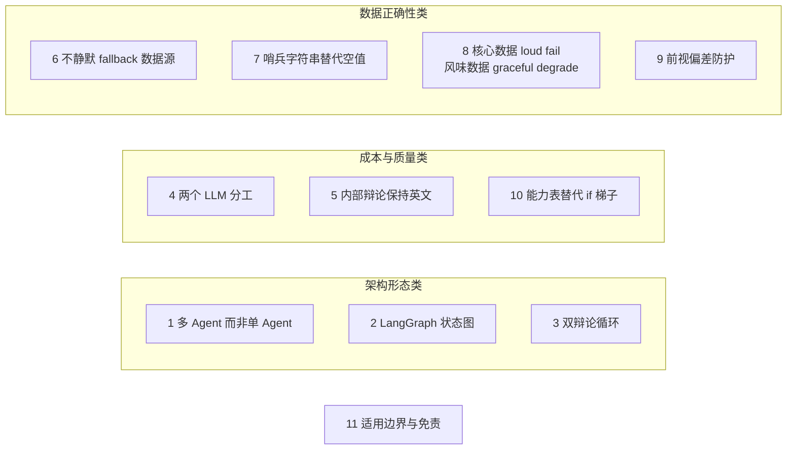

# 设计哲学

> 难度 ⭐⭐⭐（进阶分析） · 面向想理解每个设计决策动机的研究者和资深开发者 · 预计阅读 30 分钟

## 这篇文章在回答什么

一个框架的架构文档能告诉你"它长什么样"，但常常漏掉更有用的那一半："它为什么长成这样，以及它在哪些地方**故意不**这么做"。本文收集了 TradingAgents 里 10 个有明确取舍意味的设计决策，每个都按"问题动机 → 原理剖析 → 源码解析"的顺序展开。

在进入具体决策前，先给一张总览地图，把这些决策按性质分到三类。这样读到最后不会把它们混在一起。



三类决策各有侧重：架构形态类决定系统的骨架，成本质量类决定每次运行的代价，数据正确性类决定输出的可信度。最后的适用边界不属技术决策，但决定了这套工具的合理使用方式。

---

## 1. 为什么用多 Agent 而非单 Agent

**问题动机**：一个足够强的 LLM，能不能直接读完所有数据给出一份完整投资判断？

**原理剖析**：理论上可以，但实践中有三类问题单 Agent 很难处理好。第一，**上下文爆炸**：把技术面、情绪面、新闻面、基本面的原始数据全塞进一个 Prompt，模型会在海量细节里丢掉关键信号。第二，**单点幻觉**：单 Agent 一旦在某个环节（比如公司身份）出错，错误会无人挑战地贯穿整份报告。第三，**缺乏对抗**：投资判断的本质是多空博弈，单 Agent 倾向于给出一个"综合的、温和的"结论，丢失了辩论中才会暴露的分歧点。

TradingAgents 的解法是**模拟一家真实交易公司的分工**。这家"公司"里有负责单一维度的分析师（只看技术面、或只看基本面）、有为特定立场辩护的研究员（Bull/Bear 只负责一方）、有从不同风险偏好出发的辩手（Aggressive/Conservative/Neutral）。每个角色只看自己那部分数据、只为自己那部分立场负责，最后由两个裁判（Research Manager、Portfolio Manager）综合。

**源码解析**：这种分工直接体现在 Agent 的 Prompt 里。Bull Researcher 的系统提示开头就是"You are a Bull Analyst advocating for investing"（`bull_researcher.py:27`），任务是"build a strong, evidence-based case"并"counter bearish arguments"——它被设计成一个有立场的辩护者，不是一个中立的综合判断者。Bear Researcher 对称地站在反方。两个研究员的输出累加到 `investment_debate_state.history`，裁判（Research Manager）读这段历史做评级。

代价是什么？多 Agent 意味着更多 LLM 调用、更长的端到端延迟、更复杂的状态管理。这是一笔用成本换质量的交易——是否划算取决于你的使用场景。如果你只想要一个快速的"看一眼"信号，单 Agent 可能更合适。

## 2. 为什么用 LangGraph 状态图

**问题动机**：编排多 Agent 有两种风格。一种是**自主 Agent**（agentic），让一个"主控 Agent"自己决定下一步调谁；另一种是**确定性编排**，把流程预先写成一张图。TradingAgents 选了后者，为什么？

**原理剖析**：自主 Agent 适合**探索性、开放式**的任务，比如"研究一下这个公司然后告诉我你的想法"。但投资分析流水线是**结构化、可重复**的——同一家公司在同一天的分析，两次运行的路径应该一致，否则没法做回测对比，也没法定位"哪一步出了问题"。LangGraph 的状态图提供三样自主 Agent 难以提供的东西：

1. **确定性路径**：节点和边是预先定义的，条件路由基于状态字段而非 LLM 的临时决定。两个辩论循环什么时候结束，取决于 `count >= 2N` 和 `count >= 3N` 的算术判断（`conditional_logic.py:52-73`），而不是模型"觉得辩够了"。
2. **可 checkpoint**：图执行的每一步都能被持久化，崩溃的运行可从最后一个成功节点恢复（`checkpointer.py`）。这对长时间运行的分析很重要。
3. **可视化数据流**：状态在节点间的流动是显式的，调试时能清楚看到"哪个节点的输出错了"，而不是面对一个黑盒 Agent 的对话历史。

**源码解析**：图的构建集中在 `setup.py`。`GraphSetup.setup_graph` 用 `StateGraph(AgentState)` 创建工作流，依次 `add_node` 加 13 个节点、`add_edge` 连固定边、`add_conditional_edges` 加条件边（`setup.py:95-154`）。条件边的目标用完整的 path map（`DEBATE_PATH_MAP`、`RISK_ANALYSIS_PATH_MAP`，`setup.py:32-42`），这样即使路由函数因为 Prompt 或 i18n 漂移返回了一个意外的说话人标签，也不会因为 `path_map` 缺项而中途崩溃（issue #1088）。

什么时候不该用状态图？当任务流程本身不确定、需要 Agent 自己决定调几个工具、什么时候停，自主 Agent 更合适。TradingAgents 的分析师节点其实是两种风格的混合：图的**骨架**是确定的（分析师→辩论→交易→风险辩论），但每个分析师**内部**是自主的（自己决定调几次工具、调哪些）。

## 3. 为什么用双辩论循环

**问题动机**：TradingAgents 有两个辩论循环——投资辩论（Bull vs Bear）和风险辩论（Aggressive vs Conservative vs Neutral）。为什么不合并成一个？

**原理剖析**：这两个辩论回答的是**不同的问题**，强行合并会让每个问题都答不好。

- **投资辩论回答"要不要投"**：基于四份分析师报告，多空双方就"这家公司值不值得买"辩论。裁判 Research Manager 输出 5 级评级。这个阶段的分歧是**方向性**的（看多 vs 看空）。
- **风险辩论回答"这么投安不安全"**：在 Trader 已经把评级转成具体交易提案之后，三方从不同风险偏好审视**这个具体的交易**。Aggressive 关注"错过机会的风险"，Conservative 关注"亏钱的风险"，Neutral 提供平衡视角。这个阶段的分歧是**执行性**的（激进 vs 保守）。

两者的输入不同（风险辩论多了 Trader 的提案作为锚点），输出不同（投资辩论给评级，风险辩论给最终决策+目标价+时间区间），参与者的立场结构也不同（2 方对峙 vs 3 方轮转）。合并意味着让一群既没明确方向立场、又没明确风险偏好的角色同时回答两个问题，结果大概率是两边都敷衍。

**源码解析**：两个辩论的状态是分开的（`agent_states.py`）：`InvestDebateState` 有 `bull_history`/`bear_history`/`current_response`，`RiskDebateState` 有 `aggressive_history`/`conservative_history`/`neutral_history`/`latest_speaker`。结束条件也不同：投资辩论是 `count >= 2 * max_debate_rounds`（两方各算一次发言，`conditional_logic.py:56`），风险辩论是 `count >= 3 * max_risk_discuss_rounds`（三方各算一次，`conditional_logic.py:66`）。风险辩论的轮转顺序是固定的（Aggressive → Conservative → Neutral，`conditional_logic.py:69-73`），保证每方都在另外两方发言后才有机会回应。

这两个循环在数学上的细节（为什么是 `2N` 和 `3N`、count 怎么累加）在 [辩论机制](../04-graph-and-agents/debate-mechanism.md) 单独展开。

## 4. 为什么用两个 LLM

**问题动机**：12 个 LLM 角色，为什么不全部用最强的模型？

**原理剖析**：这纯粹是**成本与质量的工程权衡**，不是"裁判必须用大模型"的教条。一次典型分析里，每个角色的任务对推理深度的要求差异很大：

- 分析师、研究员、辩手、Trader 的任务是**局部的**：读几份数据写一份报告、为给定立场辩护、把评级转成操作。这些任务的瓶颈往往是数据质量而非推理深度，而且分析师还会多次工具循环，调用频次高。
- 两个裁判（Research Manager、Portfolio Manager）的任务是**综合的**：要读完整段辩论历史，权衡多方论点，做出最终评级或决策。这里推理深度的差异会直接体现在产出质量上。

如果全用最强模型，一次分析的成本会高出一个量级，但分析师和辩手那段的质量未必等比例提升——因为它们的产出已经受限于输入数据。所以 TradingAgents 把贵的 deep（默认 gpt-5.5）只放在两个最关键的裁决点（各调一次），便宜的 quick（默认 gpt-5.4-mini）承担所有高频局部任务。

**源码解析**：两个 LLM 实例在初始化时创建（`trading_graph.py:101-115`），由 `GraphSetup` 在建图时绑定到节点：`create_research_manager(self.deep_thinking_llm)` 和 `create_portfolio_manager(self.deep_thinking_llm)`，其余都用 `self.quick_thinking_llm`（`setup.py:83-92`）。默认配置在 `default_config.py`：`deep_think_llm = "gpt-5.5"`，`quick_think_llm = "gpt-5.4-mini"`。

边界说明：这是个软约束，不是硬约束。把两个模型设成同一个，系统照常运行。具体的成本估算和换模型建议在 [LLM 客户端](../05-data-and-llm/llm-clients.md) 里讲。

## 5. 为什么内部辩论保持英文

**问题动机**：用户可以把输出语言设成中文，但 Agent 之间的辩论为什么坚持用英文？

**原理剖析**：这是**LLM 推理质量的工程权衡**。当前主流 LLM 的训练语料以英文为主，金融领域的专业术语、辩论逻辑、结构化输出在英文下的表现普遍更稳定。如果让多空辩论用中文进行，模型可能在术语映射、逻辑链条、甚至结构化输出的字段填充上出现退化，而这些退化会累积到最终决策。

TradingAgents 的解法是**分两层处理语言**：内部所有 Agent 的推理、辩论、结构化输出都用英文；只有最终会落到报告里的环节，才通过 `get_language_instruction()` 注入一条"用指定语言写"的指令（`agent_utils.py:52-65`）。这条指令对每个输出会到达报告的 Agent 都生效——分析师、研究员、辩手、两个裁判、Trader——所以非英文运行产出的是一份完全本地化的报告，而不是中英混杂。

**源码解析**：`get_language_instruction` 在 `output_language` 为 English 时返回空字符串（不加 token），否则返回 `" Write your entire response in {lang}."`（`agent_utils.py:62-65`）。它被几乎所有 Agent 的 Prompt 拼接调用。这意味着即使用户选了中文，辩论的"思考"还是英文的，只是最终输出的"话"被翻译成了中文。

代价：非英文用户读不到中间辩论过程（它们是英文的），只能看到最终本地化报告。这是一个用"中间过程可读性"换"推理质量"的决定。如果你做学术研究需要完整的中文 trace，可以临时把 `output_language` 设回 English 跑一次。多语言配置细节见 [多语言输出](../02-user-guide/output-language.md)。

## 6. 为什么不静默 fallback 数据源

**问题动机**：当配置的主数据源（比如 yfinance）拉不到数据时，要不要悄悄切到备用源（比如 Alpha Vantage）？

**原理剖析**：早期版本会静默 fallback，但这引发了**跨 vendor 数据一致性**问题（issue #988/#289）。不同 vendor 对同一个指标的口径可能不同——yfinance 的"收盘价"和 Alpha Vantage 的"收盘价"在除权处理、时区、小数精度上可能有微妙差异。如果一次分析的某些数据来自 yfinance、某些悄悄来自 Alpha Vantage，分析师在比较这些数字时会得出错误结论，而且很难发现原因。

TradingAgents 现在的规则是：**配置的 vendor 列表就是 fallback 链，不会路由到用户没选的 vendor**。你写了 `"yfinance"`，就只用 yfinance；想要 fallback，就显式写 `"yfinance,alpha_vantage"`。这样数据来源是可预测、可审计的。

**源码解析**：`route_to_vendor`（`interface.py:168-262`）的逻辑里有一段关键注释（`interface.py:179-183`）：

```python
# The configured vendor list IS the chain: we do NOT silently fall back to
# vendors the user did not choose (#988/#289) — that returned data from an
# unexpected source and caused cross-vendor inconsistencies. For multi-vendor
# fallback, list them in order, e.g. data_vendors="yfinance,alpha_vantage".
```

只有 `"default"` 这个哨兵值（未显式配置时）才会用全部可用 vendor。路由过程中，`VendorRateLimitError`（限流）和 `VendorNotConfiguredError`（缺 key）会跳到链里下一个 vendor，而 `NoMarketDataError`（真没数据）会继续试其他配置的 vendor；但如果链里所有 vendor 都失败，绝不悄悄去问没配置的源。

这个决策的取舍在 [数据供应商路由](../05-data-and-llm/data-vendors.md) 里有更详细的链路图。

## 7. 为什么用哨兵字符串而不是空字符串

**问题动机**：当某个标的真的拉不到数据时，返回什么给 Agent？

**原理剖析**：最自然的做法是返回空字符串。但这对 LLM 是危险的——空字符串在 Prompt 里几乎没有信号，模型会倾向于**编造一个 plausible 的数字**来填补，尤其是基本面和价格这类它"大概知道范围"的字段。这个现象在 issue #781 里有记录：传入空结果后，Agent 凭空生成了价格叙事。

TradingAgents 的解法是返回一个**明确的哨兵字符串** `NO_DATA_AVAILABLE`，并在字符串里直接告诉模型"不要估算或编造值"。

**源码解析**：当配置的 vendor 链都报告 `NoMarketDataError` 时，`route_to_vendor` 返回（`interface.py:242-247`）：

```python
return (
    f"NO_DATA_AVAILABLE: No usable market data for '{sym}'{resolved} from "
    f"any configured vendor{reason}. The symbol may be invalid, delisted, "
    f"not covered, or the vendor returned stale data. Do not estimate or "
    f"fabricate values — report that data is unavailable for this symbol."
)
```

这个字符串的作用不是给模型"数据"，而是给模型一个**明确的指令**：这个字段就是没有，报告"不可用"而不是编一个。配合 `resolve_instrument_identity`（见上一篇的横向能力），它把 LLM 编造数字的空间压到最小。同样的思路也用在标的身份上——注入确定性的身份信息，防止模型根据价格图表猜公司（issue #814）。

## 8. 为什么核心数据 loud fail，风味数据 graceful degrade

**问题动机**：数据源失败时，是该让整个分析崩溃，还是该跳过继续？

**原理剖析**：这里要区分**两类数据**，它们对决策的重要性不同，所以失败处理也不该一样：

- **核心数据**（价格、基本面、新闻）：这些是决策的基础。如果价格拉不到，整个技术面分析就是无源之水，继续往下跑只会产出一份看起来合理、实则建立在编造数据上的报告。这种情况应该**loud fail**——明确报错，让人知道这次分析不能信。
- **风味数据**（宏观指标、预测市场）：这些是**enrichment**，给新闻分析师补充宏观和事件上下文。它们不是决策的核心，一个坏的 LLM 生成的指标、一个缺失的 API key、一次网络抖动，不该让整个分析崩溃。这种情况应该**graceful degrade**——降级到哨兵，继续跑。

**源码解析**：`interface.py:92` 定义了可选类别集合：

```python
OPTIONAL_CATEGORIES = {"macro_data", "prediction_markets"}
```

在 `route_to_vendor` 的末尾（`interface.py:253-260`），当所有 vendor 都失败且没有干净的"无数据"信号时，核心类别会 `raise first_error`（把第一个真实错误抛出去），而可选类别返回一个 `DATA_UNAVAILABLE` 哨兵：

```python
if category in OPTIONAL_CATEGORIES:
    logger.warning("Optional %s unavailable for %s: %s", category, method, first_error)
    return (
        f"DATA_UNAVAILABLE: optional {category} could not be retrieved "
        f"({first_error}). Proceed without it; do not fabricate values."
    )
raise first_error
```

这条边界的设计意图是：**让破坏决策的失败可见，让不影响决策的失败可恢复**。核心数据的失败如果被静默吞掉，用户会得到一份"看起来正常但数据是编的"报告，这比直接报错危险得多。

## 9. 为什么前视偏差防护无处不在

**问题动机**：TradingAgents 支持回测——给定一个历史日期，分析"当时"该怎么交易。但如果在分析 2025 年 5 月的标的时，新闻接口泄露了 2025 年 6 月的文章，这次回测就失效了：模型用"未来信息"做了决策，实盘根本拿不到这些信息。

**原理剖析**：前视偏差（look-ahead bias）是量化回测的经典陷阱。它的危险在于**隐蔽**——回测结果会异常好看，让人以为策略有效，实盘却复现不了。LLM 驱动的分析尤其脆弱，因为模型天然倾向于"用所有可用信息"，不会主动质疑某条新闻是不是"未来"的。

TradingAgents 在数据层做了显式的日期窗口过滤，针对 yfinance 新闻接口的几个具体漏洞（issue #992/#1007）做了修补。

**源码解析**：核心是 `yfinance_news.py` 里的 `_in_news_window`（`yfinance_news.py:60-71`）：

```python
def _in_news_window(pub_date, start_dt, end_dt) -> bool:
    """Whether an article belongs in the [start_dt, end_dt] window.
    ...
    """
    if pub_date is not None:
        naive = pub_date.replace(tzinfo=None) if hasattr(pub_date, "replace") else pub_date
        return start_dt <= naive <= end_dt + relativedelta(days=1)
    return end_dt >= datetime.now() - relativedelta(days=1)
```

两条规则：
1. **有日期的文章**：必须在 `[start, end+1天]` 窗口内才保留。`+1天` 是给时区留的缓冲。
2. **无日期的文章**：只有当窗口触及"现在"（实盘运行）时才保留。在历史回测窗口里，无日期的文章无法证明不是"未来"的，一律排除。

第二个规则是 #992 的修复重点。早期 yfinance 返回的"flat 结构"文章没有发布时间，导致它们绕过日期过滤，把未来新闻泄露进历史窗口。现在的实现会给 flat 文章也解析出 `pub_date`（`yfinance_news.py:42-57`），让它们同样可过滤。这套逻辑有专门的回归测试（`tests/test_news_lookahead.py`），覆盖"未来文章被排除""无日期文章在回测里被排除""实盘窗口保留无日期文章"等场景。

## 10. 为什么用能力表而不是 model-name if 梯子

**问题动机**：不同模型在 API 层面的怪癖不同——DeepSeek 的 thinking 模式模型拒绝 `tool_choice` 参数，MiniMax 的 M2.x 需要 `reasoning_split=True`，等等。怎么管理这些差异？

**原理剖析**：最直觉的写法是在客户端代码里堆 `if model_name.startswith("deepseek"): ... elif ...`。这种写法的问题在于：每加一个新模型或发现一个新怪癖，都要去改客户端代码，而且改完很难测全所有组合。时间一长，`if` 梯子会变成一个没人敢动的雷区。

TradingAgents 的解法是把"哪个模型接受什么 API 参数、用什么结构化输出方法"抽成一张**声明式的能力表**。客户端代码只查这张表，不硬编码模型名。加新模型就是改表，不动客户端。

**源码解析**：能力表在 `capabilities.py`。每个模型的能力用一个 frozen dataclass 描述（`capabilities.py:29-46`）：

```python
@dataclass(frozen=True)
class ModelCapabilities:
    supports_tool_choice: bool
    supports_json_mode: bool
    supports_json_schema: bool
    preferred_structured_method: StructuredMethod
    requires_reasoning_content_roundtrip: bool = False
    requires_reasoning_split: bool = False
```

具体模型按"精确 ID 优先，模式匹配兜底"的方式查（`capabilities.py:94-126`）：`_BY_ID` 字典做精确匹配，`_BY_PATTERN` 列表做正则匹配（比如 `^deepseek-v\d` 让未来的 `deepseek-v5-*` 自动继承 thinking 模式的怪癖），都没命中就用 `_DEFAULT`。这种写法借鉴了 DeepSeek 自己在集成指南里发布的 `compat:` 标志（见模块顶部注释）。

这个决策的取舍是：能力表把"模型知识"从代码里分离出来，但代价是表本身要持续维护——新模型上线后如果行为和表里写的不一致，bug 会很难定位（因为客户端代码不会暴露具体哪个参数出了问题）。能力表的具体字段和每个 Provider 的适配细节在 [LLM 客户端](../05-data-and-llm/llm-clients.md) 展开。

---

## 适用边界与免责声明

前面 10 个决策都是技术取舍，这一节讲这套工具的**合理使用边界**，因为它直接关系到你该不该信任它的输出。

**TradingAgents 是研究工具，不是投资建议工具。** 它的产出应该被视为辅助决策的参考输入，而非交易指令。原因有三：

1. **LLM 的输出本质是概率性的**。同样的输入，两次运行可能给出不同评级（README 里明确说明，没有任何 temperature 设置能让输出 bit-identical）。把它当作确定信号是危险的。
2. **数据依赖外部源**。yfinance、Alpha Vantage、FRED 等数据源本身可能有延迟、错误、覆盖盲区。框架做了大量防护（前视偏差过滤、哨兵字符串、loud fail），但无法消除数据源本身的不完美。
3. **回测不等于实盘**。即便前视偏差防护到位，回测结果也受限于历史数据反映的世界——未来可能出现历史里没有的结构性变化。

合理的使用方式是：把 TradingAgents 的输出当作"一个会多角度分析的投资委员会的参考意见"，和你的独立判断、其他信号源交叉验证，而不是直接据此下单。如果你的使用场景涉及真实资金决策，务必理解每一项输出的来源和局限。

---

## 下一步

这 10 个决策串起来，构成了 TradingAgents 的设计判断。要继续深入：

- 想看**这些决策在代码里如何落地**，读上一篇 [系统架构总览](overview.md)。
- 想深入**双辩论循环的状态机和轮次数学**，读 [辩论机制](../04-graph-and-agents/debate-mechanism.md)。
- 想理解 **vendor 路由和 fallback 链的完整细节**（对应决策 6/7/8），读 [数据供应商路由](../05-data-and-llm/data-vendors.md)。
- 想看 **20 个 Provider 和能力表的具体字段**（对应决策 10），读 [LLM 客户端](../05-data-and-llm/llm-clients.md)。
- 想了解 **结构化输出如何降级**（决策 4/5 的下游），读 [结构化输出](../06-internals/structured-output.md)。

如果只想记住一件事：**TradingAgents 的每个设计决策都是在用一个具体的代价换一个具体的好处——用更多 LLM 调用换分工的专业性，用确定性图换可复现性，用双辩论换方向与执行的双重审视，用两个模型换成本与质量的平衡，用哨兵和 loud fail换数据的可信度。理解这些交易，才能判断这套工具适不适合你的场景。**
