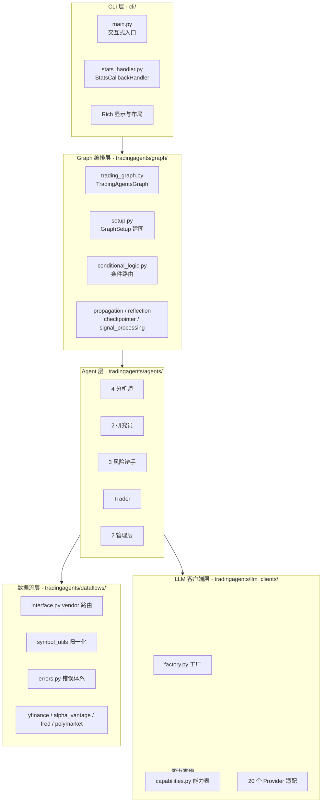
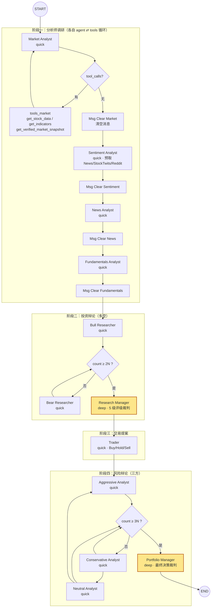
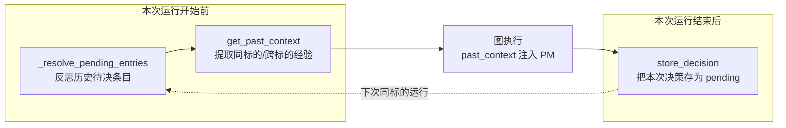
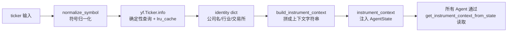
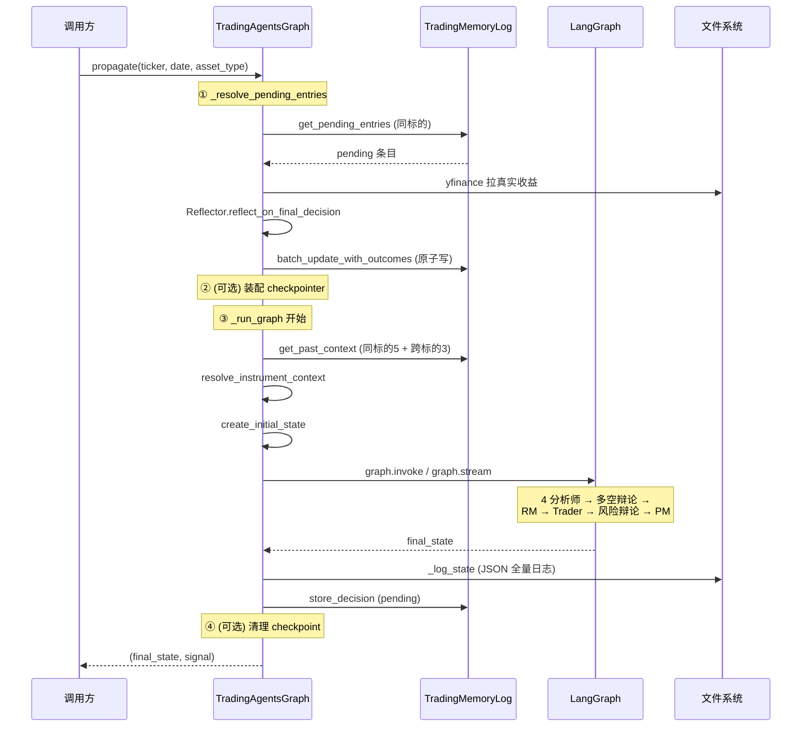

# 系统架构总览

> 难度 ⭐⭐⭐（进阶分析） · 面向想理解整体设计的研究者和资深开发者 · 预计阅读 40 分钟

## 这篇文章如何看待 TradingAgents

TradingAgents 真正解决的不是"用 LLM 看一眼股票"，而是把一家专业交易公司的投研流水线——分析师调研、多空辩论、交易提案、风险辩论、组合裁决——编码成一张**可观测、可中断、可复现**的 LangGraph 状态图。理解它的关键不在于"有多少个 Agent"，而在于看清三条容易被混在一起的主线：

1. **纵向的执行主线**：一次分析如何从 CLI 输入逐层穿过五个子系统，最终落成一份决策。这是本文要画的第一张地图。
2. **横向的能力主线**：记忆系统、标的身份解析、符号归一化这三套机制不归属任何一层，却贯穿所有层，决定了一次分析的"经验连续性"和"身份正确性"。
3. **数据与控制流的边界**：哪些是确定性的（图的路由、符号归一化、日期过滤），哪些是概率性的（LLM 的发言、结构化输出的填充），两者的边界在哪里。

读完这篇，你应该能回答：一次 `propagate()` 调用在系统里经历了什么、为什么有 12 个 LLM 角色却只调 2 个 LLM、以及三层横向机制各自负责什么。

---

## 分层架构：五个子系统

把代码按调用栈的方向自上而下切开，TradingAgents 一共五个子系统。下面这张总览表先给边界，后续小节再逐层展开。



每一层的职责边界如下：

| 层 | 目录 | 职责 | 不做什么 |
|------|------|------|------|
| CLI 层 | `cli/` | 交互式入口、Rich 终端显示、LLM/工具耗时与 token 统计 | 不直接调 LLM、不构造业务逻辑 |
| Graph 编排层 | `tradingagents/graph/` | LangGraph 状态图的构建、节点/边/条件路由、checkpoint、状态初始化 | 不写 Prompt、不实现具体数据接口 |
| Agent 层 | `tradingagents/agents/` | 12 个 LLM 角色的 Prompt 与状态读写，外加消息清理节点 | 不关心用哪个 Provider、不关心数据来自哪个 vendor |
| LLM 客户端层 | `tradingagents/llm_clients/` | Provider 工厂、能力表、结构化输出适配、模型校验 | 不持有业务状态、不写 Prompt |
| 数据流层 | `tradingagents/dataflows/` | vendor 路由、符号归一化、错误体系、具体数据源实现 | 不做投资判断、不调 LLM |

需要特别说明的是 CLI 层与 Graph 层的关系：CLI 不只是"打印结果"。它和 `propagate()` 是两条平行的入口，但都要做同一件关键事——在图启动前解析标的身份（`resolve_instrument_context`），否则下游 Agent 会拿不到身份锚点（见 `cli/main.py:1101-1112` 与 `trading_graph.py:336-346`）。这点在后面的横向能力小节会展开。

---

## 端到端数据流全景

这是本文最重要的一张图。它把一次分析的完整路径画出来，包括两个辩论循环的条件路由。建议先看这张图建立全局印象，再回到前面看分层。



读懂这张图的关键是两个**条件路由**，它们在 `tradingagents/graph/conditional_logic.py` 里：

- **投资辩论路由**（`should_continue_debate`，`conditional_logic.py:52-61`）：当 `investment_debate_state.count >= 2 * max_debate_rounds` 时进 Research Manager；否则根据 `current_response` 判断上一轮是谁发言，把话筒交给对方。两个研究员 Bull/Bear 交替，各算一次发言。
- **风险辩论路由**（`should_continue_risk_analysis`，`conditional_logic.py:63-73`）：当 `risk_debate_state.count >= 3 * max_risk_discuss_rounds` 时进 Portfolio Manager；否则按 Aggressive → Conservative → Neutral → Aggressive 的固定轮转。

注意图里两个标黄的节点（Research Manager、Portfolio Manager）用的是 `deep_thinking_llm`，其余 LLM 角色用的是 `quick_thinking_llm`。这是成本控制的核心设计，下一节的"两个 LLM 的分工"会展开。

分析师阶段的 agent ⇄ tools 循环也由条件路由驱动（`should_continue_market` 等，`conditional_logic.py:14-50`）：检查最后一条消息有没有 `tool_calls`，有就去执行工具再回到分析师，没有就进 Msg Clear 清空消息再交给下一个分析师。Msg Clear 不是 LLM 节点，它的作用是把上一个分析师累积的对话历史清掉，只留一个锚定到当前标的和日期的占位消息（`agent_utils.py:190-214`），避免上下文随分析师数量线性膨胀。

---

## 13 个角色表

图中一共有 13 个有名字的节点。其中 12 个是 LLM 角色（驱动一次或多次模型调用），1 个是消息清理节点（非 LLM）。下表给出每个角色的完整画像。

| # | 角色（节点名） | 所属团队 | 模型 | 用工具 | 结构化输出 | 职责 |
|---|------|------|------|:---:|:---:|------|
| 1 | Market Analyst | 分析师 | quick | ✓ | – | 选最多 8 个技术指标，拉行情，写技术面报告 |
| 2 | Sentiment Analyst | 分析师 | quick | –（预取） | ✓ | 预取 News/StockTwits/Reddit，产出情绪分档与叙事 |
| 3 | News Analyst | 分析师 | quick | ✓ | – | 拉新闻/宏观/预测市场，写宏观与事件面报告 |
| 4 | Fundamentals Analyst | 分析师 | quick | ✓ | – | 拉财报/现金流/利润表，写基本面报告 |
| 5 | Bull Researcher | 研究员 | quick | – | – | 基于四份报告为看多方辩护，反驳 Bear |
| 6 | Bear Researcher | 研究员 | quick | – | – | 基于四份报告为看空方辩护，反驳 Bull |
| 7 | Research Manager | 管理层（裁判） | **deep** | – | ✓ | 评估多空辩论，输出 5 级评级（Buy/Overweight/Hold/Underweight/Sell） |
| 8 | Trader | 交易 | quick | – | ✓ | 把评级转成具体交易提案（Buy/Hold/Sell + 入场/止损/仓位） |
| 9 | Aggressive Analyst | 风险辩手 | quick | – | – | 为高收益高风险方辩护 |
| 10 | Conservative Analyst | 风险辩手 | quick | – | – | 为稳健保守方辩护 |
| 11 | Neutral Analyst | 风险辩手 | quick | – | – | 提供中立平衡视角 |
| 12 | Portfolio Manager | 管理层（裁判） | **deep** | – | ✓ | 综合风险辩论，给出最终决策（5 级评级 + 目标价 + 时间区间） |
| 13 | Msg Clear（×4） | 横切 | – | – | – | 清空消息历史，留下锚定到标的+日期的占位消息 |

几个值得注意的细节：

- **"13"怎么数的**：12 个 LLM 角色 + Msg Clear 节点。Msg Clear 在四个分析师之间各出现一次（节点名分别为 `Msg Clear Market` / `Msg Clear Sentiment` / `Msg Clear News` / `Msg Clear Fundamentals`），但它们由同一个工厂 `create_msg_delete` 创建（`setup.py:100`），所以算作一类节点。
- **Sentiment Analyst 的特殊性**：它是唯一一个"预取数据"而非"工具循环"的分析师。数据在节点进入时就被同步抓取（News + StockTwits + Reddit），直接拼进 Prompt（`sentiment_analyst.py:66-80`）。这样设计是因为早期版本让 LLM 去调工具拉社交媒体数据，结果模型在 Prompt 压力下编造了不存在的 Reddit/StockTwits 内容（见 `sentiment_analyst.py` 顶部注释对 #557/#796 的说明）。
- **结构化输出的三个角色**：Research Manager、Trader、Portfolio Manager 都用 `with_structured_output` 绑定 Pydantic Schema（`schemas.py`），输出会被渲染成固定 Markdown 形状再往下传。Sentiment Analyst 也用结构化输出，但它的产物是报告而非决策。这个机制的边界在[结构化输出](../06-internals/structured-output.md)单独讲。

---

## 两个 LLM 的分工

TradingAgents 在初始化时创建两个 LLM 实例（`trading_graph.py:101-115`）：

```python
deep_client = create_llm_client(
    provider=self.config["llm_provider"],
    model=self.config["deep_think_llm"],      # 默认 gpt-5.5
    ...
)
quick_client = create_llm_client(
    provider=self.config["llm_provider"],
    model=self.config["quick_think_llm"],     # 默认 gpt-5.4-mini
    ...
)
self.deep_thinking_llm = deep_client.get_llm()
self.quick_thinking_llm = quick_client.get_llm()
```

默认配置在 `default_config.py`：`deep_think_llm = "gpt-5.5"`，`quick_think_llm = "gpt-5.4-mini"`。两个实例由 `GraphSetup` 在建图时绑定到具体节点（`setup.py:75-92`）：

| 模型 | 用在 | 调用次数（典型一次分析） | 为什么 |
|------|------|------|------|
| deep（gpt-5.5） | Research Manager、Portfolio Manager | 2 次 | 这两个角色是"裁判"，要综合整段辩论历史做最终判断，对推理深度要求高 |
| quick（gpt-5.4-mini） | 其余 10 个 LLM 角色 + 反思 | 11 次以上 | 分析师、研究员、辩手、Trader 的任务更局部，且分析师还会多次工具循环，调用频次高 |

成本逻辑很直接：贵的 deep 只在两个最关键的裁决点调用（各一次），便宜的 quick 承担所有高频、局部的任务。如果把所有角色都换成 deep，一次分析的成本会高出一个量级，但产出质量未必等比例提升——因为分析师和辩手的输出质量瓶颈往往在数据质量而非推理深度。

需要说明的是，这只是一个**成本与质量的工程权衡**，不是"裁判必须用大模型"的硬性约束。你可以把两个模型设成同一个（`deep_think_llm = quick_think_llm`），系统照常运行。

---

## 横向能力：贯穿所有层的三套机制

前面讲了纵向的分层和执行主线。但有三套机制不归属任何一层，却决定了系统的经验连续性和身份正确性。把它们和分层混在一起讲会乱，这里单独拆出来。

### 机制一：记忆系统（TradingMemoryLog）

记忆系统是一套**追加式的 Markdown 决策日志**，文件默认在 `~/.tradingagents/memory/trading_memory.md`（`memory.py`）。它的工作分两个阶段：



- **Phase A（运行前）**：`propagate()` 一开始调 `_resolve_pending_entries`（`trading_graph.py:296-334`），为本次标的的待决条目拉取实际收益、生成反思、原子批量写回。接着 `get_past_context`（`memory.py:70-95`）提取最多 5 条同标的 + 3 条跨标的的已反思经验，注入到 `past_context` 字段，最终在 Portfolio Manager 的 Prompt 里以"Lessons from prior decisions"形式出现（`portfolio_manager.py:35-40`）。
- **Phase B（运行后）**：图执行完，`store_decision` 把本次决策以 `pending` 状态追加到日志（`trading_graph.py:469-473`）。注意它**不立即反思**——反思要等真实收益数据可用，所以推迟到下一次同标的运行时。

记忆系统的边界：只有同标的的 pending 条目会在本次运行被反思；其他标的的 pending 条目会一直累积，直到那个标的再次被运行（`trading_graph.py:303-305` 注释明确写了这个取舍）。

### 机制二：标的身份解析（resolve_instrument_identity）

这套机制要解决一个具体 bug：早期版本里，Market Analyst 会根据价格图表的走势模式"猜"出一个公司身份，然后这个错误身份一路级联到所有下游 Agent（issue #814）。修复办法是在运行开始时做一次**确定性的身份解析**，把结果注入到所有 Agent：



身份解析在两个入口都被调用，保证无论从哪进来，下游都能拿到身份：`propagate()` 路径在 `_run_graph`（`trading_graph.py:424`），CLI 路径在 `main.py:1104`。它被设计成**fail-open**：yfinance 不可用或不认识这个标的时返回 `{}`，调用方退化为只用 ticker 的上下文，而不是在分析开始前就失败（`agent_utils.py:98-102`）。

### 机制三：符号归一化（normalize_symbol）

数据层的统一入口。用户/券商常用的符号和 Yahoo Finance 要的符号经常不一致（`symbol_utils.py` 顶部注释有完整对照表）：

| 用户输入 | Yahoo 需要 | 规则 |
|---------|-----------|------|
| `XAUUSD` | `GC=F` | 黄金走 COMEX 期货 |
| `EURUSD` | `EURUSD=X` | 外汇加 `=X` 后缀 |
| `BTCUSD` | `BTC-USD` | 加密货币用 `-` 分隔 |
| `SPX500` | `^GSPC` | 指数 CFD 映射到 Yahoo 指数符号 |

`normalize_symbol`（`symbol_utils.py:104-138`）是纯语法函数，不发网络请求，按"别名表 → 加密规则 → 外汇规则 → 原样返回"的顺序解析。它被三处调用：符号归一化本身、身份解析（`agent_utils.py:96`）、收益回填（`trading_graph.py:262`）。集中在这里，意味着所有 yfinance 入口点都用同一种方式解析符号，加新品种只需往表里加一行，不用改调用点。

> **三条横向机制的边界**：记忆系统是**经验**的连续性（跨运行），身份解析是**对象**的正确性（单次运行内防幻觉），符号归一化是**符号**的一致性（跨数据源）。三者职责不重叠，去掉任何一个都会留下特定类型的错误。

---

## 一次分析的生命周期

把前面所有零散的机制串起来，看一次 `propagate()` 调用从头到尾发生了什么。这是检验你是否真正理解架构的最好方式。



逐步拆解（行号均指向 `tradingagents/graph/trading_graph.py`）：

1. **反思历史**（`_resolve_pending_entries`，`trading_graph.py:296-334`）：找出本标的的 pending 条目，拉取持有期收益（`_fetch_returns`，`:251-294`），用 Reflector 生成 2-4 句反思，原子批量写回。价格数据还没出来（太新或已退市）的条目跳过，等下次再试。
2. **装配 checkpoint**（可选，`trading_graph.py:378-394`）：若 `checkpoint_enabled` 为真，重新编译图并挂上按标的隔离的 SqliteSaver，崩溃的运行可在下次同标的同日期续跑。thread_id 里折叠了图形状签名（分析师选择、辩论深度、资产类型），换其中任何一个都会从零开始（`:348-360`）。
3. **构造状态**（`_run_graph`，`trading_graph.py:419-432`）：调 `get_past_context` 取经验、`resolve_instrument_context` 解析身份、`create_initial_state` 组装初始状态字典。这三个值（`past_context`、`instrument_context`、初始的四个空报告）就是图启动前的全部输入。
4. **执行图**（`trading_graph.py:440-463`）：debug 模式用 `graph.stream` 逐节点打印并合并 chunk，非 debug 模式直接 `graph.invoke`。两种模式返回的 final_state 形状一致。
5. **落盘**（`trading_graph.py:462-480`）：`_log_state` 把全量状态写成 JSON（含两段辩论的完整历史）；`store_decision` 把最终决策存为 pending；若开了 checkpoint，成功完成后清理掉对应记录。
6. **返回**：返回 `(final_state, signal)`，其中 signal 是从最终决策里抽出的 5 级评级（`process_signal` → `parse_rating`，确定性启发式，不再调 LLM）。

CLI 路径（`main.py:1098-1115`）和这条路径的区别在于：CLI 不调 `propagate()`，而是自己拼初始状态 + 直接 `graph.stream`，但**身份解析和状态构造这两步必须自己做**（否则下游拿不到身份）。这就是为什么"身份解析是横向能力"——它不归属 Graph 层独有，而是任何想正确启动图的入口都必须做的事。

---

## 包结构

最后给一张 `tradingagents/` 的目录树，标注每个子包的职责，作为定位源码的索引。

```text
tradingagents/
├── default_config.py        # DEFAULT_CONFIG 单一来源 + TRADINGAGENTS_* 环境变量覆盖
├── graph/                   # Graph 编排层
│   ├── trading_graph.py     #   TradingAgentsGraph：对外入口，propagate/_run_graph
│   ├── setup.py             #   GraphSetup：建图，add_node/add_edge/add_conditional_edges
│   ├── conditional_logic.py #   ConditionalLogic：6 个条件路由函数
│   ├── propagation.py       #   Propagator：create_initial_state + graph args
│   ├── analyst_execution.py #   分析师执行计划（AnalystNodeSpec/AnalystExecutionPlan）
│   ├── reflection.py        #   Reflector：延迟反思的 Prompt 与调用
│   ├── signal_processing.py #   SignalProcessor：从最终决策抽 5 级评级
│   └── checkpointer.py      #   per-ticker SQLite checkpoint
├── agents/                  # Agent 层
│   ├── analysts/            #   4 个分析师（market/sentiment/news/fundamentals）
│   ├── researchers/         #   2 个研究员（bull/bear）
│   ├── risk_mgmt/           #   3 个风险辩手（aggressive/conservative/neutral）
│   ├── trader/              #   Trader
│   ├── managers/            #   2 个管理层（research/portfolio）
│   ├── schemas.py           #   Pydantic Schema（ResearchPlan/TraderProposal/PortfolioDecision/SentimentReport）
│   └── utils/               #   agent_utils（工具汇总+身份/语言助手）、memory、rating、structured
├── llm_clients/             # LLM 客户端层
│   ├── factory.py           #   create_llm_client 工厂（懒加载）
│   ├── capabilities.py      #   能力表（DeepSeek/MiniMax 等的 API 怪癖）
│   ├── base_client.py       #   BaseLLMClient 抽象基类
│   ├── model_catalog.py     #   CLI 模型选项目录
│   ├── openai_client.py     #   OpenAI 兼容家族（16 个 ProviderSpec）
│   ├── anthropic_client.py  #   Anthropic 原生
│   ├── google_client.py     #   Google Gemini 原生
│   ├── azure_client.py      #   Azure OpenAI
│   ├── bedrock_client.py    #   AWS Bedrock
│   ├── api_key_env.py       #   各 Provider 的 API key 环境变量映射
│   └── validators.py        #   模型名校验
└── dataflows/               # 数据流层
    ├── interface.py         #   route_to_vendor：vendor 路由 + fallback + 哨兵
    ├── symbol_utils.py      #   normalize_symbol：符号归一化
    ├── errors.py            #   VendorError 体系（NoMarketData/RateLimit/NotConfigured）
    ├── config.py            #   全局 config 读写
    ├── y_finance.py         #   yfinance 实现（行情/指标/财报）
    ├── yfinance_news.py     #   yfinance 新闻（含前视偏差过滤）
    ├── alpha_vantage*.py    #   Alpha Vantage 实现（拆成多个模块）
    ├── fred.py              #   FRED 宏观数据
    ├── polymarket.py        #   Polymarket 预测市场
    ├── reddit.py            #   Reddit 帖子抓取
    ├── stocktwits.py        #   StockTwits 消息抓取
    ├── stockstats_utils.py  #   技术指标计算
    ├── market_data_validator.py # 行情校验
    └── utils.py             #   safe_ticker_component 等工具
```

CLI 层在仓库根的 `cli/` 目录，不属于 `tradingagents/` 包，但和它平级协作。

---

## 下一步

本文给了静态的分层、动态的数据流、横向能力、生命周期，以及包结构索引。要继续深入，按下面的顺序展开：

- 想知道**每个设计决策为什么这么做**（为什么用多 Agent、为什么双辩论、为什么用两个 LLM、为什么用哨兵字符串而不是空值），读下一篇 [设计哲学](design-philosophy.md)。
- 想深入 **Graph 的节点/边/条件路由细节**，读 [Graph 编排](../04-graph-and-agents/graph-orchestration.md)。
- 想看 **13 个角色的 Prompt 构造和工具使用**，读 [Agent 团队](../04-graph-and-agents/agent-system.md)。
- 想搞懂 **两个辩论循环的数学和状态机**，读 [辩论机制](../04-graph-and-agents/debate-mechanism.md)。
- 想理解 **vendor 路由、fallback、错误体系**，读 [数据供应商路由](../05-data-and-llm/data-vendors.md)。
- 想了解 **20 个 Provider 和能力表**，读 [LLM 客户端](../05-data-and-llm/llm-clients.md)。

如果只想记住一件事：**TradingAgents 的架构核心是用一张确定性状态图编排 12 个 LLM 角色，把投资判断的不确定性关在两个辩论循环和两个裁判节点里，而身份正确性、经验连续性、符号一致性这三套横向机制保证了一次分析的输入是可信的。**
