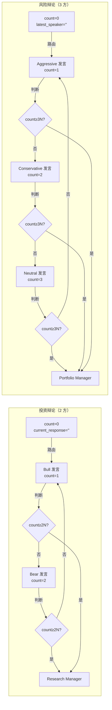
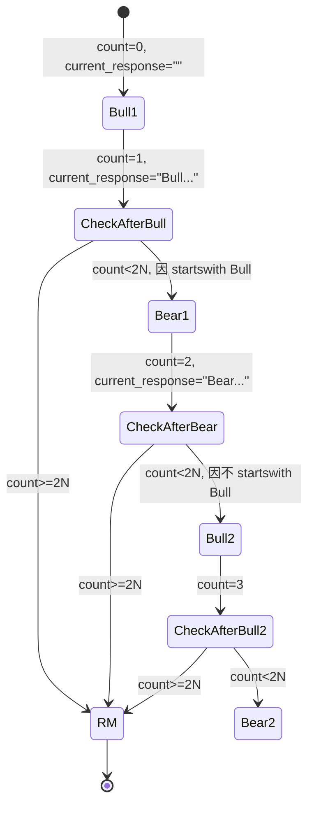
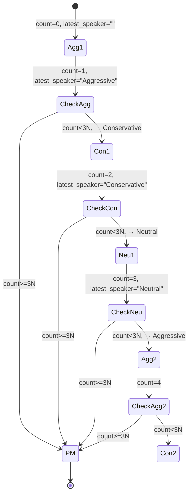
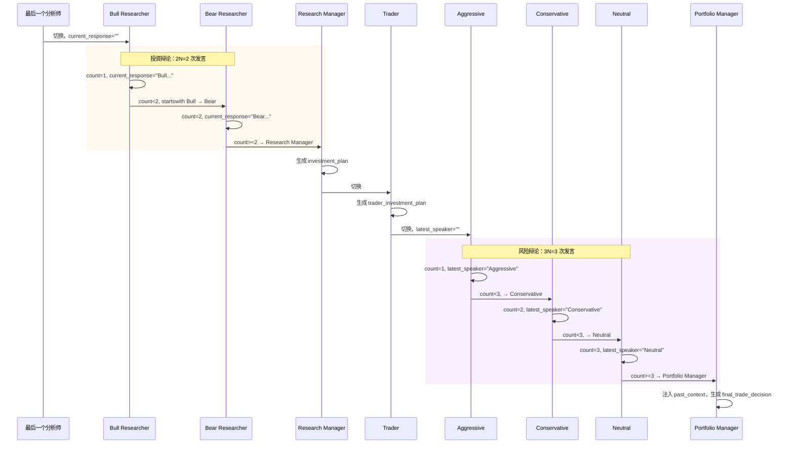

---
难度：⭐⭐⭐
类型：进阶分析
预计时间：25 分钟
前置知识：
  - [Graph 编排](graph-orchestration.md) ⭐⭐⭐
  - [Agent 团队](agent-system.md) ⭐⭐⭐
  - [状态模型](state-model.md) ⭐⭐⭐
后续推荐：
  - [扩展指南](../07-development/extension-guide.md) ⭐⭐⭐
学习路径：
  - 开发路径：第 3 阶段
  - 进阶路径：第 2 阶段
---

# 辩论机制：两套循环的数学与状态机

## 引言：为什么辩论需要专门的文档

TradingAgents 的两套辩论（投资辩论 + 风险辩论）是整套流水线里最容易被误读的部分。表面看，两套都是"几个 agent 轮流发言，到次数后裁判收尾"。但只要读一下条件路由代码，就会发现几个反直觉的设计：

- `max_debate_rounds=1` 时，Bull 实际发言 1 次、Bear 发言 1 次。但 `count >= 2 * max_debate_rounds` 这个阈值看起来像 2。
- 风险辩论的 `max_risk_discuss_rounds=1` 时，三方各发 1 次言，但阈值是 `count >= 3 * max_risk_discuss_rounds`，看起来又像 3。
- 投资辩论用 `current_response.startswith("Bull")` 路由，风险辩论用 `latest_speaker.startswith("Aggressive")` 路由——为什么不用同一种判断？

这些差异不是历史遗留的随意选择，而是从"双方辩论"和"三方辩论"的拓扑差异推出的。这篇文档专门拆开两套辩论的数学、状态机、轮次控制，把容易混淆的几个点讲清。

## 总览：两套辩论的结构对比



横向对比：

| 维度 | 投资辩论 | 风险辩论 |
|------|---------|---------|
| 参与方 | 2（Bull / Bear） | 3（Aggressive / Conservative / Neutral） |
| 裁判 | Research Manager（deep） | Portfolio Manager（deep） |
| 阈值公式 | `count >= 2 * max_debate_rounds` | `count >= 3 * max_risk_discuss_rounds` |
| 路由依据 | `current_response.startswith` | `latest_speaker.startswith` |
| 输入 | 4 份 report + 辩论历史 + 对方论点 | 4 份 report + Trader 提案 + 辩论历史 + 另两方论点 |
| 输出 | `investment_plan`（5 级 ResearchPlan） | `final_trade_decision`（5 级 PortfolioDecision） |
| 默认 N | 1 | 1 |

公式里"2"和"3"对应的是参与方数量，"N"是用户配的轮数。这个对应关系是后面所有数学的根。

## 投资辩论：2N 数学

### 阈值的真正含义

`conditional_logic.py:55-57` 的判定：

```python
if (
    state["investment_debate_state"]["count"] >= 2 * self.max_debate_rounds
):  # 3 rounds of back-and-forth between 2 agents
    return "Research Manager"
```

注释里"3 rounds"是过时的（曾经的默认值），代码以 `2 * max_debate_rounds` 为准。默认 `max_debate_rounds=1` 时阈值是 2。

为什么是 `2 * N`？因为"一轮辩论"在双方场景下定义为"各方各发言一次"——Bull 一次 + Bear 一次 = 2 次发言 = 1 轮。所以 N 轮就是 2N 次发言，count 累加到 2N 时进入裁判。

| `max_debate_rounds` | 阈值 `2N` | Bull 发言次数 | Bear 发言次数 | 总发言 |
|---------------------|----------|--------------|--------------|--------|
| 1（默认） | 2 | 1 | 1 | 2 |
| 2 | 4 | 2 | 2 | 4 |
| 3 | 6 | 3 | 3 | 6 |
| N | 2N | N | N | 2N |

这张表是这套数学的核心。读到 `count >= 2 * max_debate_rounds` 时不要直接把它当"2 轮"，而是当"2N 次发言"，就对应到 N 个完整回合。

### 路由：靠发言内容反推发言者

`conditional_logic.py:59-61`：

```python
if state["investment_debate_state"]["current_response"].startswith("Bull"):
    return "Bear Researcher"
return "Bull Researcher"
```

注意这里**没有**显式记录"下一个该谁发言"的状态字段。路由完全靠 `current_response` 的内容前缀判断。

每个 researcher 在生成发言时都加上前缀（`bull_researcher.py:49`、`bear_researcher.py:51`）：

```python
argument = f"Bull Analyst: {response.content}"   # 或 "Bear Analyst:"
```

这套机制有一个微妙的特性：**初始 state 的 `current_response` 是空字符串**（`propagation.py:46`）。空字符串不 startswith "Bull"，所以第一次路由返回 `"Bull Researcher"`，Bull 先发言。这是 Bull 优先的真正原因，不是图拓扑上的顺序——图里 Bull 和 Bear 都接到同一个路由器。

### 状态机：完整的发言顺序

把上面的逻辑画成状态机：



默认 `max_debate_rounds=1` 的实际执行顺序：

```
初始: count=0, current_response=""
1. 路由 → Bull Researcher (因为 current_response="" 不 startswith "Bull")
2. Bull 发言: count=1, current_response="Bull Analyst: ..."
3. 路由: count=1 < 2*1=2，且 startswith "Bull" → Bear Researcher
4. Bear 发言: count=2, current_response="Bear Analyst: ..."
5. 路由: count=2 >= 2*1=2 → Research Manager
6. Research Manager 裁决 → investment_plan
```

`max_debate_rounds=2` 时：

```
1. Bull (count=1) → Bear (count=2) → Bull (count=3) → Bear (count=4) → Research Manager
```

注意第 4 步：Bear 发言完 count=4，>= 2*2=4，进入裁判。即使是 N=2，最后也是 Bear 收尾，因为 Bull 永远先发言、双方交替。

### 状态更新：为什么必须原样拷贝对方 history

`bull_researcher.py:51-57` 的状态更新：

```python
new_investment_debate_state = {
    "history": history + "\n" + argument,
    "bull_history": bull_history + "\n" + argument,
    "bear_history": investment_debate_state.get("bear_history", ""),  # 原样拷贝
    "current_response": argument,
    "count": investment_debate_state["count"] + 1,
}
```

注意 `bear_history` 这一行：Bull 节点把自己 history 追加，把 Bear 的 history **原样拷贝**。这看起来冗余——Bear 的 history 不就在 state 里吗，为什么要 Bull 重新写一遍？

原因是 LangGraph 的 reducer 语义。`investment_debate_state` 是嵌套 TypedDict，没有显式 reducer。LangGraph 对这种字段的处理是**整体覆盖**：节点返回的子字典会直接替换原字典，而不是合并。如果 Bull 只返回 `bull_history` 不带 `bear_history`，覆盖后 `bear_history` 就丢了，Bear 之前累积的所有发言清零。

这个设计是 TradingAgents 状态模型的"陷阱点"。详见 [状态模型](state-model.md) 的 reducer 章节。对辩论机制的影响是：每个 researcher 节点返回的 new state 必须把所有字段都带上，即使"不变"的字段也要从原 state 显式拷贝。Bull 拷 Bear 的 history 不是因为它要修改，而是为了在整体覆盖语义下保住对方的数据。

`history` 字段是个例外——它存的是双方合并的发言，每次发言都 append 自己的 argument 进去（`history + "\n" + argument`）。所以 `history` 实际上是 `bull_history` 和 `bear_history` 的并集，按发言时间顺序排列。

## 风险辩论：3N 数学

### 阈值的不同

`conditional_logic.py:65-67`：

```python
if (
    state["risk_debate_state"]["count"] >= 3 * self.max_risk_discuss_rounds
):  # 3 rounds of back-and-forth between 3 agents
    return "Portfolio Manager"
```

注释里"3 rounds"同样是过时的，代码以 `3 * max_risk_discuss_rounds` 为准。默认 `max_risk_discuss_rounds=1` 时阈值是 3。

为什么是 `3 * N`？因为风险辩论是三方，"一轮"定义为"三方各发言一次"——Aggressive + Conservative + Neutral = 3 次发言 = 1 轮。N 轮就是 3N 次发言。

| `max_risk_discuss_rounds` | 阈值 `3N` | Aggressive | Conservative | Neutral | 总发言 |
|---------------------------|----------|------------|--------------|---------|--------|
| 1（默认） | 3 | 1 | 1 | 1 | 3 |
| 2 | 6 | 2 | 2 | 2 | 6 |
| 3 | 9 | 3 | 3 | 3 | 9 |
| N | 3N | N | N | N | 3N |

### 路由：靠 latest_speaker 判断

`conditional_logic.py:69-73`：

```python
if state["risk_debate_state"]["latest_speaker"].startswith("Aggressive"):
    return "Conservative Analyst"
if state["risk_debate_state"]["latest_speaker"].startswith("Conservative"):
    return "Neutral Analyst"
return "Aggressive Analyst"
```

这里用的是 `latest_speaker`，而不是 `current_response`。差异的原因：

- 投资辩论只有两方，"刚才是谁"可以从 `current_response` 的前缀反推（Bull/Bear 各自的 argument 都带前缀）。
- 风险辩论有三方，存在三个 `current_*_response` 字段，用任何一个都不能直接反推"轮到下一个该谁"。所以专门维护了 `latest_speaker` 字段。

`latest_speaker` 取的是 "Aggressive" / "Conservative" / "Neutral" 这种短前缀（不带 "Analyst"），由各 debator 在状态更新时显式设置（`aggressive_debator.py:48` 设 `"Aggressive"`，`conservative_debator.py:48` 设 `"Conservative"`，`neutral_debator.py:48` 设 `"Neutral"`）。`startswith` 匹配让前缀即使被加上后缀也能识别。

轮转规则：**Aggressive → Conservative → Neutral → 循环**。注意初始 `latest_speaker=""`（`propagation.py:57`），三个 startswith 都不匹配，落入最后的 `return "Aggressive Analyst"` 分支，所以 Aggressive 永远先发言。

### 状态机：三方的轮转



默认 `max_risk_discuss_rounds=1` 的实际执行顺序：

```
初始: count=0, latest_speaker=""
1. 路由 → Aggressive (3 个 startswith 都不匹配 → 默认分支)
2. Aggressive 发言: count=1, latest_speaker="Aggressive"
3. 路由: count=1 < 3*1=3，startswith "Aggressive" → Conservative
4. Conservative 发言: count=2, latest_speaker="Conservative"
5. 路由: count=2 < 3*1=3，startswith "Conservative" → Neutral
6. Neutral 发言: count=3, latest_speaker="Neutral"
7. 路由: count=3 >= 3*1=3 → Portfolio Manager
8. Portfolio Manager 裁决 → final_trade_decision
```

`max_risk_discuss_rounds=2` 时：

```
Aggressive(1) → Conservative(2) → Neutral(3) → Aggressive(4) → Conservative(5) → Neutral(6) → Portfolio Manager
```

注意第 7 步：Neutral 发言完 count=3，>= 阈值 3，**即使 latest_speaker 路由判断会把它送到 Aggressive，但阈值判断在前**。`should_continue_risk_analysis` 的代码顺序是先判阈值、后判路由——这是个很重要的实现细节，确保最后一方发言完直接进裁判，不会多绕一圈。

### 状态更新：11 字段的整体覆盖

`aggressive_debator.py:43-55` 的状态更新：

```python
new_risk_debate_state = {
    "history": history + "\n" + argument,
    "aggressive_history": aggressive_history + "\n" + argument,
    "conservative_history": risk_debate_state.get("conservative_history", ""),
    "neutral_history": risk_debate_state.get("neutral_history", ""),
    "latest_speaker": "Aggressive",
    "current_aggressive_response": argument,
    "current_conservative_response": risk_debate_state.get("current_conservative_response", ""),
    "current_neutral_response": risk_debate_state.get("current_neutral_response", ""),
    "count": risk_debate_state["count"] + 1,
}
```

9 个字段（不算 `judge_decision`，那是裁判才设的），其中 5 个是原样拷贝。这就是为什么风险辩论的状态更新比投资辩论繁琐——三方而不是两方，所以不变的字段更多。

`history` 同样是 append 自己的 argument。每个 debator 节点都会做 `history + "\n" + argument`，所以 `history` 是按时间顺序排列的所有发言合并。

## 两套辩论的差异本质

回到引言里的问题：为什么投资辩论用 `current_response`、风险辩论用 `latest_speaker`？

答案是参与方数量。两方时，发言者可以从发言内容前缀反推（"Bull..." vs "Bear..."），不需要额外字段。三方时，存在三个 `current_*_response`，每个 debator 只更新自己的那一个，看任何一个都不知道"轮到谁"——必须维护独立的 `latest_speaker` 字段。

更深层的原因：路由器的输入应该是一个能**无歧义反推下一步**的状态字段。两方时一个布尔（"是 Bull 吗"）就够了；三方时需要三态枚举（Aggressive/Conservative/Neutral）。`current_response` 字符串在两方场景下天然二分，但三方场景下需要专门的 `latest_speaker`。

| 差异点 | 投资辩论（2 方） | 风险辩论（3 方） | 原因 |
|--------|-----------------|-----------------|------|
| 阈值系数 | 2 | 3 | 参与方数 |
| 路由字段 | `current_response` | `latest_speaker` | 三方需要专门字段 |
| 路由判断 | `startswith("Bull")` 二分 | 三段 `startswith` + 默认 | 二分 vs 三态 |
| 状态字段数 | 5 | 11 | 三方 history/response 翻倍 |

## 环境变量与默认值

两套辩论的轮数都可通过环境变量覆盖。`default_config.py:16-17`：

```python
"TRADINGAGENTS_MAX_DEBATE_ROUNDS":    "max_debate_rounds",
"TRADINGAGENTS_MAX_RISK_ROUNDS":      "max_risk_discuss_rounds",
```

默认值（`default_config.py:110-111`）都是 1。注意环境变量名是不对称的——投资辩论叫 `MAX_DEBATE_ROUNDS`，风险辩论叫 `MAX_RISK_ROUNDS`（不带 DISCUSS），但映射到的 config key 是 `max_risk_discuss_rounds`。这是历史命名，使用者注意。

调高轮数会同时增加：

- LLM 调用次数（线性）
- Prompt 长度（辩论历史累积，每个 debator 都要读完整 history）
- 递归步数消耗（每方发言算一步递归，受 `max_recur_limit=100` 限制）

把两套辩论都调到 N=10，投资辩论消耗 20 步、风险辩论消耗 30 步，加上分析师工具循环的消耗，可能逼近 `max_recur_limit`。调高辩论轮数时建议同步调高 `max_recur_limit`。

## 一个完整的双辩论流

把两套辩论放在一次完整运行里看。默认配置（`max_debate_rounds=1`、`max_risk_discuss_rounds=1`）：



注意几个切换点：

- 最后一个分析师（如 Fundamentals Analyst）的 `Msg Clear *` 节点直接 `add_edge` 到 Bull Researcher。这是分析阶段→辩论阶段的硬切换。
- Research Manager 到 Trader 是 `add_edge`，不经过辩论循环。
- Trader 到 Aggressive Analyst 也是 `add_edge`——Trader 的输出进入风险辩论的输入（每个 debator 的 prompt 都包含 `trader_decision`）。

## 设计取舍

| 设计 | 选择 | 替代方案 | 取舍 |
|------|------|---------|------|
| 路由判据 | 发言内容前缀 / latest_speaker | 显式 "next_speaker" 字段 | 用现有发言信息反推，少维护一个字段；但 prompt 漂移会影响路由 |
| 阈值判断顺序 | 先判阈值、后判路由 | 反过来 | 保证最后一方发言完直接进裁判，不多绕一圈 |
| 子状态更新 | 整体覆盖 | 字段级 reducer | 简单，但每个节点都要拷贝所有字段 |
| 辩论顺序 | 固定（Bull→Bear，Agg→Con→Neu） | 动态 | 可预测、可重现；但失去随机性带来的"视角轮换" |

## 下一步

- [状态模型](state-model.md)：`InvestDebateState` 和 `RiskDebateState` 的完整字段、reducer 语义详解
- [Graph 编排](graph-orchestration.md)：辩论节点在整张图里的拓扑位置、`DEBATE_PATH_MAP` 的防御性设计
- [扩展指南](../07-development/extension-guide.md)：如何加第四方风控辩手（涉及阈值系数、路由判断、状态字段的连锁修改）

---

**文档元信息**
难度：⭐⭐⭐ | 类型：进阶分析 | 预计阅读时间：25 分钟
