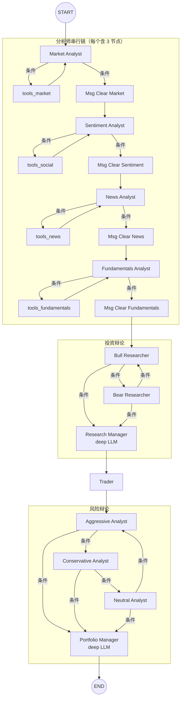
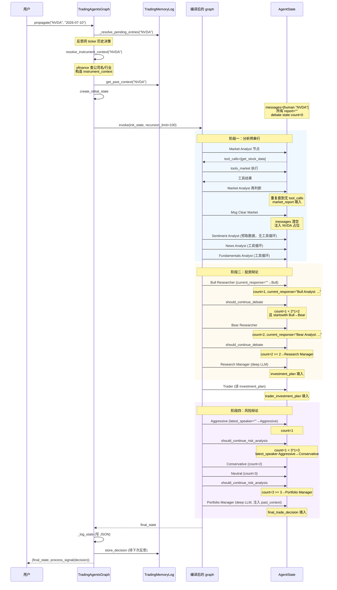

---
难度：⭐⭐⭐
类型：进阶分析
预计时间：35 分钟
前置知识：
  - [系统架构总览](../03-architecture/overview.md) ⭐⭐⭐
  - [状态模型](state-model.md) ⭐⭐⭐
后续推荐：
  - [Agent 团队](agent-system.md) ⭐⭐⭐
  - [辩论机制](debate-mechanism.md) ⭐⭐⭐
学习路径：
  - 开发路径：第 3 阶段
  - 进阶路径：第 2 阶段
---

# Graph 编排：把投研流水线编码成状态图

## 引言：为什么不是 if/else，而是图

TradingAgents 模拟的是真实投研团队的工作流：分析师调研、多空辩论、交易员提案、风控辩论、组合经理裁决。这套流程里有三种本质的并行与串行混合需求——分析师必须先于辩论（串行），多空双方要交替发言（条件循环），风控三方要轮流发言（条件循环），但循环的终止条件和路由依据都不一样。

如果用过程式的 if/else 写，每种路由分支都会埋进业务代码，节点之间的契约靠注释维护，改一处就可能让全图崩溃。TradingAgents 选择把它编成一张 LangGraph 的 `StateGraph`，节点是纯函数、边是显式声明、条件路由是独立可测的函数。这样一来，"分析师之间的顺序衔接"和"辩论双方的交替规则"在源码层面就被拆开了，调度逻辑可以脱离 prompt 单独演进。

这篇文档拆开三件事：图的拓扑（哪些节点、哪些边）、条件路由（ReAct 工具循环与辩论循环各靠什么驱动）、以及运行期的状态注入与内存管理（为什么每个分析师之间要清空消息）。文末用一个端到端任务流把三者串起来。

## 总览：一张图的全貌

先把整张图的拓扑画出来，再去看细节。所有节点都注册在 `setup.py:61-156` 的 `setup_graph()` 里。



关键观察：13 个"角色"在用户视角下是一条线，但在图层面被拆成了远多于 13 个节点。每个分析师占 3 个节点，辩论双方各自带条件出边。下面解释为什么会这样。

## 节点的三种身份

### 1. 动态分析师节点（每个拆成 3 个）

`setup.py:98-101` 循环注册每个分析师：

```python
for spec in plan.specs:
    workflow.add_node(spec.agent_node, analyst_factories[spec.key]())
    workflow.add_node(spec.clear_node, create_msg_delete())
    workflow.add_node(spec.tool_node, self.tool_nodes[spec.key])
```

对 `Market Analyst` 来说，注册的三个节点分别是：

- `Market Analyst`（`spec.agent_node`）：调用 LLM 的主体，ReAct 模式
- `Msg Clear Market`（`spec.clear_node`）：消息清理节点，准备切换到下一个分析师
- `tools_market`（`spec.tool_node`）：一个 `ToolNode`，执行 LLM 的工具调用

这套三元组对应的是 ReAct 模式的工具循环。`Market Analyst` 节点可能返回带 `tool_calls` 的消息，路由到 `tools_market` 执行工具；工具结果回灌到 `Market Analyst` 再判断，如此往复，直到模型不再调用工具，路由到 `Msg Clear Market` 收尾。

这种拆分不是装饰，而是因为 `ToolNode` 在 LangGraph 里是独立可调度的执行单元。把它单独注册成节点，能让工具调用与 LLM 调用之间的状态流转由 LangGraph 框架托管，agent 函数本身只负责调 LLM。

### 2. AnalystNodeSpec：固化映射关系

`analyst_execution.py:6-12` 用 `frozen dataclass` 把每个分析师的映射锁死：

```python
@dataclass(frozen=True)
class AnalystNodeSpec:
    key: str
    agent_node: str
    clear_node: str
    tool_node: str
    report_key: str
```

五个字段分别对应：编程用的 key、显示用的 agent 节点名、清理节点名、工具节点名、最终报告写入的状态字段名。`ANALYST_NODE_SPECS`（`analyst_execution.py:20-53`）以字典形式固化四个分析师的 spec。

`social` 这个 key 是一个值得注意的向后兼容设计。v0.2.5 之前这个角色叫 "Social Media Analyst"，之后改名 "Sentiment Analyst"，但 agent 的 prompt 路径、配置文件的保存格式、条件路由函数名（`should_continue_social`）都依赖 `social` 这个 wire key。所以 `ANALYST_NODE_SPECS["social"]` 保留了 `key="social"`，但 `agent_node="Sentiment Analyst"`。这让旧配置文件仍能加载，新流程显示的是新名字。

`build_analyst_execution_plan`（`analyst_execution.py:56-69`）接受用户选定的分析师列表，按顺序生成执行计划。传入未知 key 会立刻 `raise ValueError`，避免图编译到一半才崩。空列表也拒绝。

### 3. 固定的 7 个非分析师节点

`setup.py:104-111` 注册辩论与决策节点：

```python
workflow.add_node("Bull Researcher", bull_researcher_node)
workflow.add_node("Bear Researcher", bear_researcher_node)
workflow.add_node("Research Manager", research_manager_node)
workflow.add_node("Trader", trader_node)
workflow.add_node("Aggressive Analyst", aggressive_analyst)
workflow.add_node("Neutral Analyst", neutral_analyst)
workflow.add_node("Conservative Analyst", conservative_analyst)
workflow.add_node("Portfolio Manager", portfolio_manager_node)
```

这些节点不依赖工具循环、不需要消息清理，所以单独注册即可。注意 `Research Manager` 和 `Portfolio Manager` 用的是 `deep_thinking_llm`，其余 5 个用 `quick_thinking_llm`。LLM 档位的分配反映了角色的判断深度：裁判要给出最终评级，用更强的模型；辩手和分析家用更快的模型，因为它们要么是反复迭代、要么要调多次工具。

## 边的连接策略

`setup.py:113-154` 是图的"接线员"。所有边可以分成三类。

### 类一：固定的串行边

```python
workflow.add_edge(START, plan.specs[0].agent_node)     # 入口
workflow.add_edge("Research Manager", "Trader")        # 辩论→交易
workflow.add_edge("Trader", "Aggressive Analyst")      # 交易→风控
workflow.add_edge("Portfolio Manager", END)            # 出口
```

这些是不依赖运行时状态、永远成立的边。`plan.specs[0].agent_node` 不是硬编码字符串而是 spec 字段，意味着用户选择只跑 `(market, news)` 时，入口会变成 `Market Analyst`；选 `(fundamentals,)` 时，入口是 `Fundamentals Analyst`。

### 类二：分析师链的拼接

`setup.py:118-135` 循环把分析师串起来。每个分析师有两条条件边：

```python
workflow.add_conditional_edges(
    current_analyst,
    getattr(self.conditional_logic, f"should_continue_{spec.key}"),
    [current_tools, current_clear],
)
workflow.add_edge(current_tools, current_analyst)   # 工具回流
```

`getattr(self.conditional_logic, f"should_continue_{spec.key}")` 这行是关键。`spec.key` 是 `market`/`social`/`news`/`fundamentals` 之一，所以路由器是 `should_continue_market`/`should_continue_social` 等。每个路由器返回的目标节点名不同（`tools_market` vs `tools_social`），但判定逻辑完全一致：检查最后一条消息是否有 `tool_calls`。

接着，分析师清理完消息后要接到下一个分析师。`setup.py:131-135` 处理链尾：

```python
if i < len(plan.specs) - 1:
    workflow.add_edge(current_clear, plan.specs[i + 1].agent_node)
else:
    workflow.add_edge(current_clear, "Bull Researcher")
```

最后一个分析师清理完消息，直接进入投资辩论。这条边是"分析阶段→辩论阶段"的硬切换。

### 类三：辩论的条件循环边

投资辩论（`setup.py:138-143`）：

```python
for debate_node in ("Bull Researcher", "Bear Researcher"):
    workflow.add_conditional_edges(
        debate_node,
        self.conditional_logic.should_continue_debate,
        DEBATE_PATH_MAP,
    )
```

两个辩论节点共享同一个路由器 `should_continue_debate`，但都传入完整的 `DEBATE_PATH_MAP`：

```python
DEBATE_PATH_MAP = {
    "Bull Researcher": "Bull Researcher",
    "Bear Researcher": "Bear Researcher",
    "Research Manager": "Research Manager",
}
```

风险辩论（`setup.py:147-152`）同理，三个风控节点共享 `should_continue_risk_analysis` 和 `RISK_ANALYSIS_PATH_MAP`。

`setup.py:28-42` 的注释解释了为什么要传完整的目标映射，而不是只传"可能的目标"：

> Every target a shared conditional router can return. Each edge driven by the router maps all of them, so a fall-through return (e.g. under prompt/i18n/refactor drift in the speaker labels) can never hit a missing path_map entry and crash LangGraph mid-run (#1088).

这是个真实踩过的坑。条件路由器返回的是节点名字符串，这些字符串来自 prompt 里 LLM 写出的发言内容（比如 `current_response.startswith("Bull")`）。一旦 prompt 改了、模型改了、语言改了，前缀可能漂移。如果 `path_map` 只列出"理论上可能的目标"，路由器返回了一个没列出的目标，LangGraph 会抛 KeyError 直接崩。把所有可能的目标都写进 `path_map`，让任何"意外但合理"的返回都至少能落到某个节点上，是防御性设计。

辩论的具体路由逻辑、轮次计算留到 [辩论机制](debate-mechanism.md) 详解。

## 条件路由：两种循环，两种判断依据

`conditional_logic.py` 里的 6 个路由器函数可以分成两类。

### 类一：分析师的 ReAct 工具循环

`should_continue_market`（`conditional_logic.py:14-50`）代表四个分析师共有的模式：

```python
def should_continue_market(self, state: AgentState):
    messages = state["messages"]
    last_message = messages[-1]
    if last_message.tool_calls:
        return "tools_market"
    return "Msg Clear Market"
```

判断依据是 `last_message.tool_calls`。LLM 调了工具，去执行工具；没调工具，去清理消息。这是 LangChain ReAct 模式的标准套路。

注意 `should_continue_social` 的 docstring 提到了一个细节：

```python
def should_continue_social(self, state: AgentState):
    """Method name keeps the legacy ``social`` suffix to match the
    ``AnalystType.SOCIAL = "social"`` wire value (saved-config
    back-compat); the returned ``clear_node`` label uses the v0.2.5
    rename so it matches the node registered by the execution plan."""
```

方法名为了 wire key 兼容性保留 `social`，但返回的清理节点名是 `Msg Clear Sentiment`，跟 spec 里的 `clear_node` 字段对齐。这是 `AnalystNodeSpec` 设计的延伸——把"用户可见的稳定 key"和"显示用的可变名字"解耦。

### 类二：辩论的发言循环

`should_continue_debate`（`conditional_logic.py:52-61`）和 `should_continue_risk_analysis`（`conditional_logic.py:63-73`）走完全不同的逻辑。它们靠计数和发言者标识判断，而不是 `tool_calls`。这部分留到 [辩论机制](debate-mechanism.md)，这里只强调边界：分析师的循环发生在 LLM 与工具之间，辩论的循环发生在多个 LLM 之间。

## 运行期：状态怎么进入图

图编译好后，`TradingAgentsGraph.propagate()`（`trading_graph.py:362-402`）是运行入口。它做了三件事：反思历史、可选断点续跑、调 `_run_graph`。

### 初始状态的构造

`Propagator.create_initial_state`（`propagation.py:18-69`）构造图的初始 state：

```python
return {
    "messages": [("human", company_name)],
    "company_of_interest": company_name,
    "asset_type": asset_type,
    "instrument_context": instrument_context,
    "trade_date": str(trade_date),
    "past_context": past_context,
    "investment_debate_state": InvestDebateState({...}),
    "risk_debate_state": RiskDebateState({...}),
    "market_report": "",
    "fundamentals_report": "",
    "sentiment_report": "",
    "news_report": "",
}
```

几个要点：

- `messages` 起手是一条 `"human"` 消息，内容就是公司名（或 ticker）。这是触发第一个分析师的"指令"。
- `investment_debate_state` 和 `risk_debate_state` 是嵌套子状态，初始时 `count=0`、所有 history 空、`current_response`/`latest_speaker` 空。空字符串初始值是路由器的关键——`should_continue_debate` 第一次调用时 `current_response=""`，不 startswith "Bull"，所以走 `return "Bull Researcher"`，让 Bull 先发言。
- 4 个 report 初始为空字符串，分析师节点会把它们逐个填上。
- `instrument_context` 和 `past_context` 不在这里生成，而是由 `_run_graph` 在调用前注入（见下一节）。

### `get_graph_args`：递归上限

`propagation.py:71-84` 返回图调用的参数：

```python
def get_graph_args(self, callbacks: list | None = None) -> dict[str, Any]:
    config = {"recursion_limit": self.max_recur_limit}
    if callbacks:
        config["callbacks"] = callbacks
    return {
        "stream_mode": "values",
        "config": config,
    }
```

`recursion_limit` 默认 100（来自 `DEFAULT_CONFIG["max_recur_limit"]`）。LangGraph 把每次节点切换算一步递归，分析师工具循环、辩论循环都消耗步数。100 对默认配置（`max_debate_rounds=1`、`max_risk_discuss_rounds=1`）足够；如果用户把辩论轮数调到 5，要同步提高这个上限，否则中途会抛 `RecursionError`。

## 内存管理：为什么每个分析师之间要清空消息

`agent_utils.py:190-214` 的 `create_msg_delete` 是一个容易忽视但非常关键的设计。

```python
def create_msg_delete():
    def delete_messages(state):
        messages = state["messages"]
        removal_operations = [RemoveMessage(id=m.id) for m in messages]

        instrument_context = get_instrument_context_from_state(state)
        trade_date = state.get("trade_date", "the requested date")
        placeholder = HumanMessage(
            content=(
                f"Proceed with your assigned analysis for this workflow. "
                f"{instrument_context} The analysis date is {trade_date}."
            )
        )
        return {"messages": removal_operations + [placeholder]}

    return delete_messages
```

它把当前所有消息标记为删除（`RemoveMessage`），然后注入一条新的 `HumanMessage` 作为占位。

为什么必须清空？设想不清空：Market Analyst 调了 8 次工具，messages 里堆了 16 条消息（每次工具调用 + 工具结果）。然后 Sentiment Analyst 启动，它的 prompt 模板里有 `MessagesPlaceholder(variable_name="messages")`，会把这 16 条全塞进自己的上下文。4 个分析师串行跑下来，messages 会爆炸式增长——既费 token，又会让后面的分析师被前面无关的消息干扰。

为什么占位消息不能是裸 `"Continue"`？`create_msg_delete` 的 docstring 解释了 #888 这个坑：

> The placeholder must not be a bare `"Continue"`: some OpenAI-compatible providers interpret that literally as the user task and produce output about the word "continue" instead of analysing the instrument.

有些 provider 会把孤立的 "Continue" 当成用户的字面任务，输出关于"continue 这个词"的废话。把占位锚定到 `instrument_context` 和 `trade_date`，即使 provider 把它当独立请求处理，下一个分析师也仍然知道自己在分析哪只票、什么日期。

注意每个分析师产出的 report 仍然保留在状态里——清理的只是 `messages`，不是 `*_report` 字段。这是清理与状态传递的边界：消息历史是"短期工作内存"，每次切分析师清掉；report 是"长期产出"，留到辩论阶段用。

## 端到端任务流：一次完整运行

把前面所有机制串起来。设用户调用 `ta.propagate("NVDA", "2026-07-10")`，默认配置。



这条时序图展示了三种循环的边界：分析师的 ReAct 循环由 `tool_calls` 驱动、投资辩论的循环由 `count >= 2N` 驱动、风险辩论的循环由 `count >= 3N` 驱动。它们在同一个 `invoke()` 调用里完成，靠不同的路由器协作。

## Graph 的构建与编译

最后看图的"包装层"。`TradingAgentsGraph.__init__`（`trading_graph.py:68-151`）做的是组装工作：

```python
self.workflow = self.graph_setup.setup_graph(selected_analysts)
self.graph = self.workflow.compile()
```

注意保留了 `self.workflow`（未编译）和 `self.graph`（编译后）两份引用。原因是断点续跑——`propagate()` 检测到 `checkpoint_enabled=True` 时，会用 `SqliteSaver` 重新编译：

```python
self._checkpointer_ctx = get_checkpointer(
    self.config["data_cache_dir"], company_name
)
saver = self._checkpointer_ctx.__enter__()
self.graph = self.workflow.compile(checkpointer=saver)
```

`LangGraph` 的 checkpointer 必须在 compile 时传入，所以必须保留未编译的 workflow。断点续跑的细节见 [断点续跑](../06-internals/checkpointing.md)。

## 设计取舍总结

| 设计 | 选择 | 代价 |
|------|------|------|
| 工具循环 | 拆 3 节点（agent/clear/tools） | 节点多，但 ReAct 循环由框架托管 |
| 路由目标映射 | 传完整 path_map | 字典冗余，换防 i18n 漂移崩溃 |
| 消息管理 | 切分析师时清空 | 丢失对话历史，但避免 token 爆炸 |
| LLM 分档 | deep 给裁判、quick 给其余 | 裁判判断更重，多花成本 |
| 状态嵌套 | 子状态无 reducer，整体覆盖 | 返回子状态必须把所有字段带上 |

理解了这套编排，下一步可以深入两个方向：13 个角色各自的 prompt 和工具链是怎么构造的（见 [Agent 团队](agent-system.md)），以及两套辩论循环的具体规则和数学（见 [辩论机制](debate-mechanism.md)）。如果想先看状态怎么组织，去 [状态模型](state-model.md)。

---

**文档元信息**
难度：⭐⭐⭐ | 类型：进阶分析 | 预计阅读时间：35 分钟

### 下一步

- [Agent 团队](agent-system.md)：13 个角色的 prompt 构造、工具注册、结构化输出
- [辩论机制](debate-mechanism.md)：双辩论循环的数学、状态机、轮次控制
- [状态模型](state-model.md)：AgentState 三层嵌套、Reducer 语义
