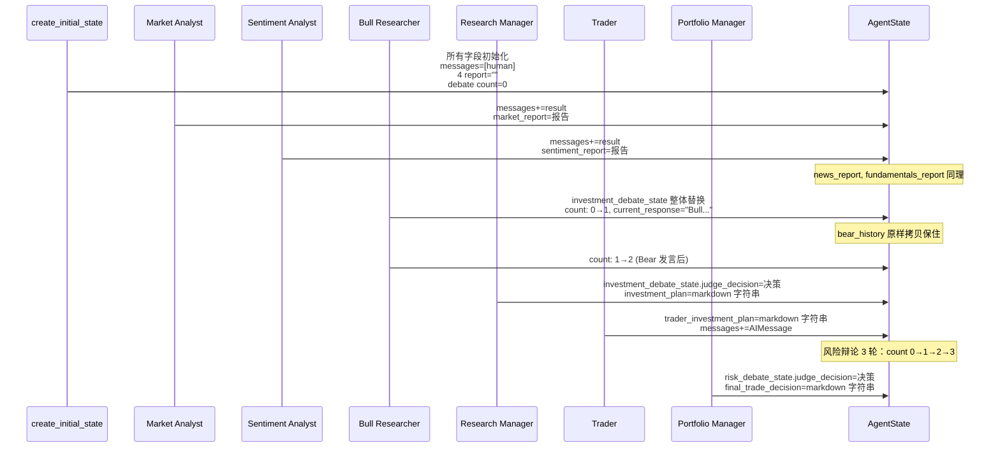

---
难度：⭐⭐⭐
类型：进阶分析
预计时间：20 分钟
前置知识：
  - [Graph 编排](graph-orchestration.md) ⭐⭐⭐
  - [Agent 团队](agent-system.md) ⭐⭐⭐
后续推荐：
  - [辩论机制](debate-mechanism.md) ⭐⭐⭐
  - [结构化输出](../06-internals/structured-output.md) ⭐⭐⭐
学习路径：
  - 开发路径：第 3 阶段
  - 进阶路径：第 2 阶段
---

# 状态模型：三层嵌套与 Reducer 语义

## 引言：状态是节点之间唯一的契约

读 TradingAgents 的 agent 代码会发现一个反复出现的模式——每个节点函数都返回一个 dict，dict 的 key 对应状态字段，value 是这个节点要写入的新值。这套设计来自 LangGraph：节点之间不直接传消息，而是共同读写一个共享状态对象。这意味着状态 schema 就是节点之间的契约。

TradingAgents 的状态模型在 `agent_states.py` 里定义，看上去只是几个 TypedDict，但有两层容易踩坑的设计：

1. **三层嵌套**：顶层 `AgentState` 包含两个子状态 `InvestDebateState` 和 `RiskDebateState`，子状态里又是一堆字段。
2. **Reducer 不对称**：`messages` 字段有显式 reducer（add_messages），其他字段没有 reducer（整体覆盖）。这种不对称决定了节点返回 dict 时必须遵循的写法——不带上"不变"的字段会丢数据。

这篇文档按三层结构拆开状态模型，再用专门的章节解释 reducer 语义，最后讲结构化输出 schema 的角色。

## 总览：三层嵌套状态

```mermaid
flowchart TD
    subgraph TOP["顶层 AgentState(MessagesState)"]
        direction TB
        M["messages<br/>add_messages reducer"]
        COI["company_of_interest"]
        AT["asset_type"]
        IC["instrument_context"]
        TD["trade_date"]
        SEN["sender"]
        PC["past_context"]
        MR["market_report"]
        SR["sentiment_report"]
        NR["news_report"]
        FR["fundamentals_report"]
        IP["investment_plan"]
        TIP["trader_investment_plan"]
        FTD["final_trade_decision"]
    end

    subgraph IDS["子状态：InvestDebateState"]
        direction TB
        BH["bull_history"]
        BEH["bear_history"]
        HIS1["history"]
        CR1["current_response<br/>(路由依据)"]
        JD1["judge_decision"]
        CNT1["count<br/>(循环计数)"]
    end

    subgraph RDS["子状态：RiskDebateState"]
        direction TB
        AGH["aggressive_history"]
        COH["conservative_history"]
        NEH["neutral_history"]
        HIS2["history"]
        LS["latest_speaker<br/>(路由依据)"]
        CAR["current_aggressive_response"]
        CCR["current_conservative_response"]
        CNR["current_neutral_response"]
        JD2["judge_decision"]
        CNT2["count<br/>(循环计数)"]
    end

    TOP --> IDS
    TOP --> RDS
```



三层之间是包含关系。顶层 15 个字段（含继承的 messages），两个子状态分别有 6 和 11 个字段。每个字段都对应一个或多个节点的产出。

## 顶层 AgentState：流水线的公共总线

`agent_states.py:47-76` 的定义：

```python
class AgentState(MessagesState):
    company_of_interest: Annotated[str, "Company that we are interested in trading"]
    asset_type: Annotated[str, "Asset type under analysis such as stock or crypto"]
    instrument_context: Annotated[str, "Deterministic ticker identity resolved at run start"]
    trade_date: Annotated[str, "What date we are trading at"]

    sender: Annotated[str, "Agent that sent this message"]

    market_report: Annotated[str, "Report from the Market Analyst"]
    sentiment_report: Annotated[str, "Report from the Sentiment Analyst"]
    news_report: Annotated[str, "Report from the News Researcher of current world affairs"]
    fundamentals_report: Annotated[str, "Report from the Fundamentals Researcher"]

    investment_debate_state: Annotated[InvestDebateState, "..."]
    investment_plan: Annotated[str, "Plan generated by the Analyst"]

    trader_investment_plan: Annotated[str, "Plan generated by the Trader"]

    risk_debate_state: Annotated[RiskDebateState, "..."]
    final_trade_decision: Annotated[str, "Final decision made by the Risk Analysts"]
    past_context: Annotated[str, "Memory log context injected at run start..."]
```

继承自 `MessagesState`——LangGraph 提供的基类，自带 `messages: Annotated[list, add_messages]` 字段。所以 `AgentState` 实际有 16 个字段（messages + 上面 15 个）。

按职责分组：

| 组 | 字段 | 写入者 | 读取者 |
|----|------|--------|--------|
| 运行参数 | `company_of_interest` / `asset_type` / `trade_date` | `create_initial_state` | 所有 agent |
| 标的身份 | `instrument_context` | `_run_graph` 预解析 | 所有 agent（通过 prompt 注入） |
| 记忆 | `past_context` | `_run_graph` 从 memory log 取 | Portfolio Manager |
| 工作内存 | `messages` / `sender` | Analyst、Trader、Msg Clear | Analyst、路由器 |
| 分析产出 | `market_report` / `sentiment_report` / `news_report` / `fundamentals_report` | 4 个分析师 | Researcher、Debator、RM、PM |
| 投资辩论 | `investment_debate_state` / `investment_plan` | Researcher、Research Manager | Trader、Portfolio Manager |
| 交易 | `trader_investment_plan` | Trader | Debator、Portfolio Manager |
| 风险辩论 | `risk_debate_state` / `final_trade_decision` | Debator、Portfolio Manager | Portfolio Manager、外部 |

几个值得注意的字段：

- `sender` 在源码里其实用得很少，主要是 Trader 写（`trader.py:62` 写 `sender=name`）。它的设计意图是记录"当前是谁在说话"，但实际辩论路由用的是发言内容前缀和 `latest_speaker`，没用 `sender`。算半个遗留字段。
- `instrument_context` 是 v0.2.5 之后加的字段，存的是预解析的标的身份描述串（详见 [Agent 团队](agent-system.md) 的横切关注点）。它的特殊性在于：在图执行前由 `_run_graph` 一次性解析，agent 通过 `get_instrument_context_from_state` 读它，避免在图执行中做网络调用。
- `past_context` 只被 Portfolio Manager 读，是框架唯一的记忆注入点。

## 子状态一：InvestDebateState

`agent_states.py:8-18`：

```python
class InvestDebateState(TypedDict):
    bull_history: Annotated[str, "Bullish Conversation history"]
    bear_history: Annotated[str, "Bearish Conversation history"]
    history: Annotated[str, "Conversation history"]
    current_response: Annotated[str, "Latest response"]
    judge_decision: Annotated[str, "Final judge decision"]
    count: Annotated[int, "Length of the current conversation"]
```

6 个字段，分工明确：

- `bull_history` / `bear_history`：各方自己的累积发言
- `history`：双方合并的发言，按时间顺序排列。每次发言追加 `argument`，所以 `history = bull_history ∪ bear_history`（按发言时间交错）
- `current_response`：**投资辩论的路由依据**。`should_continue_debate` 通过 `current_response.startswith("Bull")` 判断下一个发言者
- `judge_decision`：裁判（Research Manager）的决策，由 Research Manager 写入
- `count`：发言次数计数器，每次发言自增 1。终止条件是 `count >= 2 * max_debate_rounds`

注意 `Annotated[str, "..."]` 第二个参数是文档字符串，**不是 reducer**。LangGraph 的 reducer 应该是 `operator.add` 之类的可调用对象。这里第二参数是字符串，意味着这些字段没有 reducer。

## 子状态二：RiskDebateState

`agent_states.py:22-44`：

```python
class RiskDebateState(TypedDict):
    aggressive_history: Annotated[str, "Aggressive Agent's Conversation history"]
    conservative_history: Annotated[str, "Conservative Agent's Conversation history"]
    neutral_history: Annotated[str, "Neutral Agent's Conversation history"]
    history: Annotated[str, "Conversation history"]
    latest_speaker: Annotated[str, "Analyst that spoke last"]
    current_aggressive_response: Annotated[str, "Latest response by the aggressive analyst"]
    current_conservative_response: Annotated[str, "Latest response by the conservative analyst"]
    current_neutral_response: Annotated[str, "Latest response by the neutral analyst"]
    judge_decision: Annotated[str, "Judge's decision"]
    count: Annotated[int, "Length of the current conversation"]
```

11 个字段，三方辩论的字段更多：

- 三个独立的 `*_history`：每方累积自己的发言
- `history`：三方合并发言
- `latest_speaker`：**风险辩论的路由依据**。`should_continue_risk_analysis` 通过它判断下一个发言者（Aggressive→Conservative→Neutral→循环）
- 三个 `current_*_response`：每方最新一次发言。让其他两方在 prompt 里能引用对方最新论点
- `judge_decision`：Portfolio Manager 的裁决
- `count`：发言计数，终止条件是 `count >= 3 * max_risk_discuss_rounds`

为什么投资辩论只有一个 `current_response`，风险辩论要三个 `current_*_response`？因为两方辩论时，"对方最新论点"就是 `current_response`（自己刚写的就是 current_response 之前的发言）；三方辩论时，"其他两方的最新论点"是两个字段，所以每方都要有自己的 `current_*_response`，让第三方能同时引用前两方。

## Reducer 语义：最容易踩坑的部分

这是状态模型的核心设计，单独成章。

### 什么是 reducer

LangGraph 的状态字段可以用 `Annotated[T, reducer]` 指定一个合并函数。当节点返回 `{"field": new_value}` 时：

- 如果 field 有 reducer：用 `reducer(old_value, new_value)` 合并
- 如果 field 没有 reducer：直接用 `new_value` 替换 `old_value`

最经典的 reducer 是 `add_messages`——它把新消息追加到消息列表，对相同 ID 的消息做更新（而不是替换）。这是为什么 `messages` 字段在不同节点之间能累积。

### TradingAgents 的两种字段

#### 有 reducer：messages

`AgentState` 继承自 `MessagesState`，后者定义了：

```python
class MessagesState(TypedDict):
    messages: Annotated[list, add_messages]
```

`add_messages` 是 LangGraph 提供的 reducer，行为是"追加新消息，同 ID 消息更新内容"。所以分析师节点返回 `{"messages": [result]}` 时，新消息被追加到现有消息列表，而不是替换。

Msg Clear 节点（`create_msg_delete`）是个特例。它返回 `{"messages": removal_operations + [placeholder]}`，其中 `removal_operations` 是 `[RemoveMessage(id=m.id) for m in messages]`。`RemoveMessage` 是 LangGraph 的特殊消息类型，`add_messages` reducer 识别它并把对应 ID 的消息从列表里移除。所以"清空消息"实际是"逐条标记删除 + 加一条新占位"，仍然走 reducer 机制。

#### 无 reducer：所有其他字段

所有其他字段（包括嵌套子状态）都没有 reducer。LangGraph 对这种字段的处理是**直接替换**。

这就引出了状态模型的最大陷阱：

### 子状态的整体覆盖陷阱

`investment_debate_state` 是 `Annotated[InvestDebateState, "..."]`，第二个参数是文档字符串而不是 reducer。所以它是无 reducer 字段。

当 Bull Researcher 返回：

```python
return {"investment_debate_state": new_investment_debate_state}
```

LangGraph 把整个 `investment_debate_state` 子字典**替换**为 `new_investment_debate_state`，而不是合并。

这意味着 `new_investment_debate_state` 必须包含所有 6 个字段。如果漏掉任何一个，覆盖后那个字段就丢了。对比 `bull_researcher.py:51-57`：

```python
new_investment_debate_state = {
    "history": history + "\n" + argument,                    # 改了
    "bull_history": bull_history + "\n" + argument,          # 改了
    "bear_history": investment_debate_state.get("bear_history", ""),  # 原样拷贝！
    "current_response": argument,                            # 改了
    "count": investment_debate_state["count"] + 1,           # 改了
}
```

注意 `bear_history` 这一行：Bull 节点没有改 Bear 的 history，但仍然要从原 state 取出来原样写入。如果不写，覆盖后 Bear 之前累积的发言就丢了。`judge_decision` 字段在这个 dict 里没出现——因为 Bull 不是裁判，不需要更新它，但 Research Manager 节点会把它加上。

风险辩论更明显。`aggressive_debator.py:43-55`：

```python
new_risk_debate_state = {
    "history": history + "\n" + argument,                                # 改了
    "aggressive_history": aggressive_history + "\n" + argument,          # 改了
    "conservative_history": risk_debate_state.get("conservative_history", ""),  # 拷贝
    "neutral_history": risk_debate_state.get("neutral_history", ""),     # 拷贝
    "latest_speaker": "Aggressive",                                      # 改了
    "current_aggressive_response": argument,                             # 改了
    "current_conservative_response": risk_debate_state.get("current_conservative_response", ""),  # 拷贝
    "current_neutral_response": risk_debate_state.get("current_neutral_response", ""),            # 拷贝
    "count": risk_debate_state["count"] + 1,                             # 改了
}
```

9 个字段（`judge_decision` 留给 Portfolio Manager），5 个是"原样拷贝"。这就是为什么辩论节点的状态更新看起来这么繁琐——不是开发者不会写循环，而是必须显式把每个字段都列出来。

### 为什么不给子状态加 reducer

理论上，给 `investment_debate_state` 这种字段加一个"深度合并" reducer 能避免整体覆盖陷阱。但 TradingAgents 没这么做，原因有几个：

1. **简单性**：直接替换比深度合并行为更可预测。深度合并要处理嵌套 dict、列表、字符串的不同语义，容易出 bug。
2. **显式 > 隐式**：节点必须把所有字段都列出来，强迫开发者思考每个字段的状态。这是"显式优于隐式"的工程哲学。
3. **历史累积字段的语义**：`bull_history` 这种字段，"合并"和"追加"是两种不同语义。`history + "\n" + argument` 是显式追加，比让 reducer 隐式追加更可控。

代价是开发者要写更多代码、容易遗漏字段。但源码里所有 debator 节点都遵循同一套模式，复制粘贴时漏字段的概率比较低。

## 结构化输出 Schema：另一个状态契约

除了状态字段，TradingAgents 还有一套 Pydantic schema 定义结构化输出的形态。`schemas.py` 定义了 5 个 schema，分别对应不同 agent 的输出：

| Schema | 使用者 | 字段 |
|--------|--------|------|
| `ResearchPlan` | Research Manager | recommendation / rationale / strategic_actions |
| `TraderProposal` | Trader | action / reasoning / entry_price / stop_loss / position_sizing |
| `PortfolioDecision` | Portfolio Manager | rating / executive_summary / investment_thesis / price_target / time_horizon |
| `SentimentReport` | Sentiment Analyst | overall_band / overall_score / confidence / narrative |

这些 schema 不是直接的状态字段——agent 用 `bind_structured(llm, Schema, ...)` 让 LLM 输出 Pydantic 实例，再用 `render_*` 函数把实例渲染回 markdown 字符串，存到对应状态字段。比如 `research_manager.py:45-51`：

```python
investment_plan = invoke_structured_or_freetext(
    structured_llm,
    llm,
    prompt,
    render_research_plan,    # 渲染函数
    "Research Manager",
)
```

`investment_plan` 是字符串，写入状态。但它的内容由 `ResearchPlan` schema 约束，结构稳定。

### 评级 Enum：5 级与 3 级的对应

`schemas.py:44-51` 的 `PortfolioRating`：

```python
class PortfolioRating(str, Enum):
    BUY = "Buy"
    OVERWEIGHT = "Overweight"
    HOLD = "Hold"
    UNDERWEIGHT = "Underweight"
    SELL = "Sell"
```

`schemas.py:54-65` 的 `TraderAction`：

```python
class TraderAction(str, Enum):
    BUY = "Buy"
    HOLD = "Hold"
    SELL = "Sell"
```

5 级 vs 3 级的差异在 [Agent 团队](agent-system.md) 已解释：Trader 把 5 级压缩成 3 个动作，Portfolio Manager 再还原成 5 级。`(str, Enum)` 继承让 enum 值既是字符串又是枚举，方便序列化和 prompt 注入。

### 占位字符串强制转 None

`schemas.py:30-36` 是一个针对 LLM 行为的防御：

```python
_NULLISH_FLOAT = {"", "none", "n/a", "na", "null", "nil", "-", "tbd", "unknown"}

def _coerce_optional_float(value):
    if isinstance(value, str) and value.strip().lower() in _NULLISH_FLOAT:
        return None
    return value
```

LLM 在填可选数值字段（如 `entry_price`）时，有时不写 None，而是写 "N/A"、"unknown"、"-"这种占位字符串。这会让 Pydantic 校验失败（期望 float 收到字符串）。`_coerce_optional_float` 通过 `field_validator(mode="before")` 在 Pydantic 解析前把占位字符串转回 None（issue #1058）。

`TraderProposal.entry_price` 和 `stop_loss`（`schemas.py:152-155`）、`PortfolioDecision.price_target`（`schemas.py:225-228`）都用这个 validator。这是 LLM 输出不可预测性的典型防御——schema 不只是约束结构，还要容错模型的行为模式。

### 渲染函数：双向契约

`schemas.py:105-113` 的 `render_research_plan`：

```python
def render_research_plan(plan: ResearchPlan) -> str:
    """Render a ResearchPlan to markdown for storage and the trader's prompt context."""
    return "\n".join([
        f"**Recommendation**: {plan.recommendation.value}",
        "",
        f"**Rationale**: {plan.rationale}",
        "",
        f"**Strategic Actions**: {plan.strategic_actions}",
    ])
```

`render_*` 函数把 Pydantic 实例渲染成 markdown 字符串。这套渲染保证了：

1. **存到状态字段的是字符串**，下游 agent prompt 可以直接读，不需要 JSON 解析
2. **格式稳定**，跨 provider 一致。即使不同 LLM 的内部输出格式不同，渲染函数产出的是同一套 markdown
3. **section 头部固定**（`**Recommendation**:`、`**Rationale**:` 等），方便外部代码 grep 或正则解析

`render_trader_proposal`（`schemas.py:158-180`）有个特殊设计——尾部保留 `FINAL TRANSACTION PROPOSAL: **BUY/HOLD/SELL**` 这行：

```python
parts.extend([
    "",
    f"FINAL TRANSACTION PROPOSAL: **{proposal.action.value.upper()}**",
])
return "\n".join(parts)
```

这是为兼容历史"停止信号"字符串。analyst 的 prompt 模板里说过 `FINAL TRANSACTION PROPOSAL: **BUY/HOLD/SELL**` 是停止锚，外部代码可能 grep 这个字符串拿最终方向。即使 Trader 改用结构化输出，渲染时仍然保留这个尾部标记，让旧代码继续工作。

## 一次运行的状态演化

把状态字段在节点之间的演化画成时序图：



注意几个状态更新模式：

- **追加**：`messages` 用 reducer 追加
- **整体替换子状态**：`investment_debate_state` / `risk_debate_state` 每次发言整体覆盖（带原样拷贝）
- **直接赋值**：`*_report`、`investment_plan`、`final_trade_decision` 等顶层字段直接覆盖（覆盖空字符串或旧值）

## 设计取舍

| 设计 | 选择 | 替代方案 | 取舍 |
|------|------|---------|------|
| 顶层字段 | 大多直接覆盖 | 都加 reducer | 简单，但状态更新要写全字段名 |
| 子状态字段 | 整体覆盖 | 深度合并 reducer | 显式 > 隐式；但节点代码冗长 |
| 输出存储 | markdown 字符串 | JSON 对象 | 兼容 prompt 注入；失去结构 |
| Schema + render | 双层（Pydantic + 渲染） | 直接存 Pydantic | 状态字段都是字符串，简单；render 维护一致性 |
| LLM 占位防御 | `_coerce_optional_float` | 信任 LLM 输出 | 多一层防御；少一类崩溃 |

## 下一步

- [辩论机制](debate-mechanism.md)：`InvestDebateState` 和 `RiskDebateState` 在辩论循环里怎么被路由器读取
- [结构化输出](../06-internals/structured-output.md)：`bind_structured` 和 `invoke_structured_or_freetext` 的 provider 适配
- [Graph 编排](graph-orchestration.md)：状态怎么流过 13 个节点
- [记忆与反思](../06-internals/memory-system.md)：`past_context` 字段的构造与注入

---

**文档元信息**
难度：⭐⭐⭐ | 类型：进阶分析 | 预计阅读时间：20 分钟
