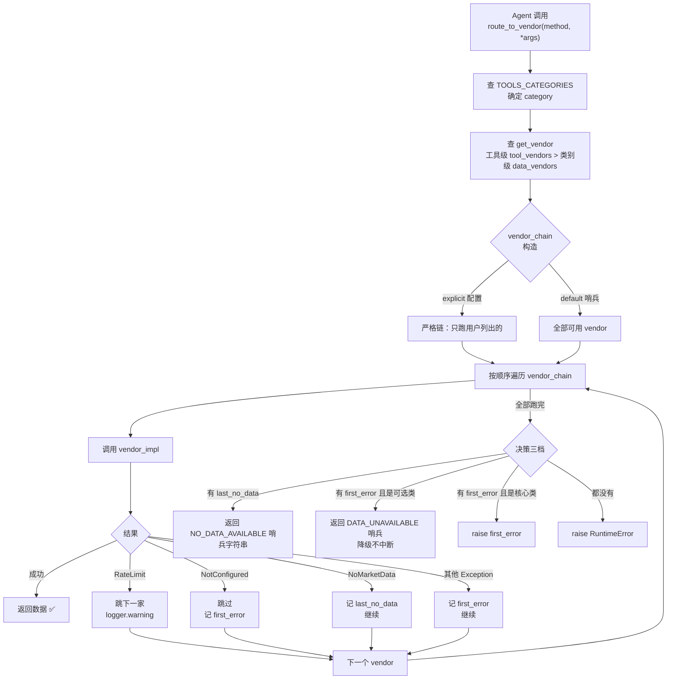
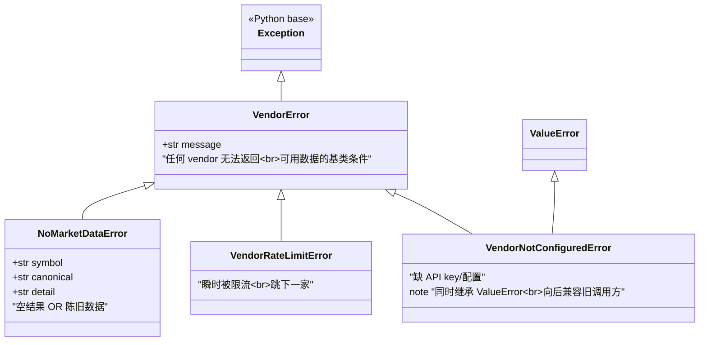
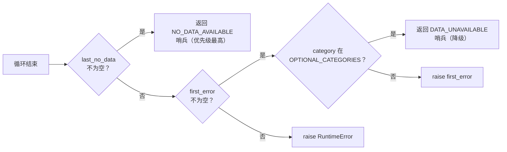
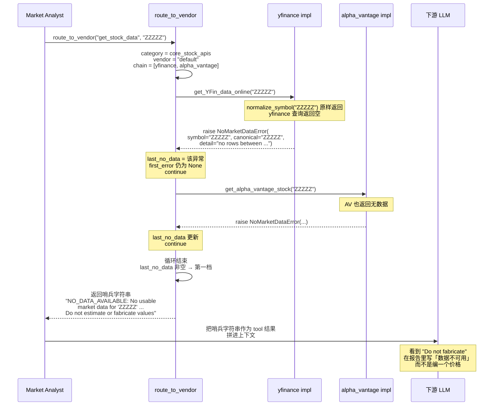

---
难度：⭐⭐⭐
类型：进阶分析
预计时间：35 分钟
前置知识：
  - [系统架构总览](../03-architecture/overview.md) ⭐⭐⭐
  - [符号归一化](symbol-normalization.md) ⭐⭐
后续推荐：
  - [LLM 客户端](llm-clients.md) ⭐⭐⭐
  - [扩展指南](../07-development/extension-guide.md) ⭐⭐⭐
学习路径：
  - 研究路径：横向能力
  - 开发路径：第 3 阶段（扩展数据源）
---

# 数据供应商路由 ⭐⭐⭐ 进阶分析

TradingAgents 的分析师角色要拉行情、基本面、新闻、宏观、预测市场五类数据，但没有一个供应商能同时覆盖全部类别，而且每个供应商都有自己的限流、密钥和返回格式。本文分析的数据供应商路由层（Vendor Router）解决的真正问题不是「调用哪个 API」，而是**把一组会失败的、异构的、可降级的外部依赖，改造成给上层 LLM 一致输出、并把失败本身编码成可决策信号的系统**。

这条管线最容易被忽略的设计在错误层。Routing 层不按「这个供应商返回了什么 HTTP 错误」来分类，而是按「路由器应该做什么动作」来分类：跳到下一个供应商、跳过这一家、记下来继续、还是直接 raise。错误类型的数量等于路由器反应的数量，而不是人类可描述原因的数量。理解这一条，是理解整个数据层的钥匙。

---

## 总览：一个 method 请求怎样流过路由层

先建立全局视图，再展开细节。下面这张图展示了一次 `route_to_vendor("get_stock_data", symbol="AAPL")` 调用在系统里经历的完整路径，以及它可能触发的三种结果。



这张图已经透露了路由层的三个关键判断：vendor chain 的构造是「显式配置即严格链」，异常处理是「面向行为」的，最终输出分「哨兵、降级、抛错」三档。下面三节分别展开。

### 系统地图：六类工具、四个供应商、双层配置

在进入细节前，先把数据层的边界画清楚。这张表是本文的参照系：

| 工具类别 | 含工具 | 可用 vendor | 是否可选 |
|---------|--------|------------|---------|
| `core_stock_apis` | `get_stock_data` | yfinance, alpha_vantage | 否（核心） |
| `technical_indicators` | `get_indicators` | yfinance, alpha_vantage | 否（核心） |
| `fundamental_data` | `get_fundamentals` / `get_balance_sheet` / `get_cashflow` / `get_income_statement` | yfinance, alpha_vantage | 否（核心） |
| `news_data` | `get_news` / `get_global_news` / `get_insider_transactions` | yfinance, alpha_vantage | 否（核心） |
| `macro_data` | `get_macro_indicators` | fred | **是**（可选） |
| `prediction_markets` | `get_prediction_markets` | polymarket | **是**（可选） |

数据来源：`interface.py:36-78`（`TOOLS_CATEGORIES`）、`interface.py:92`（`OPTIONAL_CATEGORIES`）、`interface.py:95-144`（`VENDOR_METHODS`）。

「可选」这一列是整个降级机制的根。宏观和预测市场只是给新闻分析师做风味增强（flavour data），一个 LLM 给错的经济指标、一个缺失的 FRED 密钥、一次网络抖动，都不应该让一次投资分析整体崩掉。但核心类（价格、基本面、新闻）失败必须 raise，否则一次「静默拿不到价格」的分析比一次报错的分析危险得多——前者会让 LLM 在缺失数据的情况下编造数字。

---

## 设计哲学：面向行为的错误分类

这是本文最重要的一节。理解了它，`route_to_vendor` 的每一段代码都会变得显而易见。

### 问题的本质

一个典型的供应商会失败的方式有很多种：HTTP 429 限流、401 缺密钥、404 标的不存在、500 服务端错误、返回空 DataFrame、返回的数据最新一行是两周前的。如果按「原因」分类，错误类型会爆炸——每加一个供应商、每变一种 HTTP 错误码，都要新增一个 `except` 分支。

`errors.py` 的 docstring 直接点出了这个设计判断（`errors.py:1-16`）：

> The number of types is the number of distinct router reactions, not the number of human-describable causes: empty and stale data get identical handling, so they share `NoMarketDataError` and differ only in the free-text `detail`.

翻译过来：错误类型数 = 路由器的反应数。空数据和陈旧数据会得到完全相同的处理，所以它们共用一个异常类，只在 `detail` 自由文本里区分。

### 四种反应，三个类

把所有可能的失败按「路由器该做什么」归类，只有四种动作：

| 路由器反应 | 对应的异常类 | 含义 |
|----------|-----------|------|
| 跳到下一家供应商 | `VendorRateLimitError` | 瞬时被限流，换一家可能就好 |
| 跳过这家（也算失败） | `VendorNotConfiguredError` | 缺密钥或配置，这家不可用 |
| 记下来继续（这家确实没数据） | `NoMarketDataError` | 标的无效、已退市、或数据陈旧 |
| 其他 | 基类 `Exception` | 兜底，记下来继续 |

类层级如下（`errors.py:21-55`）：



这里有两个反直觉但关键的设计。

第一，空数据和陈旧数据共用 `NoMarketDataError`。直觉上「没数据」和「有数据但太旧」是两种情况，但路由器的反应是一样的：这家没拿到可用数据，记下来，看下一家有没有。所以它们合用一个类，差异塞进 `detail` 字段。`NoMarketDataError` 携带三个字段（`errors.py:34-43`）：

```python
def __init__(self, symbol: str, canonical: str | None = None, detail: str = ""):
    self.symbol = symbol
    self.canonical = canonical or symbol
    self.detail = detail
    msg = f"No market data for {symbol!r}"
    if canonical and canonical != symbol:
        msg += f" (queried as {canonical!r})"
    if detail:
        msg += f": {detail}"
    super().__init__(msg)
```

`symbol` 是用户原始输入的标的（比如 `XAUUSD`），`canonical` 是归一化后真正发给供应商的标的（比如 `GC=F`），`detail` 是自由文本（比如 `"latest row is 2025-06-11 ... stale"`）。这三个字段最后会拼进哨兵字符串，让 LLM 看到失败的具体原因，而不是一个泛化的「unavailable」。

第二，`VendorNotConfiguredError` 同时继承 `ValueError`（`errors.py:50`）。这是个向后兼容的折中：路由层把它当作「这家供应商不可用」来处理，但历史上很多调用方用 `except ValueError` 兜底，让这个类同时是 `ValueError`，旧代码不用改就能继续工作。新代码则可以直接 catch `VendorNotConfiguredError` 拿到更精确的语义。

### 这套分类的代价

不是没有代价。`detail` 是自由文本，意味着类型系统放弃了在这里做静态保证——一个写错的 detail 不会被编译器抓到。这是「反应数有限」换来的代价：路由层不需要为每个供应商的每种失败原因新增 except 分支，代价是失败的具体原因退化为字符串，由下游的 LLM 去解读。

新增一个供应商时，这个代价的优势最明显：新供应商只要抛这几个类（或它们的薄子类），不需要在路由层加任何新代码。路由层的 `except` 分支是封闭的，只认四种反应。

---

## 路由核心：`route_to_vendor` 逐段拆解

有了错误哲学，`route_to_vendor`（`interface.py:168-262`）的代码读起来就很顺。它分三段：构造 vendor chain、逐个调用并分类异常、决定最终输出。

### 第一段：vendor chain 的构造（严格链 vs 全部可用）

```python
primary_vendors = [v.strip() for v in vendor_config.split(',')]
# ...
explicit = [v for v in primary_vendors if v and v != "default"]
if explicit:
    vendor_chain = [v for v in explicit if v in VENDOR_METHODS[method]]
    if not vendor_chain:
        raise ValueError(
            f"Configured vendor(s) {explicit} not available for '{method}'. "
            f"Available: {all_available_vendors}."
        )
else:
    vendor_chain = all_available_vendors
```

来源：`interface.py:172, 184-193`。

这里有一条容易踩的规则：**显式配置即严格链**。如果用户在配置里写了 `data_vendors="yfinance"`，那么即使 yfinance 整个挂了，路由器也不会偷偷 fallback 到 alpha_vantage。注释（`interface.py:179-183`）解释了为什么：静默 fallback 曾经导致同一份数据里混入来自意外供应商的数据，造成跨供应商的不一致（issue #988/#289）。

只有 `default` 哨兵（即用户没做任何显式配置）才会用「全部可用 vendor」作为 chain。想用多供应商 fallback，要显式写成 `data_vendors="yfinance,alpha_vantage"`，顺序就是 fallback 顺序。

### 第二段：面向行为的异常分类

这是错误哲学落地的地方（`interface.py:197-221`）：

```python
last_no_data: NoMarketDataError | None = None
first_error: Exception | None = None
for vendor in vendor_chain:
    vendor_impl = VENDOR_METHODS[method][vendor]
    impl_func = vendor_impl[0] if isinstance(vendor_impl, list) else vendor_impl

    try:
        return impl_func(*args, **kwargs)
    except VendorRateLimitError:
        logger.warning("Vendor %r rate-limited for %s; trying next vendor.", vendor, method)
        continue
    except VendorNotConfiguredError as e:
        logger.warning("Vendor %r not configured for %s; trying next vendor.", vendor, method)
        if first_error is None:
            first_error = e
        continue
    except NoMarketDataError as e:
        last_no_data = e
        continue
    except Exception as e:
        logger.warning("Vendor %r failed for %s: %s", vendor, method, e)
        if first_error is None:
            first_error = e
        continue
```

四个 `except` 分支精确对应四种反应。注意两处不对称：`VendorRateLimitError` 不记 `first_error`（被限流不算「失败」，下一家可能就好），而其他三种都记 `first_error`（只要 `first_error is None`）。`NoMarketDataError` 单独记到 `last_no_data`，因为它代表的是「标的确实没数据」，这比「供应商报错了」更接近真相——后面会看到，最终输出里 `last_no_data` 的优先级高于 `first_error`。

### 第三段：三档输出决策

循环跑完后，路由器要在三种情况里选一个（`interface.py:223-262`）。

**第一档：有 `last_no_data`，返回哨兵字符串。**

```python
if last_no_data is not None:
    if first_error is not None:
        logger.warning(
            "Returning NO_DATA for %s, but a vendor errored earlier: %s",
            method, first_error,
        )
    sym = last_no_data.symbol
    canonical = last_no_data.canonical
    resolved = "" if canonical == sym else f" (resolved to '{canonical}')"
    reason = f" ({last_no_data.detail})" if last_no_data.detail else ""
    return (
        f"NO_DATA_AVAILABLE: No usable market data for '{sym}'{resolved} from "
        f"any configured vendor{reason}. The symbol may be invalid, delisted, "
        f"not covered, or the vendor returned stale data. Do not estimate or "
        f"fabricate values — report that data is unavailable for this symbol."
    )
```

来源：`interface.py:227-247`。

这是反幻觉设计的核心。一个返回空字符串的供应商会让下游 LLM 无从判断「是没数据还是数据就是空」，进而编造一个看起来合理的价格（issue #781 就是这么来的）。哨兵字符串做了三件事：明确说「数据不可用」、给出具体原因（invalid / delisted / not covered / stale）、显式禁止编造（`Do not estimate or fabricate values`）。这串文本会作为 tool 的返回值原样进入 LLM 的上下文。

注意那个嵌套的 `if first_error is not None`：如果同时有供应商报错，会在日志里打 warning，但不改变返回的哨兵。这是为了让 no-data 的判定不被一个偶然的网络错误掩盖——但错误本身不会消失，它会留在日志里供排查。

**第二档：有 `first_error`，按类别决定 raise 还是降级。**

```python
if first_error is not None:
    if category in OPTIONAL_CATEGORIES:
        logger.warning("Optional %s unavailable for %s: %s", category, method, first_error)
        return (
            f"DATA_UNAVAILABLE: optional {category} could not be retrieved "
            f"({first_error}). Proceed without it; do not fabricate values."
        )
    raise first_error
```

来源：`interface.py:253-260`。

这里就是前面「可选类」发挥作用的地方。宏观和预测市场属于 `OPTIONAL_CATEGORIES`，失败时降级成 `DATA_UNAVAILABLE` 哨兵字符串，分析继续；核心类失败直接 `raise first_error`，让上层报错停机。同样禁止编造（`do not fabricate values`）。

**第三档：什么都没有。**

```python
raise RuntimeError(f"No available vendor for '{method}'")
```

来源：`interface.py:262`。

vendor chain 为空且没有任何异常记录的兜底，理论上只在 `VENDOR_METHODS` 配置错误时触发。

### 输出优先级小结

把三档的优先级理一下，这是排查「为什么我拿到的是哨兵而不是报错」时的关键：



`last_no_data` 的优先级高于 `first_error`，这个顺序是有意的：如果一个供应商报「标的没数据」、另一个供应商报「网络错误」，真相更接近「标的确实没数据」，而不是「系统挂了」。网络错误留在日志里，不改变给 LLM 的信号。

---

## 配置：双层优先级

vendor chain 怎么来，由 `get_vendor`（`interface.py:153-166`）决定：

```python
def get_vendor(category: str, method: str = None) -> str:
    config = get_config()
    # Check tool-level configuration first (if method provided)
    if method:
        tool_vendors = config.get("tool_vendors", {})
        if method in tool_vendors:
            return tool_vendors[method]
    # Fall back to category-level configuration
    return config.get("data_vendors", {}).get(category, "default")
```

两层优先级，工具级压过类别级：

- **工具级**（`config["tool_vendors"][method]`）：可以给单个工具指定 vendor，比如 `tool_vendors = {"get_stock_data": "yfinance"}`。
- **类别级**（`config["data_vendors"][category]`）：给整类工具指定 vendor，比如 `data_vendors = {"fundamental_data": "alpha_vantage"}`。
- 都没配：返回 `"default"` 哨兵，触发「全部可用 vendor」逻辑。

这种分层的好处是「全局默认 + 局部覆盖」。大部分工具跟着类别走，个别工具（比如某个 vendor 对某个标的特别差）可以单独覆盖。

### 逗号分隔的多 vendor

`get_vendor` 返回的是字符串，`route_to_vendor` 里用逗号分隔解析成列表（`interface.py:172`）：

```python
primary_vendors = [v.strip() for v in vendor_config.split(',')]
```

所以 `data_vendors = {"core_stock_apis": "yfinance,alpha_vantage"}` 表示「先试 yfinance，失败再试 alpha_vantage」。这就是多 vendor fallback 的写法——显式、有序、可预期。

---

## 各供应商实现的关键防护

路由层负责策略，各 vendor 实现负责把外部 API 的各种失败翻译成上面那三个异常类。下面挑几个有代表性的实现讲。

### yfinance：空结果与陈旧数据的双重防护

`get_YFin_data_online`（`y_finance.py`，入口先做符号归一化）是默认主供应商。它有两个关键防护。

第一，空结果必须 raise `NoMarketDataError`，而不是返回空 DataFrame。一旦返回空，路由层无法区分「标的没数据」和「供应商暂时没响应」，哨兵机制就失效了。

第二，`_assert_ohlcv_not_stale` 防陈旧数据。yfinance 偶尔会返回几周前的最后一行数据，这种「看似有数据」的失败比「明确没数据」更危险——LLM 会拿一个两周前的价格当成最新价。防护的逻辑是把返回的最后一行日期和请求日期比，超过阈值就 raise `NoMarketDataError`，`detail` 标记为 stale。这样它和「真正没数据」走同一条路径，路由层不需要特殊处理。

阈值 `MAX_OHLCV_STALE_DAYS = 10`（`stockstats_utils.py:20`）是一个需要解释的数字。它要在两个约束之间取交集：**宽到能跨长周末和连串节假日**（美股 Labor Day、感恩节、独立日周边常有 3-4 天无新 bar），同时**紧到能抓住 yfinance 偶发返回的陈旧帧**（issue #1021 修的就是 vendor 返回一年前的帧的情况）。设成 3 天会在节假日后的合法回测里误杀；设成 30 天则漏掉中等程度陈旧（如 15-20 天）的帧。10 天是这两条约束的折中。

`get_YFin_data_online` 里还有一个包容性修正：`end_date + 1`（`y_finance.py`，对应 issue #986/#987）。yfinance 的日期区间是左闭右开，少加一天会漏掉今天的数据。

### stockstats：缓存毒化与前视偏差防护

`stockstats_utils.py` 服务于技术指标。`load_ohlcv`（`stockstats_utils.py:125-192`）做了两件容易被忽略的事。

**前视偏差防护**。技术指标依赖历史窗口，如果在计算某一天的指标时，把那一天之后的数据也算进去，就构成了前视偏差（look-ahead bias），回测会异常漂亮但实盘崩盘。`load_ohlcv` 在切片历史窗口时严格按时间过滤。

**缓存毒化防护**。如果一次失败的请求把空数据或错误数据写进缓存，后续所有读都会拿到脏数据。`load_ohlcv` 在写入缓存前先校验数据完整性，校验不过不写。

陈旧阈值由模块常量 `MAX_OHLCV_STALE_DAYS = 10`（`stockstats_utils.py:20`）控制，`_assert_ohlcv_not_stale`（`:88-122`）执行检查，超过 10 天算陈旧。yfinance 限流的 429 由 `yf_retry`（`stockstats_utils.py:23-39`）做指数退避重试，重试用尽后由路由层接管。

### Alpha Vantage：错误措辞分类

`_make_api_request`（`alpha_vantage_common.py:62-112`）把 Alpha Vantage 的错误响应翻译成路由层认识的异常。关键是错误分类的顺序（`alpha_vantage_common.py:99-110`）：**先检查 rate limit 措辞，再检查其他**。

Alpha Vantage 的限流响应不是标准的 HTTP 429，而是一段 JSON 文本，里面同时包含 "rate limit" 和 "API key" 字样（比如 "your API key ... 25 requests per day"）。如果不先匹配 rate limit 措辞，这段文本会被误分类成 `AlphaVantageNotConfiguredError`（缺 Key 类），错误地记入 `first_error`——而真正的限流（`VendorRateLimitError`）不记 `first_error`。混淆两者会让最终输出档位判断出错。先匹配 rate limit 措辞，确保分类正确。

### FRED：宏观别名映射与描述性短语拒绝

`fred.py` 的 `MACRO_SERIES`（`fred.py:37-72`）维护了 28 个别名条目，覆盖 22 个宏观指标（如 `fed_funds_rate`/`federal_funds_rate`/`fed_funds` 三个别名都指向 `FEDFUNDS`），把 `"GDP"`、`"CPI"`、`"unemployment"` 这类人类友好的名字解析成 FRED 的官方 series ID。`_resolve_series_id`（`fred.py:95-115`）会拒绝描述性短语——如果一个字符串不匹配任何已知别名也不是合法 series ID，它会 raise，而不是猜测。LLM 经常会把一段自由描述（比如 "the rate of inflation last quarter"）当作指标名传进来，拒绝描述性短语能防止拿到错误的 series。

### 无 key 的公开端点

Polymarket（`polymarket.py`）走公开 Gamma API，StockTwits（`stocktwits.py`）走自己的公开端点（`api.stocktwits.com`），都不需要密钥。注意 StockTwits 是 Sentiment Analyst 直接调用的独立工具，不经 vendor 路由层。`_is_forward_looking`（`polymarket.py:47-65`）过滤出前向预测型市场（比如「年底降息几次」），过滤掉已经结算的历史市场。

`reddit.py` 默认走 RSS（`reddit.py:93-144`），因为 JSON 端点会被 Reddit 的 WAF 返回 403（issue #862）。这是个绕过平台限制的实战决策。

`yfinance_news.py` 的 `_in_news_window`（`yfinance_news.py:60-71`）做前向安全的窗口过滤，确保只返回指定时间窗内的新闻，不混入未来日期的条目（数据源偶发的时区错位会让未来条目混进来）。

---

## 确定性快照：防 LLM 编造数字的最后一道闸

路由层返回哨兵字符串防住了「没数据时编造」，但还有一种更隐蔽的编造：LLM 拿到真实数据后，在长报告里把数字记错或改写。`market_data_validator.py` 的 `build_verified_market_snapshot`（`market_data_validator.py:62-123`）针对这个问题。

它在分析开始时构建一份确定性的 ground-truth 快照——开高低收成交量（Open/High/Low/Close/Volume）等关键字段，从供应商原样拉取并固化。后续所有 agent 引用这些数字时，都对照快照校验。一旦 LLM 输出的数字和快照对不上，就会被标记。这对应 issue #830：LLM 在长上下文里编造价格不是偶发现象，需要一个确定性的参照系。

这个机制和数据层的「哨兵防编造」是互补的：哨兵管「没数据」，快照管「有数据但记错」。两者一起把 LLM 的数字幻觉框定在可检测的范围内。

---

## 配置合并与路径安全

两个横向工具值得提一句。

`config.py` 的 `set_config`（`config.py:16-30`）做一层深合并：dict 键合并，标量键替换。这意味着用户传入的部分配置会和默认配置合并，而不是整体覆盖。一个只设了 `data_vendors` 的用户配置不会把 `tool_vendors` 清空。

`utils.py` 的 `safe_ticker_component`（`utils.py:13-38`）防路径穿越。标的符号会被用作缓存文件名和日志文件名的一部分，如果用户（或 LLM）传入包含 `../` 的字符串，可能写出预期目录之外。这个函数校验标的只包含合法字符。

---

## 任务流案例：一次失败的分析请求怎样穿过路由层

把前面的抽象机制串成一个具体案例。假设用户把 `core_stock_apis` 配成 `"yfinance,alpha_vantage"`（默认配置是单 vendor `"yfinance"`，不会触发 fallback；这里展示的是显式配置 fallback chain 的场景），分析师请求一个无效标的 `get_stock_data("ZZZZZ")`。



这个案例展示了几个机制如何配合：符号归一化（原样返回因为不是已知别名）、面向行为的异常分类（yfinance 的 NoMarketDataError 被记下而不是抛出）、哨兵优先级（`last_no_data` 压过 `first_error`）、以及最终的反幻觉信号（哨兵字符串直接进 LLM 上下文）。

如果换成一个核心类网络错误（比如 yfinance 和 alpha_vantage 都 500），`last_no_data` 为空、`first_error` 非空、category 不在 `OPTIONAL_CATEGORIES`，路由器就会 `raise first_error`，整个分析停机——因为核心数据拿不到时，继续分析比报错更危险。

---

## 采用建议与适用边界

这套路由层的设计针对的是 TradingAgents 的具体场景：多类别异构数据源、LLM 下游消费、对幻觉敏感。它的几个设计判断在什么情况下成立，什么情况下不成立，值得拎清楚。

**「面向行为的错误分类」适用于：** 下游消费者（这里是 LLM）对错误的反应种类有限，且能从自由文本 `detail` 里提取足够信息。如果下游是强类型的程序逻辑，需要根据精确错误码做分支，这套设计就不合适——自由文本 `detail` 会让静态保证失效。

**「可选类降级」适用于：** 数据有明确的主次之分。TradingAgents 的宏观和预测市场是风味数据，缺了不影响核心决策。如果你的系统里所有数据都是必需的，`OPTIONAL_CATEGORIES` 应该为空。

**「显式配置即严格链」适用于：** 跨供应商数据一致性比可用性更重要。如果你的场景宁可拿次优供应商的数据也不要空着，应该改成允许隐式 fallback——但要做好跨供应商数据不一致的心理准备。

**新增供应商的成本：** 低。实现供应商的函数，让它抛 `VendorError` 的三个子类之一，注册进 `VENDOR_METHODS`，路由层不需要任何改动。这是这套设计最大的工程红利。

想新增供应商或新增数据类别，参考 [扩展指南](../07-development/extension-guide.md)。想理解 LLM 怎么消费这些 tool 结果，继续看 [LLM 客户端](llm-clients.md)。

---

**文档元信息**
难度：⭐⭐⭐ | 类型：进阶分析 | 更新日期：2026-07-13 | 预计阅读时间：35 分钟
