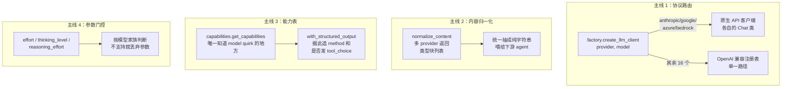
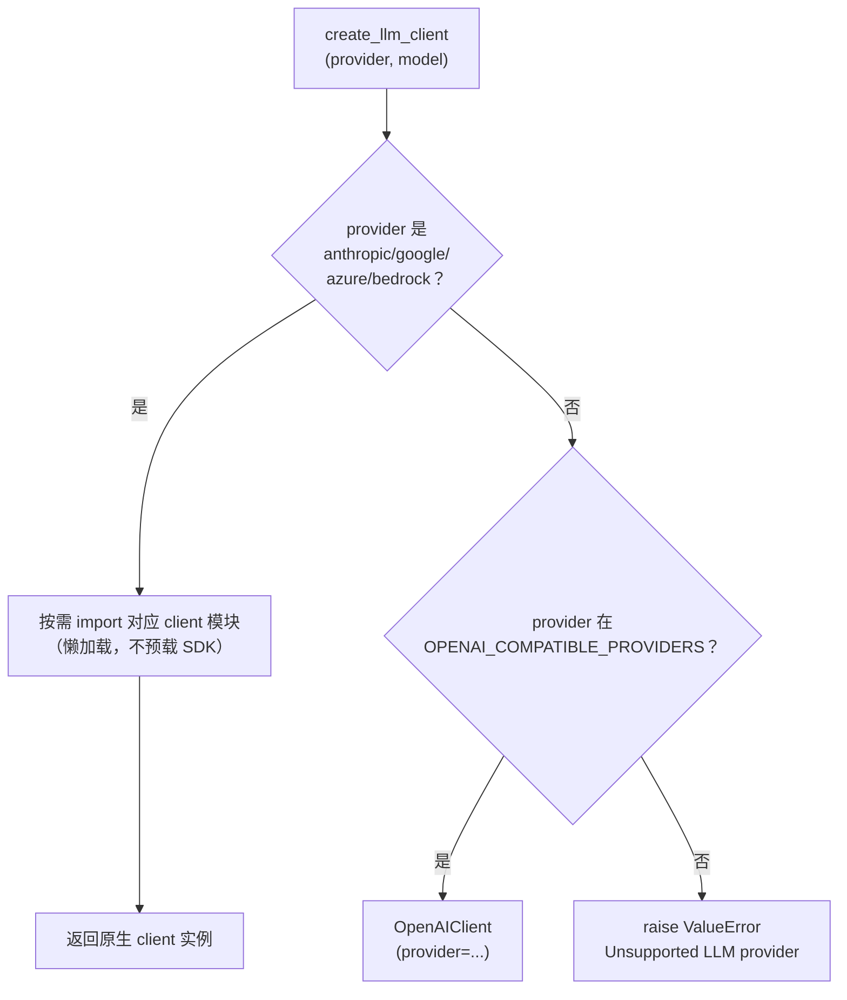
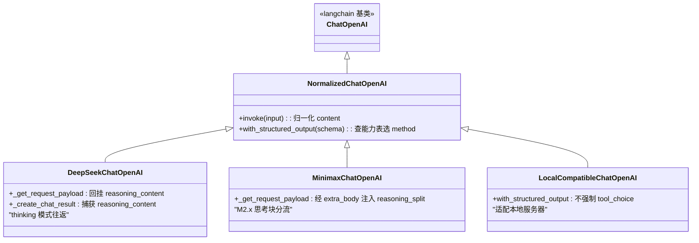
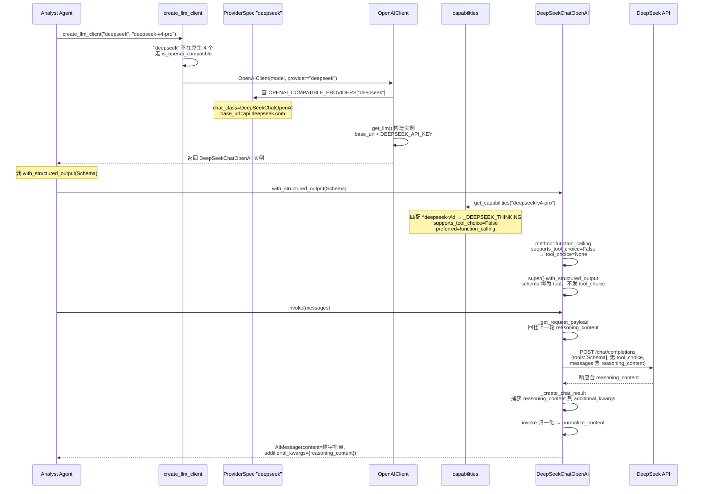

---
难度：⭐⭐⭐
类型：进阶分析
预计时间：35 分钟
前置知识：
  - [系统架构总览](../03-architecture/overview.md) ⭐⭐⭐
  - [数据供应商路由](data-vendors.md) ⭐⭐⭐
后续推荐：
  - [结构化输出](../06-internals/structured-output.md) ⭐⭐⭐
  - [本地模型部署](../02-user-guide/local-models.md) ⭐⭐
学习路径：
  - 研究路径：横向能力
  - 开发路径：第 3 阶段（扩展 Provider）
---

# LLM 客户端 ⭐⭐⭐ 进阶分析

TradingAgents 的 12 个角色都由 LLM 驱动，但「用哪家模型」这件事的复杂度被严重低估了。一个生产级的 LLM 客户端层要同时处理：原生 API 和 OpenAI 兼容 API 两种协议、20 个供应商各自的鉴权方式、双区域账户的端点隔离、推理模型特有的 `reasoning_content` 往返和 `reasoning_effort` 参数、不同模型对 `tool_choice` / `json_mode` 的差异化支持、以及本地服务器对强制参数的拒绝。本文分析的 LLM 客户端层（`llm_clients/`）解决的真正问题不是「调用模型的 SDK」，而是**把这些异构的、各有怪癖的模型 API，收敛成上层 agent 能用同一套代码调用的统一接口**。

这条管线最值得分析的设计是「声明式 provider 注册表」。传统的多 provider 客户端会为每个供应商写一个 `if` 分支或一个子类，导致代码量随供应商数线性膨胀。这里把 16 个 OpenAI 兼容供应商压缩成一张数据表，每个供应商一行声明式配置；真正需要定制代码的只有 3 个供应商（DeepSeek 和 MiniMax 是 wire-format 怪癖，LocalCompatible 是 tool_choice 行为适配）。理解这个「数据代替分支」的取舍，是理解整个客户端层的钥匙。

---

## 总览：四条主线与一张完整对照表

先建立全局视图。TradingAgents 的 LLM 客户端层有四条容易混淆的主线，必须先拆开：



这四条主线相互独立：协议路由决定走哪个 SDK，内容归一化决定输出格式，能力表决定结构化输出方式，参数门控决定推理参数发不发。正文展开成六节：内容归一化拆成「声明式注册表」（主线 2，怎么用数据表注册 provider）和「子类层级」（主线 3，哪几个需要定制代码）两节，能力表是主线 4，参数门控是主线 5，另加主线 6 讲 base_url 优先级。

### 完整 20 个 Provider 对照表

在进入细节前，先把全部 20 个支持的 provider 画清楚。这是本文的参照系。

| # | Provider | 协议 | chat_class | base_url | API Key 环境变量 | 区域 |
|---|---------|------|-----------|---------|----------------|------|
| 1 | `anthropic` | 原生 | `NormalizedChatAnthropic` | (SDK 默认) | `ANTHROPIC_API_KEY` | 国际 |
| 2 | `google` | 原生 | `NormalizedChatGoogleGenerativeAI` | (SDK 默认) | `GOOGLE_API_KEY` | 国际 |
| 3 | `azure` | 原生 | (Azure OpenAI) | (4 个环境变量) | `AZURE_OPENAI_API_KEY` | 租户 |
| 4 | `bedrock` | 原生 | (langchain-aws, 懒加载) | (AWS 链) | 无（AWS 凭证链） | `us-west-2` |
| 5 | `openai` | OpenAI 兼容 | `NormalizedChatOpenAI` | (SDK 默认) | `OPENAI_API_KEY` | 国际 |
| 6 | `xai` | OpenAI 兼容 | `NormalizedChatOpenAI` | `api.x.ai/v1` | `XAI_API_KEY` | 国际 |
| 7 | `deepseek` | OpenAI 兼容 | `DeepSeekChatOpenAI` | `api.deepseek.com` | `DEEPSEEK_API_KEY` | 国际 |
| 8 | `qwen` | OpenAI 兼容 | `NormalizedChatOpenAI` | `dashscope-intl.aliyuncs.com` | `DASHSCOPE_API_KEY` | 国际 |
| 9 | `qwen-cn` | OpenAI 兼容 | `NormalizedChatOpenAI` | `dashscope.aliyuncs.com` | `DASHSCOPE_CN_API_KEY` | 中国 |
| 10 | `glm` | OpenAI 兼容 | `NormalizedChatOpenAI` | `api.z.ai` | `ZHIPU_API_KEY` | 国际 |
| 11 | `glm-cn` | OpenAI 兼容 | `NormalizedChatOpenAI` | `open.bigmodel.cn` | `ZHIPU_CN_API_KEY` | 中国 |
| 12 | `minimax` | OpenAI 兼容 | `MinimaxChatOpenAI` | `api.minimax.io` | `MINIMAX_API_KEY` | 国际 |
| 13 | `minimax-cn` | OpenAI 兼容 | `MinimaxChatOpenAI` | `api.minimaxi.com` | `MINIMAX_CN_API_KEY` | 中国 |
| 14 | `openrouter` | OpenAI 兼容 | `NormalizedChatOpenAI` | `openrouter.ai/api/v1` | `OPENROUTER_API_KEY` | 国际 |
| 15 | `mistral` | OpenAI 兼容 | `NormalizedChatOpenAI` | `api.mistral.ai/v1` | `MISTRAL_API_KEY` | 国际 |
| 16 | `kimi` | OpenAI 兼容 | `NormalizedChatOpenAI` | `api.moonshot.ai/v1` | `MOONSHOT_API_KEY` | 国际 |
| 17 | `groq` | OpenAI 兼容 | `NormalizedChatOpenAI` | `groq.com/openai/v1` | `GROQ_API_KEY` | 国际 |
| 18 | `nvidia` | OpenAI 兼容 | `NormalizedChatOpenAI` | `integrate.api.nvidia.com/v1` | `NVIDIA_API_KEY` | 国际 |
| 19 | `ollama` | OpenAI 兼容 | `NormalizedChatOpenAI` | `localhost:11434/v1` | 无（`key_optional`） | 本地 |
| 20 | `openai_compatible` | OpenAI 兼容 | `LocalCompatibleChatOpenAI` | 用户必填 | 可选（`OPENAI_COMPATIBLE_API_KEY`） | 任意 |

数据来源：`factory.py:34-54`（原生 4 个）、`openai_client.py:212-233`（兼容 16 个）、`api_key_env.py:14-44`（环境变量映射）。

**关于计数的口径差异。** 注册表层面（`OPENAI_COMPATIBLE_PROVIDERS` 16 个 + 原生 4 个 = 20）和 CLI 交互菜单层面（`_llm_provider_table` 17 个条目）数字不同：CLI 把 Qwen / GLM / MiniMax 的国际端点和中国端点合并成一项展示（选完再二级选择区域），所以菜单项比注册表少 3 个。本文的对照表按注册表口径列出 20 个 provider。

表里有三个关键看点。第一，只有 3 个兼容 provider 用了定制子类（`DeepSeekChatOpenAI`、`MinimaxChatOpenAI`、`LocalCompatibleChatOpenAI`），其余 13 个共享同一个 `NormalizedChatOpenAI`——这就是「声明式注册表」的红利。第二，双区域 provider（`qwen`/`glm`/`minimax`）各保留独立端点和独立密钥，国际账户和中国账户不互通（issue #758，`openai_client.py:210-211`）。第三，`ollama` 和 `openai_compatible` 是 key 可选的，本地无鉴权服务器不用配密钥。

---

## 主线 1：协议路由——原生优先，其余走注册表

`create_llm_client(provider, model, ...)`（`factory.py:5-54`）是唯一入口。它的路由逻辑只有两条路：



为什么原生优先？`factory.py:31-33` 的注释说得很直接：原生 API 的字符串匹配要先做，这样它就不会误 import OpenAI client。Anthropic、Google、Azure、Bedrock 用的是各自完全不同的 API 协议（不是 Chat Completions），所以它们有独立的 client；其余所有 provider 都说 Chat Completions 协议，统一走 OpenAI 兼容注册表。

### 懒加载：不在 import 时拖入重 SDK

`factory.py:13-15` 的 docstring 解释了懒加载（lazy import）的动机：

> Provider modules are imported lazily so that simply importing this factory (e.g. during test collection) does not pull in heavy LLM SDKs or fail when their API keys are absent.

每个 provider 模块只在真正创建该 provider 的 client 时才 import。好处有两个：测试收集时不会因为缺 API key 而失败；import 整个 factory 不会把所有 LLM SDK 都拖进内存。这是「按需付费」的 import 策略。

---

## 主线 2：声明式注册表——核心创新

这是整个客户端层最值得分析的设计。先看 `ProviderSpec`（`openai_client.py:183-207`）：

```python
@dataclass(frozen=True)
class ProviderSpec:
    """Declarative config for one OpenAI-compatible provider."""
    chat_class: type = NormalizedChatOpenAI
    base_url: str | None = None
    base_url_env: str | None = None
    key_optional: bool = False
    placeholder_key: str = "EMPTY"
    require_base_url: bool = False
    use_responses_api: bool = False
```

7 个字段描述一个供应商的全部差异。然后是注册表（`openai_client.py:212-233`）：

```python
OPENAI_COMPATIBLE_PROVIDERS: dict[str, ProviderSpec] = {
    "openai":     ProviderSpec(use_responses_api=True),
    "xai":        ProviderSpec(base_url="https://api.x.ai/v1"),
    "deepseek":   ProviderSpec(base_url="https://api.deepseek.com", chat_class=DeepSeekChatOpenAI),
    "qwen":       ProviderSpec(base_url="https://dashscope-intl.aliyuncs.com/compatible-mode/v1"),
    "qwen-cn":    ProviderSpec(base_url="https://dashscope.aliyuncs.com/compatible-mode/v1"),
    "glm":        ProviderSpec(base_url="https://api.z.ai/api/paas/v4/"),
    "glm-cn":     ProviderSpec(base_url="https://open.bigmodel.cn/api/paas/v4/"),
    "minimax":    ProviderSpec(base_url="https://api.minimax.io/v1", chat_class=MinimaxChatOpenAI),
    "minimax-cn": ProviderSpec(base_url="https://api.minimaxi.com/v1", chat_class=MinimaxChatOpenAI),
    "openrouter": ProviderSpec(base_url="https://openrouter.ai/api/v1"),
    "mistral":    ProviderSpec(base_url="https://api.mistral.ai/v1"),
    "kimi":       ProviderSpec(base_url="https://api.moonshot.ai/v1"),
    "groq":       ProviderSpec(base_url="https://api.groq.com/openai/v1"),
    "nvidia":     ProviderSpec(base_url="https://integrate.api.nvidia.com/v1"),
    "ollama":     ProviderSpec(base_url="http://localhost:11434/v1", base_url_env="OLLAMA_BASE_URL",
                               key_optional=True, placeholder_key="ollama"),
    "openai_compatible": ProviderSpec(
        require_base_url=True, key_optional=True, chat_class=LocalCompatibleChatOpenAI
    ),
}
```

`ProviderSpec` 的 docstring（`openai_client.py:185-198`）把这个设计的目的说得非常清楚：OpenAI 兼容家族的所有供应商说的都是同一套 Chat Completions API，**差异只在 `ProviderSpec` 的这几个字段**——所以一行声明式配置就取代了以前每个供应商独立的 base_url 字典、鉴权处理和 client class 分支。原生 Anthropic / Google 用各自完全不同的 API，故意不放进这个注册表。

### 这套设计的取舍

「数据代替分支」的红利是：新增一个走 Chat Completions 的供应商，只要在注册表加一行，不用写任何新代码。代价是：所有「不能用声明式字段表达的」差异，必须落到 `chat_class` 子类里。所以你会看到三个定制子类——其中 DeepSeek 和 MiniMax 是 wire-format 怪癖（reasoning_content 往返、reasoning_split 经 extra_body 注入），LocalCompatibleChatOpenAI 是 tool_choice 行为适配（本地服务器拒绝对象形式 tool_choice），都无法用声明式字段表达。

---

## 主线 3：子类层级——只有 3 个需要定制代码

`ChatOpenAI` 是 langchain 的基类。TradingAgents 在它上面叠了三层子类，但只有 3 个叶子类真正有定制逻辑：



### `NormalizedChatOpenAI`：内容归一化 + 能力感知绑定

这是所有兼容 provider 的默认基类，做两件事。

第一，`invoke` 归一化输出（`openai_client.py:35-36`）：

```python
def invoke(self, input, config=None, **kwargs):
    return normalize_content(super().invoke(input, config, **kwargs))
```

`normalize_content`（`base_client.py:6-22`）处理的是多 provider 的类型块列表问题。OpenAI Responses API、Google Gemini 3 都会把 content 返回成 `[{'type': 'reasoning', ...}, {'type': 'text', 'text': '...'}]` 这种结构，而下游 agent 期望 `response.content` 是字符串。归一化函数抽出 text 块拼接，丢弃 reasoning/metadata 块。这是「上游差异，下游无感」的典型。

第二，`with_structured_output` 能力感知绑定（`openai_client.py:38-51`）。这一段是主线 3 的核心：

```python
def with_structured_output(self, schema, *, method=None, **kwargs):
    caps = get_capabilities(self.model_name)
    if caps.preferred_structured_method == "none":
        raise NotImplementedError(
            f"{self.model_name} has no structured-output method available; "
            f"agent factories will fall back to free-text generation."
        )
    method = method or caps.preferred_structured_method
    if method == "function_calling" and not caps.supports_tool_choice:
        kwargs.setdefault("tool_choice", None)
    return super().with_structured_output(schema, method=method, **kwargs)
```

它查能力表（下一节详述）决定用哪种结构化输出方法，以及是否要抑制 `tool_choice`。关键细节：当模型拒绝 `tool_choice`（比如 DeepSeek V4），schema 仍然作为 tool 绑定——这正是 DeepSeek 官方 tool-calling 示例的做法（`tools=[...]` 但不发 `tool_choice`）。

### `DeepSeekChatOpenAI`：reasoning_content 往返

DeepSeek 的 thinking 模型有一个硬性约束：如果上一轮 assistant 响应里带了 `reasoning_content` 字段，下一轮请求必须把这个字段原样回挂到对应的 assistant message 上，否则 API 返回 HTTP 400（`openai_client.py:88-101` 的 docstring）。

`_create_chat_result`（`openai_client.py:114-129`）在收到响应时，把 `reasoning_content` 捕获到 `additional_kwargs`；`_get_request_payload`（`openai_client.py:103-112`）在发送请求时，把上一轮 AIMessage 的 `reasoning_content` 回挂到 outgoing message。这就是「往返」的含义：接收时存，发送时还。

这个怪趣不能由能力表的字段表达（它影响的是 wire payload 的构造，不是参数门控），所以必须落在子类里。

### `MinimaxChatOpenAI`：reasoning_split 经 extra_body 注入

MiniMax M2.x 推理模型默认把 `<think>...</think>` 块直接嵌在 `message.content` 里，会污染保存的报告。平台支持 `reasoning_split=True` 把思考块重定向到 `reasoning_details`，让 `content` 保持干净（`openai_client.py:132-151`）。

这里有个非平凡的实现细节：`reasoning_split` 必须经 `extra_body` 发送，不能作为顶层 kwarg（`openai_client.py:156-161`）。原因是 openai SDK（≥1.56）会校验顶层参数，拒绝像 `reasoning_split` 这种未知字段（issue #826）。`extra_body` 会原样转发进请求体，绕过校验。这个标志由 `ModelCapabilities.requires_reasoning_split` 门控，只有 M2.x 推理模型会收到它——非推理的 MiniMax 端点（Coding Plan、MiniMax-Text-01）永远不会看到这个参数。

### `LocalCompatibleChatOpenAI`：不强制 tool_choice

`openai_compatible` provider 服务的是任意本地服务器（LM Studio、vLLM、llama.cpp）。这些服务器的 tool-calling 支持参差不齐，很多会拒绝 langchain 为 function-calling 结构化输出发送的对象形式 `tool_choice`（issue #1057，`openai_client.py:54-68`）。

`LocalCompatibleChatOpenAI` 的 `with_structured_output` 做的是：把 schema 绑定为 tool，但不发 `tool_choice`。这样结构化输出能跨本地服务器工作，不管模型 ID 的能力表里写的是什么。

---

## 主线 4：能力表——单一知道 model quirk 的地方

`capabilities.py` 是整个客户端层里唯一知道「哪个模型 ID 拒绝哪个参数、需要哪种结构化输出方法」的地方。client 子类查 `get_capabilities(model_name)`，而不是硬编码模型名的 `if` 阶梯。新增一个模型（或新的 provider 怪癖），改的是这张表，不是 client 代码。

### `ModelCapabilities` 六个字段

`capabilities.py:29-45`：

```python
@dataclass(frozen=True)
class ModelCapabilities:
    supports_tool_choice: bool
    supports_json_mode: bool
    supports_json_schema: bool
    preferred_structured_method: StructuredMethod
    requires_reasoning_content_roundtrip: bool = False
    requires_reasoning_split: bool = False
```

前四个字段决定结构化输出怎么做。后两个字段是 provider 怪癖的开关——它们和子类里的定制代码一一对应：`requires_reasoning_content_roundtrip` 对应 `DeepSeekChatOpenAI` 的往返逻辑，`requires_reasoning_split` 对应 `MinimaxChatOpenAI` 的 extra_body 注入。

### 四组能力预设

`capabilities.py:54-90` 定义了四组预设。挑三组关键的看：

```python
# DeepSeek thinking 模型：拒绝 tool_choice，需要 reasoning_content 往返
_DEEPSEEK_THINKING = ModelCapabilities(
    supports_tool_choice=False,
    supports_json_mode=True,
    supports_json_schema=False,
    preferred_structured_method="function_calling",
    requires_reasoning_content_roundtrip=True,
)

# MiniMax M2.x：tool_choice 限枚举，需要 reasoning_split
_MINIMAX_THINKING = ModelCapabilities(
    supports_tool_choice=False,
    supports_json_mode=False,
    supports_json_schema=False,
    preferred_structured_method="function_calling",
    requires_reasoning_split=True,
)

# 默认：全功能
_DEFAULT = ModelCapabilities(
    supports_tool_choice=True,
    supports_json_mode=True,
    supports_json_schema=True,
    preferred_structured_method="function_calling",
)
```

注意 `_MINIMAX_THINKING` 的注释（`capabilities.py:69-76`）解释了一个细节：MiniMax M2.x 的 `tool_choice` 参数被限制在枚举 `{"none", "auto"}`，而 langchain 的 function_calling 路径会把它发成 function-spec dict，MiniMax 会 400——和 DeepSeek 的 bug 同构。`supports_tool_choice=False` 让 `NormalizedChatOpenAI` 抑制这个 kwarg，schema 仍作为 tool 发出。

### 三级解析：精确 ID > 模式匹配 > 默认

`get_capabilities`（`capabilities.py:119-126`）的解析顺序：

```python
def get_capabilities(model_name: str) -> ModelCapabilities:
    if model_name in _BY_ID:
        return _BY_ID[model_name]
    for pattern, caps in _BY_PATTERN:
        if pattern.match(model_name):
            return caps
    return _DEFAULT
```

精确 ID 匹配（`_BY_ID`，如 `"deepseek-v4-pro"`）优先于模式匹配（`_BY_PATTERN`）。前向兼容的正则（`capabilities.py:112-116`）让未来的 `deepseek-v5-*`、`MiniMax-M3*` 自动继承 thinking-mode 怪癖：

```python
_BY_PATTERN: list[tuple[re.Pattern[str], ModelCapabilities]] = [
    (re.compile(r"^deepseek-v\d"), _DEEPSEEK_THINKING),
    (re.compile(r"^deepseek-reasoner"), _DEEPSEEK_THINKING),
    (re.compile(r"^MiniMax-M\d"), _MINIMAX_THINKING),
]
```

这是「前向兼容」的设计：新模型还没发布，但它的怪癖已经预设好了，发布当天不用改代码。

---

## 主线 5：参数门控——推理参数按模型家族判断

「推理参数」（`reasoning_effort`、`effort`、`thinking_level`）只有特定模型家族接受，发错会被 API 400。每个 provider（无论原生还是兼容）都有自己的门控逻辑。

### OpenAI：`reasoning_effort` 只给推理模型

`openai_client.py:175-180`：

```python
_OPENAI_REASONING_MODEL = re.compile(r"^(gpt-5|o[1-9])")

def _supports_reasoning_effort(model: str) -> bool:
    return bool(_OPENAI_REASONING_MODEL.match(model.lower().strip()))
```

`reasoning_effort` 只被 GPT-5 家族和 o 系列接受。非推理模型（gpt-4.1、gpt-4o）会返回 `Unsupported parameter: 'reasoning.effort'`。门控在 `get_llm` 的 passthrough 循环里（`openai_client.py:325-330`）：不支持就丢弃 kwarg，不让 run 崩。

### Anthropic：`effort` 按 per-family 版本表判断

`anthropic_client.py:19-38` 的门控更精细。Anthropic 的 extended-thinking `effort` 参数被 Opus 4.5+、Sonnet 4.6+ 和 Claude 5 家族（Sonnet 5、Fable 5）接受，Sonnet 4.5 和任何 Haiku 版本会 400（issue #831）。

```python
_EFFORT_MODEL = re.compile(r"^claude-(opus|sonnet|fable)-(\d+)(?:-(\d+))?$")
_EFFORT_MIN_VERSION = {"opus": (4, 5), "sonnet": (4, 6), "fable": (5, 0)}

def _supports_effort(model: str) -> bool:
    model_lc = model.lower()
    if model_lc in _EFFORT_EXACT:
        return True
    match = _EFFORT_MODEL.match(model_lc)
    if not match:
        return False
    family = match.group(1)
    major = int(match.group(2))
    minor = int(match.group(3)) if match.group(3) else 0
    return (major, minor) >= _EFFORT_MIN_VERSION[family]
```

版本号可能是点分（`opus-4-8`）也可能是单数字（`sonnet-5`、`fable-5`），per-family 的最低版本表是前向兼容的。`_EFFORT_EXACT` 处理几个非标准预览名（`claude-mythos-preview`、`claude-mythos-5`）。

### Google：`thinking_level` 字符串 + Pro 的 minimal 映射

`google_client.py:43-51`。Gemini 3.x 用字符串 `thinking_level`（整数 `thinking_budget` 是已退役的 2.5 系列用的）。Pro 只接受 `low`/`high`，Flash 还接受 `minimal`/`medium`——所以 Pro 上一个不支持的 `minimal` 会被映射到最近的 `low`：

```python
thinking_level = self.kwargs.get("thinking_level")
if thinking_level:
    if "pro" in self.model.lower() and thinking_level == "minimal":
        thinking_level = "low"
    llm_kwargs["thinking_level"] = thinking_level
```

---

## 主线 6：base_url 与 Responses API 的优先级

`OpenAIClient.get_llm`（`openai_client.py:276-333`）是兼容 provider 的统一构造器。两处优先级判断值得拎出来。

### base_url 三级优先级

`openai_client.py:289-290`：

```python
env_base_url = os.environ.get(spec.base_url_env) if spec.base_url_env else None
base_url = self.base_url or env_base_url or spec.base_url
```

优先级：显式 client base_url（携带 config / `TRADINGAGENTS_LLM_BACKEND_URL` 值）> provider env override（如 `OLLAMA_BASE_URL`）> provider 默认。`None` 表示用 SDK 默认。这让 ollama 既能在 localhost 跑，也能指向远程主机。

### Responses API 只对原生 OpenAI

`openai_client.py:316-320`：

```python
if spec.use_responses_api and _is_native_openai_base_url(base_url):
    llm_kwargs["use_responses_api"] = True
```

Responses API（`/v1/responses`）只存在于原生 OpenAI。如果用户把 `openai` provider 指向自定义 base_url（代理、网关、本地服务器），它只说 Chat Completions，Responses API 必须关掉，即使 provider spec 启用了它（issue #1024）。`_is_native_openai_base_url`（`openai_client.py:241-254`）判断 base_url 是否为空或指向 `api.openai.com`。

---

## Bedrock 与 Azure 的特殊认证

两个原生 provider 的认证方式值得一提，因为它们和「一个环境变量一个 key」的模式不一样。

**Bedrock**（`bedrock_client.py`）。懒加载 langchain-aws（不预载重 SDK）。双认证：`AWS_BEARER_TOKEN_BEDROCK`（ bearer token）或标准 AWS 凭证链（access key / secret key / role）。默认区域 `us-west-2`。`api_key_env.py:20` 把 bedrock 的 key 环境变量标为 `None`，因为它走的是 AWS 凭证链，不是单一 key。

**Azure**（`azure_client.py`）。用 4 个环境变量（`AZURE_OPENAI_API_KEY`、`AZURE_OPENAI_ENDPOINT`、`OPENAI_API_VERSION`、`AZURE_OPENAI_DEPLOYMENT_NAME`）。`validate_model` 恒返回 `True`——Azure 上模型名是用户自己部署的 deployment 名，框架无法预判合法性，所以不做校验。

---

## 任务流案例：一次 DeepSeek 结构化输出请求怎样穿过客户端层

把前面的抽象机制串成一个具体案例。假设配置是 provider=`deepseek`、model=`deepseek-v4-pro`（thinking 模型），一个 analyst 要做结构化输出。



这个案例展示了主线 1（路由走兼容注册表）、主线 2（声明式 spec 决定 chat_class）、主线 4（能力表门控 tool_choice）、主线 3（DeepSeek 子类的 reasoning_content 往返）如何配合。如果换成 `minimax` provider + `MiniMax-M2.7` 模型，能力表会返回 `requires_reasoning_split=True`，`MinimaxChatOpenAI` 会经 `extra_body` 注入 `reasoning_split=True`——同样的机制，不同的怪癖门控。

---

## model_catalog：CLI 选项与已知模型清单

`model_catalog.py` 是 CLI 交互问卷的下拉选项来源，也是 `validate_model` 的已知模型清单。两个细节值得注意。

**共享模型列表（`model_catalog.py:16-78`）。** GLM、Qwen、MiniMax 的双区域 provider（国际 + 中国）共享同一份模型 ID 列表——因为两个区域 host 的是同一批模型，只是端点和账户不同。所以 `_GLM_MODELS` 同时被 `glm` 和 `glm-cn` 引用。

**Custom-only provider（`model_catalog.py:10-13`）。** mistral、kimi、groq、nvidia、bedrock、openai_compatible 只提供「Custom model ID」选项，不给下拉列表。这些 provider 服务的模型变化频繁，硬编码列表很快过时，不如让用户直接输入自己的模型 ID。

**动态模型列表（openrouter）。** openrouter 既不在 `_CUSTOM_ONLY` 也不在静态 `MODEL_OPTIONS` 里——CLI 选 openrouter 时会实时请求 `openrouter.ai/api/v1/models` 拉取可用模型（`cli/utils.py:212` 的 `_fetch_openrouter_models`），按最新排序供选择。openrouter 聚合的模型集合变化频繁，静态列表必然过时，所以走动态抓取。

**DeepSeek 别名弃用（`model_catalog.py:129-132`）。** `deepseek-chat` / `deepseek-reasoner` 这两个别名在 2026-07-24 后弃用，现在都指向 V4 Flash。catalog 直接暴露 V4 ID，避免用户用到会变行为的别名。

---

## 采用建议与适用边界

这套客户端层的设计针对的是 TradingAgents 的具体场景：多 provider、多模型家族、对 wire-format 怪癖敏感、需要支持本地部署。几个设计判断的适用边界值得拎清楚。

**「声明式注册表」适用于：** 大部分供应商的差异能用几个字段表达。如果你的供应商需要复杂的请求构造（比如非标准的认证流程、自定义 header 链），它无法用 `ProviderSpec` 表达，必须落到子类。这套设计的红利在「供应商多但差异同构」时最大——OpenAI 兼容家族正是这种情况。

**「能力表单一真相源」适用于：** model quirk 相对稳定、可枚举。如果某个 provider 的怪癖是动态的（比如随版本号变化），静态表无法覆盖，需要运行时探测。这里的选择是宁可写精确 ID + 前向兼容正则，也不做运行时探测——因为探测本身可能触发 API 错误。

**新增 provider 的成本：** 走 Chat Completions 的供应商，注册表加一行（+ `api_key_env.py` 加一行环境变量映射）就够；有 wire-format 怪癖的，加一个 `NormalizedChatOpenAI` 的子类，在能力表里登记它的 quirk。client 主流程不用改。这是「数据代替分支」的最大工程红利。

**本地部署的建议：** 用 `ollama` provider 跑本地模型是最省事的路径，key 可选、endpoint 可配。用 `openai_compatible` 接 vLLM / LM Studio 时，记得设 `backend_url`，并预期 `tool_choice` 会被抑制（这会让结构化输出退回到 schema-as-tool 模式）。详见 [本地模型部署](../02-user-guide/local-models.md)。

想理解结构化输出的完整降级链路（能力表如何决定 method、失败时如何回退到 free-text），继续看 [结构化输出](../06-internals/structured-output.md)。想新增一个 provider，参考 [扩展指南](../07-development/extension-guide.md)。

---

**文档元信息**
难度：⭐⭐⭐ | 类型：进阶分析 | 更新日期：2026-07-13 | 预计阅读时间：35 分钟
