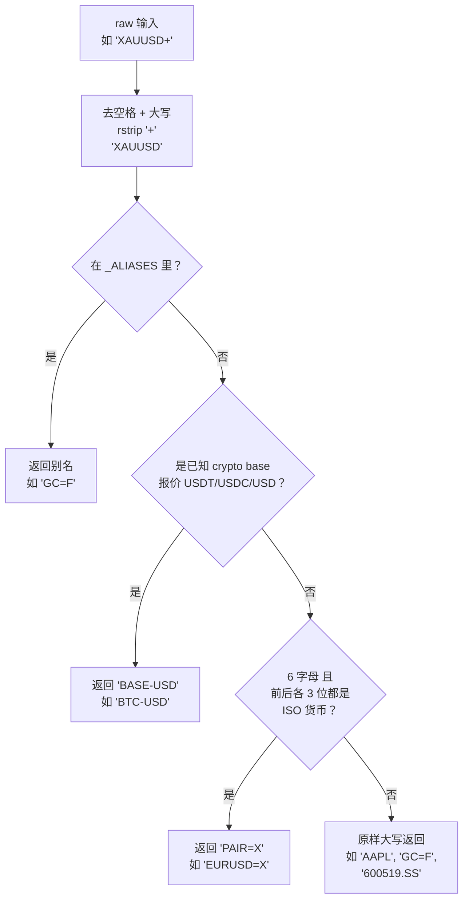

---
难度：⭐⭐
类型：核心概念
预计时间：15 分钟
前置知识：
  - [快速开始](../01-getting-started/quickstart.md) ⭐
后续推荐：
  - [数据供应商路由](data-vendors.md) ⭐⭐⭐
  - [扩展指南](../07-development/extension-guide.md) ⭐⭐⭐
学习路径：
  - 用户路径：第 2 阶段
  - 开发路径：第 3 阶段
---

# 符号归一化 ⭐⭐ 核心概念

用户在券商、TradingView、MT5 里看到的标的符号，和 Yahoo Finance 能识别的符号，往往不是同一个字符串。`XAUUSD`、`BTCUSD`、`SPX500` 这些常见的写法，直接传给 yfinance 会返回空结果，而下层的 LLM 拿到空结果后，曾经围绕一个不存在的标的编造出一整套价格走势（issue #781）。符号归一化层（`symbol_utils.py`）就是为这个问题做的——在符号进入任何 yfinance 调用之前，先把它翻译成 Yahoo 原生的写法。

这一层的关键性质是**纯语法分析，无网络调用**。它只查四张静态映射表、做几条字符串规则判断，不请求任何外部服务，所以可以安全地套在每一次数据请求的最外层，开销几乎为零。

---

## 概念定义

`normalize_symbol(raw)` 把用户或券商风格的标的符号，映射成 Yahoo Finance 的规范符号。它解决的是「同一个金融工具在不同系统里有不同字符串表示」的问题。

类比你旅游时换插座：同一个电（同一只股票），美标插座（券商）和英标插座（Yahoo）的物理形状不同，中间需要一个转接头。`normalize_symbol` 就是这个转接头——它不改变「电」本身，只改变「插头形状」。

为什么需要它，集中在一句话：**Yahoo Finance 是默认主数据源，但它的符号约定和大部分交易终端都不一样**。把决定符号归属的规则集中到一个函数里，新增一种工具只要加一行映射表，不用改任何调用点。

---

## 四张映射表

归一化的全部规则来自四张静态表。先建立全局印象，再看解析顺序。

### 1. 外汇货币表 `_FOREX_CURRENCIES`

24 个常见的 ISO-4217 货币代码（`symbol_utils.py:36-42`）：

```python
_FOREX_CURRENCIES = frozenset(
    {
        "USD", "EUR", "GBP", "JPY", "CHF", "CAD", "AUD", "NZD",
        "CNY", "CNH", "HKD", "SGD", "SEK", "NOK", "DKK", "PLN",
        "MXN", "ZAR", "TRY", "INR", "KRW", "BRL", "RUB", "THB",
    }
)
```

用途：判断一个 6 字母符号是不是「货币对」。只有当它的前 3 位和后 3 位**都**在这个集合里时，才认定为外汇对，加 `=X` 后缀。

### 2. 加密币 base 表 `_CRYPTO_BASES`

11 个已知加密币的 base 货币（`symbol_utils.py:45-47`）：

```python
_CRYPTO_BASES = frozenset(
    {"BTC", "ETH", "SOL", "XRP", "ADA", "DOGE", "LTC", "BCH", "DOT", "AVAX", "LINK"}
)
```

用途：从 `BTC-USD`、`BTCUSD`、`BTC-USDT` 等各种写法里提取出 `BTC` 这个 base。

### 3. 显式别名表 `_ALIASES`

这是最大的一张表，覆盖贵金属、能源、指数 CFD（`symbol_utils.py:53-70`）：

| 类别 | 券商写法 | Yahoo 符号 | 说明 |
|------|---------|-----------|------|
| 贵金属 | `XAUUSD` / `XAU` / `GOLD` | `GC=F` | 黄金在 Yahoo 没有 forex pair，报为 COMEX 期货 |
| 贵金属 | `XAGUSD` / `XAG` / `SILVER` | `SI=F` | 白银同理 |
| 贵金属 | `XPTUSD` / `XPDUSD` | `PL=F` / `PA=F` | 铂、钯 |
| 能源 | `WTICOUSD` / `USOIL` / `WTI` | `CL=F` | WTI 原油 |
| 能源 | `BCOUSD` / `UKOIL` / `BRENT` | `BZ=F` | 布伦特原油 |
| 能源 | `NATGAS` / `XNGUSD` | `NG=F` | 天然气 |
| 能源 | `COPPER` / `XCUUSD` | `HG=F` | 铜 |
| 指数 | `SPX500` / `US500` / `SPX` | `^GSPC` | S&P 500 |
| 指数 | `NAS100` / `US100` / `USTEC` | `^NDX` | 纳斯达克 100 |
| 指数 | `US30` / `DJI30` / `WS30` | `^DJI` | 道琼斯 |
| 指数 | `GER40` / `GER30` / `DE40` | `^GDAXI` | 德国 DAX |
| 指数 | `UK100` | `^FTSE` | 富时 100 |
| 指数 | `JP225` / `JPN225` | `^N225` | 日经 225 |
| 指数 | `FRA40` | `^FCHI` | 法国 CAC 40 |
| 指数 | `EU50` | `^STOXX50E` | 欧洲斯托克 50 |
| 指数 | `HK50` | `^HSI` | 恒生指数 |

贵金属和能源在 Yahoo 没有现货报价，统一映射到最近月期货合约（`=F` 后缀）。指数 CFD 名映射到 Yahoo 的指数符号（`^` 前缀）。

### 4. 加密报价货币 `_CRYPTO_QUOTES`

```python
_CRYPTO_QUOTES = ("USDT", "USDC", "USD")
```

用途：识别加密币的报价货币。Yahoo 只列 `<BASE>-USD`，不列 USDT/USDC 稳定币对，所以券商用的 `BTCUSDT`、`BTCUSDC` 都要归一到 `BTC-USD`（issue #982）。

**一个细节：最长优先是防御性写法，不是顺序敏感点。** 元组顺序是 `("USDT", "USDC", "USD")`，匹配时从长到短。但对当前的 base 集合来说，这个顺序其实不影响结果：`"BTCUSDT"` 的末三位是 `"SDT"` 而非 `"USD"`，所以它根本不会匹配到 `USD`——没有任何字符串能同时以后缀 `USDT`/`USDC` 和 `USD` 结尾。写成最长优先只是防御性习惯：万一以后加入了以 `USD` 结尾、却应被更长短缀命中的新报价货币，顺序才真正起作用。

---

## 解析顺序：`normalize_symbol` 的四步判断

四张表怎么看，由 `normalize_symbol`（`symbol_utils.py:104-138`）的解析顺序决定。**第一步去空格大写、剥离尾部 `+`；后续四条规则，首条匹配即返回。**



对应的代码（`symbol_utils.py:122-134`）：

```python
s = raw.strip().upper()
s = s.rstrip("+")

crypto = _normalize_crypto(s)
if s in _ALIASES:
    canonical = _ALIASES[s]
elif crypto is not None:
    canonical = crypto
elif len(s) == 6 and s[:3] in _FOREX_CURRENCIES and s[3:] in _FOREX_CURRENCIES:
    canonical = f"{s}=X"
else:
    canonical = s
```

注意解析顺序的优先级：别名表 > 加密 > 外汇 > 原样返回。这个顺序是有意的——别名表是显式精确匹配，优先级最高；加密和外汇是规则匹配，放在后面。

**尾部 `+` 的含义。** 券商常用 `+` 标记 CFD 差价合约（比如 `XAUUSD+`），Yahoo 永远不用这个后缀，所以在匹配前剥离（`symbol_utils.py:123-124`）。

### 一个重要性质：A 股不需要特殊映射

中国 A 股的 `.SS`（上海）和 `.SZ`（深圳）后缀，比如 `600519.SS`（贵州茅台），走的是第四条「原样返回」分支。原因是 **Yahoo Finance 原生支持这两个后缀**，不需要任何翻译。这印证了归一化的设计目标：只翻译「不一样」的部分，Yahoo 本来就认识的符号保持原样。

同理，本身已经是 Yahoo 符号的输入（比如用户直接传 `GC=F` 或 `^GSPC`），也会因为不匹配前三条规则而原样返回——幂等性。

---

## 使用场景

`normalize_symbol` 套在所有 yfinance 入口的最外层。典型调用是这样的：

```python
from tradingagents.dataflows.symbol_utils import normalize_symbol

def get_YFin_data_online(symbol: str, ...):
    canonical = normalize_symbol(symbol)
    # 后续所有 yfinance 调用都用 canonical，不用原始 symbol
    ticker = yf.Ticker(canonical)
    hist = ticker.history(...)
```

### 场景对照

| 用户输入 | 归一化结果 | 命中规则 | 说明 |
|---------|----------|---------|------|
| `AAPL` | `AAPL` | 原样返回 | 美股，Yahoo 原生支持 |
| `XAUUSD` | `GC=F` | 别名表 | 黄金现货 → COMEX 期货 |
| `XAUUSD+` | `GC=F` | 剥离 `+` 后命中别名表 | CFD 标记被剥除 |
| `BTCUSD` | `BTC-USD` | 加密规则 | 加 `-` 分隔符 |
| `BTC-USDT` | `BTC-USD` | 加密规则 | USDT 归一为 USD |
| `EURUSD` | `EURUSD=X` | 外汇规则 | 加 `=X` 后缀 |
| `EURGBP` | `EURGBP=X` | 外汇规则 | 交叉货币对同样处理 |
| `SPX500` | `^GSPC` | 别名表 | 指数 CFD → Yahoo 指数 |
| `600519.SS` | `600519.SS` | 原样返回 | A 股，Yahoo 原生支持 |
| `GC=F` | `GC=F` | 原样返回 | 已是 Yahoo 符号，幂等 |

### 错误信号传递

当归一化后仍查不到数据，`NoMarketDataError` 会同时携带原始符号和归一化后的符号（详见 [数据供应商路由](data-vendors.md) 的错误体系）。`NoMarketDataError(symbol=raw, canonical=canonical, detail=...)` 的 `canonical` 字段就是 `normalize_symbol` 的返回值，让错误信息能显示「你传的是 `XAUUSD`，我们实际查的是 `GC=F`」，方便排查。

---

## 辅助函数

除了主入口 `normalize_symbol`，模块还有两个公开函数。

### `crypto_base`

`crypto_base(raw)`（`symbol_utils.py:83-95`）从各种形式的加密币符号里提取 base 货币：

```python
def crypto_base(raw: str) -> str | None:
    if not isinstance(raw, str):
        return None
    compact = raw.strip().upper().rstrip("+").replace("-", "")
    for quote in _CRYPTO_QUOTES:
        if compact.endswith(quote):
            base = compact[: -len(quote)]
            return base if base in _CRYPTO_BASES else None
    return None
```

它先把 `BTC-USD`、`BTCUSD`、`BTC-USDT` 统一压成 `BTCUSD` / `BTCUSDT`（去分隔符），再剥离已知的报价货币后缀，剩下的是不是已知 base。非加密符号返回 `None`。`normalize_symbol` 内部就是用它来识别加密币的。

### `is_yahoo_safe`

`is_yahoo_safe(symbol)`（`symbol_utils.py:141-143`）校验符号只包含 Yahoo 允许的字符（字母、数字、`. _ - ^ =`）。这个函数主要用在缓存文件名、日志等场景，防止符号里混入路径分隔符或其他危险字符。它和 `normalize_symbol` 是互补关系：后者负责「翻译」，前者负责「安全校验」。

---

## 常见误区

### 误区 1：以为归一化会做网络查询

**错误理解：** 「`normalize_symbol` 会去 Yahoo 查询标的是否存在。」
**正确理解：** 它是纯字符串操作，只查四张静态表。一个标的归一化后是否存在，要等到后续 yfinance 调用才知道。归一化的职责是「把字符串变成 Yahoo 认识的样子」，而不是「验证标的」。

### 误区 2：以为可以靠规则覆盖所有标的

**错误理解：** 「只要规则写得够全，所有标的都能自动归一化。」
**正确理解：** 规则只覆盖了有系统性约定的标的（贵金属、能源、指数、外汇、主流加密币）。冷门标的（比如某只伦交所小盘股的券商别名）需要靠 `_ALIASES` 表手动维护。好在这个表是开放的，加一行就能支持新标的，不用改代码逻辑。

### 误区 3：以为外汇判断会误伤

**错误理解：** 「`US30`（道琼斯）会被外汇规则误判。」
**正确理解：** `US30` 只有 4 个字符，连外汇规则的第一道检查 `len(s) == 6` 都过不了（外汇要求 6 字符按 3+3 切分，再查前后各 3 位是否在 `_FOREX_CURRENCIES` 里）。而且它在 `_ALIASES` 里直接命中 `^DJI`，根本走不到外汇规则——别名表的精确匹配优先级更高，外汇规则是最后兜底的。

---

## 知识关联

- **前置：** [快速开始](../01-getting-started/quickstart.md) ⭐ —— 了解标的符号在 CLI 里怎么输入
- **相关：** [数据供应商路由](data-vendors.md) ⭐⭐⭐ —— 归一化后的符号如何进入 vendor 调用、失败时如何把 `canonical` 写进错误信息
- **进阶：** [扩展指南](../07-development/extension-guide.md) ⭐⭐⭐ —— 如何为新的工具类别扩展映射表

---

## 总结速查

核心要点：

1. `normalize_symbol` 是纯语法分析，无网络调用，开销极低，安全地套在每次请求最外层。
2. 解析顺序固定：去空格大写 → 剥离尾部 `+` → 别名表 → 加密规则 → 外汇规则 → 原样返回，首条匹配即返回。
3. 四张表分工：`_ALIASES`（显式精确匹配）、`_CRYPTO_BASES` + `_CRYPTO_QUOTES`（加密规则）、`_FOREX_CURRENCIES`（外汇规则）。
4. Yahoo 原生支持的符号（A 股 `.SS`/`.SZ`、已是 Yahoo 符号的输入）走「原样返回」，幂等。
5. 归一化后的符号通过 `NoMarketDataError.canonical` 进入错误信息，便于排查。

快速参考：

```python
from tradingagents.dataflows.symbol_utils import normalize_symbol, crypto_base, is_yahoo_safe

# 基础用法：把用户输入翻译成 Yahoo 符号
normalize_symbol("XAUUSD")     # 'GC=F'
normalize_symbol("BTCUSD")     # 'BTC-USD'
normalize_symbol("EURUSD")     # 'EURUSD=X'
normalize_symbol("AAPL")       # 'AAPL'
normalize_symbol("600519.SS")  # '600519.SS'

# 提取加密币 base
crypto_base("BTC-USDT")        # 'BTC'
crypto_base("AAPL")            # None

# 安全校验（用于文件名）
is_yahoo_safe("GC=F")          # True
is_yahoo_safe("GC=F; rm -rf")  # False
```

---

**文档元信息**
难度：⭐⭐ | 类型：核心概念 | 更新日期：2026-07-13 | 预计阅读时间：15 分钟
