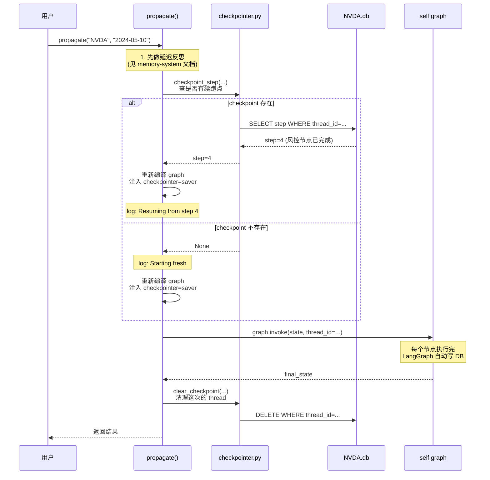

# 断点续跑 ⭐⭐⭐

> **目标读者**：已经会用 TradingAgents 跑分析、想理解崩溃恢复机制、并计划在生产环境部署长时间运行任务的开发者
> **核心问题**：一次分析跑到一半进程挂了，下次能不能从断点接着跑？为什么改了分析师选择之后旧 checkpoint 就失效了？多个 ticker 同时跑会不会互相覆盖？

---

## 这套机制解决什么问题

TradingAgents 一次完整分析要调几十次 LLM、跑好几分钟，过程中任何一个节点（分析师、辩论、风控、PM）失败都会让整次运行白费。断点续跑（checkpointing）让 LangGraph 在每个节点执行完后把当前 state 存下来，下次同样的 `(ticker, date, 图形状)` 再跑时，从最后一个成功节点接着跑，不重头来。

这套机制默认是**关的**（`default_config.py:105`），因为它有代价：每个节点多一次 SQLite 写、磁盘占用、以及续跑时和正常跑略有不同的执行路径。开它之前先确认你的场景真的需要——比如长跑生产任务、不稳定网络、调参时反复跑到同一步。

启用方式有三层覆盖关系：

```bash
# 环境变量（最高优先级）
export TRADINGAGENTS_CHECKPOINT_ENABLED=true

# CLI flag
python -m cli.main --checkpoint

# 配置字典
config = DEFAULT_CONFIG.copy()
config["checkpoint_enabled"] = True
```

---

## 三条核心设计决策

整个 checkpointing 子系统是 100 行不到的 `tradingagents/graph/checkpointer.py`，但三个关键决策决定了它的行为。

### 决策一：每个 ticker 一个 SQLite 文件

```python
def _db_path(data_dir, ticker) -> Path:
    safe = safe_ticker_component(ticker).upper()
    p = Path(data_dir) / "checkpoints"
    p.mkdir(parents=True, exist_ok=True)
    return p / f"{safe}.db"
```

`checkpointer.py:19-25`。所有 ticker 共享一个目录 `{data_cache_dir}/checkpoints/`，但每个 ticker 单独一个 `{TICKER}.db` 文件。这样设计的目的：

- **避免并发争用**：同时跑 NVDA 和 AAPL，各自读写自己的 db，不抢一把 SQLite 锁。
- **隔离故障**：一个 ticker 的 db 损坏不影响其他 ticker。
- **方便清理**：删一个 ticker 的所有 checkpoint 就是删一个文件，不用扫表。

`safe_ticker_component` 把 ticker 名转成路径安全的形式，防 `../../etc/passwd` 这种路径穿越攻击。转大写是约定——`NVDA.db` 而不是 `nvda.db`，避免在不同文件系统上因为大小写敏感差异出问题。

### 决策二：thread_id 融合图形状签名

这是整个机制最巧妙的部分。先看代码：

```python
def thread_id(ticker: str, date: str, signature: str = "") -> str:
    base = f"{ticker.upper()}:{date}"
    if signature:
        base = f"{base}:{signature}"
    return hashlib.sha256(base.encode()).hexdigest()[:16]
```

`checkpointer.py:28-38`。LangGraph 用 `thread_id` 区分不同的执行流——同一个 `thread_id` 的多次调用会被视为同一次可续跑的运行。

`signature` 这个参数是关键。它由 `_run_signature` 生成（`trading_graph.py:348-360`）：

```python
def _run_signature(self, asset_type: str) -> str:
    return "|".join([
        "analysts=" + ",".join(self.selected_analysts),
        f"debate={self.config['max_debate_rounds']}",
        f"risk={self.config['max_risk_discuss_rounds']}",
        f"asset={asset_type}",
    ])
```

四个维度的图形状特征被拼成一个字符串：

| 维度 | 影响 | 例子 |
|------|------|------|
| `selected_analysts` | 哪些分析师节点会跑 | `market,sentiment,news,fundamentals` |
| `max_debate_rounds` | 多轮辩论节点循环几次 | `1` / `2` / `3` |
| `max_risk_discuss_rounds` | 风控讨论循环几次 | `1` / `2` |
| `asset_type` | 走 stock pipeline 还是 crypto pipeline | `stock` / `crypto` |

最终 `thread_id = sha256("NVDA:2024-05-10:analysts=market,sentiment|debate=1|risk=1|asset=stock")[:16]`。

**为什么要塞 signature 进去？** 这是 #1089 的修复。考虑这个场景：

1. 周一用 `debate=1` 跑 NVDA，挂在风控节点，checkpoint 存了。
2. 周二你把 `debate` 改成 `2`，重新跑 NVDA。

如果 `thread_id` 只看 `(ticker, date)`，周二的运行会从周一的 checkpoint 续跑。但周一的 state 是按 `debate=1` 的图结构生成的——里面只有一轮辩论历史，而周二的图期望两轮。续跑出来要么报错要么行为错乱。

把图形状签名揉进 `thread_id`，一旦图变了，`thread_id` 就变，LangGraph 找不到旧 checkpoint，自动从新图的起点开始跑。**改图后不复用旧 checkpoint**，是这套机制的安全阀。

### 决策三：成功完成立刻清 checkpoint

`trading_graph.py:475-480`：

```python
# Clear checkpoint on successful completion to avoid stale state.
if self.config.get("checkpoint_enabled"):
    clear_checkpoint(
        self.config["data_cache_dir"], company_name, str(trade_date),
        self._run_signature(asset_type),
    )
```

一次完整跑完后，立刻把对应的 checkpoint 删掉。为什么？因为下次同一个 `(ticker, date)` 再跑，你要的是全新分析，不是续跑昨天的 state。如果不删，第二次跑 NVDA 5/10 会从第一次的结尾节点"续跑"——但第一次已经跑完了，根本没有"下一步"，行为不可预测。

`clear_checkpoint`（`checkpointer.py:84-98`）的实现是按 `thread_id` 精确删行：

```python
conn = sqlite3.connect(str(db))
for table in ("writes", "checkpoints"):
    conn.execute(f"DELETE FROM {table} WHERE thread_id = ?", (tid,))
conn.commit()
```

只删这一个 `thread_id` 的数据，不影响同 ticker 其他日期的 checkpoint。

---

## 续跑的完整时序

把三个决策串起来看一次完整的续跑：



几个值得注意的点：

- **每次 propagate 都重新编译 graph**（`trading_graph.py:383`）：`self.graph = self.workflow.compile(checkpointer=saver)`。这是因为 LangGraph 的 checkpointer 在编译期绑死，不能事后塞进去。
- **try/finally 保证资源释放**（`trading_graph.py:398-402`）：即使跑挂了，`_checkpointer_ctx.__exit__()` 也会关数据库连接，并把 graph 重新编译成无 checkpointer 的版本，避免后续无 checkpoint 调用误用。
- **续跑前的日志很关键**：`Resuming from step N` 这条 log 告诉你到底从第几步续跑的，排查"为什么这次结果和上次不一样"时第一个看这个。

---

## get_checkpointer：上下文管理器

`checkpointer.py:41-51`：

```python
@contextmanager
def get_checkpointer(data_dir, ticker) -> Generator[SqliteSaver, None, None]:
    db = _db_path(data_dir, ticker)
    conn = sqlite3.connect(str(db), check_same_thread=False)
    try:
        saver = SqliteSaver(conn)
        saver.setup()
        yield saver
    finally:
        conn.close()
```

为什么用 context manager 而不是直接返回 saver？因为 SQLite 连接必须显式关闭，否则 Windows 上文件锁会卡住后续访问。`try/finally` + `@contextmanager` 保证即使 saver 在使用中抛异常，连接也会被关掉。

`check_same_thread=False` 是必要的——LangGraph 内部用线程池调度节点，默认的线程检查会报错。注意这隐含一个约束：同一个 db 文件不能被多个进程同时打开写。如果你真的要跨进程并发跑同一个 ticker，要么加文件锁，要么接受数据竞争。

`saver.setup()` 建表（`checkpoints`、`writes`），幂等，每次调用都安全。

---

## 其他工具函数

### has_checkpoint / checkpoint_step

`checkpointer.py:54-70`。判断某个 `(ticker, date, signature)` 有没有 checkpoint，以及最新 checkpoint 走到了第几步。`propagate` 用 `checkpoint_step` 的返回值决定打哪条 log（续跑还是全新）。

```python
def checkpoint_step(data_dir, ticker, date, signature="") -> int | None:
    db = _db_path(data_dir, ticker)
    if not db.exists():
        return None
    tid = thread_id(ticker, date, signature)
    with get_checkpointer(data_dir, ticker) as saver:
        config = {"configurable": {"thread_id": tid}}
        cp = saver.get_tuple(config)
        if cp is None:
            return None
        return cp.metadata.get("step")
```

`db.exists()` 是个快速短路——文件都没有直接返回，不浪费时间建连接。

### clear_all_checkpoints

`checkpointer.py:73-81`。直接 `unlink` 整个 `checkpoints/` 目录下所有 `.db` 文件。这是"核选项"——不区分 ticker、不区分 date，全删。用于重置整个环境。

返回删除的文件数，方便日志记录。注意它只删 `.db` 文件，不删 `.db-journal` 或 `.db-wal`（SQLite 的事务日志），如果在中途崩溃留下这些侧车文件，需要手动清理。

---

## 配置与启用

| 配置键 | 默认值 | 覆盖方式 |
|--------|--------|----------|
| `checkpoint_enabled` | `False` | `TRADINGAGENTS_CHECKPOINT_ENABLED` 环境变量、CLI `--checkpoint` / `--no-checkpoint`、配置字典 |
| `data_cache_dir` | `~/.tradingagents/data_cache` | checkpoint db 文件存在这个目录下的 `checkpoints/` 子目录 |

启用后续跑发生在 `propagate` 层（`trading_graph.py:362-402`），不影响 `propagate` 之外的任何调用路径。`save_reports`、`memory_log` 这些独立功能不依赖 checkpoint。

---

## 调试与排查

### 想看 checkpoint 里有什么

直接用 sqlite3 客户端打开：

```bash
sqlite3 ~/.tradingagents/data_cache/checkpoints/NVDA.db
.tables
# checkpoints  writes
SELECT thread_id, step FROM checkpoints;
```

`step` 列告诉你这个 thread 跑到了第几个节点。LangGraph 的节点编号从 1 开始，对应 graph 拓扑里的执行顺序。

### 改了图但旧 checkpoint 还在续跑

确认你改的维度被 `_run_signature` 覆盖了。目前覆盖的是分析师集合、辩论轮数、风控轮数、资产类型。如果你改的是 LLM 模型、prompt 模板、工具配置——这些**不会**让 signature 变化，旧 checkpoint 仍然会被续跑。

要彻底清掉旧 checkpoint 强制全新跑，用 `clear_all_checkpoints` 或者直接删 `checkpoints/` 目录。

### 续跑后结果和正常跑对不上

这是预期的。续跑意味着从中间节点开始，前面节点的 state 是上次跑时留下的（用的可能是旧版 prompt、旧 LLM 输出）。所以**续跑结果不可能和全新跑完全一致**。如果你需要可复现性，关掉 checkpoint。

### 并发跑同一个 ticker

不要这么做。同一个 ticker 的 db 文件被两个进程同时写，SQLite 会抛 `database is locked`。如果业务上必须并发，给每个进程不同的 `data_cache_dir`，或者在调用层排队。

### 数据库锁住 / 文件损坏

Windows 上偶尔会出现 `.db` 文件被锁无法删除的情况，通常是有进程持有连接。杀掉相关 Python 进程后再试。损坏的 db 直接删掉就行，最坏后果是这个 ticker 这次跑从零开始，不影响其他数据。

---

## 和记忆系统的关系

checkpointing 和 memory system 是两套完全独立的持久化机制，容易混淆：

| 维度 | checkpointing | memory system |
|------|---------------|---------------|
| 存什么 | LangGraph 节点执行中间状态 | 最终决策和反思 |
| 存哪里 | SQLite `checkpoints/NVDA.db` | Markdown `memory/trading_memory.md` |
| 谁读它 | LangGraph 续跑逻辑 | Portfolio Manager 的 prompt |
| 何时清 | 成功跑完立刻清 | 永不清，靠 rotation 限制大小 |
| 默认开 | 关 | 开 |

它们唯一的交集是：`propagate` 开头先做记忆系统的延迟反思（`_resolve_pending_entries`），再决定是否启用 checkpoint 续跑。两者顺序固定：先反思过去，再（可选）续跑现在。

---

## 设计取舍总结

| 选择 | 替代方案 | 为什么这么选 |
|------|----------|--------------|
| 每 ticker 一个 db | 全局单 db | 避免并发争用，隔离故障，清理简单 |
| thread_id 塞图形状签名 | 只看 (ticker, date) | 改图后自动失效旧 checkpoint，避免错乱续跑 |
| 成功后立刻清 checkpoint | 永久保留 | 下次同 (ticker, date) 跑要的是全新分析 |
| 默认关闭 | 默认开启 | 大部分场景不需要，开启有性能和复杂度代价 |
| SQLite 而非 Redis / 文件 | — | 单机部署零依赖，足够支撑 TradingAgents 的规模 |

---

## 下一步

- 想看 propagate 完整生命周期（checkpoint 在哪一步介入）：[../04-graph-and-agents/graph-orchestration.md](../04-graph-and-agents/graph-orchestration.md)
- 想理解 propagate 开头先做什么（延迟反思）：[./memory-system.md](./memory-system.md)
- 想看 final_state 长什么样、被 checkpoint 存的到底是什么：[./reporting.md](./reporting.md)

---

**文档元信息**
难度：⭐⭐⭐ | 类型：进阶分析 | 预计阅读时间：20 分钟
