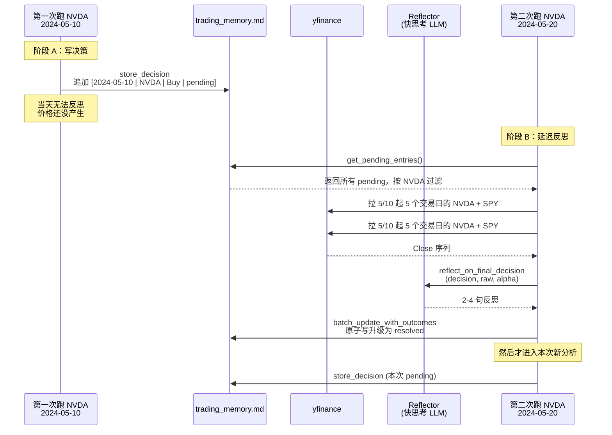
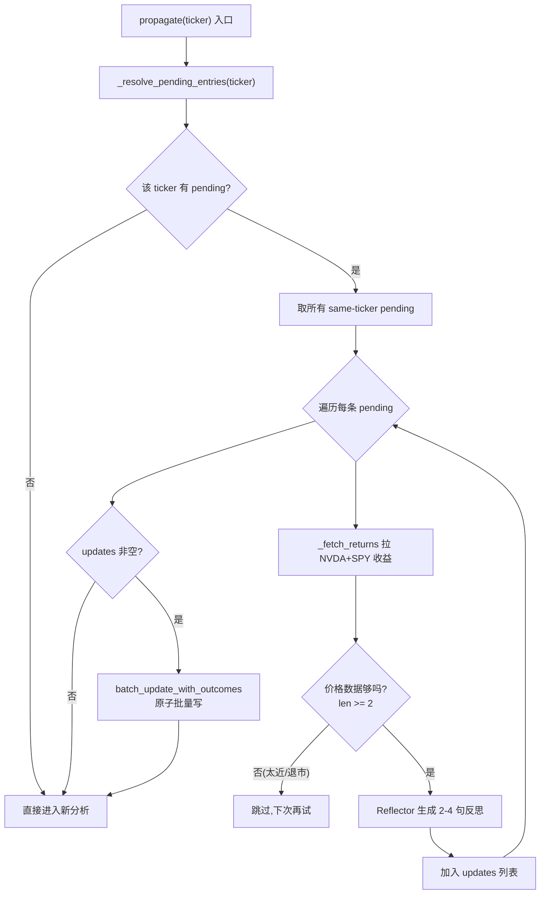

# 记忆与反思系统 ⭐⭐⭐

> **目标读者**：已读完核心概念、想理解 TradingAgents 如何跨运行积累经验、并计划定制记忆行为的开发者
> **核心问题**：为什么记忆用一个 Markdown 文件？决策什么时候写入？反思什么时候生成？为什么我第二次跑同一个 ticker 时输出和第一次不一样？

---

## 这套系统在做什么

TradingAgents 的"记忆"不是数据库，不是向量检索，也没有 BM25 打分。它的真实形态是一个 append-only（只追加）的 Markdown 文件 `~/.tradingagents/memory/trading_memory.md`，记录每一次跑出来的最终决策，以及（如果可能）事后回看这次决策赚没赚钱、该吸取什么教训。

这件事被拆成两个在时间上完全分离的阶段：

- **阶段 A（写决策）**：`propagate()` 跑完，立刻把这次最终决策以 `pending`（待回溯）状态追加到日志。这一步不调 LLM、不查价格，几乎零成本。
- **阶段 B（写反思）**：等到下一次再跑**同一个 ticker** 时，`propagate()` 开头先回头取这个 ticker 的所有 `pending` 条目，用 yfinance 拉实际价格算收益，调一次便宜的快思考模型生成 2-4 句反思，把 `pending` 升级成 `resolved`（已回溯）。

为什么要拆成两阶段？因为跑完那一刻还不知道这次决策的实际收益。5 个交易日后价格才稳定，所以反思必须延后。把反思塞到"下一次同 ticker 运行"的开头，既不需要后台定时任务，也天然把反思和当前分析放在同一个进程里。

> **重要纠偏**：早期社区文档里提到的 `FinancialSituationMemory`、BM25 检索、`reflect_and_remember` 方法在当前代码里**完全不存在**。真实实现是 `tradingagents/agents/utils/memory.py` 里的 `TradingMemoryLog` 类，加上 `tradingagents/graph/trading_graph.py` 里的延迟反思编排。如果你照着旧文档找代码，会一个都找不到。

下面这张图把两阶段的时序关系一次说清楚。



关键约束：阶段 B 只处理"当前这次跑的 ticker"的 pending 条目（`trading_graph.py:305-306`）。如果你先跑了 NVDA，10 天后又改跑 AAPL，NVDA 那条 pending 会一直挂着，直到你再次跑 NVDA 才会被反思。这是一个明确的工程取舍——按 ticker 分桶避免一次反思几十个标的，代价是冷门 ticker 的反思会延迟。

---

## 存储格式：为什么用 Markdown 而不是 SQLite

先看一个真实的 pending 条目长什么样：

```text
[2024-05-10 | NVDA | Buy | pending]

DECISION:
**Rating**: Buy

**Executive Summary**: NVDA 数据中心营收同比 +X%，建议在 X 美元附近建仓……

<!-- ENTRY_END -->


[2024-05-10 | AAPL | Hold | pending]

DECISION:
**Rating**: Hold
……

<!-- ENTRY_END -->
```

反思完成后（resolved 态），同一条目变成：

```text
[2024-05-10 | NVDA | Buy | +5.2% | +1.3% | 5d]

DECISION:
**Rating**: Buy
……

REFLECTION:
方向判断正确（5 日 alpha +1.3% vs SPY），数据中心营收逻辑成立；但低估了期权到期前的波动，止损位设得太紧。下次同类成长股把止损放宽到 ATR 的 1.5 倍。

<!-- ENTRY_END -->
```

两个设计选择值得展开。

**第一，分隔符是 HTML 注释。** `_SEPARATOR = "\n\n<!-- ENTRY_END -->\n\n"`（`memory.py:13`）。选这个形式是因为 LLM 的自然语言输出几乎不可能凭空产生 `<!-- ENTRY_END -->`，所以可以安全地用它做硬分隔，不用担心决策正文里出现同样的字符串把条目切碎。

**第二，不用数据库。** 整个日志就是纯文本，靠 `split(_SEPARATOR)` 切条目。好处是肉眼可读、可以 `git diff`、可以手工编辑修正；坏处是查找是线性扫描。但 TradingAgents 的记忆规模本来就小（单标的最多几千条），线性扫描完全够用，换来的是零依赖和极强的可调试性。

条目解析由 `_parse_entry`（`memory.py:257-281`）完成。它先看第一行 tag 是否是 `[...]` 形式，再用两个预编译正则把 body 切成 `decision` 和 `reflection` 两部分：

```python
_DECISION_RE = re.compile(r"DECISION:\n(.*?)(?=\nREFLECTION:|\Z)", re.DOTALL)
_REFLECTION_RE = re.compile(r"REFLECTION:\n(.*?)$", re.DOTALL)
```

tag 的字段数是可变的：pending 态只有 4 个字段（日期、ticker、评级、`pending`），resolved 态有 6 个（多出 raw 收益、alpha、持有天数）。解析时用 `len(fields) > 4` 这种宽松判断兼容两种形态。

---

## 写路径：三个入口

记忆类对外暴露三条写路径，分别对应阶段 A 的单条写入、阶段 B 的单条更新和批量更新。

### store_decision：阶段 A 的唯一入口

```python
def store_decision(self, ticker, trade_date, final_trade_decision):
    if not self._log_path:
        return
    # 幂等保护：快速扫描已有 pending 则跳过
    if self._log_path.exists():
        raw = self._log_path.read_text(encoding="utf-8")
        for line in raw.splitlines():
            if line.startswith(f"[{trade_date} | {ticker} |") and line.endswith("| pending]"):
                return
    rating = parse_rating(final_trade_decision)
    tag = f"[{trade_date} | {ticker} | {rating} | pending]"
    entry = f"{tag}\n\nDECISION:\n{final_trade_decision}{self._SEPARATOR}"
    with open(self._log_path, "a", encoding="utf-8") as f:
        f.write(entry)
```

`memory.py:30-49`。注意两点：

- **幂等保护**（L40-44）：用纯文本逐行扫描，而不是 `load_entries()` 全量解析。原因是这里只关心 tag 行，`splitlines()` 比解析整个日志快得多。同一个 `(trade_date, ticker)` 已经写过 pending，就直接返回，避免重跑同一天污染日志。
- **评级自动提取**：`parse_rating` 从最终决策正文里抠出 `Buy/Hold/Sell` 等 5 档评级塞进 tag，方便阶段 B 直接读不用再解析正文。

调用点在 `trading_graph.py:469-473`，紧跟在图执行完成后。

### update_with_outcome：阶段 B 单条更新

`memory.py:99-162`。逻辑是：找到第一条匹配 `(trade_date, ticker)` 的 pending 条目，把 tag 改成带收益的形式，在正文末尾追加 `REFLECTION:` 段落。

写入是**原子的**：

```python
tmp_path = self._log_path.with_suffix(".tmp")
tmp_path.write_text(new_text, encoding="utf-8")
tmp_path.replace(self._log_path)
```

`memory.py:160-162`。先写 `.tmp`，再 `os.replace()` 原子替换。即使写到一半进程被杀，原文件也完好，最多留下一个孤儿 `.tmp`。

### batch_update_with_outcomes：阶段 B 批量更新

`memory.py:164-216`。和单条版本逻辑一致，但只读一次文件、只写一次。关键是建了一个 O(1) 查找表：

```python
update_map = {(u["trade_date"], u["ticker"]): u for u in updates}
```

遍历日志每个 block 时，直接查表命中，命中后从 map 里 `del` 掉，避免重复匹配。这条路径是 `_resolve_pending_entries` 实际用的，因为一个 ticker 可能有多个 pending（比如你连续跑了同一天多次，或者跑了多个日期）。

---

## 读路径：get_past_context 是核心共享机制

读路径有 `load_entries`（全量解析）、`get_pending_entries`（只看 pending）、`get_past_context`（给 agent 注入历史）。真正影响 agent 行为的是第三个。

```python
def get_past_context(self, ticker, n_same=5, n_cross=3):
    entries = [e for e in self.load_entries() if not e.get("pending")]
    # ...
    same, cross = [], []
    for e in reversed(entries):
        if len(same) >= n_same and len(cross) >= n_cross:
            break
        if e["ticker"] == ticker and len(same) < n_same:
            same.append(e)
        elif e["ticker"] != ticker and len(cross) < n_cross:
            cross.append(e)
    # ...
```

`memory.py:70-95`。这段逻辑做了两件不同的事，值得分开看：

| 类别 | 来源 | 取几条 | 注入什么 | 目的 |
|------|------|--------|----------|------|
| same-ticker | 同一个 ticker 的 resolved | 最近 5 条 | 完整决策 + 反思 | 让 PM 看到这个标的自己的历史判断对不对 |
| cross-ticker | 其他 ticker 的 resolved | 最近 3 条 | **只**注入反思 | 把跨标的教训迁移过来，不污染当前标的的判断 |

cross-ticker 只注入反思是关键设计——你不希望 PM 把上次 AAPL 的完整决策当成 NVDA 的参考，但"成长股财报前要减仓"这种抽象教训是有用的。`_format_reflection_only`（`memory.py:293-299`）就是干这个的，连决策正文都不带。

**只取 resolved**（L72）是另一条隐含规则。pending 条目没有反思，对当前决策没有"经验"价值，所以 `get_past_context` 会跳过它们。这也意味着：你第一次跑一个全新的 ticker 时，`past_context` 是空字符串，PM 完全靠当前分析；第二次以后才会有历史可参考。

调用链：`trading_graph.py:423` 在 `_run_graph` 开头调用 `get_past_context(company_name)`，结果作为 `past_context` 字段塞进初始 state（`propagation.py:23-40`），最后被 Portfolio Manager 在 prompt 里读到。

---

## 延迟反思触发链：完整拆解

这是整个记忆系统最绕的部分，单独走一遍。

`propagate()` 每次开头第一件事就是调 `_resolve_pending_entries(company_name)`（`trading_graph.py:375`）。这个方法只做一件事：把当前 ticker 名下所有还没反思的决策，能反思的都反思掉。



### _fetch_returns：实际收益怎么算

`trading_graph.py:251-294`。这是把"决策"变成"可反思的样本"的关键一步。

```python
start = datetime.strptime(trade_date, "%Y-%m-%d")
end = start + timedelta(days=holding_days + 7)  # buffer 给周末/假日
stock = yf.Ticker(normalize_symbol(ticker)).history(start=trade_date, end=end_str)
bench = yf.Ticker(benchmark).history(start=trade_date, end=end_str)

if len(stock) < 2 or len(bench) < 2:
    return None, None, None

actual_days = min(holding_days, len(stock) - 1, len(bench) - 1)
raw = (stock["Close"].iloc[actual_days] - stock["Close"].iloc[0]) / stock["Close"].iloc[0]
bench_ret = (bench["Close"].iloc[actual_days] - bench["Close"].iloc[0]) / bench["Close"].iloc[0]
alpha = raw - bench_ret
return raw, alpha, actual_days
```

几个细节：

- **holding_days 默认 5**：以"5 个交易日"作为短期收益评估窗口。
- **+7 天 buffer**：5 个交易日加上周末和可能的假日，日历上至少要拉 12 天的数据才稳妥。
- **actual_days 容错**：如果 yfinance 返回的数据不够 5 天（比如 ticker 期间退市），就取实际能拿到的天数，不强求。
- **价格不够直接返回 None**：跑完 3 天就想反思，数据不够，`_resolve_pending_entries` 看到 None 就跳过这条 pending，下次再试。这就是"延迟"的来源。

### benchmark 自动选择

`_resolve_benchmark`（`trading_graph.py:230-249`）。算 alpha 要有个基准，不同市场的 ticker 该用不同的基准：

```python
benchmark_map = {
    ".NS":  "^NSEI",   # 印度 NSE
    ".BO":  "^BSESN",  # 印度 BSE
    ".T":   "^N225",   # 东京日经
    ".HK":  "^HSI",    # 港股恒生
    ".L":   "^FTSE",   # 伦敦富时
    ".TO":  "^GSPTSE", # 多伦多
    ".AX":  "^AXJO",   # 澳洲
    ".SS":  "000001.SS", # 上证
    ".SZ":  "399001.SZ", # 深证
    "":     "SPY",     # 美股默认
}
```

优先级：`config["benchmark_ticker"]` 显式覆盖 > 后缀 map 匹配 > 空后缀兜底（SPY）。空字符串 key 是兜底，美股 ticker（没有点号后缀）和像 `BRK.B` 这种带点的都会落到这里——这是有意的，因为 alpha 用 USD 计算本来就合理。

### Reflector：反思的 prompt 工程

`reflection.py:14-29` 的 prompt 是整个系统的"性格"所在，值得整段看：

```text
You are a trading analyst reviewing your own past decision now that the outcome is known.
Write exactly 2-4 sentences of plain prose (no bullets, no headers, no markdown).

Cover in order:
1. Was the directional call correct? (cite the alpha figure)
2. Which part of the investment thesis held or failed?
3. One concrete lesson to apply to the next similar analysis.

Be specific and terse. Your output will be stored verbatim in a decision log
and re-read by future analysts, so every word must earn its place.
```

四个约束层层加码：

1. **2-4 句**：硬性长度上限。反思会被注入未来分析的 prompt，太长会挤占上下文。
2. **plain prose, no bullets**：禁止列表和标题。因为反思要被重新拼进 prompt，结构化标记会干扰。
3. **依次回答三个问题**：方向对不对（引 alpha 数字）、论点哪部分成立/失败、一条具体教训。这三段覆盖了"复盘"最核心的信息。
4. **"every word must earn its place"**：这句话直接告诉模型你的输出会被原样复用，倒逼它省去客套。

`Reflector` 用 `quick_thinking_llm`（快思考模型）而不是深度推理模型（`reflection.py:9-12`）。原因是反思是低风险任务，省一次贵模型调用就省一次钱。

---

## 轮转：日志怎么不无限增长

`_apply_rotation`（`memory.py:220-255`）。当 `memory_log_max_entries` 配置项设了值，且 resolved 条目超过这个上限时，从最旧的 resolved 开始丢。

```python
resolved_count = sum(1 for _, r in decisions if r)
if resolved_count <= self._max_entries:
    return blocks

to_drop = resolved_count - self._max_entries
kept = []
for block, is_resolved in decisions:
    if is_resolved and to_drop > 0:
        to_drop -= 1
        continue
    kept.append(block)
return kept
```

关键约束：**pending 条目永不丢弃**（L250-254，只在 `is_resolved` 为真时才丢）。这是为了避免把还没来得及反思的决策直接吞掉——pending 代表"还没完成的工作"，丢了就永远反思不了了。

轮转只在 `update_with_outcome` 和 `batch_update_with_outcomes` 里触发，不在 `store_decision` 里。也就是说，只有当有新条目升级为 resolved、日志结构变化时，才检查要不要丢旧的。

---

## 配置项一览

| 配置键 | 默认值 | 作用 |
|--------|--------|------|
| `memory_log_path` | `~/.tradingagents/memory/trading_memory.md` | 日志文件路径，可通过 `TRADINGAGENTS_MEMORY_LOG_PATH` 覆盖 |
| `memory_log_max_entries` | `None`（不限制） | resolved 条目上限，超过则从最旧开始丢 |
| `benchmark_ticker` | `None` | 显式指定 alpha 基准，覆盖后缀 map |
| `benchmark_map` | 见上文 | ticker 后缀到基准的映射 |

记忆系统**没有显式的"短期 vs 长期"二分**。所有记忆在同一个 md 文件里，区分只看状态：`pending` 是已存决策但未反思，`resolved` 是已反思可用。所谓"短期"就是 pending 那段时间（决策刚写、还没到反思窗口），"长期"就是 resolved 之后被反复注入到未来分析的 prompt 里。

---

## 调试与排查

### 看记忆里有什么

直接打开 md 文件最快：

```bash
cat ~/.tradingagents/memory/trading_memory.md
```

或者用 Python API：

```python
from tradingagents.agents.utils.memory import TradingMemoryLog

log = TradingMemoryLog({"memory_log_path": "~/.tradingagents/memory/trading_memory.md"})
for entry in log.load_entries():
    print(entry["date"], entry["ticker"], entry["rating"],
          "pending" if entry["pending"] else f"{entry['raw']} / {entry['alpha']}")
```

### pending 条目一直不 resolved

最常见的原因是这个 ticker 第二次跑的时候离决策日太近，5 个交易日的价格数据还没产生。等够了自然就好。另一个原因是 ticker 退市或 yfinance 拉不到数据，这种会无限期 pending。检查方法：手动调 `_fetch_returns` 看返回是不是 `(None, None, None)`。

### 反思质量差

反思是单次 LLM 调用，质量主要看 `quick_thinking_llm` 的水平。如果你发现反思套话多、不引用 alpha 数字，把快思考模型换成更强的（比如从 `gpt-4o-mini` 换成 `gpt-4o`）通常立刻见效。代价是每次反思贵几倍。

### 想完全关掉记忆

把 `memory_log_path` 设成空字符串或者干脆不传，`store_decision` 和 `update_with_outcome` 都会 early return（`memory.py:37, 114`）。整个记忆系统就静默了，不影响主流程。

---

## 设计取舍总结

| 选择 | 替代方案 | 为什么这么选 |
|------|----------|--------------|
| 单 Markdown 文件 | SQLite / 向量库 | 规模小，可读性、可调试性、零依赖比查询性能重要 |
| HTML 注释分隔符 | JSON Lines / YAML | 让条目对人友好且 LLM 几乎不会误产生 |
| 两阶段延迟反思 | 当场反思 / 后台定时 | 不需要后台进程，不需要知道未来价格，自然复用下次运行 |
| 按 ticker 分桶反思 | 一次性反思所有 pending | 单次反思成本可控，代价是冷门 ticker 反思延迟 |
| 反思用快思考模型 | 用主推理模型 | 反思是低风险任务，省钱；质量损失可接受 |
| cross-ticker 只注入反思 | 注入完整决策 | 避免不同标的的判断互相污染，保留抽象教训 |

---

## 下一步

- 想看这些反思怎么被 PM 用上：[../04-graph-and-agents/agent-system.md](../04-graph-and-agents/agent-system.md)
- 想理解断点续跑如何避免和记忆系统冲突：[./checkpointing.md](./checkpointing.md)
- 想看决策正文为什么格式这么规整（影响 `parse_rating`）：[./structured-output.md](./structured-output.md)

---

**文档元信息**
难度：⭐⭐⭐ | 类型：进阶分析 | 预计阅读时间：25 分钟
