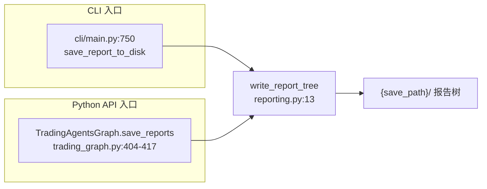
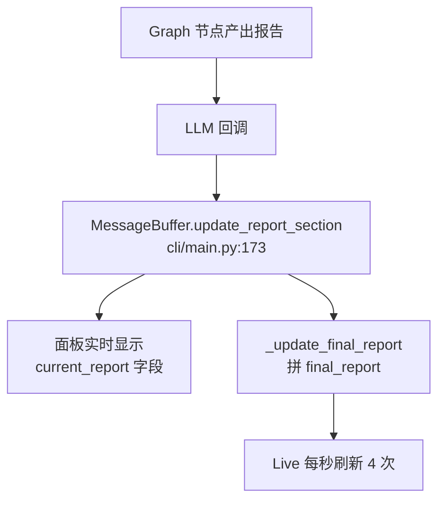

# 报告系统 ⭐⭐

> **目标读者**：想理解 TradingAgents 跑完后产物长什么样、CLI 实时显示和最终落盘报告有什么区别的使用者
> **核心问题**：一次分析会生成哪些文件？目录结构是什么？CLI 里实时刷新的报告和最终保存的报告是一回事吗？

---

## 两条独立的报告通路

TradingAgents 里"报告"其实指两件不同步的事，先分清楚：

| 通路 | 触发者 | 产物 | 用途 |
|------|--------|------|------|
| **实时报告** | CLI 运行时的 `MessageBuffer` | 边跑边刷新的终端面板 + 每段写到 `results_dir/{ticker}/{date}/reports/{section}.md` | 让用户在 CLI 里看到进度 |
| **落盘报告** | `write_report_tree`（CLI 和 Python API 共用） | `{save_path}/` 下的完整目录树 + `complete_report.md` | 跑完后的正式交付物 |

两条通路的数据来源都是 graph 执行时的 `final_state`，但**写入时机、目录结构、合并方式都不一样**。最容易踩的坑是以为 CLI 里看到的报告就是落盘文件——落盘文件（`complete_report.md`）有完整的五段（含风险辩论），但 CLI 内存里实时拼的 `final_report` 只含四段（缺风险辩论段），两者不完全相同。

落盘报告才是 Python API 调用者和后续自动化流程真正消费的东西，下面重点讲它。

---

## write_report_tree：CLI 和 API 的共用入口

`tradingagents/reporting.py:13-101`。这是整个报告系统的核心函数，两个入口都汇到这里（这是 #1037 重构的关键改动，之前 CLI 和 API 各写一份、容易漂移）：



函数签名很简短：

```python
def write_report_tree(final_state: dict, ticker: str, save_path) -> Path:
    """Save a completed run's reports to ``save_path``; return the complete-report path."""
```

`save_path` 不存在会自动 `mkdir -p` 创建。返回 `complete_report.md` 的完整路径，方便调用方打印或后续打开。

---

## 落盘目录结构

一次成功跑完的产物长这样：

```text
{save_path}/
├── complete_report.md              # 合并版，含 header 和时间戳
├── 1_analysts/                     # I. Analyst Team Reports
│   ├── market.md
│   ├── sentiment.md
│   ├── news.md
│   └── fundamentals.md
├── 2_research/                     # II. Research Team Decision
│   ├── bull.md
│   ├── bear.md
│   └── manager.md
├── 3_trading/                      # III. Trading Team Plan
│   └── trader.md
├── 4_risk/                         # IV. Risk Management Team Decision
│   ├── aggressive.md
│   ├── conservative.md
│   └── neutral.md
└── 5_portfolio/                    # V. Portfolio Manager Decision
    └── decision.md
```

目录编号 `1_` 到 `5_` 反映了 graph 的执行顺序，也是 `complete_report.md` 里章节的拼接顺序。这种命名让 `ls` 出来天然按业务流程排序，肉眼一看就知道哪一步在前。

### 按需创建：缺哪段不建哪个目录

`write_report_tree` **不是无脑建所有子目录**。每段都先用 `final_state.get(...)` 判空，只有非空才 `mkdir` 和写文件：

```python
if final_state.get("market_report"):
    analysts_dir.mkdir(exist_ok=True)
    (analysts_dir / "market.md").write_text(final_state["market_report"], encoding="utf-8")
    analyst_parts.append(("Market Analyst", final_state["market_report"]))
```

`reporting.py:22-25`。这样的好处：

- **用户关掉某个分析师**（比如只选了 market + fundamentals），sentiment 和 news 这两个文件根本不会出现，避免空文件污染。
- **graph 中途失败**：已经生成的段会保留，没生成的段对应目录直接不存在，便于事后排查到底跑到哪一步。

`2_research`、`4_risk`、`5_portfolio` 三个目录的判定还要再嵌一层。比如 portfolio 决策依赖 risk_debate_state 里有没有 `judge_decision`：

```python
if risk.get("judge_decision"):
    portfolio_dir = save_path / "5_portfolio"
    portfolio_dir.mkdir(exist_ok=True)
    (portfolio_dir / "decision.md").write_text(risk["judge_decision"], encoding="utf-8")
    sections.append(f"## V. Portfolio Manager Decision\n\n### Portfolio Manager\n{risk['judge_decision']}")
```

`reporting.py:92-96`。

---

## complete_report.md：合并版怎么拼

单文件合并版是给人快速浏览用的。结构是 `reporting.py:98-100` 这三行：

```python
header = f"# Trading Analysis Report: {ticker}\n\nGenerated: {datetime.now().strftime('%Y-%m-%d %H:%M:%S')}\n\n"
(save_path / "complete_report.md").write_text(header + "\n\n".join(sections), encoding="utf-8")
```

实际生成的开头：

```markdown
# Trading Analysis Report: NVDA

Generated: 2024-05-20 14:32:11


## I. Analyst Team Reports

### Market Analyst
……市场分析正文……

### Sentiment Analyst
……
```

五段用罗马数字 `## I / II / III / IV / V` 标题，对应 graph 的五个阶段。每段内部用 `### Analyst Name` 列出具体子项。这个罗马数字编号是硬编码的（`reporting.py:40, 61, 68, 89, 96`），改章节顺序要同步改拼接逻辑。

`sections` 列表是动态构建的——某段为空就不 append，所以 `complete_report.md` 里不会出现空的 `## II` 标题。这一点和子目录按需创建是同一套逻辑。

---

## CLI 的实时报告：MessageBuffer

`cli/main.py:63-246`。CLI 用户看到的实时滚动报告来自这里，和 `write_report_tree` 是两条独立的写路径。



`MessageBuffer` 在内存里维护一个 `report_sections` dict，键是段名（`market_report`、`sentiment_report` 等），值是最新内容。每当 graph 里某个 agent 产出报告，回调把内容塞进来，触发两件事：

1. **`current_report` 更新**：面板只显示"最近更新的一段"，不是全部，避免界面刷得太快（`cli/main.py:178-202`）。
2. **`final_report` 拼接**：把所有非空段拼成一个长字符串，对应"完整报告"视图。

### CLI 运行时也会落盘每一段

除了内存里的实时显示，CLI 还用装饰器把每段内容同步写到磁盘（`cli/main.py:1050-1062`）：

```python
def save_report_section_decorator(obj, func_name):
    func = getattr(obj, func_name)
    @wraps(func)
    def wrapper(section_name, content):
        func(section_name, content)
        if section_name in obj.report_sections and obj.report_sections[section_name] is not None:
            content = obj.report_sections[section_name]
            if content:
                file_name = f"{section_name}.md"
                text = "\n".join(str(item) for item in content) if isinstance(content, list) else content
                with open(report_dir / file_name, "w", encoding="utf-8") as f:
                    f.write(text)
    return wrapper
```

写到哪？是 `results_dir/{ticker}/{date}/reports/{section_name}.md` 这种平铺结构。注意它和 `write_report_tree` 的目录结构**不一样**——这里是按段名平铺，那里是按业务流程分五级目录。

| 维度 | CLI 实时落盘 | write_report_tree |
|------|-------------|-------------------|
| 触发时机 | 每段产出立刻写 | 全部跑完后一次性写 |
| 目录结构 | 平铺 `reports/{section}.md` | 五级目录 `1_analysts/...` |
| 文件命名 | 用 state 字段名（`market_report.md`） | 用业务名（`market.md`） |
| 合并文件 | 无 | 有 `complete_report.md` |
| 调用方 | 仅 CLI | CLI 和 Python API |

如果你用 Python API（`TradingAgentsGraph.propagate` 后调 `save_reports`），实时落盘那一套完全不会发生，只有 `write_report_tree` 的产物。这是为什么 headless 部署应该用 API 而不是包一层 CLI。

---

## Python API 怎么调

`trading_graph.py:404-417`：

```python
def save_reports(self, final_state, ticker, save_path=None) -> Path:
    if save_path is None:
        stamp = datetime.now().strftime("%Y%m%d_%H%M%S")
        save_path = (
            Path(self.config["results_dir"])
            / "reports"
            / f"{safe_ticker_component(ticker)}_{stamp}"
        )
    return write_report_tree(final_state, ticker, save_path)
```

不传 `save_path` 时，会自动在 `results_dir/reports/` 下用 `{ticker}_{时间戳}` 命名。`safe_ticker_component` 把 ticker 里的特殊字符（比如 `BRK.B` 的点）换成路径安全的字符，避免建出意外的目录层级。

典型用法：

```python
from tradingagents.graph.trading_graph import TradingAgentsGraph

ta = TradingAgentsGraph()
state, signal = ta.propagate("NVDA", "2024-05-10")
report_path = ta.save_reports(state, "NVDA")
print(f"报告写在 {report_path}")
```

---

## 常见问题

### complete_report.md 里缺某一段

去 `{save_path}/` 下看对应的编号目录是否存在。目录不存在 = 那一段在 `final_state` 里是空的。常见原因：

- 配置里关掉了对应分析师（`selected_analysts` 没选它）
- graph 中途出错，那段没跑到
- 辩论轮数设成 0，`bull_history` / `bear_history` 为空

### 想自定义报告格式

`write_report_tree` 不接受格式参数。要改章节标题、加自定义 header、改拼接顺序，直接 fork 这个函数最干净。它就 100 行不到，重写比改造快。

### API 调用拿不到实时报告

实时报告是 CLI 专属，由 `MessageBuffer` + 终端 Live 渲染驱动，Python API 没有。如果你需要在 headless 服务里看进度，得自己挂 LLM callback 收集 `messages`，或者读 graph stream 的 chunk。

---

## 下一步

- 想看 `final_state` 各字段的语义来源：[../04-graph-and-agents/agent-system.md](../04-graph-and-agents/agent-system.md)
- 想理解 `final_trade_decision` 为什么格式这么规整：[./structured-output.md](./structured-output.md)
- 跑挂了想从断点恢复，看报告写到一半怎么办：[./checkpointing.md](./checkpointing.md)

---

**文档元信息**
难度：⭐⭐ | 类型：核心概念 | 预计阅读时间：15 分钟
