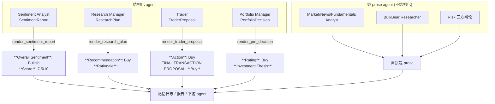
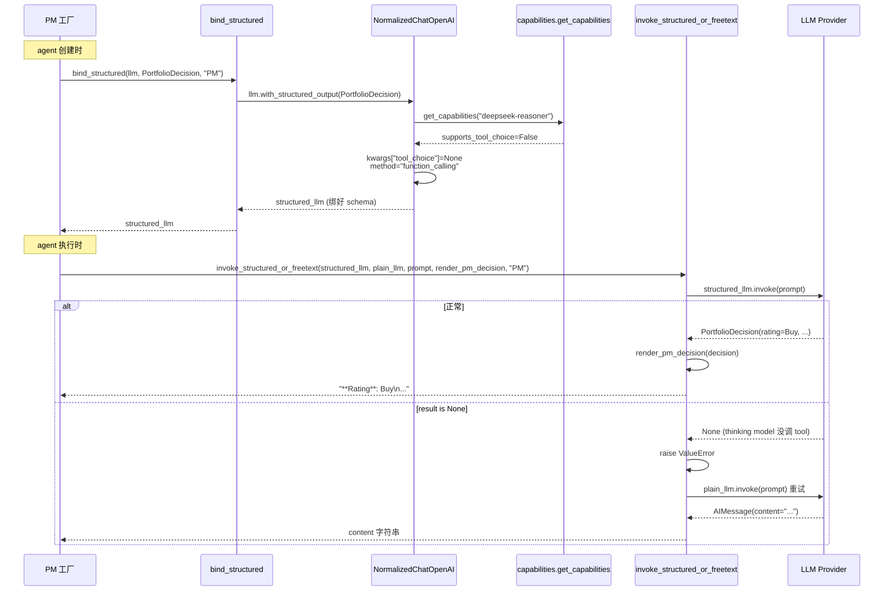

# 结构化输出 ⭐⭐⭐

> **目标读者**：想把 TradingAgents 接到不同 LLM 提供商、想理解为什么决策 agent 的输出格式总是稳定、并计划定制输出字段的开发者
> **核心问题**：为什么 prose 仍是主产物？结构化输出叠加在哪一层？模型不支持结构化时会怎样？为什么 DeepSeek 不能用 tool_choice？

---

## 一句话定位

TradingAgents 的主产物**仍然是自然语言 prose**，不是 JSON。结构化输出是叠在 prose 之上的"一致性保证层"，作用是让四个 agent（Sentiment Analyst、Research Manager、Trader、Portfolio Manager）的输出在不同模型、不同运行之间保持稳定的章节结构，方便下游解析、记忆日志、报告生成。

这个定位是理解整套机制的前提。`schemas.py` 文件头的注释开宗明义：

> The framework's primary artifact is still prose: each agent's natural-language reasoning is what users read in the saved markdown reports and what the downstream agents read as context. Structured output is layered onto the three decision-making agents...

为什么不全量结构化？因为分析师的推理是给人读的，挤进 JSON 字段会损失表达力；而决策动作（评级、买卖方向、目标价）确实需要可机器解析。所以系统在"需要机器读"的地方加结构化，在"需要人读"的地方保留 prose。例外是 Sentiment Analyst——它也用结构化输出，因为情绪报告需要可比较的量化字段（分数、置信度）。



注意右侧所有路径都汇成 markdown——结构化只发生在 agent 内部那一次 LLM 调用，调完立刻 `render_*` 渲染回 prose 形态，对下游完全透明。

---

## 四个结构化 schema

`schemas.py` 定义了四个 Pydantic schema。三个用于决策点（Research Manager、Trader、Portfolio Manager），一个用于情绪分析（Sentiment Analyst）。它们的设计有共性也有差异。

### 共享的评级枚举

```python
class PortfolioRating(str, Enum):
    """5-tier rating used by the Research Manager and Portfolio Manager."""
    BUY = "Buy"
    OVERWEIGHT = "Overweight"
    HOLD = "Hold"
    UNDERWEIGHT = "Underweight"
    SELL = "Sell"

class TraderAction(str, Enum):
    """3-tier transaction direction used by the Trader."""
    BUY = "Buy"
    HOLD = "Hold"
    SELL = "Sell"

class SentimentBand(str, Enum):
    """6-band sentiment classification used by the Sentiment Analyst."""
    BULLISH = "Bullish"
    MILDLY_BULLISH = "Mildly Bullish"
    NEUTRAL = "Neutral"
    MIXED = "Mixed"
    MILDLY_BEARISH = "Mildly Bearish"
    BEARISH = "Bearish"
```

`schemas.py:44-65`（PortfolioRating/TraderAction）、`schemas.py:258-271`（SentimentBand）。RM 和 PM 用 5 档（包含 Overweight / Underweight 这种仓位倾斜），Trader 只用 3 档（Buy / Hold / Sell），Sentiment Analyst 用 6 档情绪带（区分 Bullish/Bearish 的程度以及 Neutral 与 Mixed 的差异——Neutral 是信号弱，Mixed 是多空信号冲突）。注释解释了为什么 Trader 不需要 5 档：

> The Trader's job is to translate the Research Manager's investment plan into a concrete transaction proposal: should the desk execute a Buy, a Sell, or sit on Hold this round. Position sizing and the nuanced Overweight / Underweight calls happen later at the Portfolio Manager.

也就是说，5 档里的 Overweight/Underweight 是给 PM 做仓位决策用的，Trader 只关心"现在执行还是不执行"，3 档足够。

### ResearchPlan：RM 的产出

`schemas.py:73-102`。三个字段：

| 字段 | 类型 | 作用 |
|------|------|------|
| `recommendation` | `PortfolioRating` | 5 档评级，锁定向 |
| `rationale` | `str` | 辩论双方论点总结 + 为什么选这边 |
| `strategic_actions` | `str` | 给 Trader 的可执行指令，含仓位指引 |

字段描述（Field description）就是模型的输出指令。看 `recommendation` 的描述：

> Reserve Hold for situations where the evidence on both sides is genuinely balanced; otherwise commit to the side with the stronger arguments.

这是把"什么时候用 Hold"的判断标准塞进 schema，prompt body 就不用重复。这种"Field description 当输出指令"的写法贯穿四个 schema，让 prompt 本身可以专注上下文。

### TraderProposal：Trader 的产出

`schemas.py:121-156`。五个字段：

| 字段 | 类型 | 是否必填 | 作用 |
|------|------|----------|------|
| `action` | `TraderAction` | 必填 | Buy/Hold/Sell |
| `reasoning` | `str` | 必填 | 2-4 句理由 |
| `entry_price` | `float \| None` | 可选 | 入场价 |
| `stop_loss` | `float \| None` | 可选 | 止损价 |
| `position_sizing` | `str \| None` | 可选 | 仓位指引如 "5% of portfolio" |

三个可选字段是关键——模型不知道目标价时可以不填，而不是硬编一个数字。这种"宁可缺也不要错"的设计避免了模型为了凑字段产生幻觉数字。

### PortfolioDecision：PM 的产出

`schemas.py:188-228`。五个字段，是四个 schema 里最完整的：

| 字段 | 类型 | 作用 |
|------|------|------|
| `rating` | `PortfolioRating` | 最终仓位评级 |
| `executive_summary` | `str` | 2-4 句行动计划 |
| `investment_thesis` | `str` | 详细推理，可引用记忆里的历史教训 |
| `price_target` | `float \| None` | 可选目标价 |
| `time_horizon` | `str \| None` | 可选持有期建议 |

`investment_thesis` 的描述里有一句关键话：

> If prior lessons are referenced in the prompt context, incorporate them; otherwise rely solely on the current analysis.

这是把记忆系统和结构化输出绑起来——如果 prompt 里有过去的反思（见 [memory-system.md](./memory-system.md) 的 `get_past_context`），PM 应该在 thesis 里体现"吸取了哪些教训"。结构化字段不只是格式约束，也是行为约束。

### SentimentReport：情绪分析师的产出

`schemas.py:273-326`。四个字段：

| 字段 | 类型 | 作用 |
|------|------|------|
| `overall_band` | `SentimentBand` | 6 档情绪分类 |
| `overall_score` | `float`（0-10） | 量化情绪强度，10 最看多 |
| `confidence` | `Literal["low","medium","high"]` | 分析师对自身判断的置信度 |
| `narrative` | `str` | 2-4 段自然语言分析，解释分数和分类 |

Sentiment Analyst 是四个分析师里唯一用结构化输出的。原因在于情绪分析的本质：它的产物需要被下游（多空辩手、PM）快速比较和引用。`overall_band` 和 `overall_score` 提供可量化的锚点，`narrative` 保留可读的推理。而 Market/News/Fundamentals Analyst 产出的是叙述性报告，结构化反而会损失信息。

`sentiment_analyst.py:58` 用 `bind_structured(llm, SentimentReport, ...)` 绑定 schema，走和其他三个结构化 agent 相同的 `invoke_structured_or_freetext` 降级路径。渲染函数是 `render_sentiment_report`（`schemas.py:328-344`），输出带 `**Overall Sentiment:**` 头部的 markdown。

---

## _NULLISH_FLOAT：处理模型的占位符

LLM 经常在可选数值字段里塞字符串占位符而不是省略。`schemas.py:26-36` 处理这个问题：

```python
# LLMs sometimes write a placeholder string ("None", "N/A", ...) into an optional
# numeric field instead of omitting it. Coerce those to None so the structured
# call validates instead of erroring (#1058). Pydantic still parses real numeric
# strings ("189.5") to float.
_NULLISH_FLOAT = {"", "none", "n/a", "na", "null", "nil", "-", "tbd", "unknown"}

def _coerce_optional_float(value):
    if isinstance(value, str) and value.strip().lower() in _NULLISH_FLOAT:
        return None
    return value
```

然后挂成 Pydantic 的 `field_validator`，覆盖 TraderProposal 的两个可选价（`entry_price`、`stop_loss`）和 PortfolioDecision 的 `price_target`：

```python
@field_validator("entry_price", "stop_loss", mode="before")
@classmethod
def _nullish_float_to_none(cls, v):
    return _coerce_optional_float(v)
```

`mode="before"` 表示在 Pydantic 类型转换**之前**先跑这个 validator。这样模型填的 `"N/A"` 字符串会被先转成 None，再走 Pydantic 的 `float | None` 校验，就不会报"无法把 N/A 转 float"的错。

这是 #1058 的修复。在它之前，弱模型一旦在 entry_price 写 `"-"` 整个结构化调用就失败，触发降级。修复后这种本可挽救的输入直接转 None，结构化路径成功率显著提高。

---

## render 函数：结构化到 markdown 的回写

四个 schema 各有一个 render 函数，把 Pydantic 实例渲染成下游能消费的 markdown。这一步是结构化输出"对下游透明"的关键。

### render_pm_decision

`schemas.py:231-250`：

```python
def render_pm_decision(decision: PortfolioDecision) -> str:
    parts = [
        f"**Rating**: {decision.rating.value}",
        "",
        f"**Executive Summary**: {decision.executive_summary}",
        "",
        f"**Investment Thesis**: {decision.investment_thesis}",
    ]
    if decision.price_target is not None:
        parts.extend(["", f"**Price Target**: {decision.price_target}"])
    if decision.time_horizon:
        parts.extend(["", f"**Time Horizon**: {decision.time_horizon}"])
    return "\n".join(parts)
```

输出长这样：

```markdown
**Rating**: Buy

**Executive Summary**: 建议在 880 美元附近建仓 5%，止损 820……

**Investment Thesis**: 数据中心营收逻辑成立，结合上次 NVDA 反思里"止损太紧"的教训……

**Price Target**: 950

**Time Horizon**: 3-6 months
```

注意渲染保留了固定的 section header（`**Rating**`、`**Investment Thesis**` 等）。这不是随便选的——记忆日志的 `parse_rating`、报告生成器、CLI 显示都依赖这些 header 做正则匹配。结构化输出改了字段，render 也要同步保持 header 稳定。

### render_trader_proposal 的向后兼容

`schemas.py:158-180`。这个 render 比其他两个多一行：

```python
parts.extend([
    "",
    f"FINAL TRANSACTION PROPOSAL: **{proposal.action.value.upper()}**",
])
return "\n".join(parts)
```

注释解释了原因：

> The trailing `FINAL TRANSACTION PROPOSAL: **BUY/HOLD/SELL**` line is preserved for backward compatibility with the analyst stop-signal text and any external code that greps for it.

外部代码可能用 `grep "FINAL TRANSACTION PROPOSAL"` 来提取 Trader 的决策方向。结构化输出引入后这个尾行不能丢，否则破坏向后兼容。这是一个典型的"结构化内部、prose 外部"过渡设计——内部已经是 Pydantic enum，但渲染回 markdown 时还要维持旧的 grep-friendly 标记。

---

## structured.py：优雅降级三步

这是整个结构化输出系统对调用方暴露的统一封装。`agents/utils/structured.py` 一共两个函数。

### bind_structured：绑定阶段

`structured.py:32-46`：

```python
def bind_structured(llm: Any, schema: type[T], agent_name: str) -> Any | None:
    try:
        return llm.with_structured_output(schema)
    except (NotImplementedError, AttributeError) as exc:
        logger.warning(
            "%s: provider does not support with_structured_output (%s); "
            "falling back to free-text generation",
            agent_name, exc,
        )
        return None
```

在 agent 工厂创建时调一次。返回 `None` 表示这个 provider 完全不支持结构化输出（极少见，主要是老版本 Ollama）。返回 None 时 agent 在所有调用上都走纯文本，不是单次降级。

### invoke_structured_or_freetext：调用阶段的三步降级

`structured.py:49-79`。这是核心。完整逻辑：

```python
def invoke_structured_or_freetext(
    structured_llm, plain_llm, prompt, render, agent_name,
) -> str:
    if structured_llm is not None:
        try:
            result = structured_llm.invoke(prompt)
            if result is None:
                # thinking model 可能纯文本回答不调 tool
                raise ValueError("structured output returned no parsed result")
            return render(result)
        except Exception as exc:
            logger.warning(
                "%s: structured-output invocation failed (%s); retrying once as free text",
                agent_name, exc,
            )

    response = plain_llm.invoke(prompt)
    return response.content
```

三步降级，对应三种失败模式：

```mermaid
flowchart TD
    S["agent 调用入口"] --> C1{"structured_llm<br/>非 None?"}
    C1 -- "否(provider 不支持)" --> FT["step 3: plain_llm.invoke<br/>纯文本回退"]
    C1 -- 是 --> T["step 1: structured_llm.invoke"]
    T --> C2{"result is None?"}
    C2 -- "是(thinking model<br/>没调 tool)" --> FT
    C2 -- 否 --> R["render(result)"]
    T -->|"任何异常<br/>(JSON 损坏/网络/超时)" --> FT
    R --> OUT["返回 markdown"]
    FT --> OUT
```

| 步骤 | 触发条件 | 行为 | 典型场景 |
|------|----------|------|----------|
| 1 | 正常路径 | 结构化调用 + render | OpenAI / Anthropic / Gemini 正常模式 |
| 2 | `result is None` | 抛异常进 step 3 | thinking model 纯文本回答、不调 tool |
| 3 | 任何异常或 step 1 没绑成 | `plain_llm.invoke` 纯文本 | 弱模型 JSON 损坏、provider 临时故障 |

第二步是这套设计的精髓。**thinking model（如 DeepSeek-R1）有时会在 reasoning 阶段直接写出答案，不触发 tool call**，导致结构化 parser 拿不到结果返回 None。如果直接返回 None 给上层，整个 agent 就崩了。这里主动抛 `ValueError`，让控制流滑进 `except` 分支，触发纯文本重试。

关键保证：**结构化失败永不阻塞 pipeline**。无论哪一步失败，最终都会落到 `plain_llm.invoke` 拿到一段 prose 返回。下游 agent 拿到的永远是一个字符串，不需要关心上游是结构化还是纯文本来的。

代价是降级时输出格式可能不规整（没 `**Rating**:` header）。但记忆日志的 `parse_rating` 有两段式容错（先找 label 再全文搜 rating 词），能处理这种情况。

---

## capabilities.py：能力表驱动

为什么需要能力表？因为不同模型对结构化输出 API 的支持差异巨大，而且这种差异不能从模型名简单推断。`llm_clients/capabilities.py` 用一张声明式表格集中管理。

### ModelCapabilities 数据结构

`capabilities.py:29-45`：

```python
@dataclass(frozen=True)
class ModelCapabilities:
    supports_tool_choice: bool
    supports_json_mode: bool
    supports_json_schema: bool
    preferred_structured_method: StructuredMethod
    requires_reasoning_content_roundtrip: bool = False
    requires_reasoning_split: bool = False
```

六个字段描述一个模型在 API 层面接受什么、偏好什么。`StructuredMethod` 是个 Literal 枚举：

```python
StructuredMethod = Literal[
    "function_calling",  # 用 tools，受 supports_tool_choice 约束
    "json_mode",         # response_format={"type":"json_object"}
    "json_schema",       # response_format={"type":"json_schema",...}
    "none",              # 不支持，调用方降级
]
```

### 三级查找

`capabilities.py:94-126`。三张表，优先级从高到低：

```python
_BY_ID: dict[str, ModelCapabilities] = {
    "deepseek-chat": _DEEPSEEK_CHAT,
    "deepseek-reasoner": _DEEPSEEK_THINKING,
    "deepseek-v4-flash": _DEEPSEEK_THINKING,
    "deepseek-v4-pro": _DEEPSEEK_THINKING,
    "MiniMax-M2.7": _MINIMAX_THINKING,
    # ...
}

_BY_PATTERN: list[tuple[re.Pattern[str], ModelCapabilities]] = [
    (re.compile(r"^deepseek-v\d"), _DEEPSEEK_THINKING),
    (re.compile(r"^deepseek-reasoner"), _DEEPSEEK_THINKING),
    (re.compile(r"^MiniMax-M\d"), _MINIMAX_THINKING),
]

def get_capabilities(model_name: str) -> ModelCapabilities:
    if model_name in _BY_ID:
        return _BY_ID[model_name]
    for pattern, caps in _BY_PATTERN:
        if pattern.match(model_name):
            return caps
    return _DEFAULT
```

| 优先级 | 来源 | 例子 | 用途 |
|--------|------|------|------|
| 1 | 精确 ID 匹配 | `deepseek-chat` | 已知模型走精确配置 |
| 2 | 正则模式匹配 | `deepseek-v5-*` 未发布版本 | 前向兼容，新版本自动继承家族特性 |
| 3 | 默认值 `_DEFAULT` | 任意未知模型 | 假设全支持，最大化可用性 |

前向兼容那条尤其重要。`deepseek-v5-flash` 这种还没发布的版本，靠 `^deepseek-v\d` 模式自动继承 thinking 家族的特性，不用等用户报告 bug 再补表。

### _DEFAULT 假设全支持

```python
_DEFAULT = ModelCapabilities(
    supports_tool_choice=True,
    supports_json_mode=True,
    supports_json_schema=True,
    preferred_structured_method="function_calling",
)
```

未知模型默认假设什么都支持。这是有意的选择——大多数新模型都是 OpenAI-compatible 的标准实现，默认全支持能让新模型开箱即用。如果某个新模型有 quirk，等用户报 issue 再补到 `_BY_ID`。

### 为什么 DeepSeek 不能用 tool_choice

这是能力表最典型的应用案例。`capabilities.py:54-60`：

```python
_DEEPSEEK_THINKING = ModelCapabilities(
    supports_tool_choice=False,
    supports_json_mode=True,
    supports_json_schema=False,
    preferred_structured_method="function_calling",
    requires_reasoning_content_roundtrip=True,
)
```

注释解释：

> DeepSeek's thinking models accept the `tools` array but reject the `tool_choice` parameter. Their official tool-calling examples pass `tools=[...]` without `tool_choice` — we mirror that pattern by setting supports_tool_choice to False and letting the client suppress the kwarg.

也就是说 DeepSeek 的 thinking model 接受 tools 定义（schema 作为 tool 传过去），但拒绝 tool_choice 参数（langchain 默认会发）。`supports_tool_choice=False` 让 client 在发请求时把 tool_choice 去掉，schema 仍然作为 tool 传过去。这和 DeepSeek 官方文档的示例完全一致。

如果不用能力表，就得在每个调用点写 `if "deepseek" in model_name: ...`，散落各处、容易漏。集中一张表之后，加新模型只改一个文件。

---

## NormalizedChatOpenAI.with_structured_output

能力表的实际消费者。`llm_clients/openai_client.py:38-51`：

```python
def with_structured_output(self, schema, *, method=None, **kwargs):
    caps = get_capabilities(self.model_name)
    if caps.preferred_structured_method == "none":
        raise NotImplementedError(
            f"{self.model_name} has no structured-output method available; "
            f"agent factories will fall back to free-text generation."
        )
    method = method or caps.preferred_structured_method
    # 当模型拒绝 tool_choice 时，suppress langchain 硬编码的值
    # schema 仍然作为 tool 绑定，这正是 DeepSeek 官方示例的做法
    if method == "function_calling" and not caps.supports_tool_choice:
        kwargs.setdefault("tool_choice", None)
    return super().with_structured_output(schema, method=method, **kwargs)
```

三件事按顺序做：

1. **查能力表选方法**：`preferred_structured_method` 决定走 `function_calling` / `json_mode` / `json_schema`。如果是 `none`，直接抛 `NotImplementedError`，`bind_structured` 会捕获并返回 None，agent 工厂降级到纯文本。
2. **决定是否发 tool_choice**：DeepSeek thinking、MiniMax M2 这类拒绝 tool_choice 的模型，把 `tool_choice` 显式设为 None 抑制 langchain 的默认值。schema 本身仍然作为 tool 传过去。
3. **委托给父类**：剩下的事 langchain 处理，本类不再干预。

`LocalCompatibleChatOpenAI`（`openai_client.py:54-68`）更进一步，对所有 function_calling 路径都默认抑制 tool_choice。原因是 LM Studio、vLLM、llama.cpp 这些本地服务对 tool_choice 支持参差不齐，干脆全部不发，最大化兼容性（#1057）。

---

## 整体调用链

把三层串起来看一次 PM 的完整调用：



整个链路的设计目标是：**对 PM 业务代码来说，拿到的永远是一个 markdown 字符串**。无论 DeepSeek 还是 OpenAI，无论 thinking 还是普通模式，无论结构化成功还是降级，业务代码不需要写任何分支判断。

---

## 配置与定制

### 想给某个 agent 加字段

改对应的 schema（比如 `PortfolioDecision` 加个 `conviction: float`），同步改 `render_pm_decision` 把新字段渲染出来。不要忘了：

- 加可选字段用 `float | None` + `_NULLISH_FLOAT` validator
- render 里要 `if field is not None` 守卫，避免空字段污染输出

### 想接一个新 provider

如果新 provider 是 OpenAI-compatible 的（大多数都是），直接用 `NormalizedChatOpenAI`。如果有 quirk（不接受某个参数、需要特殊处理），在 `capabilities.py` 加一条 `_BY_ID` 或 `_BY_PATTERN` 记录，定义它的 `ModelCapabilities`。

不要在 client 代码里写 `if model_name == "..."` 梯子。所有 per-model 的差异都应该声明式地进能力表，这是这套设计的核心约束。

### 想完全关掉结构化

不用改代码。能力表里把对应模型的 `preferred_structured_method` 设成 `"none"`，`with_structured_output` 会抛 `NotImplementedError`，`bind_structured` 返回 None，agent 自动全程走纯文本。

---

## 设计取舍总结

| 选择 | 替代方案 | 为什么这么选 |
|------|----------|--------------|
| prose 仍是主产物 | 全量 JSON | 分析推理是给人读的，JSON 损失表达力 |
| 结构化只叠在 3 个决策 agent | 所有 agent 都结构化 | 分析师、辩论的输出给下游 agent 当上下文，prose 更自然 |
| 优雅降级三步 | 失败就报错 | 结构化失败不应阻塞 pipeline，prose 兜底永远可用 |
| 能力表驱动 | per-call if 梯子 | 集中管理 per-model quirk，加新模型只改一个文件 |
| _DEFAULT 假设全支持 | 默认保守 | 让新模型开箱即用，有 quirk 再补表 |
| render 保留固定 header | 自由格式 | 下游解析（parse_rating、报告生成）依赖 header 稳定 |
| _NULLISH_FLOAT 强转 | 直接校验报错 | 挽救弱模型的占位符输入，提高结构化成功率 |

---

## 下一步

- 想看 schema 怎么被 agent 工厂实际消费：[../04-graph-and-agents/agent-system.md](../04-graph-and-agents/agent-system.md)
- 想理解 render 出来的 markdown 怎么进记忆日志：[./memory-system.md](./memory-system.md)
- 想看不同 LLM 提供商怎么接入：[../05-data-and-llm/llm-clients.md](../05-data-and-llm/llm-clients.md)

---

**文档元信息**
难度：⭐⭐⭐ | 类型：进阶分析 | 预计阅读时间：20 分钟
