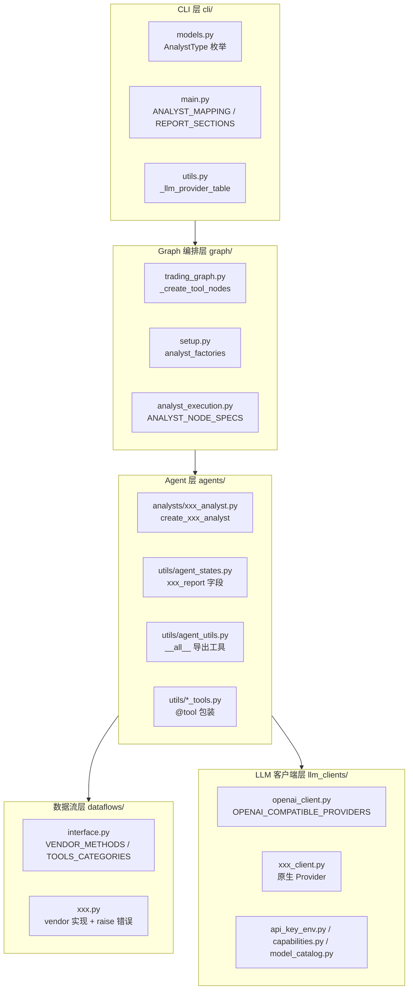
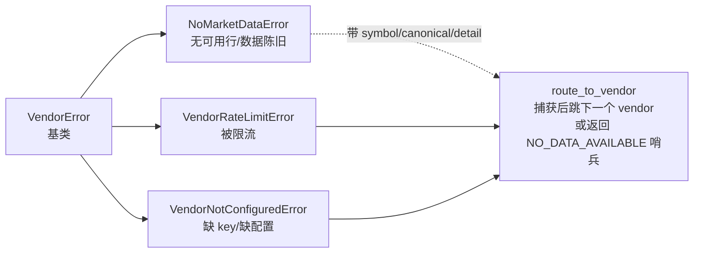
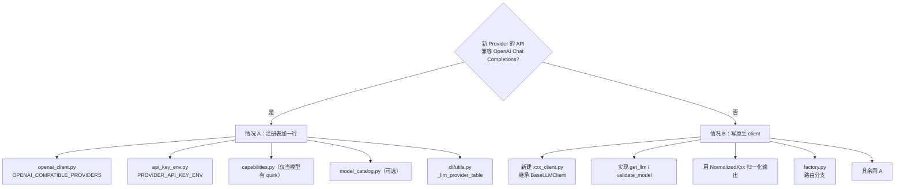

# 扩展指南：新增 Analyst / Data Vendor / LLM Provider

> 难度 ⭐⭐⭐（实战贡献） · 面向想二次开发的贡献者 · 预计阅读 40 分钟

## 这篇文章在回答什么

TradingAgents 把"分析师调研 → 多空辩论 → 交易提案 → 风险辩论 → 组合决策"这条投研流水线编码成一张 LangGraph 状态图。要把这套骨架扩展到你自己的数据、模型或分析视角，本质上是在四个维度上做加法：

- **新增 Analyst**：加一个分析视角（技术面 / 情绪面 / 新闻面 / 基本面之外的第五面）。
- **新增 Data Vendor**：给已有数据类别（行情、基本面、新闻等）接一个新的数据源。
- **新增 LLM Provider**：把整个流水线接到另一个 LLM 后端。
- **新增工具函数**：给现有 Analyst 加一个可调用的数据工具。

本文按"动作清单 + 可运行模板 + 注册点"的结构展开，每一条注册点都标注源码位置。读完之后，你应该能不靠猜地完成一次扩展，并知道每一步改动的后果会落到哪个层。

### 阅读前置

- 读过 [系统架构总览](../03-architecture/overview.md)，知道五个子系统的边界。
- 知道 `AnalystNodeSpec` 是 frozen dataclass，字段为 `key / agent_node / clear_node / tool_node / report_key`（位置见 [源码索引](./source-index.md#graph-编排层)）。

### 全局心智模型

四类扩展不是孤立的，它们都最终汇入同一张图。下图把一次"新增 Analyst"涉及的改动按层铺开，其它三类扩展可以对照阅读。



四类扩展的工作量差别很大。新增 LLM Provider 分两种情况，差别是"协议是否兼容 OpenAI Chat Completions"，先判断清楚能省下大半工作量。

---

## 扩展一：新增 Analyst（分析师）

### 设计约束

一个 Analyst 在图里的标准形态由 `AnalystNodeSpec`（`tradingagents/graph/analyst_execution.py:6`）描述：

```python
@dataclass(frozen=True)
class AnalystNodeSpec:
    key: str           # 配置 / 选择键，如 "market"
    agent_node: str    # LangGraph 节点名，如 "Market Analyst"
    clear_node: str    # 消息清理节点名，如 "Msg Clear Market"
    tool_node: str     # 工具节点名，如 "tools_market"
    report_key: str    # state 上的报告字段，如 "market_report"
```

这套结构在 `setup.py:setup_graph` 里被展开成"分析师 → 条件路由 → 工具节点回环 → 清理消息 → 下一个分析师"的链。新增一个 Analyst 的全部动作，都是为了让这张表多出一行，并让那一行在每一层都对得上。

### 完整动作清单（10 步）

| # | 动作 | 文件:位置 | 作用 |
|---|------|----------|------|
| 1 | 新建 `xxx_analyst.py` | `tradingagents/agents/analysts/xxx_analyst.py` | 定义 `create_xxx_analyst(llm)` 和 `xxx_analyst_node(state)` |
| 2 | 注册数据工具（若涉及新数据领域） | `tradingagents/agents/utils/agent_utils.py:29`（`__all__`） | 把工具集中到一个 import 入口 |
| 3 | 新增 ToolNode | `tradingagents/graph/trading_graph.py:188`（`_create_tool_nodes`） | 决定这个 Analyst 能调哪些工具 |
| 4 | 注册 Analyst 映射 | `tradingagents/graph/analyst_execution.py:20`（`ANALYST_NODE_SPECS`） | 加一行 `AnalystNodeSpec` |
| 5 | 加报告字段 | `tradingagents/agents/utils/agent_states.py:47`（`AgentState`） | 在 state 上多一个 `xxx_report` |
| 6 | 加 CLI 枚举 | `cli/models.py:4`（`AnalystType`） | 用户能在菜单里选到 |
| 7 | 加 CLI Analyst 映射 | `cli/main.py:73`（`ANALYST_MAPPING`） | 节点名一致 |
| 8 | 加报告段映射 | `cli/main.py:83`（`REPORT_SECTIONS`） | 报告聚合时认得这一段 |
| 9 | 加报告输出 | `tradingagents/reporting.py:13`（`write_report_tree`） | 写盘多一段 |
| 10 | 加默认选择 | `tradingagents/default_config.py:71`（`DEFAULT_CONFIG`） | 可选：默认开/关 |

### 步骤 1：写 `xxx_analyst.py`（模板）

下面是一个完整、可运行的 Analyst 模板，以 `market_analyst.py` 为蓝本。我们假设新增一个"资金流分析师"（`flow`），只调一个工具 `get_flow_data`。

```python
# tradingagents/agents/analysts/flow_analyst.py

from langchain_core.prompts import ChatPromptTemplate, MessagesPlaceholder

from tradingagents.agents.utils.agent_utils import (
    get_flow_data,                                # 步骤 2 导出的工具
    get_instrument_context_from_state,
    get_language_instruction,
)


def create_flow_analyst(llm):
    """构造资金流分析师节点。llm 通常是 quick_thinking_llm。"""

    def flow_analyst_node(state):
        current_date = state["trade_date"]
        instrument_context = get_instrument_context_from_state(state)

        # 1) 这个 Analyst 能调的工具
        tools = [get_flow_data]

        # 2) 工具说明 + 行为约束。务必写清：
        #    - 工具的正确调用顺序
        #    - 何时算"完成"并写最终报告
        #    - 不要凭空补数值（数据缺失就报告缺失）
        system_message = (
            """You are a trading assistant tasked with analyzing capital flows.
Your role is to ...（具体职责）...

When you call get_flow_data, use the exact ticker from the instrument context.
Do not invent flow numbers; if the tool returns NO_DATA_AVAILABLE, report it
explicitly."""
            + """ Make sure to append a Markdown table at the end of the report."""
            + get_language_instruction()
        )

        # 3) 用 ChatPromptTemplate 拼装 system 消息。
        #    五个占位符（tool_names / current_date / instrument_context / system_message / messages）
        #    在所有 Analyst 之间保持一致——下游 PM、Trader 也按这套字段读。
        prompt = ChatPromptTemplate.from_messages(
            [
                (
                    "system",
                    "You are a helpful AI assistant, collaborating with other assistants."
                    " Use the provided tools to progress towards answering the question."
                    " If you are unable to fully answer, that's OK; another assistant with different tools"
                    " will help where you left off. Execute what you can to make progress."
                    " If you or any other assistant has the FINAL TRANSACTION PROPOSAL: **BUY/HOLD/SELL** or deliverable,"
                    " prefix your response with FINAL TRANSACTION PROPOSAL: **BUY/HOLD/SELL** so the team knows to stop."
                    " You have access to the following tools: {tool_names}."
                    " Today's date is {current_date}; treat it as 'now' for all analysis and tool-call date ranges. {instrument_context}\n"
                    "{system_message}",
                ),
                MessagesPlaceholder(variable_name="messages"),
            ]
        )

        prompt = prompt.partial(system_message=system_message)
        prompt = prompt.partial(tool_names=", ".join([tool.name for tool in tools]))
        prompt = prompt.partial(current_date=current_date)
        prompt = prompt.partial(instrument_context=instrument_context)

        # 4) bind_tools 后串成 chain
        chain = prompt | llm.bind_tools(tools)
        result = chain.invoke(state["messages"])

        # 5) 关键约定：只有当模型没有 tool_calls 时，才把 content 当作"最终报告"。
        #    有 tool_calls 表示模型还在拉数据，下一轮才会回到这个节点。
        report = ""
        if len(result.tool_calls) == 0:
            report = result.content

        # 6) 返回 dict：messages 永远返回，report 只在无 tool_calls 时填充
        return {
            "messages": [result],
            "flow_report": report,
        }

    return flow_analyst_node
```

四个不能省的细节：

- **`if len(result.tool_calls) == 0` 才填 report**：这是"何时算完成"的判断。如果忽略，会把中间步骤误当成最终报告。
- **`get_language_instruction()`**：保证非英文运行时这一段也跟着本地化，否则最终报告会半中半英。
- **`get_instrument_context_from_state(state)`**：把标的真实身份（公司名 / 交易所 / 资产类型）注入 prompt，避免模型看着 K 线脑补成另一家公司（参见 `agent_utils.py` 里关于 #814 的注释）。
- **prompt 里那句 `FINAL TRANSACTION PROPOSAL` 前缀约定**：是整张图判断"是否收尾"的信号，删了会破坏下游 Research Manager 的解析。

### 步骤 3：在 `_create_tool_nodes` 加一行

```python
# tradingagents/graph/trading_graph.py:188
def _create_tool_nodes(self) -> dict[str, ToolNode]:
    return {
        "market": ToolNode([get_stock_data, get_indicators, get_verified_market_snapshot]),
        "social": ToolNode([get_news]),
        "news": ToolNode([get_news, get_global_news, get_insider_transactions,
                          get_macro_indicators, get_prediction_markets]),
        "fundamentals": ToolNode([get_fundamentals, get_balance_sheet, get_cashflow,
                                  get_income_statement]),
        # 新增 ↓
        "flow": ToolNode([get_flow_data]),
    }
```

`ToolNode` 是 langgraph 提供的节点，它接收一个工具列表。这里的 key（`"flow"`）要和下一步的 `AnalystNodeSpec.key` 严格一致。

### 步骤 4：在 `ANALYST_NODE_SPECS` 加一行

```python
# tradingagents/graph/analyst_execution.py:20
ANALYST_NODE_SPECS: dict[str, AnalystNodeSpec] = {
    "market":       AnalystNodeSpec(key="market",       agent_node="Market Analyst",
                                    clear_node="Msg Clear Market",       tool_node="tools_market",
                                    report_key="market_report"),
    "social":       AnalystNodeSpec(key="social",       agent_node="Sentiment Analyst",
                                    clear_node="Msg Clear Sentiment",    tool_node="tools_social",
                                    report_key="sentiment_report"),
    "news":         AnalystNodeSpec(key="news",         agent_node="News Analyst",
                                    clear_node="Msg Clear News",         tool_node="tools_news",
                                    report_key="news_report"),
    "fundamentals": AnalystNodeSpec(key="fundamentals", agent_node="Fundamentals Analyst",
                                    clear_node="Msg Clear Fundamentals", tool_node="tools_fundamentals",
                                    report_key="fundamentals_report"),
    # 新增 ↓
    "flow":         AnalystNodeSpec(key="flow",         agent_node="Flow Analyst",
                                    clear_node="Msg Clear Flow",         tool_node="tools_flow",
                                    report_key="flow_report"),
}
```

五个字段必须全填，并且 `tool_node` 的值（`"tools_flow"`）要和 `setup.py` 里 `workflow.add_node(spec.tool_node, self.tool_nodes[spec.key])` 自动拼出来的节点名对得上——它是 `spec.tool_node` 字段的值（约定写成 `tools_{key}`）。

### 步骤 5：在 `AgentState` 加字段

```python
# tradingagents/agents/utils/agent_states.py:47
class AgentState(MessagesState):
    ...
    market_report: Annotated[str, "Report from the Market Analyst"]
    sentiment_report: Annotated[str, "Report from the Sentiment Analyst"]
    news_report: Annotated[str, "Report from the News Researcher"]
    fundamentals_report: Annotated[str, "Report from the Fundamentals Researcher"]
    flow_report: Annotated[str, "Report from the Flow Analyst"]   # 新增
    ...
```

`setup.py:setup_graph` 里有一步 `analyst_factories = {"market": ..., "flow": lambda: create_flow_analyst(self.quick_thinking_llm)}`，记得同步加上，否则图建到这一步会 KeyError。

### 步骤 6-8：CLI 三件套

```python
# cli/models.py:4
class AnalystType(str, Enum):
    MARKET = "market"
    SOCIAL = "social"
    NEWS = "news"
    FUNDAMENTALS = "fundamentals"
    FLOW = "flow"   # 新增
```

```python
# cli/main.py:73
ANALYST_MAPPING = {
    "market": "Market Analyst",
    "social": "Sentiment Analyst",
    "news": "News Analyst",
    "fundamentals": "Fundamentals Analyst",
    "flow": "Flow Analyst",   # 新增，值要和 AnalystNodeSpec.agent_node 完全一致
}
```

```python
# cli/main.py:83
REPORT_SECTIONS = {
    "market_report":            ("market",       "Market Analyst"),
    "sentiment_report":         ("social",       "Sentiment Analyst"),
    "news_report":              ("news",         "News Analyst"),
    "fundamentals_report":      ("fundamentals", "Fundamentals Analyst"),
    "flow_report":              ("flow",         "Flow Analyst"),   # 新增
    "investment_plan":          (None,           "Research Manager"),
    "trader_investment_plan":   (None,           "Trader"),
    "final_trade_decision":     (None,           "Portfolio Manager"),
}
```

`REPORT_SECTIONS` 的语义：`(analyst_key, finalizing_agent)`。`analyst_key=None` 表示这一段不依赖任何可选 Analyst（永远出现）。第一项填我们刚加的 `"flow"`，CLI 才知道这一段在用户没选 Flow Analyst 时不显示。

### 步骤 9：在 `write_report_tree` 加输出

```python
# tradingagents/reporting.py:13，在 analyst_parts 收集段加
if final_state.get("flow_report"):
    analysts_dir.mkdir(exist_ok=True)
    (analysts_dir / "flow.md").write_text(final_state["flow_report"], encoding="utf-8")
    analyst_parts.append(("Flow Analyst", final_state["flow_report"]))
```

这一步保证 CLI 和编程式 API（`TradingAgentsGraph.save_reports`）写出同一份盘上报告（参见 [测试体系](./testing.md) 里 #1037 的回归测试）。

### 步骤 10（可选）：默认配置

如果希望默认开启，把 `DEFAULT_CONFIG` 里某个对应的字段（如默认 `selected_analysts`，目前是 `TradingAgentsGraph.__init__` 的参数，没进 DEFAULT_CONFIG）调整即可。一般情况留空，让用户在 CLI 选。

### 容易漏的两处

- **`conditional_logic` 不需要改**：每个 Analyst 的"是否收尾"条件路由是 `getattr(self.conditional_logic, f"should_continue_{spec.key}")`（`setup.py:126`），所以要在 `ConditionalLogic` 类里加一个 `should_continue_flow` 方法，逻辑照抄 `should_continue_market` 即可。
- **`__init__.py` 导出**：`tradingagents/agents/__init__.py` 要导出 `create_flow_analyst`，否则 `setup.py` 顶部的 `from tradingagents.agents import (...)` 会失败。

### 自检清单

- [ ] 选了 Flow Analyst 跑一次，最终报告里有 `flow.md`。
- [ ] 不选 Flow Analyst 跑一次，`complete_report.md` 里没有 Flow Analyst 段。
- [ ] `pytest tests/test_analyst_execution.py` 通过（它校验 `ANALYST_NODE_SPECS` 的完整性）。
- [ ] 跑一次 `pytest -m unit`，确认没有 import 报错。

---

## 扩展二：新增 Data Vendor（数据供应商）

### 设计约束

数据流的中央调度在 `tradingagents/dataflows/interface.py`。三个表共同决定一次工具调用的去向：

- `TOOLS_CATEGORIES`（`interface.py:36`）：方法 → 类别。
- `VENDOR_METHODS`（`interface.py:95`）：方法 → {vendor_name → impl}。
- `OPTIONAL_CATEGORIES`（`interface.py:92`）：哪些类别的失败可以优雅降级，而不是炸掉整次运行。

数据流向是单向的：**工具函数 → `route_to_vendor` → vendor 实现**。`route_to_vendor`（`interface.py:168`）负责按配置选 vendor 链、捕获 vendor 抛出的分类异常、决定降级还是上抛。

### 错误体系（必须遵守）

新 vendor 实现必须按 `tradingagents/dataflows/errors.py` 的体系抛错。这套异常树把"vendor 为什么失败"映射成"路由器该怎么反应"：



三种异常对应三种路由反应：

| 异常 | 含义 | 路由器反应 |
|------|------|-----------|
| `NoMarketDataError` | 该 vendor 没数据（空结果 / 数据陈旧） | 跳下一个 vendor；都失败则返回 `NO_DATA_AVAILABLE:` 哨兵字符串 |
| `VendorRateLimitError` | 被 vendor 限流（429） | 跳下一个 vendor |
| `VendorNotConfiguredError` | 缺 API key 或配置 | 跳下一个 vendor；若所有 vendor 都失败，把这个错上抛 |

`NoMarketDataError` 必须带 `symbol`、`canonical`、`detail` 三参（`errors.py:34`），它们会被拼进 `NO_DATA_AVAILABLE:` 哨兵字符串，让 LLM 看清"为什么没数据"，而不是凭空补一个值。

### 完整动作清单（5 步）

| # | 动作 | 文件:位置 |
|---|------|----------|
| 1 | 实现 vendor 函数 | `tradingagents/dataflows/xxx.py`（新文件） |
| 2 | 注册到 `VENDOR_METHODS` | `tradingagents/dataflows/interface.py:95` |
| 3 | 加默认配置 | `tradingagents/default_config.py:133`（`data_vendors`） |
| 4 | 加分类（如果是新数据类别） | `tradingagents/dataflows/interface.py:36`（`TOOLS_CATEGORIES`），酌情加 `OPTIONAL_CATEGORIES` |
| 5 | 写工具函数 | `tradingagents/agents/utils/*_tools.py`（用 `@tool` 包装） |

### 步骤 1：写 vendor 实现（模板）

假设我们要给 `core_stock_apis` 类别新增一个 vendor `acme`。下面是必须满足的最小形态：

```python
# tradingagents/dataflows/acme.py

import logging
import os

import requests

from .errors import (
    NoMarketDataError,
    VendorNotConfiguredError,
    VendorRateLimitError,
)

logger = logging.getLogger(__name__)
ACME_BASE = "https://api.acme.example.com/v1"
REQUEST_TIMEOUT = 30


def _require_key() -> str:
    """读 key，缺则抛 VendorNotConfiguredError——不要返回空串让上游误判。"""
    key = os.environ.get("ACME_API_KEY")
    if not key:
        raise VendorNotConfiguredError(
            "ACME_API_KEY not set; add it to your .env to use the acme vendor"
        )
    return key


def get_stock(symbol: str, *args, **kwargs) -> str:
    """ACME 的 OHLCV 实现，签名要和该 method 下其它 vendor 一致。

    route_to_vendor 用位置/关键字透传调用，所以参数列表必须能被
    "get_stock_data(ticker, ...)" 这一调用形态匹配上。
    """
    key = _require_key()
    try:
        resp = requests.get(
            f"{ACME_BASE}/ohlc",
            params={"symbol": symbol, "apikey": key},
            timeout=REQUEST_TIMEOUT,
        )
    except requests.RequestException as exc:
        # 网络层错误不要伪装成 NoMarketData——它不是"没数据"，是"没拿到"
        raise VendorRateLimitError(f"ACME unreachable: {exc}") from exc

    if resp.status_code == 429:
        raise VendorRateLimitError("ACME rate-limited")
    if resp.status_code in (401, 403):
        raise VendorNotConfiguredError(f"ACME auth failed: {resp.status_code}")
    resp.raise_for_status()

    rows = resp.json().get("rows") or []
    if not rows:
        # 必须传 symbol / canonical / detail，让哨兵字符串能解释原因
        raise NoMarketDataError(
            symbol=symbol,
            canonical=symbol,            # 如果做了 normalize，传归一化后的 ticker
            detail="ACME returned no rows for this symbol",
        )

    # 把行格式化成 LLM 能直接读的字符串
    return _format_rows(symbol, rows)
```

四个常被忽略的强约束：

- **签名对齐**：同一个 `method` 下所有 vendor 实现的参数列表要兼容。`route_to_vendor(method, *args, **kwargs)` 是透传，参数对不上会在调用时炸。
- **缺 key 抛 `VendorNotConfiguredError`**：不要返回空串或 `None`。空串会被当成"成功但没数据"，污染下游。
- **空结果抛 `NoMarketDataError`**：且 `detail` 要写清是"未覆盖"还是"已退市"还是"日期范围之外"，让哨兵字符串能传递这个信息。
- **限流抛 `VendorRateLimitError`**：网络异常也归到这里（如果适合），让路由器去试下一个 vendor。

### 步骤 2：注册到 `VENDOR_METHODS`

```python
# tradingagents/dataflows/interface.py:95
"get_stock_data": {
    "alpha_vantage": get_alpha_vantage_stock,
    "yfinance":      get_YFin_data_online,
    "acme":          get_acme_stock,   # 新增
},
```

key 是 vendor 名（要和 `default_config.py:data_vendors` 里的字符串一致），value 是函数引用。

### 步骤 3：加默认配置

`data_vendors` 是 category 级配置（覆盖一类工具的默认 vendor），`tool_vendors` 是 method 级配置（更细，优先级更高）。一般只在 `data_vendors` 里把新 vendor 列为可选即可，不改默认：

```python
# tradingagents/default_config.py:133
"data_vendors": {
    "core_stock_apis":      "yfinance",   # Options: alpha_vantage, yfinance, acme
    "technical_indicators": "yfinance",
    ...
},
```

要让用户能写多 vendor 链路 fallback，例如 `"yfinance,acme"`，不需要额外代码——`route_to_vendor` 已经按逗号拆分（`interface.py:172`）。但要注意：**配置里没列的 vendor 不会被静默 fallback**，这是 #988/#289 的明确设计，避免数据来源不可控。

### 步骤 4（仅新类别）：加 `TOOLS_CATEGORIES` 和 `OPTIONAL_CATEGORIES`

如果是给一个全新的数据类别（不是给现有类别加 vendor），需要：

1. 在 `TOOLS_CATEGORIES` 加一项：

```python
# tradingagents/dataflows/interface.py:36
"flow_data": {
    "description": "Capital flow / fund flow data",
    "tools": ["get_flow_data"],
},
```

2. 判断是否进 `OPTIONAL_CATEGORIES`：

```python
OPTIONAL_CATEGORIES = {"macro_data", "prediction_markets"}   # 风味数据
```

判定标准写在 `interface.py:87-92` 的注释里：**核心数据（价格、基本面、新闻）失败必须 loud fail；风味数据（宏观、预测市场、资金流等补充信息）失败降级为哨兵字符串**。新增类别按"它缺失是否会让投资结论变得不可信"来选。

### 步骤 5：写工具函数（`@tool`）

工具函数是 LLM 看到的接口，是 `route_to_vendor` 的薄包装。模板参考 `news_data_tools.py`：

```python
# tradingagents/agents/utils/flow_data_tools.py

from typing import Annotated
from langchain_core.tools import tool
from tradingagents.dataflows.interface import route_to_vendor


@tool
def get_flow_data(
    ticker: Annotated[str, "Ticker symbol"],
    curr_date: Annotated[str, "Current date in yyyy-mm-dd format"],
) -> str:
    """Retrieve capital flow data for a given ticker symbol.

    Uses the configured flow_data vendor.
    """
    return route_to_vendor("get_flow_data", ticker, curr_date)
```

然后在 `agent_utils.py:29` 的 `__all__` 里加上 `get_flow_data`，并 import 它。这步等于"把工具登记到统一入口"，Agent 和 `trading_graph.py` 都从这里 import。

### 自检清单

- [ ] 不设 `ACME_API_KEY` 跑一次：得到 `VendorNotConfiguredError`，日志里能看到。
- [ ] 设错 ticker（如 `XYZNOTREAL`）：得到 `NO_DATA_AVAILABLE:` 哨兵字符串，LLM 在报告里说"数据不可用"而不是瞎编。
- [ ] 在 `data_vendors` 配 `"yfinance,acme"`，故意让 yfinance 失败：路由器跳到 acme。
- [ ] `pytest tests/test_vendor_routing.py tests/test_vendor_errors.py` 通过。

---

## 扩展三：新增 LLM Provider

### 先判断属于哪种情况



OpenAI Chat Completions 协议覆盖了大部分商业模型（OpenAI、xAI、DeepSeek、Qwen、GLM、MiniMax、OpenRouter、Mistral、Kimi、Groq、NVIDIA、Ollama、vLLM/LM Studio 等）。判断依据很简单：**看官方文档有没有 "OpenAI-compatible endpoint"**。如果有，走情况 A，工作量大概 10 分钟；如果协议真的不一样（比如 Anthropic、Google、Bedrock、Azure），走情况 B。

### 情况 A：OpenAI-compatible（最常见）

整个适配过程是"加几行声明"，核心是 `ProviderSpec`（`openai_client.py:183`）：

```python
@dataclass(frozen=True)
class ProviderSpec:
    chat_class: type = NormalizedChatOpenAI   # provider 特例的子类
    base_url: str | None = None               # 默认 endpoint
    base_url_env: str | None = None           # 覆盖 base_url 的 env（如 OLLAMA_BASE_URL）
    key_optional: bool = False                # 不强制 key（如本地 server）
    placeholder_key: str = "EMPTY"            # keyless 时发送的占位
    require_base_url: bool = False            # 没指定 base_url 就报错（通用 endpoint）
    use_responses_api: bool = False           # 是否走 OpenAI 的 Responses API
```

#### 动作清单

| # | 动作 | 文件:位置 | 何时需要 |
|---|------|----------|---------|
| 1 | 加 `ProviderSpec` | `openai_client.py:212`（`OPENAI_COMPATIBLE_PROVIDERS`） | 必做 |
| 2 | 加 key 映射 | `api_key_env.py:14`（`PROVIDER_API_KEY_ENV`） | 有 key 就必做 |
| 3 | 加能力条目 | `capabilities.py:94`（`_BY_ID` 或 `_BY_PATTERN`） | 模型有 quirk 时 |
| 4 | 加模型列表 | `model_catalog.py` | 想让 CLI 菜单列出模型 |
| 5 | 加 CLI 选项 | `cli/utils.py:338`（`_llm_provider_table`） | 必做 |

#### 模板：标准 OpenAI-compatible

假设接入一个虚构的 OpenAI-compatible provider `acme`：

```python
# openai_client.py:212
OPENAI_COMPATIBLE_PROVIDERS: dict[str, ProviderSpec] = {
    ...
    "acme": ProviderSpec(base_url="https://api.acme.example.com/v1"),
}
```

```python
# api_key_env.py:14
PROVIDER_API_KEY_ENV = {
    ...
    "acme": "ACME_API_KEY",
}
```

```python
# cli/utils.py:338
return [
    ...
    ("Acme", "acme", "https://api.acme.example.com/v1"),
]
```

就这三处。`OpenAIClient.get_llm`（`openai_client.py:276`）会自动读 spec、解析 key、构造 `NormalizedChatOpenAI`。

#### 模型有 quirk 时：加 `chat_class` 子类 + 能力条目

quirk 的典型例子是 DeepSeek 的 thinking 模型（拒绝 `tool_choice` 参数、需要回传 `reasoning_content`）和 MiniMax 的 M2.x（`tool_choice` 只接受 enum、需要 `reasoning_split=True`）。处理方式分两层：

- **能力表**（`capabilities.py`）：声明"这个模型拒绝什么、偏好哪种 structured-output 方法"。客户端在读到 `function_calling` 时，会查表决定要不要发 `tool_choice`（`openai_client.py:38-51`）。
- **子类**：如果 quirk 在请求/响应层（比如要在 `_get_request_payload` 里改 body），写一个 `NormalizedChatOpenAI` 的子类，在 `ProviderSpec.chat_class` 里指定。

加 quirk 的模板：

```python
# capabilities.py:94
_BY_ID: dict[str, ModelCapabilities] = {
    ...
    "acme-thinker-1": ModelCapabilities(
        supports_tool_choice=False,        # 拒绝 tool_choice
        supports_json_mode=True,
        supports_json_schema=False,
        preferred_structured_method="function_calling",
        # requires_reasoning_content_roundtrip=True,   # 仅当模型要求回传 reasoning
        # requires_reasoning_split=True,               # 仅当模型需要 reasoning_split
    ),
}

# 同时可以加一条前向兼容 pattern，让 acme-thinker-2 也自动继承
_BY_PATTERN: list[tuple[re.Pattern[str], ModelCapabilities]] = [
    ...
    (re.compile(r"^acme-thinker"), _ACME_THINKING),
]
```

前向兼容 pattern 的好处：以后 `acme-thinker-2`、`acme-thinker-3` 出来不用改代码，自动继承同一套行为。这是 `capabilities.py` 模块注释里强调的设计意图——"加新模型或 quirk = 改表，不是改客户端代码"。

### 情况 B：原生 API Provider（协议不同）

参考 `anthropic_client.py` / `google_client.py` / `bedrock_client.py` / `azure_client.py`。下面以接入 Anthropic 风格的虚构 provider 为例。

#### 动作清单

| # | 动作 | 文件 |
|---|------|------|
| 1 | 新建 `xxx_client.py` | `tradingagents/llm_clients/acme_client.py` |
| 2 | 实现 `get_llm` / `validate_model` | 同上 |
| 3 | 用 `NormalizedXxx` 归一化输出 | 同上 |
| 4 | 在 `factory.py` 加路由 | `tradingagents/llm_clients/factory.py:29` |
| 5 | 其余同情况 A | `api_key_env.py` / `model_catalog.py` / `cli/utils.py` |

#### 模板

```python
# tradingagents/llm_clients/acme_client.py

from typing import Any

from langchain_acme import ChatAcme   # 假设有官方 langchain 适配

from .base_client import BaseLLMClient, normalize_content
from .validators import validate_model


class NormalizedChatAcme(ChatAcme):
    """所有原生 provider 都要做这一步归一化。

    多个 provider（OpenAI Responses、Gemini 3、带 thinking 的 Anthropic）
    返回的 content 是 typed block 列表，但下游 Agent 期望 content 是 str。
    normalize_content 把 text block 拼起来，丢弃 reasoning/metadata block。
    """

    def invoke(self, input, config=None, **kwargs):
        return normalize_content(super().invoke(input, config, **kwargs))


class AcmeClient(BaseLLMClient):
    """Client for Acme models."""

    def __init__(self, model: str, base_url: str | None = None, **kwargs):
        super().__init__(model, base_url, **kwargs)

    def get_llm(self) -> Any:
        self.warn_if_unknown_model()
        llm_kwargs = {"model": self.model}

        if self.base_url:
            llm_kwargs["base_url"] = self.base_url

        # 显式白名单透传字段，避免无意中传了 provider 不认的 kwarg
        for key in ("timeout", "max_retries", "api_key", "temperature", "callbacks"):
            if key in self.kwargs:
                llm_kwargs[key] = self.kwargs[key]

        return NormalizedChatAcme(**llm_kwargs)

    def validate_model(self) -> bool:
        return validate_model("acme", self.model)
```

`factory.py` 路由放在 OpenAI 兼容分支**之前**（`factory.py:34-48`），因为原生分支靠字符串精确匹配：

```python
# factory.py:29
provider_lower = provider.lower()

if provider_lower == "acme":
    from .acme_client import AcmeClient
    return AcmeClient(model, base_url, **kwargs)

# 以下是原生分支的现有写法
if provider_lower == "anthropic":
    ...
```

四个不能省的细节：

- **`normalize_content` 必须调**：不同 provider 的 `content` 字段类型不一致，归一化为 str 是下游 Agent 正常工作的前提（`base_client.py:6` 的注释把原因说清了）。
- **白名单透传**：`_PASSTHROUGH_KWARGS` 这种白名单写法是为了避免把 `reasoning_effort` 这种 OpenAI-only 的参数透传给不认它的 provider，导致 400。
- **lazy import**：`factory.py` 用函数内 import 是有意的——`from .anthropic_client import AnthropicClient` 写在函数内，这样"只是 import 工厂"（比如测试收集阶段）不会拉起重型 LLM SDK，也不会因为缺 key 而失败（`factory.py:12-18` 的注释）。
- **lazy import 的副作用**：每次 `create_llm_client` 调用都会重复 import，但 Python 的模块缓存让这几乎没成本。

### 通用最后一步：CLI 表

无论情况 A 还是 B，都要在 `_llm_provider_table`（`cli/utils.py:338`）里加一行，否则用户在交互式菜单里选不到。三元组是 `(display_name, provider_key, default_base_url)`：

```python
("Acme", "acme", "https://api.acme.example.com/v1"),
```

`provider_key` 必须和 `factory.py` / `OPENAI_COMPATIBLE_PROVIDERS` / `PROVIDER_API_KEY_ENV` 里的 key 完全一致（区分大小写）。

### 自检清单

- [ ] 不设 key 跑：CLI 提示 `ACME_API_KEY` 没设（说明 `api_key_env.py` 注册成功）。
- [ ] 设错 key 跑：得到清晰的认证失败，而不是静默 fallback。
- [ ] `pytest tests/test_provider_registry.py tests/test_api_key_env.py` 通过。
- [ ] 模型有 quirk 时，`pytest tests/test_capabilities.py` 通过。

---

## 扩展四：新增工具函数（最轻量）

如果只是给已有 Analyst 加一个数据工具，不需要改图，只是写一个 `@tool` 函数。完整动作只有两步，参考 `news_data_tools.py:8`：

```python
# tradingagents/agents/utils/xxx_tools.py

from typing import Annotated
from langchain_core.tools import tool
from tradingagents.dataflows.interface import route_to_vendor


@tool
def get_xxx(
    ticker: Annotated[str, "Ticker symbol"],
    curr_date: Annotated[str, "Current date in yyyy-mm-dd format"],
) -> str:
    """One-line description: what this tool returns and how to use it.

    LLM 会读这个 docstring 决定何时调用，所以要写清"调它能拿到什么"
    和"参数应该填什么"。
    """
    return route_to_vendor("get_xxx", ticker, curr_date)
```

两步：

1. 把上面的文件放进 `tradingagents/agents/utils/`，命名约定是 `<domain>_tools.py`（已有 `core_stock_tools.py` / `fundamental_data_tools.py` / `news_data_tools.py` 等）。
2. 在 `agent_utils.py:29` 的 `__all__` 里加 `"get_xxx"`，并在文件顶部 import 它。

然后在 `_create_tool_nodes`（`trading_graph.py:188`）里把 `get_xxx` 加到对应 Analyst 的 `ToolNode` 列表里。

> 注意：如果 `route_to_vendor("get_xxx", ...)` 找不到对应的 method，会抛 `ValueError: Method 'get_xxx' not supported`。所以新增工具通常和新增 vendor 实现一起做——先在 `VENDOR_METHODS` 里登记至少一个 vendor 实现，工具函数才有意义。

---

## 何时需要重建图

图的形状由 `selected_analysts` 决定（`setup.py:setup_graph` 会按这个参数动态连边）。`TradingAgentsGraph.__init__` 在构造时编译一次图，之后 `propagate` 直接复用。下面两类改动需要重新建图：

- **增删 Analyst 类型**：图的节点和边会变。
- **修改 `AnalystNodeSpec` 的五个字段**：节点名变了，图也得重建。

只是改 Analyst 的 prompt 或工具列表（不改节点名）不需要重建图。Checkpointer 的 thread_id 里编码了 `_run_signature`（`trading_graph.py:348`），它把 `selected_analysts / debate / risk / asset` 拼成签名，所以换分析师组合会让旧 checkpoint 失效，自动从头跑（#1089）。

---

## 提交前的回归测试

四类扩展各自有对应的回归测试，改完先跑这几组：

```bash
# Analyst 扩展
pytest tests/test_analyst_execution.py tests/test_structured_agents.py

# Vendor 扩展
pytest tests/test_vendor_routing.py tests/test_vendor_errors.py tests/test_no_data_handling.py

# Provider 扩展
pytest tests/test_provider_registry.py tests/test_api_key_env.py tests/test_capabilities.py

# 全量快速过一遍（不调真实 API）
pytest -m unit
```

测试的设计原则见 [测试体系](./testing.md)。新加的扩展建议补一两个 unit 测试，模板照抄现有同主题的测试文件头 docstring（很多测试文件顶部写了"修复 issue #XXX"）。

---

## 下一步

- 想知道改完怎么验证：[测试体系](./testing.md)。
- 想快速定位某个函数的源码位置：[源码索引](./source-index.md)。
- 想理解为什么是这套架构：[系统架构总览](../03-architecture/overview.md)。
- 想理解每个设计决策的动机：[设计哲学](../03-architecture/design-philosophy.md)。
