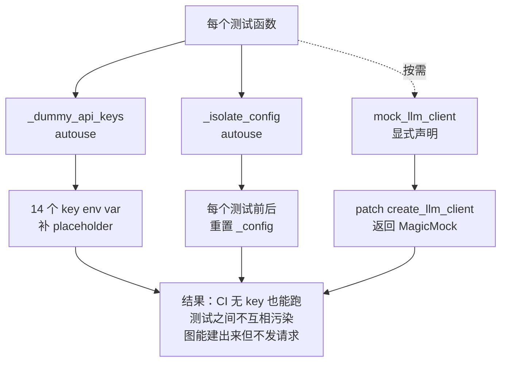

# 测试体系

> 难度 ⭐⭐（实战贡献） · 面向想跑测试、补测试、读懂现有测试的贡献者 · 预计阅读 20 分钟

## 这篇文章在回答什么

TradingAgents 的测试套件有 71 个测试文件，但它们要回答的核心问题只有一个：**在没有真实 API key 和网络的情况下，怎么验证这套接了十几个外部服务的多 Agent 系统仍然是对的？**

读完这篇，你应该能回答：

- 默认 `pytest` 跑了哪些测试、跑了多少。
- 三个 fixture（`_dummy_api_keys` / `_isolate_config` / `mock_llm_client`）各自解决什么问题。
- 一个新加的扩展该跑哪几组测试、该往哪个测试文件里加用例。
- 为什么没有端到端集成测试，以及怎么手动补这一层验证。

### 核心策略：纯单元测试为主

整套测试套件以**纯单元测试**为主，全部用 mock LLM 和 mock 网络实现。`pytest -m unit` 能跑通绝大多数用例（59 个文件标注了 `unit` marker），不依赖任何真实 API key 或网络。这一选择背后的考虑是：

- 多 Agent 系统的 bug 大部分在**控制流**（路由、状态字段、错误处理、消息清理），不在 LLM 输出本身。
- 真实 API 调用不可复现、贵、慢，不适合放在每次提交都跑的 CI 里。
- LLM 行为需要单独的评测（eval），不该和数据流的回归测试混在一起。

唯一标了 `integration` marker 的是 `test_deepseek_reasoning.py:192` 的一个用例，它需要真实 DeepSeek API 来回，默认不在 CI 里跑。

---

## 测试组织：71 个文件按主题分组

| 主题 | 代表文件 | 覆盖内容 |
|------|---------|---------|
| 记忆系统 | `test_memory_log.py`（最大，871 行）、`test_memory_log_edge_cases.py` | `TradingMemoryLog` 全部路径：存储、延迟反思、PM 注入、轮换、边界情况 |
| CLI | `test_cli_env_skip.py`、`test_cli_config_precedence.py`、`test_cli_symbol_handling.py`、`test_ticker_symbol_handling.py`、`test_symbol_normalization_paths.py`、`test_symbol_utils.py` | env 驱动跳过交互、配置优先级、ticker 解析与归一化 |
| 报告 | `test_reporting.py`、`test_report_tree_branches.py` | CLI 与编程式 API 报告一致（#1037）、报告树分支覆盖 |
| LLM Provider | `test_provider_registry.py`、`test_openai_compatible_provider.py`、`test_openrouter_model_select.py`、`test_bedrock_provider.py`、`test_deepseek_reasoning.py`、`test_anthropic_effort.py`、`test_google_api_key.py`、`test_google_thinking_level.py`、`test_minimax.py`、`test_ollama_base_url.py`、`test_openai_responses_base_url.py`、`test_openai_reasoning_effort.py`、`test_capabilities.py`、`test_model_validation.py`、`test_openai_client_unit.py`、`test_anthropic_client_unit.py`、`test_base_client.py`、`test_llm_factory.py`、`test_llm_validators.py` | 20 个 provider 的注册、能力表、base_url 解析、key 处理、客户端归一化 |
| 数据流 | `test_vendor_routing.py`、`test_vendor_errors.py`、`test_alpha_vantage_hardening.py`、`test_alpha_vantage_common.py`、`test_alpha_vantage_indicator.py`、`test_alpha_vantage_news.py`、`test_alpha_vantage_stock.py`、`test_fred.py`、`test_fred_unit.py`、`test_polymarket.py`、`test_polymarket_unit.py`、`test_reddit_fallback.py`、`test_stocktwits_resilience.py`、`test_yfinance_stale_ohlcv_guard.py`、`test_yfinance_news_unit.py`、`test_stockstats_helpers.py`、`test_technical_indicators_tool.py`、`test_market_data_validator.py`、`test_no_data_handling.py`、`test_safe_ticker_component.py` | vendor 路由、错误体系、各家 vendor 的边界情况 |
| 图与 Agent | `test_structured_agents.py`、`test_analyst_execution.py`、`test_risk_router_path_map.py`、`test_checkpoint_resume.py`、`test_checkpointer_unit.py`、`test_conditional_logic_routers.py`、`test_propagation_unit.py`、`test_signal_processing.py`、`test_market_toolnode.py`、`test_news_analyst_prompt.py`、`test_instrument_identity.py`、`test_instrument_context.py` | 图的形状、Agent 结构化输出、风险辩论路由、断点续跑、条件路由、身份解析 |
| 配置 | `test_env_overrides.py`、`test_api_key_env.py`、`test_dataflows_config.py`、`test_temperature_config.py`、`test_llm_max_retries.py` | env 覆盖、key 映射、配置合并语义、provider 参数透传 |
| 数据正确性 | `test_date_boundaries.py`、`test_news_lookahead.py`、`test_stockstats_date_column.py`、`test_crypto_asset_mode.py`、`test_i18n_coverage.py` | 前视偏差防护、日期边界、加密资产模式、i18n |

### Issue 编号驱动的回归测试

约 30 个测试文件在 docstring 里直接标注了它们修复的 GitHub issue 编号。例如：

```python
# tests/test_reporting.py
"""Report parity: the shared writer produces the report tree for the CLI and the
programmatic API alike (#1037)."""

# tests/test_cli_env_skip.py
"""Tests for env-driven CLI behavior (#897, #873)."""
```

涉及到的 issue 包括 #897 / #976 / #977 / #978 / #1037 / #1088 / #1089 等。补新扩展时，如果修了某个 issue 或防某种回归，按这个约定在 docstring 里标出来——后续读代码的人能直接定位到当时的讨论。

---

## 三个核心 fixture（`conftest.py`）

`tests/conftest.py` 只有 67 行，但定义了三个 fixture，决定了整套测试能不能在 CI 里跑起来。理解它们的作用是写新测试的前提。

### fixture 1：`pytest_configure` —— 注册 marker

```python
# tests/conftest.py:9
def pytest_configure(config):
    for marker in ("unit", "integration", "smoke"):
        config.addinivalue_line("markers", f"{marker}: {marker}-level tests")
```

注册 `unit` / `integration` / `smoke` 三个 marker。`pyproject.toml` 里 `addopts = "-ra --strict-markers"` 会拒绝未注册的 marker，所以这一步是 marker 能用的前提。

### fixture 2：`_dummy_api_keys`（autouse）—— 防 CI 无 key 卡住

```python
# tests/conftest.py:32
@pytest.fixture(autouse=True)
def _dummy_api_keys(monkeypatch):
    for env_var in _API_KEY_ENV_VARS:
        # `or` 不是 .get 默认值：env var 存在但为空（比如 .env 里留空）也要补 placeholder
        monkeypatch.setenv(env_var, os.environ.get(env_var) or "placeholder")
```

给 14 个 API key env var（`OPENAI_API_KEY` / `GOOGLE_API_KEY` / `ANTHROPIC_API_KEY` / `XAI_API_KEY` / `DEEPSEEK_API_KEY` / `DASHSCOPE_API_KEY` / `DASHSCOPE_CN_API_KEY` / `ZHIPU_API_KEY` / `ZHIPU_CN_API_KEY` / `MINIMAX_API_KEY` / `MINIMAX_CN_API_KEY` / `OPENROUTER_API_KEY` / `AZURE_OPENAI_API_KEY` / `ALPHA_VANTAGE_API_KEY`）设 placeholder。

`autouse=True` 表示所有测试都自动套用。它解决的问题是：客户端在构造时会校验 key 是否存在（如 `openai_client.py:309`），CI 里没 key 就会直接 raise，让所有测试卡在 fixture 阶段。用 placeholder 而不是真 key，保证不会真的发出请求。

注释里特意强调"`or` 不是 `.get` 默认值"——因为 `.env` 文件里可能留了空值（`OPENAI_API_KEY=`），这种情况 `os.environ.get` 返回空串，依然要补 placeholder。

### fixture 3：`_isolate_config`（autouse）—— 配置隔离

```python
# tests/conftest.py:40
@pytest.fixture(autouse=True)
def _isolate_config():
    """Reset the global dataflows config before and after each test.

    set_config merges (it never clears keys absent from the override), so a
    test that sets e.g. tool_vendors would otherwise leak into later tests and
    make routing behavior order-dependent. Replace the global outright so every
    test starts from a clean DEFAULT_CONFIG.
    """
    import copy
    import tradingagents.dataflows.config as config_module
    import tradingagents.default_config as default_config
    config_module._config = copy.deepcopy(default_config.DEFAULT_CONFIG)
    yield
    config_module._config = copy.deepcopy(default_config.DEFAULT_CONFIG)
```

每个测试**前后**都把全局 `dataflows.config._config` 重置成 `DEFAULT_CONFIG` 的 deepcopy。

为什么必须这么做（注释里说清了）：`set_config` 是**合并语义**——它不会清掉 override 里没有的 key。如果一个测试改了 `tool_vendors`，下一个测试如果不显式重置就会继承这个改动，导致**测试顺序敏感**。直接覆盖整个 `_config` 而不是用 `set_config`，是因为合并语义在测试隔离场景下反而是错的。

### fixture 4：`mock_llm_client` —— 按需 mock

```python
# tests/conftest.py:59
@pytest.fixture()
def mock_llm_client():
    client = MagicMock()
    client.get_llm.return_value = MagicMock()
    with patch(
        "tradingagents.llm_clients.factory.create_llm_client",
        return_value=client,
    ):
        yield client
```

patch `create_llm_client` 工厂，返回一个 `MagicMock`。需要它的测试在参数列表里声明 `mock_llm_client` 即可（不是 autouse）。

这个 fixture 解决的问题是：很多图级别的测试需要构造 `TradingAgentsGraph`，但构造过程会调 `create_llm_client` 创建两个真实的 LLM client（`trading_graph.py:101`）。mock 掉工厂，图能正常建出来，但不会真的发请求。

### 三个 fixture 的协作关系



写新测试时的规则：

- 不需要真实 LLM：声明 `mock_llm_client`。
- 需要改 `dataflows` 配置：直接改就行，`_isolate_config` 会在测试结束后还原。
- 需要测某个 key 缺失时的行为：用 `monkeypatch.delenv` 删掉那个 key（注意：`_dummy_api_keys` 是 autouse，所以你要在测试函数里再删，且顺序上 autouse fixture 先执行）。

---

## 测试运行

### 默认运行

```bash
pytest
```

`pyproject.toml` 里配置了：

```toml
[tool.pytest.ini_options]
testpaths = ["tests"]
addopts = "-ra --strict-markers"
```

默认跑 `tests/` 下全部用例，`--strict-markers` 拒绝未注册 marker，`-ra` 在摘要里列出除 passed 之外的所有结果。

### 按 marker 过滤

```bash
pytest -m unit          # 只跑单元测试（绝大多数用例）
pytest -m integration   # 只跑集成测试（需真实 API，默认 CI 跳过）
pytest -m smoke         # 只跑冒烟测试（当前仓库尚无 smoke 测试，marker 为预留）
pytest -m "not integration"   # 跑除集成之外的所有测试（CI 默认行为）
```

### 按主题过滤

```bash
pytest tests/test_vendor_routing.py          # 单个文件
pytest tests/test_provider_registry.py -k anthropic   # 文件内关键词
pytest tests/test_memory_log.py -k "deferred or pending"   # 复杂关键词
```

### 常用组合

```bash
# CI 风格：跑所有不依赖网络的测试
pytest -m "not integration" -q

# 只跑和某个扩展相关的测试（例如改了 vendor）
pytest tests/test_vendor_routing.py tests/test_vendor_errors.py tests/test_no_data_handling.py -v
```

---

## 测试设计模式

### 模式 1：mock LLM 输出，验证控制流

图和 Agent 的测试都用 `MagicMock` 替换 LLM，预设返回值，然后断言图的状态字段或路由决策。

```python
# 典型形态（伪代码）
def test_analyst_writes_report_when_no_tool_calls(mock_llm_client):
    llm = mock_llm_client.get_llm.return_value
    llm.invoke.return_value = MagicMock(tool_calls=[], content="最终报告")
    node = create_market_analyst(llm)
    state = {"messages": [...], "trade_date": "2025-01-01", ...}
    result = node(state)
    assert result["market_report"] == "最终报告"
```

这条模式覆盖了"何时写 report""何时路由回 ToolNode""何时收尾"等控制流。

### 模式 2：mock 网络层，验证 vendor 行为

vendor 测试用 `mock.patch` 替换 `requests.get` / `requests.post`，预设 HTTP 响应，然后断言 vendor 抛了正确的异常类型。

```python
# 典型形态（伪代码）
@mock.patch("tradingagents.dataflows.acme.requests.get")
def test_acme_raises_no_data_on_empty(mock_get):
    mock_get.return_value.json.return_value = {"rows": []}
    with pytest.raises(NoMarketDataError) as exc:
        get_stock("FAKE")
    assert exc.value.symbol == "FAKE"
    assert "no rows" in exc.value.detail
```

### 模式 3：env 隔离 + 配置重置

CLI 和配置测试用 `mock.patch.dict(os.environ, ...)` 改 env，配合 `_isolate_config` 保证测试间不污染。这是为什么 `_isolate_config` 必须是 autouse——你不写它，它也在跑。

### 模式 4：docstring 标注 issue

修复某个 issue 后，测试文件顶部 docstring 写清 issue 编号，让后续维护者能从测试反查到 PR 讨论。这是 TradingAgents 测试套件的一个明确约定，新测试建议沿用。

---

## 没有端到端集成测试（以及怎么补）

整套测试套件里**没有**一次"输入 ticker → 跑完整图 → 检查最终决策"的端到端测试。原因：

- 完整图至少调十几次真实 LLM，单次成本和时间都不可控。
- LLM 输出不确定，断言"最终决策 == 某个固定值"做不到。
- 真实 vendor 数据每天变，今天通过的测试明天可能就不过。

补这一层验证的推荐方式：

1. **手动冒烟测试**：用 CLI 跑一个流动性好的 ticker（如 `AAPL`），确认最终报告生成、文件结构正确。这是 `smoke` marker 的预期用途。
2. **fixture 化的 e2e**：用 `mock_llm_client` mock 掉 LLM，但保留真实的数据流逻辑，跑一次完整图，断言"图能跑完、所有报告字段非空、文件写到正确位置"。这种测试在 `test_checkpoint_resume.py` 等文件里有雏形。
3. **真实 provider 的 integration 测试**：标 `@pytest.mark.integration`，本地有 key 时手动跑。`test_deepseek_reasoning.py:192` 是当前唯一的例子，可以照着加。

---

## 写新测试时的检查清单

- [ ] 文件顶部 docstring 说明"测的是什么、修复了哪个 issue（如有）"。
- [ ] 不需要真实 LLM 时声明 `mock_llm_client`。
- [ ] 改了 env 用 `monkeypatch` 或 `mock.patch.dict`，不要直接 `os.environ[...] = ...`（会泄漏）。
- [ ] 改了 `dataflows` 配置不用手动还原，`_isolate_config` 会处理。
- [ ] 标 `@pytest.mark.unit`（绝大多数情况）或 `@pytest.mark.integration`（需要真实 API）。
- [ ] 跑一遍 `pytest -m unit`，确认新加的测试通过、没有 break 其它测试。

---

## 下一步

- 想知道某个扩展改完该跑哪些测试：[扩展指南](./extension-guide.md) 每节末尾有回归测试清单。
- 想找某个函数在哪个文件：[源码索引](./source-index.md)。
- 想理解图的整体编排：[系统架构总览](../03-architecture/overview.md)。
