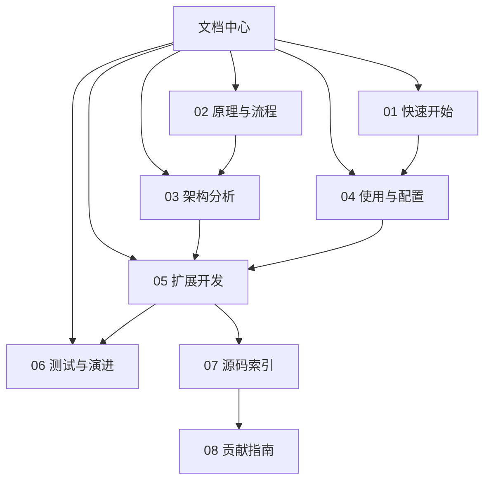

---
难度：⭐⭐
类型：文档导航
预计时间：20 分钟
前置知识：
  - 无
后续推荐：
  - [01-quickstart.md](01-quickstart.md)
  - [02-principles-and-workflow.md](02-principles-and-workflow.md)
学习路径：
  - 用户路径：总入口
  - 开发路径：总入口
---

# TradingAgents 中文文档中心

## 功能特点

TradingAgents 是一个基于多 Agent（智能体）协作的 LLM 金融交易决策框架。

**多维度数据采集与分析**

系统内置 4 类 Analyst（分析师），各自使用独立的数据工具链完成信息采集：

- Market Analyst（市场分析师）：通过 `get_stock_data` 和 `get_indicators` 获取 OHLCV 行情数据和技术指标。
- Social Media Analyst（社交媒体分析师）：通过 `get_news` 获取新闻数据以进行舆情分析。
- News Analyst（新闻分析师）：通过 `get_news` 和 `get_global_news` 获取公司新闻与全球宏观经济新闻。
- Fundamentals Analyst（基本面分析师）：通过 `get_fundamentals`、`get_balance_sheet`、`get_cashflow` 和 `get_income_statement` 获取公司财务报表数据。

**多 Agent 辩论与仲裁机制**

系统包含两轮辩论流程：

- 投资辩论：Bull Researcher（看多研究员）与 Bear Researcher（看空研究员）围绕各 Analyst 的报告进行多轮辩论，由 Research Manager（研究经理）综合为 `investment_plan`。
- 风险辩论：Aggressive Analyst（激进分析师）、Conservative Analyst（保守分析师）与 Neutral Analyst（中性分析师）围绕 Trader（交易员）的投资方案进行多轮风险讨论，由 Portfolio Manager（投资组合经理）输出 `final_trade_decision`。

**多 LLM Provider 支持**

通过 `tradingagents/llm_clients/factory.py` 中的 `create_llm_client()` 工厂方法，系统支持 OpenAI、Anthropic、Google、xAI、OpenRouter 和 Ollama 共 6 种 LLM Provider。系统区分两层模型：`deep_think_llm` 用于 Research Manager 和 Portfolio Manager 等关键仲裁节点，`quick_think_llm` 用于 Analyst 和 Debater 等高频节点。

**多数据供应商与回退机制**

数据工具按类别（`core_stock_apis`、`technical_indicators`、`fundamental_data`、`news_data`）组织，每个类别可配置供应商（当前支持 yfinance 和 Alpha Vantage）。`tool_vendors` 按工具级别覆盖 `data_vendors` 的类别默认值，逗号分隔的供应商字符串构成回退链。

**记忆与反思系统**

每个关键角色（Bull Researcher、Bear Researcher、Trader、Research Manager、Portfolio Manager）都持有独立的 `FinancialSituationMemory` 实例，使用 BM25 算法进行基于词汇相似度的检索。通过 `reflect_and_remember()` 方法，系统在收到持仓收益反馈后对各角色的记忆进行更新，以支持跨决策周期的经验积累。

**信号处理**

`SignalProcessor` 将 Portfolio Manager 输出的完整决策文本提取为核心评级，输出为 BUY、OVERWEIGHT、HOLD、UNDERWEIGHT 或 SELL 之一。

**灵活配置**

通过 Python 字典传递配置，支持：辩论轮数（`max_debate_rounds`、`max_risk_discuss_rounds`）、Analyst 启用集合（`selected_analysts`）、输出语言（`output_language`）、Provider 专属参数（如 `google_thinking_level`、`openai_reasoning_effort`、`anthropic_effort`）等。

## 文档目标

这一组文档面向两类核心读者：

1. 希望尽快跑通项目、理解输出结果的使用者。
2. 希望深度理解架构并进行二次开发的研究者和工程师。

本文档中心将原有单篇总纲拆成多篇协同文档：读者可以按目标阅读，而不是在单篇长文中反复跳转；维护者可以独立更新某一个主题（如配置、扩展、测试），而不必改整份总文档。

## 核心概念一览

以下是理解整个系统需要掌握的核心概念。每个概念标注了在代码中的具体位置，方便你在阅读文档时随时对照源码。

| 概念 | 定义 | 所在文件 |
| ---- | ---- | ---- |
| TradingAgentsGraph | 系统统一入口类，负责初始化配置、创建 LLM 客户端、构建 Agent 图并提供 `propagate()` 和 `reflect_and_remember()` 两个主要方法 | `tradingagents/graph/trading_graph.py` |
| AgentState | 继承自 LangGraph 的 `MessagesState`，承载全流程共享的结构化状态，包含公司名称、交易日期、各 Analyst 报告、辩论状态和最终决策等字段 | `tradingagents/agents/utils/agent_states.py` |
| InvestDebateState | 投资辩论阶段的状态类型，记录 Bull/Bear 研究员的对话历史、裁判决定和当前轮数 | `tradingagents/agents/utils/agent_states.py` |
| RiskDebateState | 风险辩论阶段的状态类型，记录三位风险分析师的对话历史、最新发言方和裁判决定 | `tradingagents/agents/utils/agent_states.py` |
| selected_analysts | Analyst 的启用集合，同时定义执行顺序。默认为 `["market", "social", "news", "fundamentals"]`，可以按需裁剪 | `TradingAgentsGraph.__init__()` 参数 |
| ToolNode | LangGraph 提供的工具调用桥接节点，每个 Analyst 配备独立的 ToolNode，包含该 Analyst 需要调用的数据工具 | `tradingagents/graph/trading_graph.py` 中的 `_create_tool_nodes()` |
| data_vendors | 按能力类别配置默认数据供应商的字典，键为类别名（如 `"core_stock_apis"`），值为供应商名（如 `"yfinance"`） | `tradingagents/default_config.py` |
| tool_vendors | 按具体工具名覆盖 `data_vendors` 的默认供应商，优先级高于类别级别配置 | `tradingagents/default_config.py` |
| deep_think_llm | 关键仲裁节点（Research Manager、Portfolio Manager）使用的推理模型，默认为 `"gpt-5.4"` | `tradingagents/default_config.py` |
| quick_think_llm | 高频节点（Analyst、Researcher、Debater、Trader）使用的快速模型，默认为 `"gpt-5.4-mini"` | `tradingagents/default_config.py` |
| FinancialSituationMemory | 基于 BM25 算法的记忆系统，存储经验文本并支持词汇相似度检索，每个关键角色持有独立实例 | `tradingagents/agents/utils/memory.py` |
| final_trade_decision | Portfolio Manager 产出的最终交易决策文本，经过 `SignalProcessor` 提取后输出为 BUY/OVERWEIGHT/HOLD/UNDERWEIGHT/SELL | `AgentState` 字段 |
| max_debate_rounds | 投资辩论轮数上限，每轮包含 Bull 和 Bear 各一次发言。默认为 1，即总共 2 次发言 | `tradingagents/default_config.py` |
| max_risk_discuss_rounds | 风险辩论轮数上限，每轮包含三位分析师各一次发言。默认为 1 | `tradingagents/default_config.py` |
| GraphSetup | 负责构建 LangGraph `StateGraph` 并完成节点注册和边连线的组件 | `tradingagents/graph/setup.py` |
| ConditionalLogic | 负责条件路由判断的组件，包括工具调用循环、辩论轮数终止和风险讨论轮数终止 | `tradingagents/graph/conditional_logic.py` |
| eval_results | 图执行状态的实际落盘目录，路径为 `eval_results/{ticker}/TradingAgentsStrategy_logs/`，以 JSON 格式保存完整状态日志 | `tradingagents/graph/trading_graph.py` 中的 `_log_state()` |

## 如何阅读

### 路径一：第一次上手

适合目标是"尽快跑通并看懂结果"的读者。预计总阅读时间约 2 小时。

| 步骤 | 文档 | 预计时间 | 你将获得 |
| ---- | ---- | ---- | ---- |
| 1 | [01-quickstart.md](01-quickstart.md) | 35 分钟 | 从安装到首次运行的最短路径；Ollama 本地模型；记忆系统入门；结果解读 |
| 2 | [04-usage-and-configuration.md](04-usage-and-configuration.md) | 50 分钟 | CLI 与 Python API 的适用场景；模型、数据供应商、输出语言和辩论轮数的配置方法 |
| 3 | [06-testing-and-evolution.md](06-testing-and-evolution.md) | 45 分钟 | FAQ 与排查建议；测试边界与工程限制 |

### 路径二：理解系统设计

适合目标是"弄清楚为什么这样设计"的读者。预计总阅读时间约 4.5 小时。

| 步骤 | 文档 | 预计时间 | 你将获得 |
| ---- | ---- | ---- | ---- |
| 1 | [02-principles-and-workflow.md](02-principles-and-workflow.md) | 45 分钟 | 多 Agent 设计动机；图编排原理；辩论乘数机制；Prompt 设计哲学 |
| 2 | [03-architecture.md](03-architecture.md) | 55 分钟 | 5 层目录分层；状态模型；normalize_content；记忆系统；信号处理的架构解剖 |
| 3 | [tradingagents-complete-guide.md](tradingagents-complete-guide.md) | 150 分钟 | 全景串联，覆盖使用场景、性能与成本分析、新手到专家完整视角 |

### 路径三：准备做二次开发

适合目标是"为系统新增角色、数据源或工作流"的读者。预计总阅读时间约 4 小时。

| 步骤 | 文档 | 预计时间 | 你将获得 |
| ---- | ---- | ---- | ---- |
| 1 | [03-architecture.md](03-architecture.md) | 55 分钟 | 架构分层与模块职责，建立改动的空间感知 |
| 2 | [05-extension-guide.md](05-extension-guide.md) | 55 分钟 | 完整 Macro Analyst 代码模板；扩展验证测试；`output_language` 传播机制 |
| 3 | [07-source-code-index.md](07-source-code-index.md) | 35 分钟 | 从问题出发快速定位关键源码文件；每个文件的关键函数索引 |
| 4 | [06-testing-and-evolution.md](06-testing-and-evolution.md) + [08-contributor-guide.md](08-contributor-guide.md) | 85 分钟 | 测试盲区；改动验证顺序；PR 格式模板；协作约束 |

### 路径之间如何衔接

上面的主干图展示的是各路径内的默认阅读顺序。实际使用中经常出现以下跨路径跳转：

1. 你在 [01-quickstart.md](01-quickstart.md) 跑通后找不到结果文件，需要立刻跳到 [04-usage-and-configuration.md](04-usage-and-configuration.md) 和 [06-testing-and-evolution.md](06-testing-and-evolution.md) 查看结果目录与排查策略。
2. 你在 [02-principles-and-workflow.md](02-principles-and-workflow.md) 理解了流程哲学后，往往需要回到 [04-usage-and-configuration.md](04-usage-and-configuration.md) 才能把"为什么这样设计"转成"该怎么调参"。
3. 你在 [05-extension-guide.md](05-extension-guide.md) 开始扩展新能力时，需要同步查阅 [07-source-code-index.md](07-source-code-index.md) 的源码入口，以及 [08-contributor-guide.md](08-contributor-guide.md) 的验证要求。

## 新手到专家进阶指南

以下按能力阶段列出从新手到专家的完整进阶路径。每个阶段给出具体的学习目标和判定标准。

### 第 1 阶段：能够运行并解读结果

**学习目标**

- 完成 `pip install -e .` 安装，配置 API Key。
- 使用 CLI（`tradingagents`）或 Python API（`main.py`）对指定股票和日期运行一次完整分析。
- 找到输出文件（`eval_results/{ticker}/TradingAgentsStrategy_logs/` 下的 JSON 日志），理解其中各字段的含义。
- 解释 `final_trade_decision` 和经 `SignalProcessor` 提取后的评级（BUY/HOLD/SELL 等）之间的关系。

**阅读材料**

- [01-quickstart.md](01-quickstart.md)（35 分钟）

**判定标准**

能够独立运行 `ta.propagate("AAPL", "2024-01-15")` 并正确解读返回的决策和日志文件内容。

### 第 2 阶段：理解设计原理

**学习目标**

- 解释系统为何采用多 Agent + 图编排架构，而不是单 Agent 串行提示词。
- 说清楚 Analyst、Researcher、Trader、Risk Manager 之间的职责边界和数据流向。
- 理解辩论轮数（`max_debate_rounds`、`max_risk_discuss_rounds`）对输出质量和成本的影响。
- 理解 `deep_think_llm` 和 `quick_think_llm` 两层模型的使用场景差异。

**阅读材料**

- [02-principles-and-workflow.md](02-principles-and-workflow.md)（45 分钟）
- [03-architecture.md](03-architecture.md)（55 分钟）

**判定标准**

能够回答"如果将 `max_debate_rounds` 从 1 改为 3，系统的 token 消耗和决策质量分别会发生什么变化"。

### 第 3 阶段：熟练配置与调参

**学习目标**

- 根据研究目标选择合适的 LLM Provider 和模型。
- 配置 `data_vendors` 和 `tool_vendors` 以切换或组合数据供应商。
- 使用 `output_language` 配置中文或其他语言的输出。
- 配置 Ollama 等本地模型运行，理解其与云端 API 的差异。
- 使用 `selected_analysts` 参数裁剪不需要的 Analyst 以控制成本。

**阅读材料**

- [04-usage-and-configuration.md](04-usage-and-configuration.md)（50 分钟）

**判定标准**

能够在不查阅文档的情况下，写出一份包含自定义模型、中文输出、仅启用 Market 和 Fundamentals Analyst 的配置字典。

### 第 4 阶段：能够扩展系统

**学习目标**

- 新增一个自定义 Analyst 并注册到图中。
- 新增一个数据供应商并为特定工具实现覆盖。
- 新增一个 LLM Provider 的适配逻辑。
- 理解 `output_language` 在新角色中的传播机制。

**阅读材料**

- [05-extension-guide.md](05-extension-guide.md)（55 分钟）
- [07-source-code-index.md](07-source-code-index.md)（35 分钟）

**判定标准**

能够参照代码模板新增一个 Macro Analyst，并通过扩展验证测试确认其正常工作。

### 第 5 阶段：能够维护和贡献

**学习目标**

- 识别当前测试覆盖的盲区和高风险区域。
- 理解改动策略：哪些改动容易引入回归，哪些相对安全。
- 按照贡献者指南完成改动验证、文档同步和 PR 提交。
- 使用 `reflect_and_remember()` 进行跨周期的记忆反思实验。

**阅读材料**

- [06-testing-and-evolution.md](06-testing-and-evolution.md)（45 分钟）
- [08-contributor-guide.md](08-contributor-guide.md)（40 分钟）

**判定标准**

能够独立完成一个涉及新增数据工具的改动，包括实现、测试、文档更新和 PR 提交的完整流程。

## 文档地图

| 文档 | 预计时间 | 适合谁 | 你会得到什么 |
| ---- | ---- | ---- | ---- |
| [01-quickstart.md](01-quickstart.md) | 35 分钟 | 首次使用者 | 从安装到首次运行的最短成功路径；Ollama 本地模型；记忆系统入门；结果解读 |
| [02-principles-and-workflow.md](02-principles-and-workflow.md) | 45 分钟 | 想理解设计理念的人 | 多 Agent、图编排、工具调用与辩论流程的原理分析；辩论乘数机制；Prompt 设计哲学 |
| [03-architecture.md](03-architecture.md) | 55 分钟 | 研究者与开发者 | 5 层目录分层、状态模型、normalize_content、记忆系统、信号处理的架构解剖 |
| [04-usage-and-configuration.md](04-usage-and-configuration.md) | 50 分钟 | 高频使用者 | CLI、Python API、output_language、Provider 专属参数、callbacks、配置场景速查 |
| [05-extension-guide.md](05-extension-guide.md) | 55 分钟 | 二次开发者 | 完整 Macro Analyst 代码模板、扩展验证测试、output_language 传播 |
| [06-testing-and-evolution.md](06-testing-and-evolution.md) | 45 分钟 | 维护者与贡献者 | MVP 测试集（4 个可直接使用的模板）、pytest 配置、测试优先级 |
| [07-source-code-index.md](07-source-code-index.md) | 35 分钟 | 开发者 | 从问题出发快速定位关键源码文件；每个文件的关键函数索引 |
| [08-contributor-guide.md](08-contributor-guide.md) | 40 分钟 | 贡献者 | 改动策略、验证顺序、PR 格式模板、Git 工作流 |
| [tradingagents-complete-guide.md](tradingagents-complete-guide.md) | 150 分钟 | 需要全景阅读的人 | 使用场景详解、性能与成本分析、新手到专家全景 |

## 推荐阅读顺序

## 快速排查与导航

如果你不是来"按顺序学习"，而是因为某个具体问题来查文档，可以直接跳：

1. 找不到结果文件，或对 `results_dir` 与 `eval_results` 感到困惑：读 [06-testing-and-evolution.md](06-testing-and-evolution.md)。
2. 想新增一个 Analyst、Provider 或数据源：读 [05-extension-guide.md](05-extension-guide.md)，里面有完整代码模板和测试用例。
3. 改了代码后图不收敛，或不知道问题在哪一层：先读 [03-architecture.md](03-architecture.md)，再查 [07-source-code-index.md](07-source-code-index.md)。
4. 想判断一次改动是否足够安全：读 [08-contributor-guide.md](08-contributor-guide.md)。
5. 想了解为什么辩论轮数设置 1 和 2 差别非常大：读 [02-principles-and-workflow.md](02-principles-and-workflow.md) 的"辩论轮数"章节。
6. 想配置中文输出或本地 Ollama：读 [04-usage-and-configuration.md](04-usage-and-configuration.md) 的"配置场景速查"。
7. 想了解运行一次大概花多少钱、需要多久：读 [tradingagents-complete-guide.md](tradingagents-complete-guide.md) 的"性能与成本分析"。

## 学习目标

阅读完这组文档后，你应该能够：

1. 独立运行 TradingAgents，并解释主要输出内容。
2. 理解系统为何采用多 Agent 加图编排，而不是单 Agent 串行提示词。
3. 说清楚 Agent、Graph、LLM Provider、Dataflow 之间的职责边界。
4. 根据自己的研究目标调整模型、辩论轮数和数据供应商。
5. 为系统新增一个角色、一个数据源或一段新工作流。
6. 识别当前项目仍属于研究框架的工程边界，并知道如何用日志、测试和状态字段验证这一判断。

## 写作约定

1. 每篇文档聚焦一个主题，避免信息重复。
2. 核心概念解释包含"是什么""为什么""怎么用"三层。
3. 示例优先可运行或可直接映射到仓库现有代码。
4. 讲设计时同时讲边界，不要把研究框架包装成万能方案。
5. 对开发扩展给出具体改动面，而非抽象建议。

## 文档维护建议

如果后续仓库结构变更，建议优先同步以下几篇文档：

1. 新增入口或 CLI 变更时，同步 01 和 04。影响范围通常是"首次跑通路径"和"配置解释路径"。
2. 图结构或状态模型变更时，同步 02、03、05。影响范围通常是"系统原理""架构图""扩展步骤"三条线。
3. 新增核心源码入口或模块分层变化时，同步 07。影响范围通常是"源码导航"和"调试入口"。
4. 测试增强、结果目录、验证流程或工程规范变化时，同步 06 和 08。影响范围通常是"可信度判断"和"贡献者工作流"。

## 如何高效使用这些文档

如果你只打算整体读一遍，三步走：

1. [01-quickstart.md](01-quickstart.md) — 建立结果直觉。
2. [02-principles-and-workflow.md](02-principles-and-workflow.md) 和 [03-architecture.md](03-architecture.md) — 建立"为什么这样设计"的因果链。
3. [04-usage-and-configuration.md](04-usage-and-configuration.md) 到 [08-contributor-guide.md](08-contributor-guide.md) — 把使用、扩展、验证和协作串成长期工作流。

---

__文档元信息__
难度：⭐⭐ | 类型：文档导航 | 更新日期：2026-05-23 | 预计阅读时间：20 分钟
