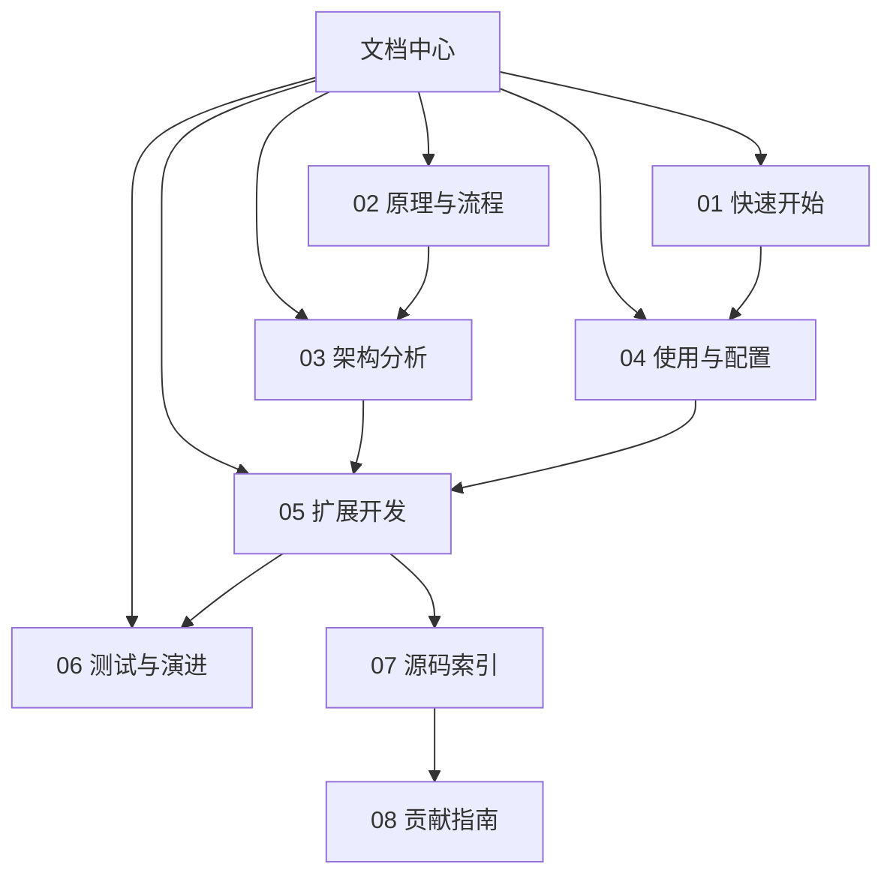

---
难度：⭐⭐
类型：文档导航
预计时间：15 分钟
前置知识：
  - 无
后续推荐：
  - [01-quickstart.md](01-quickstart.md)
  - [02-principles-and-workflow.md](02-principles-and-workflow.md)
学习路径：
  - 用户路径：总入口
  - 开发路径：总入口
---

# TradingAgents 中文文档中心

## 文档目标

这一组文档面向两类核心读者：

1. 希望尽快跑通项目、理解输出结果的使用者。
2. 希望深度理解架构并进行二次开发的研究者和工程师。

本文档中心将原有单篇总纲拆成多篇协同文档。这样做有两个直接收益：

1. 读者可以按目标阅读，而不是在单篇长文中反复跳转。
2. 维护者可以独立更新某一个主题，例如配置、扩展、测试，而不必改整份总文档。

## 如何阅读

### 路径一：第一次上手

1. 先读 [01-quickstart.md](01-quickstart.md)。
2. 再读 [04-usage-and-configuration.md](04-usage-and-configuration.md)。
3. 最后按需查阅 [06-testing-and-evolution.md](06-testing-and-evolution.md) 的 FAQ 与排查建议。

### 路径二：理解系统为什么这样设计

1. 先读 [02-principles-and-workflow.md](02-principles-and-workflow.md)。
2. 再读 [03-architecture.md](03-architecture.md)。
3. 最后回到 [tradingagents-complete-guide.md](tradingagents-complete-guide.md) 做全局串联。

### 路径三：准备做二次开发

1. 先读 [03-architecture.md](03-architecture.md)。
2. 再读 [05-extension-guide.md](05-extension-guide.md)。
3. 再读 [07-source-code-index.md](07-source-code-index.md)，建立源码导航能力。
4. 最后读 [06-testing-and-evolution.md](06-testing-and-evolution.md) 和 [08-contributor-guide.md](08-contributor-guide.md)，确认测试盲区和协作约束。

## 文档地图

| 文档 | 适合谁 | 你会得到什么 |
| ---- | ---- | ---- |
| [01-quickstart.md](01-quickstart.md) | 首次使用者 | 从安装到首次运行的最短成功路径 |
| [02-principles-and-workflow.md](02-principles-and-workflow.md) | 想理解设计理念的人 | 多 Agent、图编排、工具调用与辩论流程的原理分析 |
| [03-architecture.md](03-architecture.md) | 研究者与开发者 | 目录分层、状态模型、关键模块和执行链路的架构解剖 |
| [04-usage-and-configuration.md](04-usage-and-configuration.md) | 高频使用者 | CLI、Python API、配置项、模型与数据源调优方法 |
| [05-extension-guide.md](05-extension-guide.md) | 二次开发者 | 新增 Analyst、Provider、数据源和工作流的具体落地步骤 |
| [06-testing-and-evolution.md](06-testing-and-evolution.md) | 维护者与贡献者 | 测试现状、已知局限、演进方向与常见问题排查 |
| [07-source-code-index.md](07-source-code-index.md) | 开发者 | 从问题出发快速定位关键源码文件 |
| [08-contributor-guide.md](08-contributor-guide.md) | 贡献者 | 面向协作的改动策略、验证顺序与文档同步规则 |
| [tradingagents-complete-guide.md](tradingagents-complete-guide.md) | 需要全景阅读的人 | 单篇整合版全景文档 |

## 学习目标

阅读完这组文档后，你应该能够：

1. 独立运行 TradingAgents，并解释主要输出内容。
2. 理解系统为何采用多 Agent 加图编排，而不是单 Agent 串行提示词。
3. 说清楚 Agent、Graph、LLM Provider、Dataflow 之间的职责边界。
4. 根据自己的研究目标调整模型、辩论轮数和数据供应商。
5. 为系统新增一个角色、一个数据源或一段新工作流。
6. 识别当前项目仍属于研究框架的工程边界，而不是误判为生产交易平台。

## 推荐阅读顺序

## 这组文档的写作原则

为了保证可读性和可维护性，本文档组遵循以下原则：

1. 每篇文档聚焦一个主题，不重复堆砌信息。
2. 每个核心概念都尽量解释“是什么”“为什么”“怎么用”。
3. 示例优先可运行或可直接映射到仓库现有代码。
4. 讲设计时同时讲边界，避免把研究框架包装成万能方案。
5. 对开发扩展给出具体改动面，而不只给抽象建议。

## 文档维护建议

如果后续仓库结构变更，建议优先同步以下几篇文档：

1. 新增入口或 CLI 变更时，同步 01 和 04。
2. 图结构或状态模型变更时，同步 02、03、05。
3. 新增核心源码入口或模块分层变化时，同步 07。
4. 测试增强或工程规范变化时，同步 06 和 08。

---

__文档元信息__
难度：⭐⭐ | 类型：文档导航 | 更新日期：2026-03-29 | 预计阅读时间：15 分钟
