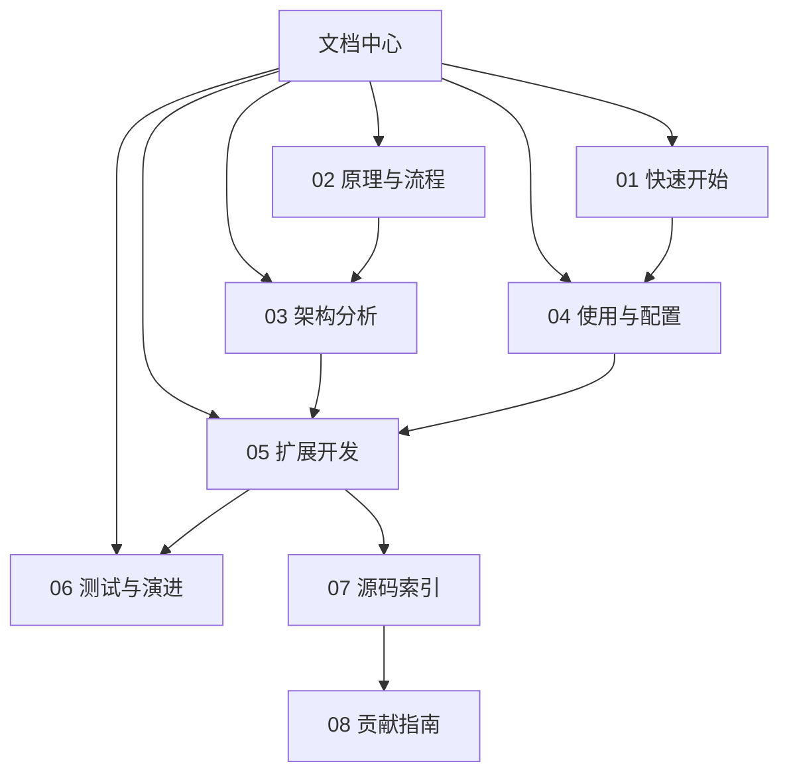

---
难度：⭐⭐
类型：文档导航
预计时间：15 分钟
前置知识：
  - 无
后续推荐：
  - [01-quickstart.md](01-quickstart.md)
  - [02-principles-and-workflow.md](02-principles-and-workflow.md)
学习路径：
  - 用户路径：总入口
  - 开发路径：总入口
---

# TradingAgents 中文文档中心

## 文档目标

这一组文档面向两类核心读者：

1. 希望尽快跑通项目、理解输出结果的使用者。
2. 希望深度理解架构并进行二次开发的研究者和工程师。

本文档中心将原有单篇总纲拆成多篇协同文档。这样做有两个直接收益：

1. 读者可以按目标阅读，而不是在单篇长文中反复跳转。
2. 维护者可以独立更新某一个主题，例如配置、扩展、测试，而不必改整份总文档。

## 核心术语速览

如果你是第一次接触这个项目，先记住下面这些术语：

| 术语 | 在本文档体系中的含义 |
| ---- | ---- |
| TradingAgentsGraph | 系统统一入口与装配中心 |
| selected_analysts | Analyst 的启用集合，同时也定义执行顺序 |
| ToolNode | Analyst 调用外部工具的桥接节点 |
| data_vendors | 按能力类别配置默认数据供应商 |
| tool_vendors | 按具体工具覆盖默认供应商 |
| quick_think_llm | 高频节点使用的模型 |
| deep_think_llm | 关键仲裁节点使用的模型 |
| AgentState | 多阶段共享的结构化状态契约 |
| final_trade_decision | Portfolio Manager 产出的最终决策文本 |
| eval_results | 当前图执行状态的实际落盘目录 |

## 如何阅读

### 路径一：第一次上手

1. 先读 [01-quickstart.md](01-quickstart.md)。
2. 再读 [04-usage-and-configuration.md](04-usage-and-configuration.md)。
3. 最后按需查阅 [06-testing-and-evolution.md](06-testing-and-evolution.md) 的 FAQ 与排查建议。

### 路径二：理解系统为什么这样设计

1. 先读 [02-principles-and-workflow.md](02-principles-and-workflow.md)。
2. 再读 [03-architecture.md](03-architecture.md)。
3. 最后回到 [tradingagents-complete-guide.md](tradingagents-complete-guide.md) 做全局串联。

### 路径三：准备做二次开发

1. 先读 [03-architecture.md](03-architecture.md)。
2. 再读 [05-extension-guide.md](05-extension-guide.md)。
3. 再读 [07-source-code-index.md](07-source-code-index.md)，建立源码导航能力。
4. 最后读 [06-testing-and-evolution.md](06-testing-and-evolution.md) 和 [08-contributor-guide.md](08-contributor-guide.md)，确认测试盲区和协作约束。

## 文档地图

| 文档 | 适合谁 | 你会得到什么 |
| ---- | ---- | ---- |
| [01-quickstart.md](01-quickstart.md) | 首次使用者 | 从安装到首次运行的最短成功路径；Ollama 本地模型；记忆系统入门；结果解读 |
| [02-principles-and-workflow.md](02-principles-and-workflow.md) | 想理解设计理念的人 | 多 Agent、图编排、工具调用与辩论流程的原理分析；辩论乘数机制；Prompt 设计哲学 |
| [03-architecture.md](03-architecture.md) | 研究者与开发者 | 5 层目录分层、状态模型、normalize_content、记忆系统、信号处理的架构解剖 |
| [04-usage-and-configuration.md](04-usage-and-configuration.md) | 高频使用者 | CLI、Python API、output_language、Provider 专属参数、callbacks、配置场景速查 |
| [05-extension-guide.md](05-extension-guide.md) | 二次开发者 | 完整 Macro Analyst 代码模板、扩展验证测试、output_language 传播 |
| [06-testing-and-evolution.md](06-testing-and-evolution.md) | 维护者与贡献者 | MVP 测试集（4 个可直接使用的模板）、pytest 配置、测试优先级 |
| [07-source-code-index.md](07-source-code-index.md) | 开发者 | 从问题出发快速定位关键源码文件；每个文件的关键函数索引 |
| [08-contributor-guide.md](08-contributor-guide.md) | 贡献者 | 改动策略、验证顺序、PR 格式模板、Git 工作流 |
| [tradingagents-complete-guide.md](tradingagents-complete-guide.md) | 需要全景阅读的人 | 使用场景详解、性能与成本分析、新手到专家全景 |

## 学习目标

阅读完这组文档后，你应该能够：

1. 独立运行 TradingAgents，并解释主要输出内容。
2. 理解系统为何采用多 Agent 加图编排，而不是单 Agent 串行提示词。
3. 说清楚 Agent、Graph、LLM Provider、Dataflow 之间的职责边界。
4. 根据自己的研究目标调整模型、辩论轮数和数据供应商。
5. 为系统新增一个角色、一个数据源或一段新工作流。
6. 识别当前项目仍属于研究框架的工程边界，并知道如何用日志、测试和状态字段验证这一判断。

## 推荐阅读顺序

## 快速排查与导航

如果你不是来”按顺序学习”，而是因为某个具体问题来查文档，可以直接跳：

1. 找不到结果文件，或对 results_dir 与 eval_results 感到困惑：读 [06-testing-and-evolution.md](06-testing-and-evolution.md)。
2. 想新增一个 Analyst、Provider 或数据源：读 [05-extension-guide.md](05-extension-guide.md)，里面有完整代码模板和测试用例。
3. 改了代码后图不收敛，或不知道问题在哪一层：先读 [03-architecture.md](03-architecture.md)，再查 [07-source-code-index.md](07-source-code-index.md)。
4. 想判断一次改动是否足够安全：读 [08-contributor-guide.md](08-contributor-guide.md)。
5. 想了解为什么辩论轮数设置 1 和 2 差别这么大：读 [02-principles-and-workflow.md](02-principles-and-workflow.md) 的”辩论轮数”章节。
6. 想配置中文输出或本地 Ollama：读 [04-usage-and-configuration.md](04-usage-and-configuration.md) 的”配置场景速查”。
7. 想了解运行一次大概花多少钱、需要多久：读 [tradingagents-complete-guide.md](tradingagents-complete-guide.md) 的”性能与成本分析”。

### 路径之间如何衔接

上面的主干图只展示默认阅读顺序。实际使用时，经常会出现 3 类跨路径跳转：

1. 你在 [01-quickstart.md](01-quickstart.md) 跑通后找不到结果文件，需要立刻跳到 [04-usage-and-configuration.md](04-usage-and-configuration.md) 和 [06-testing-and-evolution.md](06-testing-and-evolution.md) 看结果目录与排查策略。
2. 你在 [02-principles-and-workflow.md](02-principles-and-workflow.md) 理解了流程哲学后，往往需要回到 [04-usage-and-configuration.md](04-usage-and-configuration.md) 才能把“为什么这样设计”转成“该怎么调参”。
3. 你在 [05-extension-guide.md](05-extension-guide.md) 开始扩展新能力时，需要同步查阅 [07-source-code-index.md](07-source-code-index.md) 的源码入口，以及 [08-contributor-guide.md](08-contributor-guide.md) 的验证要求。

## 这组文档的写作原则

为了保证可读性和可维护性，本文档组遵循以下原则：

1. 每篇文档聚焦一个主题，不重复堆砌信息。
2. 每个核心概念都尽量解释“是什么”“为什么”“怎么用”。
3. 示例优先可运行或可直接映射到仓库现有代码。
4. 讲设计时同时讲边界，避免把研究框架包装成万能方案。
5. 对开发扩展给出具体改动面，而不只给抽象建议。

## 文档维护建议

如果后续仓库结构变更，建议优先同步以下几篇文档：

1. 新增入口或 CLI 变更时，同步 01 和 04。影响范围通常是“首次跑通路径”和“配置解释路径”。
2. 图结构或状态模型变更时，同步 02、03、05。影响范围通常是“系统原理”“架构图”“扩展步骤”三条线。
3. 新增核心源码入口或模块分层变化时，同步 07。影响范围通常是“源码导航”和“调试入口”。
4. 测试增强、结果目录、验证流程或工程规范变化时，同步 06 和 08。影响范围通常是“可信度判断”和“贡献者工作流”。

## 使用建议

如果你只打算读一遍文档，建议把这组文档当成一个三段式闭环：

1. 先用 [01-quickstart.md](01-quickstart.md) 跑通最小路径，建立结果直觉。
2. 再用 [02-principles-and-workflow.md](02-principles-and-workflow.md) 和 [03-architecture.md](03-architecture.md) 建立“为什么这样设计”的因果链。
3. 最后用 [04-usage-and-configuration.md](04-usage-and-configuration.md) 到 [08-contributor-guide.md](08-contributor-guide.md) 把使用、扩展、验证和协作串成长期工作流。

---

__文档元信息__
难度：⭐⭐ | 类型：文档导航 | 更新日期：2026-04-01 | 预计阅读时间：15 分钟
