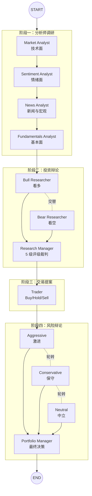
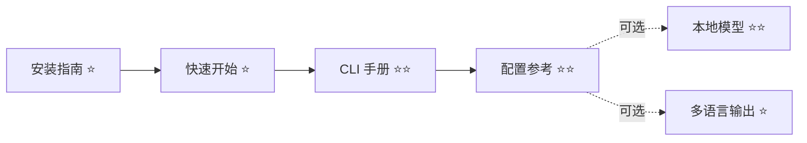
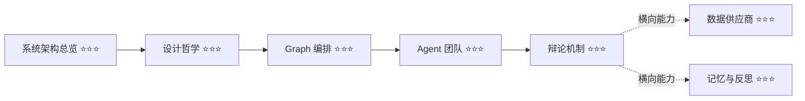
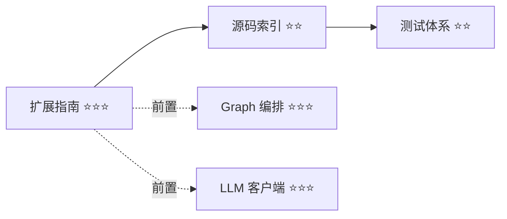

# TradingAgents 中文文档

TradingAgents 是一个模拟真实交易公司协作流程的多智能体 LLM 金融分析框架。它把"分析师调研 → 多空辩论 → 交易提案 → 风险辩论 → 组合决策"这条专业投研流水线，编码成一张可执行的 LangGraph 状态图。

> ⚠️ **定位声明**：TradingAgents 是研究工具，不是投资建议工具。它的产出应被视为辅助决策的参考输入，而非交易指令。详见 [免责声明与适用边界](03-architecture/design-philosophy.md#适用边界与免责声明)。

---

## 这套文档适合谁

| 读者画像 | 你想解决的问题 | 推荐起点 |
|---------|--------------|---------|
| **第一次接触的用户** | 装好就跑出第一份报告 | [快速开始](01-getting-started/quickstart.md) ⭐ |
| **高频使用者** | 搞懂 CLI 每一步、自定义配置、切语言 | [CLI 手册](02-user-guide/cli-manual.md) ⭐⭐ |
| **想编程集成的开发者** | 在自己的 Python 程序里调用 | [Python API](02-user-guide/python-api.md) ⭐⭐ |
| **想理解原理的研究者** | 为什么要这样设计、数据怎么流 | [系统架构总览](03-architecture/overview.md) ⭐⭐⭐ |
| **想二次开发的贡献者** | 加 Analyst、加数据源、加 Provider | [扩展指南](07-development/extension-guide.md) ⭐⭐⭐ |

---

## 五分钟理解 TradingAgents

一次完整的分析由 **13 个角色** 协作完成，分四个阶段：

四个阶段的产出层层递进：分析师产出原始报告 → 多空双方基于报告辩论 → 研究经理裁决出投资评级 → 交易员把评级转成具体操作 → 风控三方从不同立场审视交易 → 组合经理给出最终决策。每个角色都由独立的 LLM 实例驱动，通过 LangGraph 的状态图编排协作。

想深入理解每个阶段的内部机制，参见 [系统架构总览](03-architecture/overview.md)。

---

## 文档地图

### 📘 01 入门篇 Getting Started

让一个新用户在 15 分钟内装好环境、跑出第一份报告。

| 文档 | 内容 | 难度 | 时间 |
|------|------|------|------|
| [安装指南](01-getting-started/installation.md) | Python 环境、依赖安装、常见安装问题 | ⭐ | 10 分钟 |
| [快速开始](01-getting-started/quickstart.md) | 从零到第一份完整分析报告 | ⭐ | 15 分钟 |

### 📗 02 用户手册 User Guide

面向已经能跑通、想用好 TradingAgents 的使用者。

| 文档 | 内容 | 难度 | 时间 |
|------|------|------|------|
| [CLI 交互式手册](02-user-guide/cli-manual.md) | 8 步交互问卷逐项详解、每个选项的含义 | ⭐⭐ | 25 分钟 |
| [Python API](02-user-guide/python-api.md) | 编程方式调用、自定义 Agent 编排 | ⭐⭐ | 20 分钟 |
| [配置参考](02-user-guide/configuration.md) | `DEFAULT_CONFIG` 全字段、环境变量覆盖、优先级 | ⭐⭐ | 30 分钟 |
| [多语言输出](02-user-guide/output-language.md) | 让报告输出中文等 11 种语言 | ⭐ | 5 分钟 |
| [本地模型部署](02-user-guide/local-models.md) | Ollama、vLLM、LM Studio 接入 | ⭐⭐ | 15 分钟 |

### 📙 03 架构篇 Architecture

面向想理解"为什么这样设计"的研究者和资深开发者。

| 文档 | 内容 | 难度 | 时间 |
|------|------|------|------|
| [系统架构总览](03-architecture/overview.md) | 分层设计、端到端数据流、模块职责边界 | ⭐⭐⭐ | 40 分钟 |
| [设计哲学](03-architecture/design-philosophy.md) | 核心设计决策的动机与权衡 | ⭐⭐⭐ | 30 分钟 |

### 📕 04 Graph 与 Agent 篇

深入框架最核心的编排逻辑和角色系统。

| 文档 | 内容 | 难度 | 时间 |
|------|------|------|------|
| [Graph 编排](04-graph-and-agents/graph-orchestration.md) | 节点、边、条件路由、图的构建与编译 | ⭐⭐⭐ | 35 分钟 |
| [Agent 团队](04-graph-and-agents/agent-system.md) | 13 个角色的职责、Prompt 构造、工具使用 | ⭐⭐⭐ | 40 分钟 |
| [辩论机制](04-graph-and-agents/debate-mechanism.md) | 双辩论循环的数学、状态机、轮次控制 | ⭐⭐⭐ | 25 分钟 |
| [状态模型](04-graph-and-agents/state-model.md) | `AgentState` 三层嵌套、Reducer 语义 | ⭐⭐⭐ | 20 分钟 |

### 📓 05 数据与 LLM 篇

框架的两个横向子系统：数据获取和大模型调用。

| 文档 | 内容 | 难度 | 时间 |
|------|------|------|------|
| [数据供应商路由](05-data-and-llm/data-vendors.md) | Vendor chain、fallback、优雅降级、错误体系 | ⭐⭐⭐ | 35 分钟 |
| [符号归一化](05-data-and-llm/symbol-normalization.md) | crypto/forex/commodity/index 符号映射 | ⭐⭐ | 15 分钟 |
| [LLM 客户端](05-data-and-llm/llm-clients.md) | 19 个 Provider、能力表、结构化输出适配 | ⭐⭐⭐ | 35 分钟 |

### 📔 06 内部机制篇 Internals

支撑框架运行的横向能力。

| 文档 | 内容 | 难度 | 时间 |
|------|------|------|------|
| [记忆与反思](06-internals/memory-system.md) | `TradingMemoryLog`、延迟反思、经验注入 | ⭐⭐⭐ | 25 分钟 |
| [报告系统](06-internals/reporting.md) | 报告树结构、CLI 与 API 的统一输出 | ⭐⭐ | 15 分钟 |
| [断点续跑](06-internals/checkpointing.md) | Checkpoint 机制、thread_id 签名、恢复策略 | ⭐⭐⭐ | 20 分钟 |
| [结构化输出](06-internals/structured-output.md) | Pydantic Schema、优雅降级、Provider 差异 | ⭐⭐⭐ | 20 分钟 |

### 📒 07 开发篇 Development

面向想扩展或贡献代码的开发者。

| 文档 | 内容 | 难度 | 时间 |
|------|------|------|------|
| [扩展指南](07-development/extension-guide.md) | 新增 Analyst / Vendor / Provider 的完整模板 | ⭐⭐⭐ | 40 分钟 |
| [测试体系](07-development/testing.md) | 测试组织、fixture、回归测试策略 | ⭐⭐ | 20 分钟 |
| [源码索引](07-development/source-index.md) | 按问题定位源码的查找表 | ⭐⭐ | 参考 |

---

## 三条推荐阅读路径

不同读者的目标不同，不必从第一篇读到最后一篇。下面三条路径针对三种典型场景。

### 路径一：上手使用（使用者）

目标：尽快跑起来，然后按需调参。

预计 1-2 小时，完成后能独立运行分析并理解所有配置项。

### 路径二：理解原理（研究者）

目标：搞懂框架的设计思路和内部机制，用于学术研究或技术选型评估。

预计 3-4 小时，完成后能清晰解释每个设计决策的动机。

### 路径三：二次开发（贡献者）

目标：在框架上做扩展，或向上游贡献代码。

预计 2-3 小时（含前置阅读），完成后能独立添加新角色、数据源或模型供应商。

---

## 核心概念速查

第一次接触 TradingAgents 的读者，先记住这几个概念就能读懂大部分文档：

| 概念 | 一句话解释 | 详细文档 |
|------|----------|---------|
| **Analyst（分析师）** | 负责一个维度的调研（技术/情绪/新闻/基本面），可调工具拉数据 | [Agent 团队](04-graph-and-agents/agent-system.md) |
| **Researcher（研究员）** | 基于分析师报告做辩论，Bull 看多、Bear 看空 | [辩论机制](04-graph-and-agents/debate-mechanism.md) |
| **ToolNode（工具节点）** | LangGraph 的工具执行节点，分析师通过它调用数据接口 | [Graph 编排](04-graph-and-agents/graph-orchestration.md) |
| **Vendor（数据供应商）** | 具体的数据源实现（yfinance、Alpha Vantage、FRED 等） | [数据供应商路由](05-data-and-llm/data-vendors.md) |
| **Provider（模型供应商）** | LLM 的提供方（OpenAI、Anthropic、Bedrock、Ollama 等） | [LLM 客户端](05-data-and-llm/llm-clients.md) |
| **Debate Round（辩论轮）** | 多空双方各发言一次算一轮，由 `max_debate_rounds` 控制 | [辩论机制](04-graph-and-agents/debate-mechanism.md) |
| **Checkpoint（检查点）** | 图执行过程的持久化快照，崩溃后可从最后成功节点恢复 | [断点续跑](06-internals/checkpointing.md) |
| **Instrument Context（标的上下文）** | 确定性解析的标的身份信息，注入所有 Agent 防止身份幻觉 | [Agent 团队](04-graph-and-agents/agent-system.md) |

---

## 版本与时效

| 项目 | 值 |
|------|-----|
| 文档对应版本 | v0.3.1 |
| 文档更新日期 | 2026-07-13 |
| 源码分支 | main |

这套文档基于 v0.3.1 源码逐行核实撰写。如果代码更新后文档与实现出现出入，以源码为准。

---

## 反馈与贡献

- 文档问题（错别字、过时信息、不通顺的表达）：提交 Issue 或直接发 PR
- 代码贡献：先读 [扩展指南](07-development/extension-guide.md) 和 [测试体系](07-development/testing.md)
