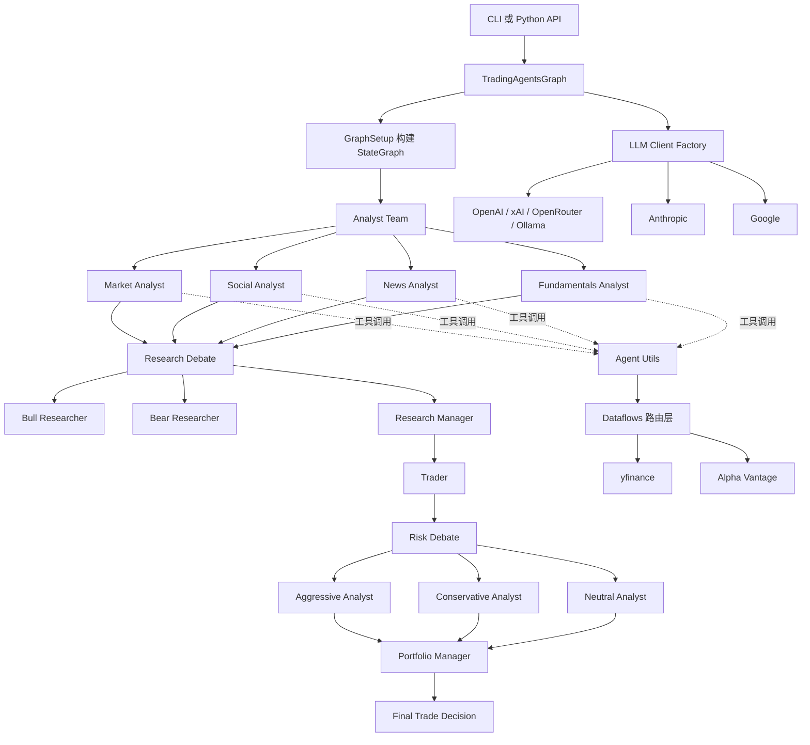
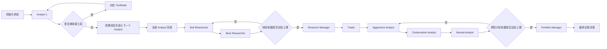

---
难度：⭐⭐⭐⭐
类型：专家设计
预计时间：120 分钟
前置知识：
  - Python 基础
  - LLM Agent 基础概念
  - 金融市场与量化交易的基础术语
后续推荐：
  - [README.md](README.md)
学习路径：
  - 用户路径：从首次运行到参数调优
  - 开发路径：从模块理解到二次扩展
---

# TradingAgents 从入门到精通：原理、架构、使用与扩展全景指南

## 配套文档说明

本文是单篇整合版全景文档，适合希望一次性完整阅读的读者。如果你更偏向按主题分步学习，请从 [README.md](README.md) 进入中文文档中心，再按“快速开始”“原理与流程”“架构分析”“使用与配置”“扩展开发”“测试与演进”这几篇分文档阅读。

为了避免和分文档形成重复劳动，建议把本文理解成“全局串联器”，而不是“唯一权威副本”：

1. 你需要最短成功路径时，优先读 [01-quickstart.md](01-quickstart.md)。
2. 你需要可执行的扩展步骤时，优先读 [05-extension-guide.md](05-extension-guide.md)。
3. 你需要风险、测试和协作判断时，优先读 [06-testing-and-evolution.md](06-testing-and-evolution.md) 与 [08-contributor-guide.md](08-contributor-guide.md)。

本文的价值在于把这些主题串成一条完整因果链，而不是替代分文档的细粒度说明。

## 阅读导航

为了让不同背景的读者快速进入状态，建议按下面的顺序阅读：

| 目标 | 建议优先阅读章节 | 预期收获 |
| ---- | ---- | ---- |
| 先把项目跑起来 | 快速开始、CLI 与 Python API 使用说明、配置系统详解 | 能独立完成首次运行与基础调参 |
| 先理解系统设计 | 为什么这个项目值得研究、核心原理分析、系统架构分析 | 能解释系统为什么这样分层与编排 |
| 先准备做二次开发 | 开发者视角的源码解剖、开发扩展指南、测试、质量与局限 | 能安全地新增模块或改造工作流 |

## 5 分钟快速版

如果你不打算一次读完 120 分钟版本，可以用下面的跳读方式：

1. 只想跑通：读“快速开始”“CLI 与 Python API 使用说明”“配置系统详解”。
2. 只想理解设计：读“为什么这个项目值得研究”“核心原理分析”“系统架构分析”。
3. 只想做扩展：读“开发者视角的源码解剖”“开发扩展指南”“测试、质量与局限”。

这也是本文和分文档的边界：本文负责串联，分文档负责落地。

## 目录

- [配套文档说明](#配套文档说明)
- [阅读导航](#阅读导航)
- [5 分钟快速版](#5-分钟快速版)
- [文档定位](#文档定位)
- [学习目标](#学习目标)
- [关键术语速览](#关键术语速览)
- [一句话理解项目](#一句话理解项目)
- [为什么这个项目值得研究](#为什么这个项目值得研究)
- [项目全景图](#项目全景图)
- [快速开始](#快速开始)
- [目录结构与职责分层](#目录结构与职责分层)
- [核心原理分析](#核心原理分析)
- [系统架构分析](#系统架构分析)
- [LLM 抽象层分析](#llm-抽象层分析)
- [数据流与工具系统分析](#数据流与工具系统分析)
- [CLI 与 Python API 使用说明](#cli-与-python-api-使用说明)
- [配置系统详解](#配置系统详解)
- [开发者视角的源码解剖](#开发者视角的源码解剖)
- [开发扩展指南](#开发扩展指南)
- [实战建议：如何把它用于真实研究](#实战建议如何把它用于真实研究)
- [测试、质量与局限](#测试质量与局限)
- [常见问题与排查思路](#常见问题与排查思路)
- [进一步阅读建议](#进一步阅读建议)
- [面向贡献者的改进建议](#面向贡献者的改进建议)
- [练习与进阶任务](#练习与进阶任务)
- [自测检查清单](#自测检查清单)
- [总结](#总结)

## 文档定位

本文面向三类读者：

1. 想快速跑通项目、理解输出结果的使用者。
2. 想基于现有框架调参、换模型、换数据源的研究者。
3. 想新增 Agent、接入新供应商、改造执行图的开发者。

如果你的目标只是先把项目跑起来，优先阅读“快速开始”“CLI 使用说明”“Python API 使用说明”。如果你的目标是理解系统为何这样设计，重点阅读“核心原理”“系统架构分析”“状态流与执行流”。如果你的目标是做二次开发，重点阅读“开发扩展指南”“测试与工程建议”。

## 学习目标

读完本文后，你应该能够：

1. 说清楚 TradingAgents 要解决什么问题，以及它为何选择多 Agent 架构。
2. 理解系统如何把分析、辩论、交易规划、风险审查组织成一个可执行图。
3. 独立通过 CLI 或 Python API 运行一次完整分析。
4. 根据场景修改模型、研究深度、数据供应商和分析团队组合。
5. 为项目新增一个 Agent、一个数据源，或者一个新的工作流节点。
6. 明白当前项目的边界、测试现状和工程风险，而不是把它误当成生产级自动交易系统。

## 关键术语速览

| 术语 | 本文中的含义 |
| ---- | ---- |
| Agent | 承担某种明确角色职责的 LLM 节点 |
| LangGraph | 用来组织节点、状态和条件边的图编排框架 |
| ToolNode | LangGraph 中负责执行工具调用的节点 |
| Provider | LLM 或数据服务的具体供应商 |
| Debate Round | 多 Agent 轮流表达观点的一轮讨论计数 |
| final_trade_decision | 组合经理产出的最终交易结论文本 |

## 一句话理解项目

TradingAgents 是一个用 LangGraph 编排的多 Agent 金融交易研究框架。它把现实交易团队中的不同角色拆成多个专门 Agent，让它们分别做技术分析、新闻分析、情绪分析、基本面分析，再通过多轮辩论、交易规划与风险审查，最终给出交易结论。

## 为什么这个项目值得研究

很多 LLM（大语言模型）金融项目的问题在于：要么只有一个“大而全”的 Agent，容易把信息搜集、推理、判断混在一起；要么把工具调用和最终决策耦合得过紧，难以替换模型与数据源。TradingAgents 的设计价值在于，它把复杂问题显式拆开：

1. 用角色分工降低单个 Agent 的提示词复杂度。
2. 用图结构约束执行顺序，而不是让一个 Agent 自由漫游。
3. 用工具层和供应商路由层隔离外部数据源差异。
4. 用双层思考模型区分“常规分析”与“关键仲裁”。
5. 用反思与记忆机制为后续迭代留下接口。

这套设计并不保证更高收益，但它显著提高了系统的可解释性、可替换性和研究可操作性。这正是一个研究型框架最重要的价值。

## 项目全景图



## 快速开始

### 环境准备

推荐使用 Python 虚拟环境。项目的最低 Python 版本要求是 3.10，但 README 中给出的示例环境是 Python 3.13。为了减少兼容性分歧，建议直接使用较新的 Python 版本。

```bash
git clone https://github.com/TauricResearch/TradingAgents.git
cd TradingAgents

conda create -n tradingagents python=3.13
conda activate tradingagents

pip install .
```

### 配置 API Key

项目支持多个 LLM 供应商，也支持不同的数据供应商。至少需要准备一组可用的 LLM Key；如果你使用 Alpha Vantage，还需要额外配置对应的数据 Key。这里的 API（应用程序接口）Key 本质上是访问外部模型或数据服务的凭证。

```bash
export OPENAI_API_KEY=your_openai_key
export GOOGLE_API_KEY=your_google_key
export ANTHROPIC_API_KEY=your_anthropic_key
export XAI_API_KEY=your_xai_key
export OPENROUTER_API_KEY=your_openrouter_key
export ALPHA_VANTAGE_API_KEY=your_alpha_vantage_key
```

如果你使用 Ollama，本地模型不要求远程 Key，但要确保本地服务已经启动，并且模型已提前拉取。

### 首次运行

安装完成后，可以直接启动交互式 CLI（命令行界面）：

```bash
tradingagents
```

或者在源码目录中直接执行：

```bash
python -m cli.main
```

CLI 会引导你依次选择：

1. 股票代码。
2. 分析日期。
3. 启用的分析师组合。
4. 研究深度。
5. LLM 供应商。
6. 浅层与深层模型。

这里的“研究深度”不是抽象标签，而是直接映射到辩论轮数。也就是说，你在 CLI 里把研究深度调高，本质上是在增加多 Agent 讨论的回合数。

### 10 分钟最小示例

如果你希望先用代码快速验证主流程，下面这个示例最直接：

```python
from tradingagents.graph.trading_graph import TradingAgentsGraph
from tradingagents.default_config import DEFAULT_CONFIG

config = DEFAULT_CONFIG.copy()
config["llm_provider"] = "openai"
config["deep_think_llm"] = "gpt-5.4"
config["quick_think_llm"] = "gpt-5.4-mini"

graph = TradingAgentsGraph(debug=True, config=config)
final_state, decision = graph.propagate("NVDA", "2024-05-10")

print(decision)
print(final_state["final_trade_decision"])
```

### 完成验证

首次成功运行后，建议检查三件事：

1. 终端是否输出了最终决策文本，而不是中途报错。
2. 是否生成了完整的中间报告，例如市场分析、新闻分析、基本面分析等。
3. 是否在 eval_results 目录中看到了保存下来的状态日志。

这里仍要注意一个现实问题：默认配置含有 results_dir，但当前图执行状态落盘仍直接写入 eval_results。也就是说，本文中所有“如何判断跑通”的建议，都应以实际落盘目录为准，而不是以配置声明为准。

如果这三点都满足，说明主执行链路已经跑通。

## 目录结构与职责分层

从工程视角看，TradingAgents 可以拆成五层。

### 第一层：入口层

入口层有两种使用方式：

1. Python API（应用程序接口）入口，示例在根目录的 main.py。
2. 交互式 CLI 入口，由 cli/main.py 提供 Typer 应用。

这两条路径最终都会汇聚到同一个核心类：TradingAgentsGraph。

### 第二层：图编排层

图编排层位于 tradingagents/graph。它负责把“有哪些角色”“角色之间如何流转”“何时结束分析”“状态如何初始化和保存”这些问题统一起来。

这个目录下最关键的模块有：

1. trading_graph.py：系统总控，负责初始化 LLM、工具节点、记忆系统与 StateGraph。
2. setup.py：把图上的节点、边和条件边真正组装出来。
3. conditional_logic.py：决定某个 Analyst 是否继续调用工具，以及辩论是否进入下一轮。
4. propagation.py：负责生成初始状态，并配置图执行参数。
5. reflection.py：根据收益或亏损结果，回写反思信息到记忆系统。
6. signal_processing.py：从完整自然语言结论中提取更凝练的信号。

### 第三层：Agent 角色层

Agent 层位于 tradingagents/agents。这里不是一个单体 Agent，而是一组具有明确职责边界的角色：

1. analysts：生成各自领域的分析报告。
2. researchers：围绕是否投资进行看多与看空辩论。
3. managers：做阶段性仲裁与最终审批。
4. risk_mgmt：从不同风险偏好视角评估交易方案。
5. trader：把研究结论转成交易计划。
6. utils：工具函数、状态定义、记忆系统。

### 第四层：能力抽象层

能力抽象层分成两块：

1. llm_clients：把不同模型供应商抽象成统一接口。
2. dataflows：把不同市场数据供应商抽象成统一工具路由。

这两层抽象的目标都一样：上层业务逻辑尽量不感知底层供应商差异。

### 第五层：表现层与测试层

1. cli：负责交互体验、实时展示和统计信息。
2. tests：当前只有较少的单元测试，主要覆盖 ticker 后缀处理。
3. docs：文档目录，目前中文文档由本文补齐。

## 核心原理分析

### 原理一：角色分治，而不是单 Agent 包打天下

TradingAgents 最核心的理念不是“多模型”，而是“多角色”。系统假设金融决策不是一个单步问答，而是一个包含信息收集、观点形成、冲突辩论、风险约束和最终拍板的多阶段流程。

这件事为什么重要？

因为一个通用 Agent 往往在以下几个方面同时失控：

1. 它既要知道去哪找数据，又要知道怎么解释数据。
2. 它既要做局部分析，又要做全局决策。
3. 它既要乐观评估机会，又要悲观评估风险。

这些目标天然互相拉扯。TradingAgents 通过拆角色，避免把所有矛盾都压给一个提示词。

### 原理二：图驱动工作流，而不是自由对话流

这个项目没有让 Agent 自由聊天直到“看起来结束”。相反，它用 LangGraph 定义了一张明确的状态图。图结构的价值在于：

1. 执行顺序稳定，可复现。
2. 每个阶段的输入输出边界清晰。
3. 条件跳转逻辑可以独立测试和演化。
4. 新增节点时，主要关注节点本身和相邻边即可，而不是重写整个系统。

从工程可维护性的角度看，这远优于把流程写成一串高度耦合的 if else 或提示词内隐规则。

### 原理三：工具调用先于报告产出

四个 Analyst 并不是直接空想式地产出报告。它们首先获得工具访问能力，然后根据消息状态决定是否继续调用工具。只有当最后一条消息里不再包含 tool_calls 时，才把内容写回对应报告字段。

这种设计的意义在于：

1. 保留“先查数据，再下结论”的流程纪律。
2. 让 Agent 具备受控的行动能力，而不是只有文本生成能力。
3. 让不同 Analyst 使用不同工具集合，减少无关工具干扰。

### 原理四：双层模型分工

系统默认区分 quick_think_llm 和 deep_think_llm 两类模型。

通常来说：

1. 快速模型用于 Analyst、研究员、交易员等高频节点。
2. 深度模型用于研究经理和组合经理等关键仲裁节点。

这背后的设计逻辑是，系统不是所有节点都值得支付高昂推理成本。高频节点重视吞吐和响应速度，低频但高影响节点重视推理质量。这是一种典型的“分层推理预算”思想。

### 原理五：记忆与反思为闭环学习预留接口

项目内置了 FinancialSituationMemory，并且为 bull、bear、trader、invest_judge、portfolio_manager 分别维护独立记忆实例。当前实现基于 BM25 词法匹配，不依赖向量数据库，也不依赖外部 Embedding 服务。

为什么这很有价值？

1. 它让系统具备低成本的经验回顾能力。
2. 它把“复盘后更新经验”从核心推理逻辑中拆了出来。
3. 它为将来升级到更强检索或长期记忆机制保留了兼容面。

## 系统架构分析

### 核心总控：TradingAgentsGraph

TradingAgentsGraph 是整个系统的编排中心。初始化时，它会完成以下动作：

1. 读取或接收配置。
2. 调用 dataflows.config.set_config 更新全局数据源配置。
3. 初始化深层与浅层 LLM 客户端。
4. 创建多个记忆实例。
5. 创建不同类别的 ToolNode。
6. 初始化条件逻辑、图构建器、传播器、反思器、信号处理器。
7. 调用 GraphSetup.setup_graph 产出真正可执行的 LangGraph。

可以把它理解为系统的装配工厂，而不是业务决策者。它本身并不“分析市场”，它只是把分析市场所需的部件组装起来。

### 状态模型：系统共享语言

多 Agent 系统最容易混乱的地方，是不同节点之间到底通过什么共享上下文。TradingAgents 用 AgentState 统一了这件事。

状态里最重要的字段包括：

| 字段 | 作用 |
| ---- | ---- |
| messages | 当前图执行中的消息序列 |
| company_of_interest | 当前分析标的 |
| trade_date | 当前分析日期 |
| market_report | 市场技术分析报告 |
| sentiment_report | 社交情绪分析报告 |
| news_report | 新闻分析报告 |
| fundamentals_report | 基本面分析报告 |
| investment_debate_state | 看多和看空研究辩论状态 |
| investment_plan | 研究经理裁决后的投资计划 |
| trader_investment_plan | 交易员输出的执行计划 |
| risk_debate_state | 风险管理阶段的多方辩论状态 |
| final_trade_decision | 组合经理输出的最终决策 |

这套状态设计的最大优点是显式。每一阶段产出的内容不是散落在消息历史里，而是沉淀到结构化字段中，后续节点可以直接消费。

### 执行流：从分析到拍板

完整执行流如下：



这个流程中有三个特别值得注意的设计点：

1. Analyst 阶段是串行的，不是并行的。这意味着上游报告会影响后续消息上下文。
2. 投资辩论与风险辩论是分开的两段式结构，而不是一次性混在一起。
3. 最终裁决权集中在 Portfolio Manager，而不是 Trader。

### 条件逻辑：图为什么能“停下来”

流程控制主要由 conditional_logic.py 负责。

对于 Analyst 节点，停止条件很简单：如果最后一条消息还包含 tool_calls，就继续去工具节点；否则清理消息并流转到下一个阶段。

对于研究辩论和风险辩论，停止条件基于计数器：

1. 投资辩论达到 2 × max_debate_rounds 后，进入 Research Manager。
2. 风险辩论达到 3 × max_risk_discuss_rounds 后，进入 Portfolio Manager。

这里的乘数来自参与者数量。投资辩论是双边轮转，风险辩论是三方轮转。

### 消息清理：一个容易忽略但很重要的工程细节

每个 Analyst 阶段之后，系统不会把所有历史消息无限累积下去，而是通过 create_msg_delete 生成消息删除操作，并补一个最小占位消息。这是为了控制上下文污染，同时兼容部分模型供应商的消息格式要求。

这类细节通常不会出现在论文图里，但对实际稳定运行非常重要。

## LLM 抽象层分析

### 统一工厂的作用

llm_clients/factory.py 提供 create_llm_client，负责根据 provider 选择不同客户端实现。

目前支持的 provider 包括：

1. openai
2. anthropic
3. google
4. xai
5. openrouter
6. ollama

其中 openai、xai、openrouter、ollama 共享 OpenAIClient 这一套兼容实现。

### 为什么要做内容归一化

OpenAI Responses API 和部分 Google 返回格式不是单纯字符串，而是由多个内容块组成的列表，例如 reasoning block 和 text block。项目通过 normalize_content 把这些返回统一压平成纯文本，保证下游 Agent 不必为不同供应商写分支逻辑。

这是一个非常典型、也非常正确的抽象决策。真正稳定的多模型框架，必须在边界层做响应归一化，否则所有上层 Prompt 和节点处理都会被供应商差异污染。

### Provider 特定参数如何传递

配置项中可以给不同 provider 传入专属推理参数：

1. google_thinking_level
2. openai_reasoning_effort
3. anthropic_effort

TradingAgentsGraph 会根据 llm_provider 把这些参数提取出来，注入到对应客户端。这意味着你可以在不改 Agent 逻辑的前提下，控制不同模型的推理强度。

## 数据流与工具系统分析

### 数据源为何需要单独抽象

金融数据是这个项目的基础输入。如果数据供应商和业务逻辑直接绑死，会带来两个后果：

1. 更换供应商要改大量代码。
2. API 限流、字段差异、可用性问题会直接侵入 Agent 层。

TradingAgents 通过 dataflows/interface.py 里的 route_to_vendor，把工具调用先映射成抽象方法，再映射到具体供应商实现。

### 类别级配置与工具级配置

项目的数据源配置有两层：

1. data_vendors：按类别配置默认供应商。
2. tool_vendors：按具体工具覆盖类别默认值。

这两层设计非常实用。它允许你把绝大多数工具统一切到 yfinance，同时单独把某个不稳定或更关键的工具切到 Alpha Vantage。

### 供应商回退机制

route_to_vendor 会先读取主供应商配置，再拼出一个回退链。如果主供应商因为 AlphaVantageRateLimitError 失败，系统会尝试其他已注册供应商。

这意味着项目并不是简单的“切换开关”，而是具备有限的故障转移能力。不过要注意，当前回退逻辑主要针对 Alpha Vantage 限流；如果是其他异常类型，并不会自动优雅降级。

### ToolNode 的组织方式

系统把工具分为四类节点：

1. market：股票数据与技术指标。
2. social：新闻工具，用于情绪分析。
3. news：新闻、全球新闻、内幕交易。
4. fundamentals：财务与报表数据。

这意味着每类 Analyst 默认只能访问与其角色匹配的工具集合。这是一种“最小必要能力”原则，有助于减少误用工具与提示词漂移。

## CLI 与 Python API 使用说明

### CLI 适合什么场景

CLI 更适合第一次体验项目、做人工监督、观察多 Agent 实时运行过程。它集成了 Rich UI、消息缓冲、进度展示和统计回调，能看到系统在每个阶段正在做什么。

如果你的目标是演示、调参、人工审阅中间结果，CLI 是最合适的入口。

### Python API 适合什么场景

Python API 更适合集成到实验脚本、回测流水线、批量研究任务或自定义评估框架里。你可以直接拿到 final_state 和 final_trade_decision，再接入自己的指标统计、持仓模拟或日志系统。

### CLI 的关键选择项

CLI 在运行时会引导你做几类选择：

| 选择项 | 含义 | 对系统的实际影响 |
| ---- | ---- | ---- |
| 股票代码 | 分析对象 | 写入初始状态中的 company_of_interest |
| 分析日期 | 决策观察点 | 写入 trade_date，并传递给各 Agent |
| 分析师组合 | 启用哪些 Analyst | 直接影响图中哪些节点会被创建 |
| 研究深度 | 讨论深度 | 映射为 max_debate_rounds 与 max_risk_discuss_rounds |
| LLM 供应商 | 模型后端 | 决定工厂返回哪类客户端 |
| 快速模型 | 高频节点模型 | 用于大部分分析与交易规划节点 |
| 深度模型 | 关键仲裁模型 | 用于研究经理与组合经理等高影响节点 |

### 推荐使用姿势

首次使用时，建议遵循下面的顺序：

1. 先只开两个 Analyst，例如 market 和 news。
2. 使用默认的数据供应商 yfinance。
3. 将研究深度保持在较低水平。
4. 先确认流程稳定，再逐步增加 Analyst 数量和讨论轮数。

原因很简单：你首先要验证系统通路是通的，而不是一开始就把复杂度开满。

## 配置系统详解

默认配置位于 tradingagents/default_config.py，核心字段包括：

```python
DEFAULT_CONFIG = {
    "llm_provider": "openai",
    "deep_think_llm": "gpt-5.4",
    "quick_think_llm": "gpt-5.4-mini",
    "max_debate_rounds": 1,
    "max_risk_discuss_rounds": 1,
    "max_recur_limit": 100,
    "data_vendors": {
        "core_stock_apis": "yfinance",
        "technical_indicators": "yfinance",
        "fundamental_data": "yfinance",
        "news_data": "yfinance",
    },
    "tool_vendors": {},
}
```

### 配置字段该怎么理解

1. llm_provider：指定 LLM 提供方。
2. deep_think_llm：高价值仲裁节点使用的模型。
3. quick_think_llm：普通分析节点使用的模型。
4. max_debate_rounds：研究辩论轮数。
5. max_risk_discuss_rounds：风险讨论轮数。
6. max_recur_limit：LangGraph 递归上限，防止异常循环。
7. data_vendors：按能力类别设置默认数据源。
8. tool_vendors：按具体工具覆盖默认数据源。

### 一个实用的自定义配置示例

```python
from tradingagents.default_config import DEFAULT_CONFIG

config = DEFAULT_CONFIG.copy()
config["llm_provider"] = "openrouter"
config["backend_url"] = "https://openrouter.ai/api/v1"
config["quick_think_llm"] = "gpt-5.4-mini"
config["deep_think_llm"] = "anthropic/claude-sonnet-4.5"
config["max_debate_rounds"] = 2
config["max_risk_discuss_rounds"] = 2

config["data_vendors"] = {
    "core_stock_apis": "yfinance",
    "technical_indicators": "yfinance",
    "fundamental_data": "alpha_vantage",
    "news_data": "yfinance",
}

config["tool_vendors"] = {
    "get_news": "yfinance,alpha_vantage",
}
```

这个配置体现了两个重要思想：

1. 模型与数据源是解耦的，可以独立替换。
2. 关键工具可以配置多供应商回退链。

## 开发者视角的源码解剖

### Analyst 是如何写成一个节点的

以市场分析师为例，节点函数大致遵循以下结构：

1. 从 state 读取当前日期和 ticker。
2. 构造角色化的 system prompt。
3. 给 LLM 绑定有限工具集。
4. 调用链式对象执行。
5. 如果结果不再继续调工具，则把 result.content 写入 market_report。

这说明一个 Agent 节点本质上不是一个类，而是一个闭包工厂：create_xxx_agent 接收 llm 或 memory，返回真正可执行的 node 函数。这种写法很适合与 LangGraph 的节点模型对接。

### 初始状态是怎么生成的

Propagator.create_initial_state 会创建一个包含默认消息、标的、日期、辩论状态和四类报告空位的字典。换句话说，Graph 的输入不是自由文本，而是一份结构化上下文。

这点很重要，因为它让后续所有节点都工作在统一的数据契约之上。

### 日志与结果输出

TradingAgentsGraph.propagate 在完成图执行后，会把完整状态写入 eval_results 下的 JSON 文件。这里保存的不是简化结论，而是包含多阶段报告和辩论状态的完整结构。

这对研究型项目尤其重要，因为你往往不是只关心“买还是卖”，而是要复盘系统为什么这样判断。

这里还有一个值得注意的工程细节：默认配置里存在 results_dir 字段，但 trading_graph.py 里的 _log_state 当前直接写入 eval_results 目录，而不是统一走 results_dir。这说明“配置层声明的结果目录”和“当前实际日志落盘目录”还没有完全收敛。对使用者来说，这意味着你不能只改 results_dir 就期待所有输出自动迁移；对贡献者来说，这是一个值得优先清理的工程一致性问题。

## 开发扩展指南

这一节保留的是“全景级摘要”。如果你已经决定动手实现，请直接配合 [05-extension-guide.md](05-extension-guide.md) 使用，因为那里更强调改动闭环和验证顺序。

### 扩展一：新增一个 Analyst

假设你要增加一个 Macro Analyst，用于专门分析宏观经济环境。推荐步骤如下：

1. 在 tradingagents/agents/analysts 新建 macro_analyst.py。
2. 按现有 create_market_analyst 的模式，写一个 create_macro_analyst(llm) 工厂。
3. 在 tradingagents/agents/__init__.py 中导出该工厂函数。
4. 在 TradingAgentsGraph._create_tool_nodes 中新增 macro 对应的 ToolNode。
5. 在 GraphSetup.setup_graph 中把 macro 纳入 selected_analysts 分支。
6. 在 ConditionalLogic 中补充 should_continue_macro。
7. 在 AgentState 中新增 macro_report 字段。
8. 在 cli/models.py 中把 macro 加入 AnalystType 枚举。
9. 在 cli/main.py 的 MessageBuffer 中补齐 ANALYST_MAPPING、REPORT_SECTIONS 以及相关展示逻辑。
10. 在 CLI 的分析师选择逻辑中把 macro 作为可选项暴露给用户。

为什么要同时改这么多地方？

因为新增节点不是只补一个文件，而是要让“状态定义”“图构建”“工具权限”“CLI 暴露”四个面同时闭合。

还有一个容易漏掉的点：selected_analysts 的顺序会直接影响 GraphSetup 中 Analyst 的串行执行顺序。如果你把新 Analyst 插到最前面，它就会成为第一个执行节点，而不是仅仅在原流程中追加一个角色。

### 扩展二：新增一个数据供应商

如果你要新增 Finnhub、Polygon 或自研数据服务，可以参考下面的模式：

1. 在 tradingagents/dataflows 新建对应实现文件。
2. 为现有抽象方法补齐供应商实现，例如 get_stock_data、get_news、get_fundamentals。
3. 在 dataflows/interface.py 的 VENDOR_METHODS 中注册这些实现。
4. 确保异常模型与返回格式与现有工具约定一致。
5. 在默认配置或用户配置中把对应类别切到新供应商。

这里最容易踩坑的不是函数本身，而是字段格式和异常语义。如果你的新供应商返回结构与现有工具期望不兼容，Agent 层就会出现难以解释的行为偏差。

### 扩展三：新增一个 LLM Provider

新增 LLM 供应商的标准做法是：

1. 在 llm_clients 下新增 xxx_client.py。
2. 继承 BaseLLMClient，实现 get_llm 和 validate_model。
3. 在 factory.py 中注册 provider 到客户端类的映射。
4. 处理返回内容格式差异，必要时接入 normalize_content。
5. 为新 provider 增加环境变量、base_url 与认证逻辑。

建议把所有供应商差异都收敛在 llm_clients 层，而不是渗透到 Agent 节点或图逻辑中。

### 扩展四：调整工作流结构

如果你要做学术研究或策略实验，很可能想改图结构，比如：

1. 让 Analyst 并行执行，而不是串行执行。
2. 在 Trader 前增加一个 Strategy Synthesizer。
3. 把风险辩论提前到交易规划之前。
4. 在最终决策后增加合规审查节点。

这类改动主要集中在 GraphSetup.setup_graph 和 ConditionalLogic。建议你的修改遵循两个原则：

1. 状态字段先定义，再接入节点。
2. 先让图可编译，再优化节点语义。

### 扩展五：替换记忆实现

当前记忆实现基于 BM25。它的优点是便宜、稳定、离线可用；缺点是语义泛化能力有限。如果你要升级为向量检索或混合检索，推荐保留现有 FinancialSituationMemory 的对外接口，只替换内部索引实现。

这样可以最大限度减少对 researcher、trader、manager 节点的侵入式修改。

## 实战建议：如何把它用于真实研究

### 建议一：把它当作研究辅助系统，而不是自动交易引擎

README 已明确声明该项目用于研究目的，而非投资建议。你应该把它理解为“多视角分析与策略讨论引擎”，而不是“一键自动下单系统”。

更稳妥的使用方式是：

1. 让它生成多维报告。
2. 让研究员或策略工程师审核输出。
3. 再把结论接入自己的回测或风控流水线。

### 建议二：先关注报告质量，再关注最终评级

很多人第一次跑这类系统，会直接看 BUY/HOLD/SELL。实际上，更有价值的是中间报告质量是否稳定、是否能自洽、是否与原始数据一致。

如果中间报告本身就不可信，那么最终评级只是错误压缩后的结果。

### 建议三：逐层做 A/B 实验

不要一次改三个因素。比较合理的实验顺序是：

1. 固定图结构，只换 LLM。
2. 固定模型，只换数据供应商。
3. 固定数据与模型，只增加辩论轮数。
4. 最后才尝试改工作流结构。

这样你才能知道系统行为变化究竟来自哪里。

## 测试、质量与局限

### 当前测试覆盖现状

目前仓库中的显式测试非常有限，当前 tests 目录下只有 3 个测试文件，主要覆盖：ticker 符号标准化、模型校验 warning 行为，以及 Google Provider 的 api_key 兼容性。这说明项目当前更像研究原型，而不是经过严格测试矩阵验证的企业级平台。

### 当前未充分覆盖的高风险区域

以下部分值得优先补测试：

1. 多供应商路由与回退逻辑。
2. Graph 条件边是否按预期收敛。
3. 不同 LLM provider 的输出归一化。
4. 关键状态字段在不同阶段是否完整写回。
5. 反思与记忆流程是否能稳定回放。
6. CLI 选择项与最终 config 的映射是否正确。

### 已知局限与设计边界

理解这个项目时，必须把以下边界看清楚：

1. 它不是实时交易执行系统，没有交易所接入与订单回报链路。
2. 它不是完整回测平台，缺少成体系的历史评估框架。
3. 它的多 Agent 协作质量高度依赖所选 LLM。
4. 数据质量、接口限流、模型不确定性都会直接影响结果。
5. 当前测试覆盖不足，意味着任何改动都应伴随额外验证。

### 为什么这些局限不代表项目没有价值

因为它的定位是“研究框架”，而不是“生产交易系统”。评价一个研究框架，重点不在于它是否已经具备一切生产能力，而在于：

1. 它的抽象边界是否清晰。
2. 它是否便于实验。
3. 它是否能承载不同假设的快速替换。
4. 它是否让研究过程更可解释。

在这些维度上，TradingAgents 是有明显优势的。

## 常见问题与排查思路

### 问题一：项目启动后卡住，或者输出速度很慢

优先排查：

1. 当前模型是否响应很慢。
2. 研究深度是否设得过高。
3. 是否启用了过多 Analyst。
4. 外部数据供应商是否限流。

建议先把 max_debate_rounds 与 max_risk_discuss_rounds 降到 1，并减少 Analyst 数量，再逐步恢复复杂度。

### 问题二：模型调用成功，但报告质量很差

常见原因包括：

1. 使用了不适合工具调用或长推理的模型。
2. 数据供应商返回的数据不完整。
3. 提示词与模型能力不匹配。
4. 使用了成本较低但推理稳定性不足的后端。

建议先固定数据源，再更换 quick_think_llm 和 deep_think_llm 进行对比。

### 问题三：ticker 带交易所后缀时行为异常

项目已经专门补了 ticker 后缀保留相关测试，并在 build_instrument_context 中强调必须保留精确标的字符串。如果你要接入新的数据工具，也必须遵守这一约束，避免在中途把 7203.T 变成 7203，或者把 CNC.TO 变成 CNC。

### 问题四：切换数据源后结果异常

重点检查：

1. 新供应商是否覆盖了所有被调用的方法。
2. 返回字段是否与现有工具预期一致。
3. 是否只在类别级设置了 vendor，却忘了某个工具有单独覆盖。
4. 是否遇到了限流后未命中的异常回退路径。

## 进一步阅读建议

如果你已经读完本文，可以继续按下面的方式深入：

1. 如果你是使用者，回到 [01-quickstart.md](01-quickstart.md) 和 [04-usage-and-configuration.md](04-usage-and-configuration.md)，把“能读懂”变成“能稳定跑和调”。
2. 如果你是开发者，先读 [03-architecture.md](03-architecture.md)、[05-extension-guide.md](05-extension-guide.md)、[07-source-code-index.md](07-source-code-index.md)，建立改动路径。
3. 如果你是贡献者，最后用 [06-testing-and-evolution.md](06-testing-and-evolution.md) 和 [08-contributor-guide.md](08-contributor-guide.md) 校正风险判断与验证顺序。

## 面向贡献者的改进建议

如果你想把这个项目做得更稳，建议优先推进以下方向：

1. 为图编排层补系统化单元测试和集成测试。
2. 增加对更多数据供应商异常场景的回退测试。
3. 为每类 Agent 产出结构化 schema，而不是纯自然语言大段文本。
4. 把 eval_results 与 results_dir 统一成更清晰的结果输出策略。
5. 增加实验配置快照，提升复现实验的能力。
6. 构建端到端基准任务集，用于对比不同模型和工作流改动。

## 练习与进阶任务

### 理解型练习

1. 解释为什么 Research Manager 和 Portfolio Manager 使用 deep_think_llm 更合理。
2. 说明为什么要把数据供应商路由层放在 Agent 之外。
3. 分析串行 Analyst 与并行 Analyst 的利弊。

### 应用型练习

1. 将 quick_think_llm 切换为另一家 provider，并记录报告质量变化。
2. 只启用 market 和 fundamentals 两个 Analyst，比较与四个 Analyst 全开时的结果差异。
3. 把 get_news 配置为多供应商回退链，验证限流时的行为。

### 开发型练习

1. 新增一个自定义 Analyst，并让 CLI 能够选择它。
2. 为 route_to_vendor 编写至少 3 个异常路径测试。
3. 给 final_trade_decision 增加结构化输出解析器。

## 自测检查清单

- [ ] 我能解释系统为什么采用多 Agent，而不是单 Agent。
- [ ] 我能说出 CLI 和 Python API 的共同核心入口。
- [ ] 我知道研究深度最终映射到哪些配置项。
- [ ] 我能说明 ToolNode、dataflows 和供应商实现之间的关系。
- [ ] 我能自己新增一个 Analyst，并补齐状态、图和 CLI 暴露。
- [ ] 我知道当前项目的测试盲区，不会误判其成熟度。

## 总结

TradingAgents 的真正价值，不在于它已经把“AI 做交易”这件事彻底做完，而在于它把这件事拆成了一套清晰、可讨论、可扩展、可替换的工程结构。

如果你是使用者，它提供了一条从 CLI 到 Python API 的顺滑体验路径。如果你是研究者，它提供了一个可观察、可复盘的多 Agent 实验底座。如果你是开发者，它的图结构、状态模型、工具抽象和多 provider 设计，为继续扩展留下了足够明确的接口。

从这个意义上说，TradingAgents 最像的不是一个“现成策略”，而是一间已经搭好组织结构、流程规范和通信协议的数字化研究团队。真正的上限，取决于你往这支团队里接入怎样的模型、数据和方法论。

---

__文档元信息__
难度：⭐⭐⭐⭐ | 类型：专家设计 | 更新日期：2026-03-29 | 预计阅读时间：120 分钟
